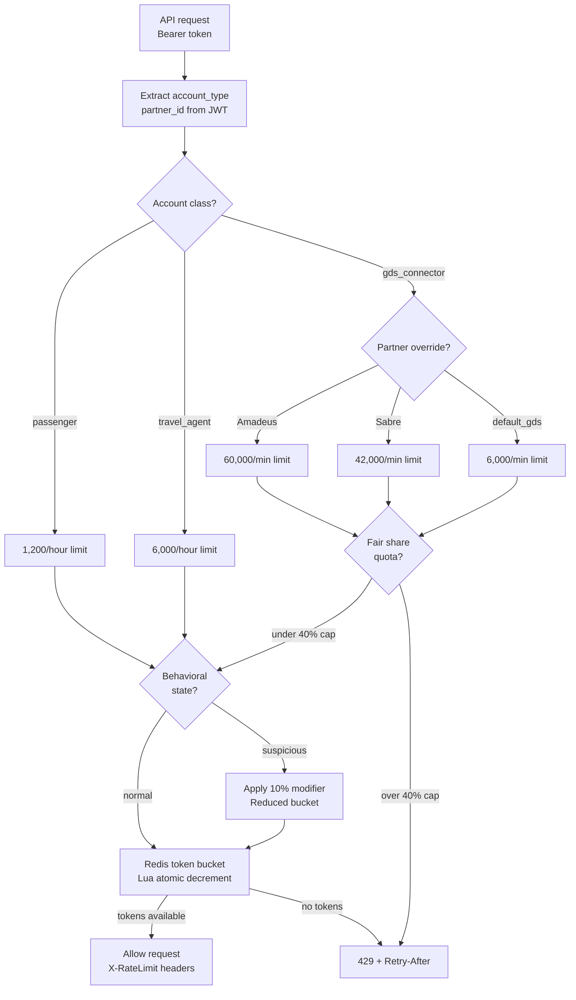

### Story Context

**Week 4 — GDS integration meeting**

The day after you finished the typed account auth design, Jeroen from GDS
integrations sends you an urgent message. Except this isn't LuminaryAI's
Jeroen — this is Martin Schofield, SkyRoute's GDS Partnership Manager.

**Slack DM — Martin Schofield → You, Monday 9 AM**

**Martin Schofield**: We have a problem with the new per-account rate limits
you're designing. Amadeus is upset.

**You**: What's their concern?

**Martin Schofield**: Their contract with SkyRoute specifies "unthrottled access
to seat inventory search." They pull real-time inventory for 340,000 travel
agents worldwide who use Amadeus to search and book flights. At peak, they
send 48,000 search requests per minute. Your new rate limiting design caps
GDS connectors at... what was the number?

**You**: 100 requests/second per account = 6,000/minute. That was a first-draft
number.

**Martin Schofield**: 6,000/minute. They send 48,000. You'd cap them at 12.5%
of their normal volume. They would breach their SLA with their travel agent
customers. This would cost them, and us, significant contractual damages.

**You**: This is why rate limiting is a business negotiation, not just
a technical decision.

**Martin Schofield**: Sabre sends 35,000 requests/minute. Travelport sends
27,000. Combined: 110,000 requests/minute from the three GDS partners alone.
Plus 45,000 travel agents sending an average of 200 requests/minute each
= 9 million requests/minute from the agent channel. How do you rate-limit
anything in that environment without killing partners?

**You**: The answer is: you don't rate-limit GDS by default. You differentiate
by behavior. A GDS account sending 48,000 well-formed search requests per minute
is normal. A passenger account doing the same is an attack. The rate limit
is not universal — it's calibrated per account class and behavior.

---

**Design session — Monday 2 PM**

You, Kai Hoffmann (Security), Martin Schofield (Partnerships), and Amina Diallo
(VP Engineering) are in the same room.

**Amina Diallo**: I want to understand the threat model for rate limiting.
Who are we rate limiting against, and why?

**You**: Three distinct threats. One — passenger-level bots (like the seat
harvesting incident). These are accounts that appear to be passengers but
are automated. Defense: behavioral rate limits on passenger account class.
Low request volume per individual account.

Two — misconfigured or runaway GDS integration. A GDS system with a bug
could flood us with duplicate requests — not malicious, but damaging.
Defense: per-GDS-partner rate limits with graceful degradation. Send 429
with a Retry-After header so the GDS can back off cleanly.

Three — the GDS themselves, acting in bad faith. Less likely — they're
contractual partners — but not impossible. An overly aggressive inventory
prefetch job could consume all our search capacity. Defense: per-partner
fair-share quotas that ensure no single GDS can consume more than 40% of
search capacity.

**Kai Hoffmann**: And the travel agent channel?

**You**: Travel agents are in the middle. They're human, mostly. But they
use API tools. Their request rates are higher than passengers but lower
than GDS. The behavioral detector (from the auth design) covers the
edge cases — agents whose hold-to-book rate is anomalous.

**Amina Diallo**: I want the rate limiting to be transparent to partners.
If Amadeus gets rate limited, their engineers should be able to see why —
not just receive a 429 with no context.

**Martin Schofield**: They have a partner portal. We could expose rate
limit consumption metrics there.

**You**: And the rate limit headers on the response itself: `X-RateLimit-Limit`,
`X-RateLimit-Remaining`, `X-RateLimit-Reset`. Standard headers. Every
GDS integration will expect them.

---

**Slack DM — Marcus Webb → You, Monday evening**

**Marcus Webb**
Third rate limiting system. The arc:

First time (CloudStack, Ch. 29): tenant API rate limiting.
Token bucket in Redis, Lua atomic decrement. Threat: runaway client bug.
Single rate limit class (API keys), one threat model.

Second time (CivicOS, Ch. 40): behavioral rate limiting.
847 IPs × 17 req/hour. No individual exceeded the limit. Distributed attack.
Behavioral fingerprinting, per-ASN limits, oracle removal.

This time: multi-class, multi-partner, contractually-constrained rate limiting.
You have partners with legitimate high-volume needs AND adversarial low-volume
distributed bots. Both must be handled simultaneously. Same system.

The new dimension: rate limit as a contract.
Amadeus's contract says "unthrottled access." You cannot rate-limit them
the way you rate-limit passengers — even if their volume is high. The rate
limit is a negotiated business term, not just a technical control.

The pattern: tiered rate limits with partner-specific overrides.
Default class limits (passenger: 1,200/hour; agent: 6,000/hour).
Partner overrides: Amadeus = 60,000/minute (contractual SLA).
Behavior-based escalation: accounts in "suspicious" state drop to 10% of
their class limit, regardless of partner tier.

The Redis data structure: a hash per account class with per-partner override keys.
The rate limiting decision is: get class limit → check for partner override → apply behavioral state.

---

### Problem Statement

SkyRoute must implement rate limiting across three account classes (passengers,
travel agents, GDS connectors) with contractually-defined rate limits for GDS
partners (Amadeus: 60,000/min, Sabre: 42,000/min, Travelport: 35,000/min),
behavioral rate limits for suspicious accounts, and transparent rate limit
headers for partner debugging. The system must prevent both distributed
passenger-level attacks (Ch. 61 incident) and protect SkyRoute from runaway
GDS integrations without violating partner SLA contracts.

### Explicit Requirements

1. Three rate limit tiers: passenger (1,200/hour), travel agent (6,000/hour),
   GDS connector (per-partner contract, e.g., 60,000/minute for Amadeus)
2. Behavioral state modifier: suspicious accounts drop to 10% of their class limit
3. GDS fair-share quota: no single GDS partner can consume more than 40% of
   total search capacity at peak
4. Standard rate limit response headers on all API responses: `X-RateLimit-Limit`,
   `X-RateLimit-Remaining`, `X-RateLimit-Reset`
5. Rate limit violations return 429 with `Retry-After` header (the number of
   seconds until the limit resets)
6. Rate limit metrics must be available in the partner portal per partner account

### Hidden Requirements

- **Hint**: Martin Schofield said "Amadeus's contract specifies unthrottled
  access to seat inventory search." But "unthrottled" cannot be truly unlimited
  — at some point, Amadeus's requests could consume all of SkyRoute's capacity
  and deny service to Sabre, Travelport, and travel agents. The contract's
  "unthrottled" likely means "no per-request rate limit" but implicitly allows
  capacity-based throttling during extreme load. How do you design a rate
  limiting system that respects the contractual intent ("no arbitrary throttle")
  while protecting against capacity exhaustion? What is the threshold at which
  you would throttle even a contractual partner?

- **Hint**: The rate limiting system uses Redis for state. With Amadeus sending
  60,000 requests/minute = 1,000 requests/second, the rate limiter is processing
  1,000 Redis operations per second just for Amadeus. At 110,000 combined GDS
  requests/minute, plus travel agent and passenger traffic, the rate limiter
  may be processing 3,000-5,000 Redis ops/second. Is this within Redis's
  throughput limits? What is Redis's practical write throughput? Does the Lua
  atomic script approach (from CloudStack, Ch. 29) scale to this volume?

- **Hint**: "Behavior-based escalation: suspicious accounts drop to 10% of
  their class limit." But the suspicious state is set by the behavioral
  detection system (Ch. 61). What is the latency between "account is flagged
  as suspicious" and "rate limit enforced at 10%"? If the flag is stored
  in Postgres and the rate limiter reads from Redis, there's a propagation
  delay. During that delay, the suspicious account continues at full rate.
  What is the maximum acceptable propagation delay?

### Constraints

- **GDS request volume**: Amadeus 60k/min, Sabre 42k/min, Travelport 35k/min
  = 137,000 combined GDS requests/minute
- **Travel agent volume**: 45,000 agents × 200 avg req/min = 9M requests/minute
- **Passenger volume**: 12M DAU × ~10 requests/session / 24 hours = ~83,000/minute
- **Total search capacity target**: 150,000 requests/minute (platform limit)
- **Redis ops/second budget**: available for estimation
- **Partner portal refresh rate**: rate limit metrics available in near-real-time
  (< 30 second lag)

### Your Task

Design the multi-tier, partner-aware, behaviorally-sensitive rate limiting
system for SkyRoute's API layer.

### Deliverables

- [ ] **Rate limit tier table** — for each account class (passenger, agent,
  GDS-standard, GDS-Amadeus, GDS-Sabre, GDS-Travelport): the rate limit
  value, the window (second/minute/hour), the behavioral state modifier,
  and the Redis key structure.

- [ ] **Rate limit decision flow** (Mermaid flowchart) — for an incoming
  API request: extract account type from JWT → lookup partner override →
  check behavioral state → apply rate limit → return remaining count in headers

- [ ] **Redis key schema** — the data structures for rate limit state.
  Token bucket? Sliding window? Fixed window? Show the Redis key naming
  convention and the Lua script for atomic decrement (extending Ch. 29 design
  to multi-tier).

- [ ] **Fair-share quota design** — how do you enforce "no single GDS >
  40% of total capacity"? Is this a separate Redis counter? How is it computed?
  What is the enforcement mechanism when a GDS approaches the 40% ceiling?

- [ ] **Response header implementation** — define the `X-RateLimit-*` header
  values for each scenario: under limit, at limit, over limit (after 429).
  What does the `Retry-After` value contain for each account tier?

- [ ] **Partner portal metrics** — what rate limit metrics are exposed in
  the partner portal? Define the API that the portal queries. How are
  per-partner metrics aggregated across all API gateway instances?

- [ ] **Tradeoff analysis** — minimum 3 tradeoffs:
  1. Per-request Redis check (accurate, latency on every request) vs
     cached rate limit state (faster, slightly inaccurate)
  2. Contractual partner exemptions (business-friendly, exploitation risk)
     vs uniform rate limits (simpler, partner friction)
  3. Token bucket (allows bursts) vs sliding window (accurate, no burst)
     for GDS rate limits

### Diagram Format

