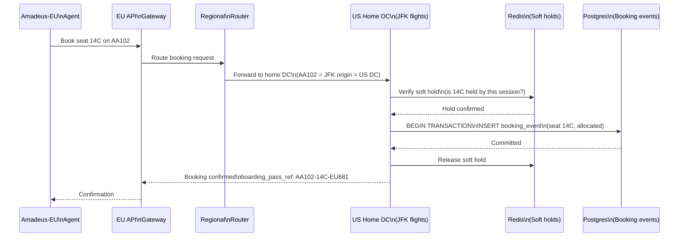

### Story Context

**Week 5 — operations anomaly**

**Slack thread — #operations-incidents, Tuesday**

```
Yemi Adeyemi [Ops]: ALERT — American Airlines reports double-booked seats
  on AA flight 102 (JFK → LAX, Wednesday 8 AM). Three passengers booked
  seat 14C. All three have valid boarding passes. AA is at the gate now.

You: Three passengers with seat 14C? That's not a soft hold race condition.
  The soft hold should prevent this.

Yemi Adeyemi: The soft hold system was working. But the three bookings
  happened from three different regional GDS endpoints. Amadeus-NA, Amadeus-EU,
  and a direct passenger booking.

You: Three concurrent bookings for the same seat from three different
  data centers?

Elena Vasquez: The seat inventory for AA102 seat 14C is stored in our
  primary US data center. But the Amadeus-EU connector queries the EU replica.
  There's replication lag. EU replica showed seat 14C as available. NA
  showed it as held (passenger booking in progress). The Amadeus-EU booking
  went through before the replication propagated.

You: So the soft hold was in Redis (US primary). The Amadeus-EU connector
  read from the Postgres EU replica, saw seat 14C as available, and booked it.
  The soft hold wasn't replicated to the EU Postgres replica.

Yemi Adeyemi: We have three passengers at the gate.

You: This is not a soft hold bug. This is a consistency bug. We're storing
  seat reservations in two places (Redis for soft holds, Postgres for
  confirmed bookings) with async replication between DCs. Strong consistency
  for seat booking is required. We cannot allow an EU replica to confirm a
  booking without checking the US primary.
```

**Amina Diallo** walks over to your desk 20 minutes later.

**Amina Diallo**: The AA102 incident. Three passengers, one seat. What happened?

**You**: Seat inventory is eventually consistent across regions. A soft hold
in the US Redis didn't propagate to the EU Postgres replica before the Amadeus-EU
booking went through.

**Amina Diallo**: We've had overbooking incidents before. Not like this.
Airlines tolerate 1-2% overbooking for no-shows — that's expected.
But triple-booking a seat is a system failure, not a revenue optimization.
What's the fix?

**You**: Two fixes. Immediate: seat bookings must go through the regional
primary, not a replica. No booking confirmation without a primary write.
Structural: seat booking is a strongly-consistent operation, same as
OmniLogix's inventory allocation. We need quorum confirmation or a
single-writer per flight-seat.

**Amina Diallo**: Single-writer per flight-seat is simpler. Each flight has
a designated primary data center. All bookings for that flight route to that DC.

**You**: Simpler, but a potential hotspot. A JFK → LAX flight at 8 AM on
a Monday might have 450 simultaneous booking requests during the 90-second
go-live window when seats open for sale. All of them must route to the
same DC.

**Amina Diallo**: That's manageable. What isn't manageable is a DC being
down when that flight has bookings. We need failover.

**You**: Failover with leader election. The flight's designated primary can
fail over to a secondary. But during failover, bookings must be paused
— not rerouted to the (now-stale) secondary. The pause must be short.

---

**Design session — Thursday**

**Elena Vasquez**: I want to understand the overbooking economics before
we design the fix. Airlines do intentionally overbook to account for
no-shows. United typically books 103-108% of capacity on domestic routes.
If we prevent all overbooking, we're costing airlines revenue.

**You**: We need to separate two things: intentional overbooking (airlines
selling more tickets than seats as a revenue strategy) vs accidental
overbooking (system bugs that create double-bookings). Our system must
support the first and prevent the second.

**Elena Vasquez**: How does intentional overbooking work?

**You**: The airline sets an overbooking limit: "flight AA102 has 180 physical
seats but we allow 188 bookings." The seat inventory counter starts at 188.
As bookings come in, it decrements. When it hits 0, the flight is closed.
But 188 > 180 means 8 passengers might be denied boarding. That's intentional.

**Elena Vasquez**: So the overbooking limit is a business parameter, not
a technical one.

**You**: Exactly. Our job is to ensure the counter never goes below 0 (no
accidental overbooking beyond the airline's limit) and that the counter
is consistent across all bookings (no double-bookings within the airline's limit).

---

**Slack DM — Marcus Webb → You, Thursday evening**

**Marcus Webb**
Seat inventory is the same problem as OmniLogix's inventory allocation.
Same pattern: append-only events, counting problem, quorum write.

But there's a difference. OmniLogix had 14 DCs for a global inventory.
You have seat-level granularity: one seat on one flight. The hotspot
problem is real — a popular flight can have hundreds of concurrent
booking attempts. You can't put every booking through a global quorum.

The pattern: regional authority per flight.
Each flight is "owned" by a regional data center — its home DC.
All booking decisions for that flight go through the home DC.
Read replicas can serve search results (availability snapshots).
Writes always go to the home DC.
On home DC failure: leader election, temporary pause of bookings.

The home DC assignment is based on: origin airport region (JFK → NA DC,
LHR → EU DC). This is a natural sharding key. It minimizes cross-region
booking traffic for regional routes. International routes are assigned
to the origin airport's region by convention.

The counter: not a `seats_available` integer. An append-only log of
`booking_events` (seat allocated, seat released). Current available count
= initial_capacity + overbooking_buffer - count(allocated) + count(released).
This gives you a full audit trail and prevents lost updates on concurrent writes.

---

### Problem Statement

SkyRoute experienced a triple-booking incident on AA102 when concurrent
booking requests from US (passenger direct booking) and EU (Amadeus-EU GDS)
data centers both saw seat 14C as available — due to async replication lag
between the US Redis soft hold and the EU Postgres replica. Seat booking
requires strong consistency: no two bookings may confirm the same physical
seat. The system must implement regional authority per flight (single writer
per flight), an append-only booking event log, and correct overbooking
buffer support for airline intentional overbooking.

### Explicit Requirements

1. Each flight is assigned a home data center (origin airport region);
   all booking confirmations must be written to the home DC
2. Soft holds must be checked at the home DC, not at read replicas,
   before booking confirmation
3. Seat inventory must be modeled as an append-only event log, not a
   decrement counter (prevents lost updates on concurrent bookings)
4. Overbooking buffer: airlines can set a per-flight overbooking limit
   (e.g., 188 bookings for 180-seat aircraft); system must enforce the
   limit, never go below 0
5. On home DC failure, booking must pause (not reroute to stale secondary)
   until leader election completes (target: < 30 seconds)
6. Read replicas may serve availability search results with eventual consistency

### Hidden Requirements

- **Hint**: Elena raised "intentional overbooking." The overbooking buffer
  (188 bookings for 180 seats) means the system might have 8 passengers
  with valid boarding passes who cannot board. When this happens, the airline
  handles it — offers vouchers, rebooks. But SkyRoute must alert the airline
  when the booking count approaches the physical seat limit, so they can
  prepare. What is the alert threshold? What notification does the airline
  receive? Is this part of the flight status notification system (Ch. 59)?

- **Hint**: "Soft holds must be checked at the home DC before booking
  confirmation." But soft holds currently live in Redis, which is separate
  from Postgres. When the booking confirmation write happens in Postgres
  at the home DC, the soft hold in Redis must be atomically converted to
  a confirmed booking in Postgres. This is a dual-write: release the Redis
  hold AND create the Postgres booking record atomically. You've seen this
  problem before. What is the correct pattern? (Hint: Ch. 52 outbox pattern)

- **Hint**: The regional authority model assigns flights to data centers
  by origin airport region. But SkyRoute serves 47 airline partners who
  operate routes across regions. If American Airlines routes all bookings
  for AA102 (JFK → LAX, a domestic US route) to the US DC — but an
  Amadeus-EU agent wants to book a seat — the EU agent's booking must
  cross the Atlantic to the US DC. At 150ms EU→US latency, what is the
  booking latency for an EU travel agent booking a US domestic flight?
  Is this within the acceptable latency SLA?

### Constraints

- **Flight inventory**: 24,000 flights/day across 47 airline partners
- **Peak concurrent bookings**: 450/second during flight go-on-sale events
- **Overbooking range**: airlines set 100-108% of physical capacity
- **Home DC failure recovery**: leader election target < 30 seconds
- **Cross-region booking latency**: EU → US DC = 150ms; APAC → US = 400ms
- **Booking P99 latency SLA**: < 800ms (includes cross-region routing)
- **Event log retention**: 7 years (airline regulatory requirement)

### Your Task

Design the strongly-consistent seat booking system: regional authority model,
append-only event log, overbooking buffer, and soft hold conversion.

### Deliverables

- [ ] **Regional authority assignment** — how is a flight's home DC determined?
  Show the assignment table (origin region → DC). What happens for codeshare
  flights (operated by one airline but marketed by another with different regions)?

- [ ] **Booking event log schema** — the `seat_booking_events` table at the
  home DC. Include: event_id, flight_id, seat_id, event_type (allocated/released/
  cancelled), booking_reference, passenger_id, agent_id, created_at. What is
  the query to compute current available seats from this log?

- [ ] **Soft hold → confirmed booking conversion** — the atomic operation that
  converts a Redis soft hold to a Postgres confirmed booking. What is the
  transaction boundary? What happens if the Redis release fails after the
  Postgres write? (Apply outbox pattern from Ch. 52)

- [ ] **Overbooking buffer design** — how is the overbooking limit stored
  and enforced? What is the `flight_inventory_config` table? How does the
  booking service use it? What is the airline alert trigger at physical
  seat capacity?

- [ ] **Home DC failure protocol** — the sequence of events when the home DC
  for a flight fails: detect failure → pause bookings → elect new leader →
  resume bookings. What does the client see during the pause? What is the
  leader election mechanism?

- [ ] **Availability search vs booking consistency** — read replicas serve
  search with eventual consistency. Booking requires home DC. How does the
  system communicate to passengers that a seat "shown as available in search
  may be unavailable at booking time"? Is there a standard UX pattern?

- [ ] **Tradeoff analysis** — minimum 3 tradeoffs:
  1. Regional authority per flight (simple, cross-region latency) vs
     global quorum writes (consistent, high latency)
  2. Append-only event log (auditable, query complexity) vs counter
     decrement (simple, lost update risk)
  3. Booking pause during DC failure (no overbooking risk, brief unavailability)
     vs booking continuity with conflict resolution on recovery (available,
     reconciliation complexity)

### Diagram Format


