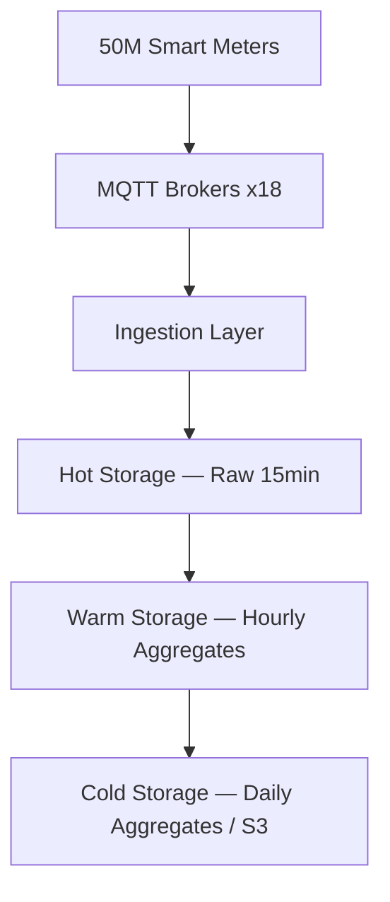

### Story Context

**Monday, Week 1. 09:15.**

You have been at your desk for 45 minutes. Your laptop is still being configured by IT. You are reading architecture docs on your personal machine when Dr. Marcus Thompson appears in the doorway of the small glass-walled meeting room they have temporarily assigned you.

Dr. Thompson is tall, deliberate in his movements, and carries a notebook — a physical one, graph paper, the kind electrical engineers use for circuit diagrams. He has a PhD in electrical engineering from TU Berlin and spent eight years modeling power grid topology before pivoting to data engineering. He thinks about data the way he thinks about current: it flows in one direction, it can be buffered, and if it backs up somewhere it will find a path around the obstruction or it will arc and destroy something.

"I'm Marcus," he says, setting the notebook on the table. "I built most of what you're about to tell Elena is wrong."

You appreciate the directness. You tell him so.

"Good," he says. "Then let's not waste time."

---

**Slack DM — @marcus.thompson → @you**
**Monday 09:22**

```
marcus.thompson: I'm going to walk you through the current stack.
                 Fair warning: some of this will be painful to hear.

you: I've seen painful stacks. Go ahead.

marcus.thompson: PostgreSQL. Everything is in PostgreSQL.

you: ...everything?

marcus.thompson: 50M meters. 96 readings per meter per day (every 15 minutes).
                 4.8 billion rows per day.
                 Current table: meter_readings. 47 terabytes.
                 No partitioning. One index on (meter_id, timestamp).
                 Query for "average power consumption by region, last 30 days"
                 takes 22 minutes.

you: What's the storage runway?

marcus.thompson: Storage team says 4 months. Maybe 5 if we delete some
                 of the 2021 data. Elena won't approve data deletion
                 without a retention policy signed off by Lena [Krause].
                 Lena hasn't approved it because NERC CIP requires
                 7-year retention for certain audit-relevant readings.

you: So you can't delete anything and you're running out of space.

marcus.thompson: And the queries are getting slower every week because
                 the table is growing and Postgres sequential scans
                 across 47TB take... a while.

you: Why Postgres originally?

marcus.thompson: 2011. We had 3 million meters. Postgres was fine.
                 It was more than fine — it was great. The team knew it.
                 We added partitioning in 2016 when we hit 10M meters.
                 Then removed it in 2018 because Sanjay [Mehta] said
                 the partition pruning wasn't working and it was causing
                 insert bottlenecks during peak hours.

you: What's peak hours look like for inserts?

marcus.thompson: 7-9AM and 5-8PM local time. But we're in 12 countries
                 across 6 time zones so "peak" is pretty much a 14-hour
                 window. We see about 3.5M inserts per minute during the
                 European morning overlap.

you: 3.5M inserts per minute. Into a single PostgreSQL table.

marcus.thompson: Two actually. We have a replica that handles reads
                 so the writes don't starve the analytics queries.
                 The replica is 6 hours behind.

you: The analytics replica is 6 hours behind real-time?

marcus.thompson: On a good day. During peak it's been as bad as 11 hours.

you: And grid operators need real-time consumption data for demand forecasting.

marcus.thompson: [typing pause — 8 seconds]
                 Yes. You see the problem.

you: I see about six problems. When can you give me an hour?

marcus.thompson: I've blocked 2-5pm for you. Conference room 4B.
                 I'll bring the architecture diagrams.
                 Fair warning: they're on paper. I don't trust Lucidchart.
```

---

**Monday, 14:00 — Conference Room 4B**

Marcus Thompson spreads four sheets of graph paper across the table. The diagrams are meticulous — every component labeled with its version number, every connection annotated with throughput figures from 2021 and current measurements from last month. The gap between the two numbers on most connections is substantial.

"Current architecture," he says, tapping the first diagram. "Two PostgreSQL primaries — one for Europe, one for North America. Each with a read replica. The European primary handles UK, DE, FR, NL, BE. The NA primary handles US East, US West, Canada. Meter data arrives via MQTT brokers — we have 18 of them distributed across the regions — and gets written synchronously to the primary."

"Synchronously?" you ask.

"I know. Sanjay argued for sync writes because we had data loss incidents in 2019 when we were doing async. Lost 4 hours of readings from 800,000 Scottish meters during a broker failover. Grid ops was not pleased."

"What does the storage team project at current growth rates?"

Marcus opens his notebook to a page of handwritten calculations. "12% year-on-year meter growth. 8% growth in reading frequency as we roll out sub-5-minute granularity for smart home integrations. Storage is growing at 22% annually. We will breach capacity in 4 months unless we change something."

You look at the diagram. You look at the numbers. You think about what this data actually needs — it arrives in time order, it is queried in time ranges, it is never updated after write, it ages in a completely predictable pattern. You think about the databases built specifically for this problem. You think about the databases that have solved every single one of these issues before.

"Tell me," you say, "what has Elena already rejected?"

Marcus almost smiles. "InfluxDB 3.0 in 2022. She didn't like the licensing model. TimescaleDB in 2023 — Sanjay said it was 'just Postgres with extra steps' and argued we should fix our Postgres instead. QuestDB last year — the team didn't have the expertise."

"What's the real objection?"

He is quiet for a moment. "Migration risk. We have 47TB of live data serving real-time grid operations in 12 countries. The last time someone suggested a major migration, it was the 2018 repartitioning rollback that took down the European cluster for 6 hours."

"And your grid operators' SLA?"

"60 seconds from meter read to queryable data. We're hitting it 97.3% of the time right now. A 6-hour outage window is not available to us."

You nod. This is the real problem. Not the technology selection — the migration strategy. The technology is straightforward. Getting from here to there without anyone losing power procurement contracts is the actual design challenge.

---

**Slack — #architecture-discussion**
**Monday 16:47**

```
you: @elena.vasquez I've finished the initial review with Marcus.
     I have a proposal for the time-series storage redesign.
     The short version: we need a purpose-built TSDB. The long
     version involves a zero-downtime migration strategy.
     Can I get 30 minutes on your calendar tomorrow?

elena.vasquez: 8AM. My office. Bring numbers, not slides.

you: Understood.

marcus.thompson: [reaction: 👀]

sanjay.mehta: [reaction: 😬]
```

---

### Problem Statement

Crestline Energy's meter reading platform ingests 200 million events per hour across 50 million smart meters. The current architecture — a monolithic PostgreSQL deployment with two primaries and read replicas — is approaching storage capacity (47TB today, 4-month runway), experiencing 22-minute query times for regional analytics, and running an analytics replica that lags 6–11 hours behind real-time.

The platform must be redesigned around a purpose-built time-series storage architecture that supports: sub-60-second write-to-query latency for real-time grid operations, sub-second range query performance for operational dashboards, long-term data retention meeting NERC CIP 7-year requirements, and automated data lifecycle management (downsampling and tiering) that controls storage cost growth without manual intervention.

The migration must be designed for zero-downtime execution against a live system serving real-time grid operations across 12 countries.

---

### Explicit Requirements

1. Ingest 200M meter reading events per hour (55,555 events/second sustained, up to 3.5M/minute during peak overlap windows)
2. Write-to-queryable latency: ≤60 seconds (P99), targeting ≤15 seconds (P50)
3. Range query performance for "last 30 days by region": ≤5 seconds (P95)
4. Point-in-time queries for individual meters: ≤500ms (P99)
5. Automated downsampling: 15-min raw → 1-hour aggregates → 1-day aggregates
6. Data retention: raw data 90 days, hourly aggregates 2 years, daily aggregates 7 years (NERC CIP minimum)
7. Zero-downtime migration from existing PostgreSQL
8. Support for 12% annual meter growth without architecture changes (only capacity scaling)
9. Read replica lag must not exceed 30 seconds for operational queries

---

### Hidden Requirements

- **Hint**: Re-read Marcus's message about the 2019 data loss incident affecting 800,000 Scottish meters. What compliance requirement does a 4-hour gap in meter readings create? Does NERC CIP have something to say about data integrity and audit trails for utility-grade meter data?

- **Hint**: Marcus mentions "sub-5-minute granularity for smart home integrations." The current schema is designed around 15-minute readings. What happens to your chunk sizing and retention policy calculations if reading frequency triples for 20% of your meter population?

- **Hint**: Sanjay's comment that TimescaleDB is "just Postgres with extra steps" contains a clue. Elena rejected TimescaleDB in 2023. What organizational advantage does a Postgres-compatible TSDB provide for a team that already knows Postgres deeply? Is there a migration risk argument for Postgres-compatible systems vs a completely new query language?

- **Hint**: The analytics replica is 6–11 hours behind. Who depends on this replica? What happens to the NERC CIP regulatory reporting that Lena Krause is responsible for if the "current state" read from the replica is actually yesterday's state?

---

### Constraints

- **Scale**: 50M meters, 200M events/hour sustained, 3.5M events/minute peak
- **Storage today**: 47TB, growing 22% YoY
- **Storage budget**: Must fit within current infrastructure spend + 15% headroom
- **Query SLA**: 60s write-to-query (P99), 5s range query (P95), 500ms point query (P99)
- **Retention**: 90 days raw, 2 years hourly, 7 years daily (regulatory minimum)
- **Team**: 4 data engineers, 2 platform engineers. No dedicated DBA.
- **Migration window**: Zero-downtime required. Largest available maintenance window: 30 minutes monthly.
- **Countries**: 12 (6 EU + 6 NA), two regional clusters (EU, NA)
- **Meter growth**: 12% YoY in meter count, 8% YoY in reading frequency
- **Budget**: Infrastructure cost growth must stay below 10% YoY despite 22% data growth

---

### Your Task

Design the complete time-series storage architecture for Crestline Energy's meter reading platform, including database selection rationale, schema design, data lifecycle management, and a zero-downtime migration strategy from the existing PostgreSQL deployment.

---

### Deliverables

- [ ] **Mermaid architecture diagram** — Full data flow from MQTT brokers through ingestion, storage layers, and query paths (operational vs analytical)
- [ ] **Database selection analysis** — Compare InfluxDB v3, TimescaleDB, QuestDB, and Apache Druid against Crestline's specific requirements. Include licensing considerations Elena has previously flagged.
- [ ] **Schema design** — Hypertable definition with chunk sizing rationale, compression policy, continuous aggregate definitions for 1-hour and 1-day rollups, retention policy. Include column types and index definitions.
- [ ] **Scaling math** — Step-by-step: current storage growth rate → projected storage with new tiering strategy → cost comparison. Show the math for chunk sizing given peak insert rate.
- [ ] **Data lifecycle policy** — Decision table: raw (15min) retention, hourly aggregate retention, daily aggregate retention. Map each tier to NERC CIP requirements.
- [ ] **Zero-downtime migration plan** — Phase-by-phase strategy. Include dual-write period, backfill approach for 47TB historical data, cutover criteria, and rollback procedure.
- [ ] **Tradeoff analysis** — Minimum 3 explicit tradeoffs:
  - TimescaleDB (Postgres-compatible, lower migration risk) vs InfluxDB v3 (higher performance, new query language)
  - Continuous aggregates (pre-computed, fast reads) vs on-demand downsampling (lower storage, slower reads)
  - Single global schema vs per-region schema isolation (impacts cross-region analytics and data residency compliance)

### Diagram Format
All architecture diagrams: Mermaid syntax.


