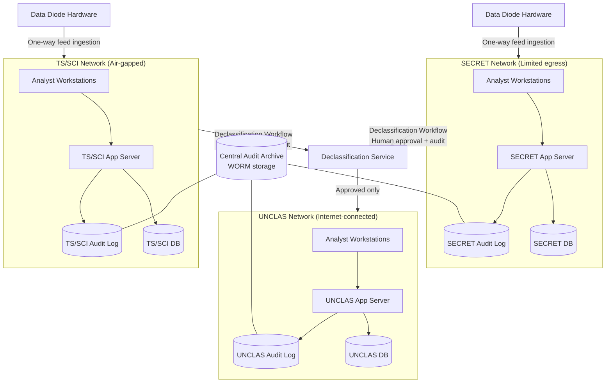

### Story Context

The SCIF has no windows. The walls are lined with acoustic dampening panels in a shade of gray that resists description — not quite charcoal, not quite concrete. A laminated placard on the door reads MOBILE DEVICES PROHIBITED. You surrendered your phone to locker 14 on the way in.

Colonel Marguerite Osei sits across a rectangular table with four chairs. She's in her early sixties, civilian clothes, but posture that does not bend. Beside her is a man she introduces as Randall Tuck, the platform's lead infrastructure engineer — late thirties, cargo pants, a cup of coffee he hasn't touched. On the whiteboard behind her someone has drawn three horizontal bands and labeled them UNCLAS, SECRET, and TS/SCI with thick black marker. Below the diagram, barely legible, someone else has written: **data only flows UP.**

"Here's your situation," Osei begins, without preamble. "We have three tiers. Unclassified handles open-source intelligence, partner feeds, public threat reports. Secret handles agency-to-agency shared intel. TS/SCI handles compartmented programs. We have 500 analysts across all three. The architecture we inherited treats tier separation as a network VLAN policy enforced by a single firewall rule set." She pauses. "One misconfigured rule and TS/SCI data lands on an UNCLAS box. That is not a P1 incident. That is a federal criminal matter."

Tuck speaks for the first time. "The previous architect called it 'defense in depth.' I called it 'defense in hope.' He left in October."

You ask what threat model they're designing against. Osei doesn't hesitate. "Insider threat. External APT. Supply chain compromise. In that order. You can assume a determined nation-state adversary has already attempted to place an agent inside this building. You cannot assume they failed."

You ask about data movement between tiers. Tuck slides a printed diagram across the table — no digital copies are permitted in this room. It shows three physically separate networks. The TS/SCI network has no outbound connection whatsoever. Threat intel feeds arrive from partner agencies via encrypted physical media — hard drives delivered by courier, processed in a transfer workstation. That workstation, Tuck explains, is connected to both the SECRET and TS/SCI networks via USB.

You write one word on your notepad: *malware.*

"The USB path is temporary," Osei says, noticing. "That's your first problem to solve. We need a hardware-enforced one-way transfer — a cross-domain solution — between SECRET and TS/SCI for automated feed ingestion. We also need you to design the overall tier architecture: physical separation, data diode placement, and declassification workflow for moving data DOWN the stack. Data can travel up freely. Down requires a human in the loop and a paper trail that survives court scrutiny."

She stands. The meeting is over. Tuck gives you a laminated badge for SCIF room 3, a three-ring binder of the existing network diagrams, and a note: **IG review is in 90 days. Design must be complete in 30.**

On your way out, you retrieve your phone from locker 14. You have a Slack notification from an unknown number. It's Marcus Webb. His farewell DM, sent your first day at OrbitCore, was cryptic. This one is shorter:

**Marcus Webb [DM]:** *Heard you're at IronWatch. I know a guy who consulted there in 2019. He said: assume breach always, but design for the audit, not the attack. The audit is the system. Good luck.*

You stare at it for a moment. Then you go back inside the SCIF and start drawing.

---

### Problem Statement

IronWatch operates a multi-classification threat intelligence platform serving 500 analysts across three network tiers: Unclassified (UNCLAS), Secret (S), and Top Secret / Sensitive Compartmented Information (TS/SCI). The current architecture relies on a single firewall rule set for tier isolation — a single point of failure with catastrophic consequences if misconfigured.

You must design the overall platform architecture: physical network separation, data flow controls enforcing the principle that data may travel UP the classification stack freely but may only travel DOWN via an explicit declassification workflow with human approval, and a cross-domain solution (CDS) to replace the existing USB-based threat intel ingestion path.

---

### Explicit Requirements

1. Three physically separate networks: UNCLAS, SECRET, TS/SCI — no shared hardware at the host level
2. Data may flow UNCLAS → SECRET → TS/SCI (up) without explicit approval
3. Data flowing DOWN (TS/SCI → SECRET → UNCLAS) requires explicit declassification workflow with human approver and immutable audit record
4. Hardware-enforced one-way transfer (data diode) between SECRET and TS/SCI for automated threat intel feed ingestion
5. Cross-domain solution (CDS) to replace USB-based physical media ingestion
6. Support 500 analysts simultaneously across all three tiers
7. Architecture must survive Inspector General review — every data movement must be attributable to a specific analyst or automated process
8. Insider threat and APT are primary threat models; supply chain compromise is tertiary

---

### Hidden Requirements

- **Hint**: Re-read Osei's threat model enumeration order. She said "insider threat" first. What does that imply about the trust model for administrators — including Randall Tuck — on the TS/SCI network?
- **Hint**: Re-read Tuck's comment about "defense in hope." The previous architecture was VLAN-based. What does physical separation imply about the operator workstations? Can an analyst have a single workstation that accesses all three tiers?
- **Hint**: Marcus Webb's DM says "design for the audit, not the attack." What does this imply about the structure of audit data — where must it be stored relative to the networks it describes?
- **Hint**: Osei says declassification records must "survive court scrutiny." What does that imply about storage medium, chain-of-custody, and deletability of declassification records?

---

### Constraints

- **Analysts**: 500 total (estimated 300 UNCLAS, 150 SECRET, 50 TS/SCI)
- **Networks**: 3 physically separate — air-gapped TS/SCI, limited-egress SECRET, internet-connected UNCLAS
- **Threat intel feed volume**: ~2,000 feed entries/hour from partner agencies ingested into SECRET and TS/SCI
- **Declassification events**: estimated 50-200/day requiring human approval
- **IG review deadline**: 30 days for design, 90 days for implementation
- **Budget signal**: government contract — cost is secondary to security correctness
- **Team**: 4 infrastructure engineers on-site; you as external architect
- **Physical constraint**: SCIF for TS/SCI work (limited physical footprint); SECRET and UNCLAS in separate wings of same building
- **Regulatory**: DCSA RMF (Risk Management Framework), DISA STIG compliance, ICD 503 for cross-domain solutions

---

### Your Task

Design the IronWatch multi-classification platform architecture. Produce a complete architectural blueprint covering physical network topology, data flow controls, cross-domain solution design, declassification workflow, and audit architecture. Address the insider threat model explicitly.

---

### Deliverables

- [ ] Mermaid architecture diagram showing all three network tiers, data diodes, CDS placement, and audit log flows
- [ ] Database schema for declassification workflow: request, approval, audit chain (with column types and indexes)
- [ ] Scaling estimation: analyst session load per tier, feed ingestion throughput, audit log write rate — show math step by step
- [ ] Tradeoff analysis (minimum 3 explicit tradeoffs):
  - Physical separation vs. operational complexity
  - Hardware data diode vs. software-enforced CDS
  - Centralized audit log vs. per-tier audit logs
- [ ] Cost modeling: hardware (data diodes, air-gapped servers), operational overhead ($X/month estimate)
- [ ] Capacity planning: 12-month horizon (analyst growth, feed volume growth)
- [ ] Insider threat model document: how does the design limit blast radius if a TS/SCI administrator is compromised?

### Diagram Format

All architecture diagrams: Mermaid syntax (renders in GitHub Issues).

