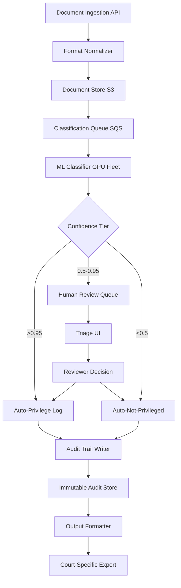

### Story Context

It's 11:04 PM on a Tuesday. You're about to close your laptop when Slack lights up.

---

**#lexcore-oncall**

```
11:04 PM — Danielle Okafor [VP Product]
@you — are you still on? I have Julia Chen from Hartwell & Pryce on the line.
She's asking if we can do something we've never done before.
```

```
11:05 PM — you
On. What's the ask?
```

```
11:06 PM — Danielle Okafor
Privilege log generation. 800,000 documents. Court deadline tomorrow noon.
She says she's been on the phone with three other vendors and no one will touch it.
```

```
11:07 PM — you
That's 13 hours from now.
```

```
11:07 PM — Danielle Okafor
Correct. I'm going to loop her assistant into this thread.
```

```
11:08 PM — Marcus Tate [Assistant to Julia Chen, Hartwell & Pryce]
Hello. Julia asked me to join. Here's the situation:
We have 847,293 documents in a Relativity database export.
We need a privilege log in the format specified by Judge Calloway's standing order.
The log must identify: privilege type (attorney-client, work product, or not privileged),
basis for the claim, and author/recipient metadata.
Documents are a mix of emails, Word docs, PDFs, and some Slack exports.
```

```
11:09 PM — you
Marcus, what's the litigation context? We need to understand the sensitivity here.
```

```
11:12 PM — Marcus Tate
I need to be careful about what I share publicly, but I can say this is a significant
commercial dispute. Julia is lead counsel for the defense. The privilege log is part
of our discovery response. The opposing party has been very aggressive about
challenging privilege claims.
```

```
11:13 PM — Ravi Subramaniam [LexCore On-Call Engineer]
Looping myself in — I saw the alert. @you what are we thinking?
```

```
11:14 PM — you
Let me think out loud. Our document classification pipeline can run inference on
~2,000 docs/minute on current GPU capacity. 847K docs = roughly 7 hours of
inference time. That gets us to 6am. We have 6 hours to generate the output,
handle human review of borderline cases, and format for court.
Tight but potentially feasible.
```

```
11:15 PM — Ravi Subramaniam
The problem isn't throughput. It's confidence thresholds.
Our privilege classifier was trained on commercial contracts, not litigation docs.
Accuracy on email threads with forwarded attorney correspondence is... not great.
I'd estimate 15-20% of documents will land below 0.8 confidence.
That's potentially 150,000 docs in the human review queue.
```

```
11:16 PM — Danielle Okafor
We cannot tell Julia we need 150,000 human reviews in 6 hours.
```

```
11:17 PM — Marcus Tate
Julia wanted me to add: the financial exposure in this case is approximately
$400 million. She said to be explicit about that so you understand why she is
calling at 11pm. A single incorrectly released privileged document — even one —
could constitute waiver and compromise the defense strategy entirely.
```

A cold quiet settles over the thread for about 90 seconds.

```
11:19 PM — you
Okay. Here's what I'm thinking.
We run the classifier with three tiers: high confidence privilege (>0.95),
borderline (0.5-0.95), and clear non-privilege (<0.5).
High confidence gets auto-logged. Clear non-privilege gets excluded from the log.
Borderline goes to human review — but we prioritize by document type and
attorney involvement signals. Emails from/to @hartwellpryce.com addresses
get elevated priority in the review queue regardless of confidence score.
We can build a triage UI tonight that lets their team work through the queue
with keyboard shortcuts. We've done something like this before for due diligence.
```

```
11:20 PM — Ravi Subramaniam
The triage UI exists. We'd need to modify it to support privilege-type tagging.
2 hours of work max.
```

```
11:21 PM — Danielle Okafor
@you I need you to tell me: is the output court-admissible?
```

```
11:22 PM — you
That's a legal question, not an engineering question. What I can tell you
is we can produce output in Judge Calloway's specified format with full
provenance: document ID, confidence score, model version, whether it was
auto-classified or human-reviewed, and the reviewer identity.
What the court accepts is Julia's call.
```

```
11:23 PM — Marcus Tate
Julia says that's acceptable. She'll take responsibility for the legal determination.
She needs the raw capability. Can you start the pipeline tonight?
```

```
11:24 PM — you
Yes. But I need one thing from you first: a written instruction to proceed
from Julia directly, acknowledging the confidence thresholds and human review workflow.
We're not going to run this without documented authorization.
Ravi — can you start spinning up GPU instances? We're doing this.
```

---

The Slack thread continues for another two hours as Ravi spins up capacity and you sketch the pipeline architecture on a whiteboard in your home office, photographing each stage. By 1am, the classifier is running. By 6am, you have 847,293 documents classified. By 8am, 23 associates at Hartwell & Pryce are working through the 127,000-document borderline queue in the triage UI. At 11:47am, the privilege log is submitted to the court.

You never find out the outcome of the litigation. Julia Chen sends a one-line email three days later: "We'll be in touch about a contract."

---

### Problem Statement

LexCore needs to design a production-grade automated privilege log generation system capable of processing hundreds of thousands of legal documents within tight court-imposed deadlines. The system must classify documents into privilege categories (attorney-client privilege, work product doctrine, or not privileged) using ML, route borderline cases to human review with intelligent prioritization, and produce court-admissible output with full provenance tracking.

This is not a one-off event — the Hartwell & Pryce case reveals a market opportunity. Law firms handling large-scale litigation routinely face e-discovery privilege review. LexCore must productize this capability at enterprise scale.

---

### Explicit Requirements

1. Ingest up to 2 million documents per matter (emails, PDFs, Word docs, Slack exports) via batch upload or Relativity/Ringtail export formats
2. ML classification pipeline with three tiers: high-confidence privilege (>0.95), borderline (0.5–0.95), and clear non-privilege (<0.5)
3. Human review queue for borderline documents, prioritized by attorney involvement signals, document type, and date proximity to key litigation events
4. Court-admissible output: privilege log in configurable formats (CSV, XML, LEDES standard) with document ID, privilege type, basis, author/recipient metadata, classification method (auto vs. human), reviewer identity, and model version
5. Triage UI with keyboard-shortcut-driven review workflow for rapid human review throughput (target: 300 documents/reviewer/hour)
6. Full audit trail: every classification decision (auto or human) must be immutable and exportable
7. Support for custom privilege definitions per matter (e.g., specific attorney names, firm email domains, in-house counsel addresses)
8. Matter-level isolation: no data leakage between law firm clients

---

### Hidden Requirements

- **Hint: re-read Marcus Tate's message at 11:17 PM.** The $400M litigation exposure means a false negative — releasing a privileged document — is categorically worse than a false positive. The system must be tunable to err heavily toward privilege assertion for borderline cases. The cost function is asymmetric. What does this imply about your confidence threshold defaults?

- **Hint: re-read Ravi's concern at 11:15 PM** about the classifier being "trained on commercial contracts, not litigation docs." The model will degrade on email thread forwarding chains (privilege can transfer or be waived depending on recipients). The system needs domain-specific fine-tuning hooks and per-matter model calibration capability.

- **Hint: re-read the authorization requirement you stated at 11:24 PM.** Privilege log generation has legal liability implications for the firm and potentially for LexCore. Every classification must carry a chain of custody that can be presented in court. This implies the audit log is itself a legal artifact — it must be tamper-evident, not just append-only.

- **Hint: re-read Judge Calloway's "standing order" reference.** Different judges have different standing orders for privilege log format. The output formatter must be configurable per-court, and the court configuration must be versioned — if a judge updates their standing order mid-case, prior submissions must reference the prior version.

---

### Constraints

- **Document volume**: up to 2M documents per matter, typically 50K–500K
- **Document types**: emails (EML, MSG), PDFs, Word (DOCX), Excel (XLSX), Slack JSON exports, Relativity DAT/OPT exports
- **Processing SLA**: 800K documents in under 8 hours (target: 6 hours with headroom)
- **Classification throughput**: 2,500 docs/minute on 4× A10G GPU instances
- **Human review throughput**: 300 docs/reviewer/hour in triage UI
- **Borderline rate**: estimated 15–20% of documents (calibrate per matter)
- **False negative tolerance**: near-zero for attorney-client privilege; the system must default to privilege assertion for uncertain cases above $X matter value (configurable)
- **Audit log**: immutable, exportable, cryptographically signed per matter
- **Multi-tenancy**: complete matter isolation; no cross-matter data access
- **Output formats**: CSV, XML, LEDES 1998B, custom per-court standing orders
- **Team size**: 6 engineers (2 ML, 2 backend, 1 frontend, 1 infra)
- **Infrastructure**: AWS, existing GPU capacity (4× A10G), can burst to 16× for large matters
- **Compliance**: attorney-client privilege requires confidentiality protections equivalent to the documents being processed; SOC 2 Type II required

---

### Your Task

Design the automated privilege log generation system end-to-end. Your design must cover:

1. Document ingestion pipeline (batch + streaming) with format normalization
2. ML privilege classification service with confidence tiers and per-matter calibration
3. Human review queue with intelligent prioritization algorithm
4. Triage UI architecture (frontend state machine — sketch the review flow)
5. Court-admissible audit trail with tamper-evidence
6. Output formatter with per-court standing order configuration
7. Matter-level isolation architecture
8. Operational runbook for the "11pm emergency" scenario (on-demand capacity surge)

---

### Deliverables

- [ ] Mermaid architecture diagram covering ingestion → classification → human review → output generation
- [ ] Database schema for: `matters`, `documents`, `classifications`, `review_queue`, `audit_log`, `court_configs` (with column types, indexes, and partitioning strategy)
- [ ] Scaling estimation — show your math:
  - 800K docs × average 50KB = total storage per matter
  - GPU throughput: 2,500 docs/min × 4 GPUs × 6 hours = capacity ceiling
  - Human review queue math: 150K borderline docs ÷ 300 docs/reviewer/hour = reviewer-hours required
  - Burst capacity: what does spinning up from 4 to 16 GPU instances cost per hour?
- [ ] Tradeoff analysis (minimum 3):
  - Auto-classify at 0.95 threshold vs. lower threshold to reduce human review queue size
  - Per-matter fine-tuning (accuracy) vs. shared model (cost and speed)
  - Synchronous human review blocking output vs. partial output with clearly-marked pending items
- [ ] Cost modeling: estimate $/matter for a 500K-document privilege review at standard throughput. Include GPU hours, storage, human review facilitation overhead.
- [ ] Capacity planning: if LexCore signs 50 law firm customers, each running 2 large matters/year (500K docs avg), what does the annual infrastructure look like? What's the cost at scale vs. per-matter pricing model?
- [ ] Asymmetric cost function: write the TypeScript interface for a `PrivilegeClassificationConfig` that captures per-matter risk tolerance, threshold overrides, and false-negative penalty weighting

### Diagram Format

Mermaid syntax (renders in GitHub Issues).



*Expand this diagram significantly in your deliverable — add the matter isolation layer, the per-court config service, the calibration pipeline, and the burst capacity manager.*
