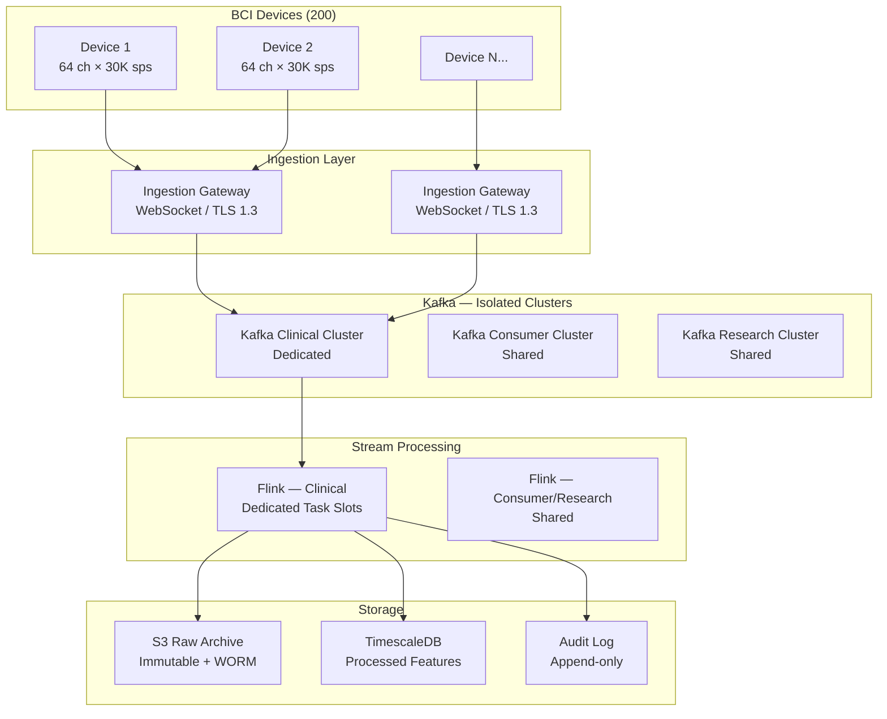

### Story Context

**#platform-eng — Monday 9:04am**

```
lena.strauss [9:04]: Everyone, quick intro — we have our new Staff Engineer starting
today. [your name], welcome to the worst possible first week.

lena.strauss [9:05]: Quick state of the world: FDA field reviewer arrives Friday 10am.
She's here to validate trial milestone TM-7: "continuous signal capture with < 10ms
processing latency, full audit trail, no data loss." That's her checklist. Our
checklist is somewhat longer.

dev.okonkwo [9:06]: "somewhat longer" lol

dev.okonkwo [9:06]: we've had 23 stability incidents in 90 days. 18 of them were
pipeline-related.

priya.sharma [9:07]: 19. The one last Thursday counts.

lena.strauss [9:08]: The pipeline is shared between clinical trials, consumer
neurofeedback, and research. Dev, can you walk [your name] through the architecture
as it actually exists?

dev.okonkwo [9:09]: yeah. give me 5 min to find the diagram. last time i saw it
it was on a post-it note in the old office
```

Dev Okonkwo is NeuralBridge's most senior platform engineer. He's been here since year two, written most of the pipeline code himself, and carries the mental model of a system that has never been fully documented. He speaks in clipped sentences and has a habit of ending statements with "...but don't worry about that yet" — which, you will learn, means "this is actually the most important thing."

Priya Sharma owns the clinical trials product. She is precise, slightly terse, and has been filing internal incident tickets for six months asking for pipeline isolation. They have not been actioned.

Dev shares his screen. The architecture diagram is a Google Slide from 18 months ago.

**#platform-eng — Monday 9:21am**

```
dev.okonkwo [9:21]: okay so here's the deal. each BCI device pushes signal data
over WebSocket to an ingestion gateway. gateway writes to Kafka. we have three
consumers: clinical-trial-processor, consumer-neurofeedback-processor,
research-processor. all three read from the same topics.

[your name] [9:23]: same topics or same consumer groups?

dev.okonkwo [9:24]: ...same topics. different consumer groups. but the kafka
cluster is shared. and so is the flink cluster downstream.

priya.sharma [9:24]: and when research kicks off a job, clinical latency spikes.

dev.okonkwo [9:25]: only sometimes

priya.sharma [9:25]: 19 times in 90 days

dev.okonkwo [9:25]: yeah okay. but don't worry about that yet.

[your name] [9:26]: how many devices total?

dev.okonkwo [9:26]: 200 active in the current trial. each device is 64 electrodes
at 30k samples/sec. so 1.92M samples/sec per device.

[your name] [9:27]: 200 devices times 1.92M is 384M samples/sec total

dev.okonkwo [9:27]: yep. it's a lot.

lena.strauss [9:28]: and that needs to go from device to processed output in
under 10ms. the 10ms is in the FDA submission.

[your name] [9:28]: where does the processing happen?

dev.okonkwo [9:29]: mostly cloud. some filtering on the device itself but
the heavy lifting — artifact rejection, feature extraction, event detection —
that's all in flink on our kafka cluster.

priya.sharma [9:29]: when it works.

dev.okonkwo [9:29]: when it works.
```

You spend the rest of the morning reading incident logs. Most follow the same pattern: research or consumer workloads create back-pressure in Kafka, consumer lag grows on the clinical trial consumer group, latency exceeds 10ms, alert fires, someone manually restarts consumers. One incident at 3:17am was resolved by Dev SSHing into the Flink cluster and manually terminating a stuck research job.

At 2pm, Lena finds you at your desk.

**1:1 — Dr. Lena Strauss / Your name — Monday 2:00pm**

```
Lena: "Where are you?"

You: "I've been through all 23 incidents. I think I understand the shape of
the problem."

Lena: "Good. What's the shape?"

You: "Three teams on one pipeline with no isolation. Clinical trial workloads
get starved by lower-priority workloads because the shared infrastructure
has no priority tiers. The 10ms SLA is maintained when the cluster is quiet.
It breaks when it isn't."

Lena: "And Friday?"

You: "Friday the reviewer will run the trial milestone test. She'll check latency
under load. If the consumer and research workloads are running during the test,
we'll fail."

Lena: "So what do we do?"

You: "Short term: we freeze research and consumer workloads during the
FDA test window. We manufacture compliance. Long term: we redesign the pipeline
so clinical trial data has dedicated, isolated infrastructure. One can never
affect the other. But I can't do both before Friday."

Lena: "The short term solution you just described is called fraud."

[pause]

You: "...You're right. What's the actual constraint?"

Lena: "The constraint is: fix the architecture enough that the system
legitimately passes the FDA test. And document what still needs to be done.
The FDA reviewer has seen half-finished systems. She respects honesty. She
does not respect theater."
```

That is your mandate. You have four days. You are designing the real-time neural signal processing pipeline — not as theater, but as the system that has to actually work.

### Problem Statement

NeuralBridge's signal processing pipeline ingests raw neural data from 200 BCI devices in an active clinical trial. Each device produces 64 electrodes × 30,000 samples/second = 1.92M samples/second. The total ingest rate is 384M samples/second across the trial. The pipeline must deliver processed signal data (artifact rejection, feature extraction, event detection) to downstream clinical applications with end-to-end latency under 10ms. This 10ms requirement is written into the FDA submission.

The current pipeline is a shared Kafka + Apache Flink cluster serving three workload types (clinical trial, consumer neurofeedback, research) with no isolation between them. Your task is to design a production-grade signal processing pipeline that guarantees the 10ms SLA for clinical trial workloads under all conditions, with the required HIPAA and 21 CFR Part 11 compliance properties.

### Explicit Requirements

1. Ingest raw neural signals from 200 BCI devices at 384M samples/second total throughput
2. End-to-end latency from device signal capture to processed output: < 10ms (hard SLA for clinical trial workloads)
3. Clinical trial workloads must be isolated from consumer and research workloads — no shared compute, no shared Kafka partitions
4. Signal processing stages: artifact rejection, band-pass filtering, feature extraction (power spectral density, coherence), event detection
5. All clinical trial data must be immutably stored with tamper-evident audit trail (21 CFR Part 11)
6. HIPAA compliance: brain signal data is PHI; access controls, encryption at rest and in transit, audit logs
7. System must handle device disconnection and reconnection without data loss or session corruption
8. Processing pipeline must be observable: per-device latency metrics, consumer lag, error rates, alert thresholds

### Hidden Requirements

**Hint 1**: Re-read Dev's description of the pipeline architecture. He mentions "artifact rejection, feature extraction, event detection." In a clinical trial context, what does "event detection" mean — and what does that imply about the latency requirement for *that specific sub-stage* versus the others?

**Hint 2**: Re-read Lena's final instruction: "The FDA reviewer has seen half-finished systems. She respects honesty." What does this imply about the required documentation artifact accompanying the architecture — and its format?

**Hint 3**: Re-read the incident logs context: "One incident at 3:17am was resolved by Dev SSHing into the Flink cluster and manually terminating a stuck research job." What does this reveal about the operability requirements — specifically around automated runbooks and on-call tooling?

**Hint 4**: Re-read Dev's mention: "some filtering on the device itself." The incident where a device "froze" (Ch. 182) is foreshadowed here. What happens to in-flight data when a device loses connectivity mid-session?

### Constraints

- **Scale**: 200 devices × 64 electrodes × 30,000 samples/sec = 384M samples/sec ingestion
- **Latency SLA**: < 10ms end-to-end (device → processed output) for clinical trial workloads
- **Storage**: Each sample = 4 bytes (float32) → 384M × 4 = 1.5 GB/sec raw data rate; processed features are ~100x compressed
- **Compliance**: HIPAA (PHI), 21 CFR Part 11 (electronic records for clinical trials)
- **Infrastructure**: AWS us-east-1 (primary), FDA requires data residency within US
- **Team**: 4 platform engineers, 1 Staff Engineer (you), DevOps support on-call
- **Budget**: $180K/month current infra spend; 20% headroom approved for pipeline redesign
- **Availability**: 99.9% uptime SLA for clinical trial workloads during active trial windows
- **Data retention**: Raw signals 7 years (21 CFR Part 11), processed features indefinitely

### Your Task

Design the NeuralBridge real-time neural signal processing pipeline. Focus on:
1. The ingestion layer (device → cloud transport, protocol selection, connection handling)
2. The stream processing architecture (Kafka topology, Flink job design, partition strategy)
3. Isolation model (how clinical trial workloads are protected from consumer/research)
4. The 10ms latency budget allocation across pipeline stages
5. Storage architecture for raw signals vs processed features vs audit trail
6. Failure modes and recovery (device disconnection, consumer lag spike, Flink job failure)

### Deliverables

- [ ] Mermaid architecture diagram showing the full pipeline from BCI device to downstream consumers
- [ ] Kafka topic design: topic names, partition counts, replication factors, consumer group assignments per workload type
- [ ] Latency budget: allocate the 10ms across each stage with justification (transport, ingestion, processing, output)
- [ ] Database schema for: device registry, session records, processed feature storage, audit log (with column types and indexes)
- [ ] Scaling estimation — show your math:
  - Total samples/sec → bytes/sec → GB/hour → TB/day
  - Kafka partition count calculation (throughput per partition ceiling)
  - Flink parallelism calculation (samples/sec per task slot)
- [ ] Tradeoff analysis (minimum 3):
  - WebSocket vs gRPC for device transport
  - Flink vs custom stream processor for sub-10ms latency
  - Shared cluster with priority vs dedicated clinical cluster
- [ ] Cost modeling: estimate $/month for ingestion layer, Kafka cluster, Flink cluster, storage tier
- [ ] Capacity planning: 200 devices today → 2,000 devices in 18 months (next trial cohort). What changes?

### Diagram Format

All architecture diagrams: Mermaid syntax.


