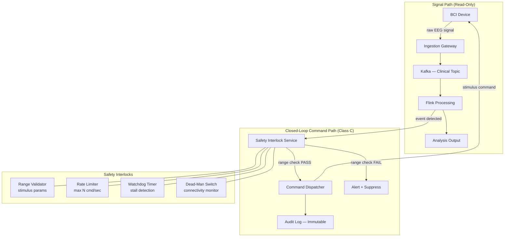

### Story Context

**Email chain — Tuesday, Day 2**

```
From: Rachel Ng <r.ng@neuralbridge.io>
To: [your name] <[you]@neuralbridge.io>
CC: Lena Strauss <l.strauss@neuralbridge.io>
Subject: FDA 510(k) — Software Documentation Gaps
Date: Tuesday 8:17am

Welcome to the team. I'm Rachel — Regulatory Affairs Lead. Lena said to loop
you in immediately.

Here's where we are:

Our 510(k) submission for the NeuralBridge Signal Platform is targeting a
90-day window. The submission argues "substantial equivalence" to the
Neurolytics DataCore v2.1 (our predicate device), which was cleared in 2019.

We have a problem: the Neurolytics predicate is a Class II device with
Software as a Medical Device (SaMD) classified at IEC 62304 Class B
(moderate risk). Our device handles direct neural stimulation feedback loops.
FDA reviewers will almost certainly classify us at Class C (highest risk).

Class C requires:
  - Complete software requirements specification (SRS)
  - Software design specification (SDS)
  - Software hazard analysis (SHA) — we have a partial draft
  - Software FMEA
  - Full requirements traceability matrix (RTM) from requirements → design → test
  - Verification and validation (V&V) protocols and results

What we currently have:
  - SRS: 40% complete
  - SDS: 0% (it's in people's heads and in Confluence pages)
  - SHA: 30% complete (Dev started it in Q2, abandoned it)
  - SFMEA: 0%
  - RTM: 0%
  - V&V: exists for unit tests, nothing end-to-end

The 510(k) submission needs all of this. We have 90 days.

The architectural implication: we cannot simply document what we have. Some
of what we have will NOT pass IEC 62304 Class C. The architecture has to change
AND be documented. In that order.

I'm attaching the FDA guidance document. It is 412 pages.

Rachel Ng
Regulatory Affairs Lead, NeuralBridge
```

---

```
From: [your name]
To: Rachel Ng
CC: Lena Strauss
Subject: Re: FDA 510(k) — Software Documentation Gaps
Date: Tuesday 9:03am

Rachel,

Got it. A few questions before I read the 412 pages:

1. The predicate device (Neurolytics DataCore v2.1) — do we have access to
   their 510(k) submission? The FDA database makes cleared submissions public.
   I need to understand what safety claims we're claiming equivalence to.

2. "Direct neural stimulation feedback loops" — does our platform issue
   stimulation commands, or only read signals?

3. Who owns the test protocols currently? Is there a QA team?

[your name]
```

---

```
From: Rachel Ng
To: [your name]
CC: Lena Strauss
Subject: Re: FDA 510(k) — Software Documentation Gaps
Date: Tuesday 9:31am

1. Yes, attaching the Neurolytics clearance letter and their SDS summary.
   Their predicate argument is built on "read-only signal acquisition with
   passive analysis." No feedback. No stimulation.

   Our platform, in the CognitiveTrain trial (our largest clinical customer),
   runs closed-loop neurofeedback. The algorithm detects a neural state and
   then sends a signal BACK to the device, which adjusts audio/visual stimulus
   in real-time.

   This is NOT what the predicate device does.

2. See above. Yes, we do issue commands. The closed-loop path goes:
   Signal → Detect → Command → Device response

3. QA team: it's one person, Marco Vitelli. He owns test cases in TestRail.
   No formal V&V protocol. He's very good but also very alone.

I want to flag: the closed-loop path may require us to argue a different
predicate, or pursue De Novo classification. I have a call with our FDA
counsel tomorrow. I'll need your architecture docs before that call.

Rachel
```

---

You read the Neurolytics clearance letter that afternoon. Their safety case rests on three claims: (1) the software cannot issue commands to the device, (2) all signal processing is advisory only, and (3) the system will not operate if the audit log is unavailable.

NeuralBridge violates claim 1. The closed-loop neurofeedback path in the CognitiveTrain trial is a real-time command channel. This is not a documentation problem. This is an architectural truth that the FDA 510(k) submission must honestly represent — which means the safety architecture must be redesigned to support a Class C safety claim.

You call Dev that evening.

**Dev Okonkwo / Your name — Tuesday 7:44pm — Phone**

```
Dev: "So the closed-loop path. Yeah. That was added in Q3 of last year.
The CognitiveTrain team asked for it, we shipped it in six weeks. Nobody
updated the 510(k) docs."

You: "Does the feedback command go through the same pipeline as the signal data?"

Dev: "...Yes."

You: "So if there's a processing error or a bug in the event detection algorithm,
the device could receive a malformed or unintended stimulus command."

Dev: "...In theory."

You: "Has that happened?"

Dev: "We had one incident in November. Device received a stimulus at the wrong
frequency. Patient reported discomfort. It was logged as a 'device calibration
issue' in the incident report."

You: "Where's that incident report?"

Dev: "I'll find it. But listen — the team was stressed about it at the time.
Lena knows. Rachel doesn't. I don't think it made it into the regulatory log."

[long pause]

You: "Dev, that incident has to be in the regulatory log."

Dev: "Yeah. I know."
```

This is no longer a documentation project. It is a safety architecture project with a regulatory clock running.

### Problem Statement

NeuralBridge's Signal Platform must be architected to support FDA 510(k) clearance under IEC 62304 Class C (highest risk software lifecycle requirements). The platform includes a closed-loop neurofeedback path — software detects a neural state and issues a command back to the physical device, altering patient stimulus. This capability does not match the predicate device's safety claims. The architecture must be redesigned to (a) ensure the closed-loop command path has safety interlocks that prevent unintended stimulus, (b) produce the required IEC 62304 Class C documentation artifacts, and (c) support a credible hazard analysis for FDA submission.

The 90-day window is non-negotiable. The undisclosed November incident must be properly logged. The architecture must be honest.

### Explicit Requirements

1. Redesign the closed-loop neurofeedback command path with explicit safety interlocks (range checking, rate limiting on stimulus commands, watchdog timers, dead-man's switch)
2. Define software safety integrity levels per IEC 62304: identify which modules are Class C (can cause patient harm), Class B (can cause non-serious harm), Class A (no harm possible)
3. Produce a Software Hazard Analysis (SHA) structure: for each hazard, define severity × probability → risk level → mitigation → residual risk
4. Define a Requirements Traceability Matrix (RTM) structure linking: user requirement → software requirement → design component → test case → test result
5. All Class C modules must have: code review by two engineers, documented test protocols, version-locked dependencies, and immutable deployment records
6. The November stimulus incident must be documented in the regulatory adverse event log with root cause analysis

### Hidden Requirements

**Hint 1**: Re-read Rachel's email carefully. She says "substantial equivalence to the Neurolytics DataCore v2.1." Then re-read what she reveals about Neurolytics' safety claims: "the software cannot issue commands to the device." NeuralBridge's architecture violates this claim. What does this mean for the 510(k) strategy — and what alternative regulatory pathway exists?

**Hint 2**: Re-read Dev's phone call disclosure about the November incident. He says "Rachel doesn't know." What is the regulatory obligation when a safety incident occurs during a clinical trial and is not reported? (Hint: 21 CFR Part 803, mandatory reporting timelines.)

**Hint 3**: Re-read Rachel's description of the closed-loop path: "Signal → Detect → Command → Device response." The detection algorithm is ML-based. What IEC 62304 classification applies to AI/ML-based SaMD, and what does that add to the documentation burden?

**Hint 4**: Re-read Rachel's final line: "I'll need your architecture docs before that call." The FDA counsel call is tomorrow morning. What artifact format does FDA counsel actually need — and it is NOT a Mermaid diagram?

### Constraints

- **Regulatory timeline**: 510(k) submission in 90 days
- **IEC 62304 Class C**: full software lifecycle documentation required
- **Team**: 4 platform engineers, 1 QA engineer (Marco Vitelli), 1 Staff Engineer (you)
- **Predicate device mismatch**: closed-loop path has no predicate — De Novo or new predicate strategy required
- **Undisclosed adverse event**: November stimulus incident must be retroactively documented under 21 CFR Part 803
- **Clinical trial continuity**: CognitiveTrain trial is live; cannot pause the closed-loop path without trial disruption
- **Compliance frameworks**: IEC 62304 (software lifecycle), IEC 62366 (usability), ISO 14971 (risk management), 21 CFR Part 820 (quality system regulation)
- **Budget**: $40K approved for regulatory consultant engagement; Marco Vitelli's full time allocated to V&V

### Your Task

Design the FDA 510(k) Software Architecture for NeuralBridge's Signal Platform with specific attention to:
1. The safety interlock architecture for the closed-loop command path
2. IEC 62304 Class C module classification and isolation strategy
3. Hazard analysis structure (at minimum 8 hazards with full risk table)
4. The RTM architecture (how it is generated, maintained, and audited)
5. The adverse event reporting process and how it integrates with system logs
6. The regulatory strategy pivot: 510(k) with new predicate vs De Novo

### Deliverables

- [ ] Mermaid architecture diagram: closed-loop command path with safety interlocks highlighted
- [ ] IEC 62304 module classification table: list all major software modules, assign Class A/B/C, justify each
- [ ] Software Hazard Analysis template (at minimum 8 rows):
  - Hazard | Hazardous Situation | Harm | Severity (S1-S4) | Probability (P1-P5) | Risk Level | Mitigation | Residual Risk
- [ ] Safety interlock design for the closed-loop path:
  - Stimulus range validation (what are the safe parameter bounds?)
  - Rate limiting on command issuance (max commands/second)
  - Watchdog timer design (what happens if processing stalls?)
  - Dead-man's switch (automatic cessation if cloud connectivity lost)
- [ ] RTM structure: show the data model linking requirement → design → test → result (database schema or document format)
- [ ] Tradeoff analysis (minimum 3):
  - 510(k) substantial equivalence with new predicate vs De Novo classification
  - Separate closed-loop path service vs integrated pipeline (risk isolation)
  - ML-based event detection (IEC 62304 + AI/ML guidance) vs rule-based (simpler compliance burden)
- [ ] Cost modeling: regulatory compliance engineering effort in $/engineer-days; external FDA consultant cost
- [ ] 90-day timeline: phase the work across the 90-day window with milestones

### Diagram Format

All architecture diagrams: Mermaid syntax.


