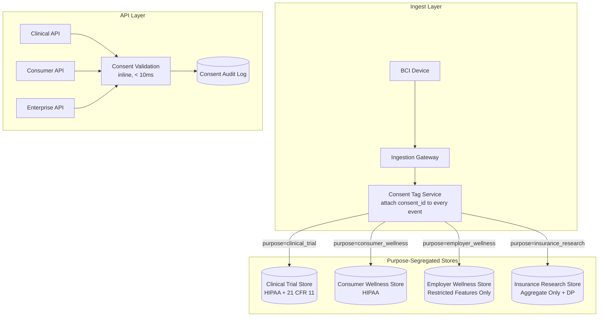

### Story Context

**Email chain — Wednesday, Day 3**

```
From: Lena Strauss <l.strauss@neuralbridge.io>
To: [your name] <[you]@neuralbridge.io>
Subject: FWD: Brain Data Report — Are We Exposed?
Date: Wednesday 7:52am

Forwarding this from the CEO. Please read and flag any architectural
implications before EOD.

— Lena

---------- Forwarded message ---------
From: Arjun Mehta <a.mehta@neuralbridge.io>
To: Lena Strauss <l.strauss@neuralbridge.io>
CC: Rachel Ng <r.ng@neuralbridge.io>
Subject: Brain Data Report — Are We Exposed?
Date: Wednesday 7:41am

Lena,

Please read this and tell me we're not exposed:

https://cognitivelibert.org/reports/bci-data-2026

The headline: "Brain Data is the Last Private Frontier — and Tech Companies
Are Already Mining It."

Three specific claims from the report:
  1. Several BCI platforms sell data to third parties without explicit
     neural-specific consent (consent buried in general terms of service)
  2. Some employers are using BCI wellness programs to flag "cognitive stress
     patterns" in employees — effectively monitoring employee mental state
  3. An insurance company in their data shows actuarial models incorporating
     neural patterns to flag "high-risk" individuals for premium adjustments

I need to know: do we have any customers in category 2 or 3?

— Arjun
```

---

```
From: Rachel Ng
To: Arjun Mehta, Lena Strauss
CC: [your name]
Subject: Re: Brain Data Report — Are We Exposed?
Date: Wednesday 8:34am

Arjun,

Short answer: yes, we have customers in both categories.

Category 2 (employer wellness): MindfulCorp — a corporate wellness platform
that deploys our non-invasive headset integration for employee stress monitoring.
Their contract with us is under the "Consumer Neurofeedback" product tier.
Current NeuralBridge terms allow them to access processed features (not raw
signals) for "wellness improvement and product optimization."

Category 3 (insurance): PremiumLife Insurance — a pilot customer on the
enterprise tier. They are using our research API to pull aggregated neural
pattern data for a cohort study. The consent form their users signed references
"research purposes" but does not specifically call out insurance actuarial use.

I want to be very clear: our current consent architecture does not distinguish
between these use cases. All customers get the same consent form. All get the
same data access tier based on their product subscription.

I will note that the report's legal analysis suggests current HIPAA compliance
is insufficient for these use cases, and that several state legislatures
(Colorado, Illinois, Texas) are moving to pass explicit "neural privacy" laws
this year.

Rachel
```

---

```
From: [your name]
To: Rachel Ng, Lena Strauss
Subject: Re: Brain Data Report — Are We Exposed?
Date: Wednesday 9:17am

Rachel, Lena —

I've read the report and Rachel's summary. Here's the architectural
implication in plain language:

We currently have ONE data flow. Signals come in, get processed, and go
into a single data store. All customers query the same processed feature
store through the same API with different permission tiers.

This means that data generated in a clinical trial context can flow —
technically, without a code change — to the PremiumLife insurance API
query. The permission tier stops an unauthorized query, but there is NO
architectural segregation of data by purpose or by customer type.

If a court, regulator, or journalist asks "could the insurance company
have accessed a clinical trial patient's neural data?" — the honest answer
is "not without bypassing permissions, but the data was in the same
database."

That is not good enough.

I think we need to redesign the data flow so that:
  1. Data generated under different consent frameworks lives in different
     physical data stores (not just different permission tiers)
  2. Customer type (clinical/consumer/research/employer/insurance) is
     a first-class architectural concept — not an afterthought
  3. Any cross-purpose data use requires explicit re-consent, logged
     and auditable

This will require a data model redesign and an API redesign.

[your name]
```

---

```
From: Lena Strauss
To: [your name], Rachel Ng
Subject: Re: Brain Data Report — Are We Exposed?
Date: Wednesday 9:44am

This is exactly the right analysis. But I want you to understand the
business tension before you design anything:

Our revenue model currently treats consumer neurofeedback, clinical trials,
and enterprise (employer/insurance) as three growing revenue streams.
The enterprise tier is the fastest-growing and commands the highest margins.

If we architecturally segregate data by customer type and require explicit
re-consent for cross-purpose use, some enterprise contracts become
technically impossible to fulfill — specifically PremiumLife's cohort study,
which REQUIRES cross-population analytics.

I'm not asking you to make this a business decision. I'm asking you to
design an architecture that makes the tradeoffs EXPLICIT — so Arjun and
the board can decide with clear eyes what we're willing to do and what
we're not.

Design for what's right. Then we'll have the harder conversation.

— Lena
```

---

You spend Wednesday afternoon reading the Colorado Cognitive Privacy Act draft, the Illinois Biometric Information Privacy Act (as an analog), and the EU's emerging AI Act neural data provisions. None of them are yet law. All of them will be law within 18 months, based on the legislative calendars.

The civil liberties report had a specific line you keep returning to: *"The question is not whether brain data is sensitive. The question is whether the people generating it had any meaningful choice about how it was used."*

Meaningful choice is an architectural requirement.

### Problem Statement

NeuralBridge's unified data platform stores processed neural features from clinical trial patients, consumer wellness users, and enterprise customers (including an employer wellness program and an insurance company) in a single data store with permission-tier access controls. This architecture does not provide meaningful data segregation by purpose or consent context. The architecture must be redesigned to enforce purpose limitation at the data layer — ensuring that data collected under clinical trial consent cannot flow to insurance or employer use cases without explicit architectural barriers and re-consent workflows. The design must also anticipate emerging neural privacy legislation in three US states and the EU.

### Explicit Requirements

1. Purpose-segregated data storage: data must be physically separated by consent context (clinical trial, consumer wellness, employer wellness, insurance research), not just logically separated by permission tiers
2. Consent architecture: each data point must carry a consent record that defines permitted uses; cross-purpose queries must fail at the data layer if the consent record does not authorize the requesting context
3. Data minimization: processed features returned to each customer type must be filtered to the minimum necessary for their stated purpose; raw signals must never be accessible to employer or insurance customers
4. Re-consent workflow: when a customer requests access to data beyond their original consent scope, the platform must initiate an auditable re-consent process with the data subject
5. Consent audit trail: every data access must be logged with: requesting customer, purpose claimed, consent record referenced, data returned (schema, not values), timestamp
6. Right to erasure: data subjects must be able to request deletion of their data; deletion must propagate across all customer-accessible stores; clinical trial records governed by 21 CFR Part 11 have different retention requirements (explain the conflict and resolution)
7. Emerging legislation readiness: architecture must accommodate Colorado, Illinois, and Texas neural privacy bill requirements (right to opt-out of commercial use, no discriminatory use for insurance/employment)

### Hidden Requirements

**Hint 1**: Re-read Rachel's email about PremiumLife's cohort study: "which REQUIRES cross-population analytics." What does this mean architecturally? Can you support aggregate analytics across consent contexts using differential privacy or federated computation — without moving individual-level data?

**Hint 2**: Re-read Lena's framing: "I'm asking you to design an architecture that makes the tradeoffs EXPLICIT." This is a hint about a specific deliverable beyond the architecture diagram — what artifact forces explicit tradeoffs to be visible to a non-technical executive and board?

**Hint 3**: Re-read the civil liberties report reference: "Consent buried in general terms of service." The current NeuralBridge consent form is general-purpose. What does this mean for the legal validity of data that has already been collected? (Research "informed consent" and retroactive consent problems.)

**Hint 4**: Re-read the conflict between 21 CFR Part 11 (requires data retention) and the right to erasure (requires deletion). The resolution is not obvious — it requires a specific architectural pattern. What pattern allows you to satisfy both obligations simultaneously?

### Constraints

- **Users**: 12 active clinical trials (estimated 500 patients), 150K consumer wellness users, 80 enterprise customers (employer and insurance tier)
- **Data volume**: 1.5 GB/sec raw signal ingestion; processed features ~15 MB/sec; consent records < 1 KB per user
- **Latency**: API query latency < 100ms for processed feature reads; consent validation < 10ms (inline, synchronous)
- **Compliance**: HIPAA, 21 CFR Part 11, GDPR (EU users), Colorado/Illinois/Texas emerging neural privacy law
- **Retention**: clinical trial data 7 years (21 CFR Part 11), consumer data per consent agreement (default 2 years), enterprise data per contract
- **Team**: 4 platform engineers + you; no dedicated privacy engineering team
- **Budget**: $25K/month additional infra approved for privacy architecture

### Your Task

Design NeuralBridge's brain data privacy architecture. Focus on:
1. The purpose-segregated data store design
2. The consent record data model and enforcement mechanism
3. Data minimization: how feature sets are filtered per customer type
4. Aggregate analytics for enterprise customers using privacy-preserving computation
5. Right to erasure implementation with 21 CFR Part 11 conflict resolution
6. The consent audit trail

### Deliverables

- [ ] Mermaid architecture diagram showing purpose-segregated data flows from ingest through to customer API
- [ ] Consent record schema (PostgreSQL or equivalent):
  - `consent_records` table with: user_id, purpose_type (enum), granted_at, expires_at, revoked_at, permitted_uses (JSON array), consent_version
  - Index strategy for inline consent validation
- [ ] Data store segregation design: list the separate stores, what data lives in each, who can access each
- [ ] Data minimization matrix: for each customer type, what processed features are accessible (table format)
- [ ] Privacy-preserving aggregate analytics design: how PremiumLife can get population-level insights without individual-level brain data
- [ ] Right to erasure flowchart: deletion request → propagation across stores → clinical trial data carve-out
- [ ] Scaling estimation:
  - Consent validation adds inline latency — model the overhead for 150K concurrent users
  - Audit log write rate (every API call generates a record) — GB/day estimate
- [ ] Tradeoff analysis (minimum 3):
  - Physical store segregation vs logical segregation with strong access control
  - Inline consent check vs pre-computed access tokens
  - Differential privacy for enterprise analytics vs federated computation
- [ ] Cost modeling: additional infrastructure for purpose-segregated stores + consent service $/month
- [ ] Capacity planning: 150K users today → 1.5M in 18 months with consumer product launch. How does consent validation scale?

### Diagram Format

All architecture diagrams: Mermaid syntax.


