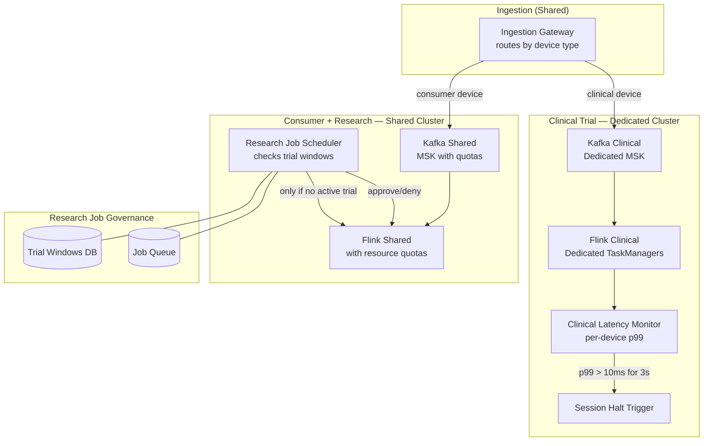

### Story Context

**This is the mandatory cross-team architecture review story beat.**

**Architecture Review — Thursday 10:00am — Conference Room 3**

You scheduled this as a 90-minute session with the three teams that share the signal processing pipeline. You framed it as a "readiness review before the FDA visit." The attendees:

- **Dev Okonkwo** — Platform Engineering (pipeline owner)
- **Priya Sharma** — Clinical Trials Product
- **Marcus Yuen** — Consumer Neurofeedback Engineering
- **Dr. Hana Björk** — Research Computing (joined remotely from Berlin)
- **You** — facilitating
- **Lena Strauss** — observing silently from the back

You had spent Wednesday night building a dependency map of the shared infrastructure. You drew it on the whiteboard before people arrived. The map shows three teams' workloads all funneling into a single shared Kafka cluster and a single shared Apache Flink cluster. There are no lines showing isolation between them. No priority tiers. No circuit breakers.

**Architecture Review Transcript (partial):**

```
You: "I want to start with a simple question. If the research team kicks off
a large back-test job — say, 24 hours of signal replay — what happens to
clinical trial latency?"

Dev: "It spikes. We've seen it go from 4ms to 40ms during big research runs."

You: "And when latency hits 40ms, what happens to the CognitiveTrain trial?"

Priya: [pause] "The trial protocol requires < 10ms. At 40ms, the neurofeedback
loop is outside the protocol window. Technically, data collected during that
window may be... protocol-violating."

Dr. Björk: [from laptop speaker] "We always schedule big jobs at night when
clinical trial windows are closed."

You: "Always?"

Dr. Björk: "...Usually."

You: "Priya, do you have visibility into when research jobs are running?"

Priya: "No. We have Grafana alerts when our consumer lag exceeds 500ms.
That's the only warning we get."

You: "So the clinical trial team gets 500ms of lag before they find out
a research job might be affecting trial data quality."

Priya: "Correct."

Marcus Yuen: "To be fair, consumer neurofeedback workloads also cause spikes.
We're not innocent here."

You: "Let me ask a different question. If a patient in the CognitiveTrain trial
experiences an adverse event — a seizure, say — and the subsequent investigation
requires them to pull the exact processing latency at the moment of the event...
can they do that?"

Dev: "We have Kafka timestamps and Flink task metrics."

You: "Can you reconstruct the exact processing latency for a specific device
at a specific 10-millisecond window, three weeks after the fact?"

Dev: "...With effort. It's not a first-class operation."

Priya: [very quietly] "Dev, if there was a patient adverse event and we
couldn't prove the pipeline was within protocol..."

Dev: "I know."

You: "I want to draw something on the board."
```

You went to the whiteboard. You drew two scenarios:

**Scenario A (current state)**: Three teams sharing infrastructure. Research job starts. Kafka partition backpressure propagates to clinical consumer group. Flink task slots starved. Clinical processing latency spikes from 4ms to 40ms. No automatic detection. No isolation. A 40ms spike during a 30-minute trial session = protocol violation that may not be detected for hours.

**Scenario B (required state)**: Clinical trial infrastructure is physically separate. Research and consumer share infrastructure. No shared resources between clinical and non-clinical. Clinical processing latency is a guaranteed SLA with hard capacity reservation. Any degradation triggers an immediate automated halt to the clinical session.

```
Dr. Björk: "Physically separate infrastructure will cost more."

You: "Yes."

Dr. Björk: "How much more?"

You: "I'll model it. But before we talk cost, I need everyone to agree on
a factual statement: in the current architecture, a low-priority research
workload can impair the data quality of a live clinical trial, and the
clinical team has no real-time visibility or control over that. Is that
a true statement?"

[silence]

Priya: "Yes. That's true."

Dev: "Yes."

Marcus Yuen: "Yes."

Dr. Björk: "...Yes."

Lena: [from the back] "Okay. We're redesigning."
```

The review was supposed to be routine. It became the moment everyone stopped looking away.

**After the review — 11:47am — Lena's office**

```
Lena: "When did you know?"

You: "I suspected it from the incident logs on Monday. I confirmed it when
I built the dependency map Wednesday night. I wanted to surface it in the
room, not in a Slack message."

Lena: "Why?"

You: "Because if I send a Slack message saying 'the architecture is a patient
safety risk,' that's a bomb. In the room, with all three teams, I could
make sure everyone understood the problem at the same time and agreed on
the same remediation path. No one can claim they weren't told."

Lena: "You're going to be good at this job."

You: "I haven't fixed anything yet."

Lena: "No. But you found it. Dev's been maintaining that system for two years
and he knew something was wrong. You were here for three days and you could
name it. That's different from fixing it, but it's not nothing."

You: "The fix is going to take 6 to 8 weeks. We're redesigning a live system
with clinical trial workloads running on it. Zero downtime."

Lena: "What do you need?"

You: "Dev full-time for 6 weeks. A dedicated infrastructure budget approval.
And someone needs to tell the CognitiveTrain clinical team that their trial
data from the last 30 days needs a quality review — any sessions where
research jobs were running concurrently may have latency violations."

Lena: [long pause] "That's going to be an uncomfortable conversation."

You: "Yes. But it's the honest one."
```

### Problem Statement

NeuralBridge's signal processing pipeline is a shared Kafka + Apache Flink cluster serving three workload types: clinical trial processing (latency SLA < 10ms, patient safety implications), consumer neurofeedback (latency SLA < 50ms, quality-of-service), and research computing (batch-oriented, no hard SLA). There is no resource isolation between these workloads. Research and consumer jobs can impair clinical trial data quality. The architecture must be redesigned to provide hard resource isolation for clinical trial workloads, zero-downtime migration from the shared cluster to the isolated design, and retrospective data quality assessment tooling for the last 30 days.

The constraint that makes this uniquely difficult: the clinical trial is live. You cannot stop it to migrate infrastructure. Every redesign decision must be made in the context of continuous clinical data flowing.

### Explicit Requirements

1. Clinical trial workloads must have dedicated, physically separate infrastructure — dedicated Kafka cluster, dedicated Flink cluster, dedicated processing resources; no shared components with research or consumer workloads
2. Resource isolation for consumer and research workloads: these can share infrastructure, but with Kafka topic-level isolation, Flink job-level resource quotas, and circuit breakers that prevent research jobs from starving consumer workloads
3. Migration must be zero-downtime: during the migration period, clinical trial data must flow uninterrupted with maintained latency SLA; the migration uses a dual-write or shadow approach
4. Latency observability: every clinical trial device must have per-device, per-session processing latency visible with < 1-second granularity and 30-day retention
5. Session quality audit: a tooling artifact must allow retrospective analysis of any 30-day session window to identify periods where processing latency exceeded protocol threshold
6. Automated clinical session halt: if clinical processing latency exceeds 10ms for more than 3 consecutive seconds, the system must automatically halt the affected trial session and alert clinical staff
7. Research job scheduling governance: research batch jobs must register with a scheduler that checks for active clinical trial windows before allowing execution

### Hidden Requirements

**Hint 1**: Re-read the transcript at the moment You ask "can you reconstruct the exact processing latency for a specific device at a specific 10-millisecond window, three weeks after the fact?" Dev says "with effort." What does "with effort" mean for a regulatory investigation? What specific observability artifact is missing that would make this a first-class operation?

**Hint 2**: Re-read Priya's quiet statement: "Dev, if there was a patient adverse event and we couldn't prove the pipeline was within protocol..." This is not just a latency problem. What does "protocol violation" mean in a clinical trial context — and what is the regulatory obligation when protocol violations are discovered retroactively?

**Hint 3**: Re-read Lena's final exchange: "someone needs to tell the CognitiveTrain clinical team that their trial data from the last 30 days needs a quality review." This implies a specific artifact the architecture must produce: not just future-facing observability, but retroactive data quality analysis. What data must have been stored to make this possible?

**Hint 4**: Re-read Dr. Björk's comment: "We always schedule big jobs at night when clinical trial windows are closed." This implies an informal scheduling agreement. What happens when informal agreements are codified as formal system requirements — and what enforcement mechanism is needed?

### Constraints

- **Clinical trial load**: 200 devices × 384M samples/sec; 10ms hard SLA; currently live
- **Consumer load**: 50K simultaneous neurofeedback sessions; 50ms SLA
- **Research load**: batch jobs, no hard SLA, up to 500M events in a single replay job
- **Shared Kafka cluster**: 3 brokers, 120 partitions, 12TB storage; managed MSK (AWS)
- **Shared Flink cluster**: 20 TaskManagers, 4 slots each = 80 total slots
- **Migration constraint**: zero downtime; clinical trial data must not be interrupted
- **Infrastructure budget**: $35K/month approved for dedicated clinical infrastructure
- **Timeline**: isolation redesign must be complete within 6 weeks
- **Data retention**: session latency metrics retained 30 days (observability), raw latency events retained 7 years (regulatory)

### Your Task

Design the isolation architecture for NeuralBridge's signal processing pipeline. You must produce:
1. The target state architecture (dedicated clinical cluster + shared consumer/research cluster)
2. The zero-downtime migration plan (how you transition from current to target state while the trial is live)
3. The research job scheduling governance model
4. The retroactive data quality audit tooling design
5. The automated clinical session halt mechanism

### Deliverables

- [ ] Mermaid architecture diagram: target state with dedicated clinical cluster and shared consumer/research cluster with quota enforcement
- [ ] Kafka topology design (before and after):
  - Current: topic names, consumer groups, partition assignments
  - Target: separate cluster topology, new topic strategy, consumer group isolation
- [ ] Zero-downtime migration plan (step by step):
  - How dual-write is established
  - How traffic cutover happens for clinical workloads
  - How rollback is triggered if something goes wrong
  - Timeline with milestones
- [ ] Research job scheduler design:
  - How jobs register
  - How active trial windows are checked
  - What happens when a job is denied
  - Database schema for: `research_jobs`, `trial_windows`, `scheduling_decisions`
- [ ] Retroactive data quality audit design:
  - What data must be retained to support the 30-day retrospective
  - Query pattern to identify protocol-violating latency periods
  - Report format for clinical team
- [ ] Automated clinical session halt:
  - Latency monitoring: what triggers the halt
  - Alert chain: clinical staff notification within how many seconds?
  - Session state: how is a halted session recorded for regulatory audit?
- [ ] Scaling estimation:
  - Two-cluster model vs one-cluster with quotas: compare Kafka broker cost
  - Flink parallelism requirements for clinical cluster alone
- [ ] Tradeoff analysis (minimum 3):
  - Dedicated clusters vs quota-enforced shared cluster (cost vs isolation guarantee)
  - Dual-write migration vs blue/green cluster migration
  - Hard automated halt vs soft alert-and-log for protocol violations
- [ ] Cost modeling: dedicated clinical cluster cost vs shared cluster cost delta ($/month)
- [ ] Capacity planning: 200 devices today → 2,000 devices in 18 months; does the dedicated cluster design scale linearly?

### Diagram Format

All architecture diagrams: Mermaid syntax.


