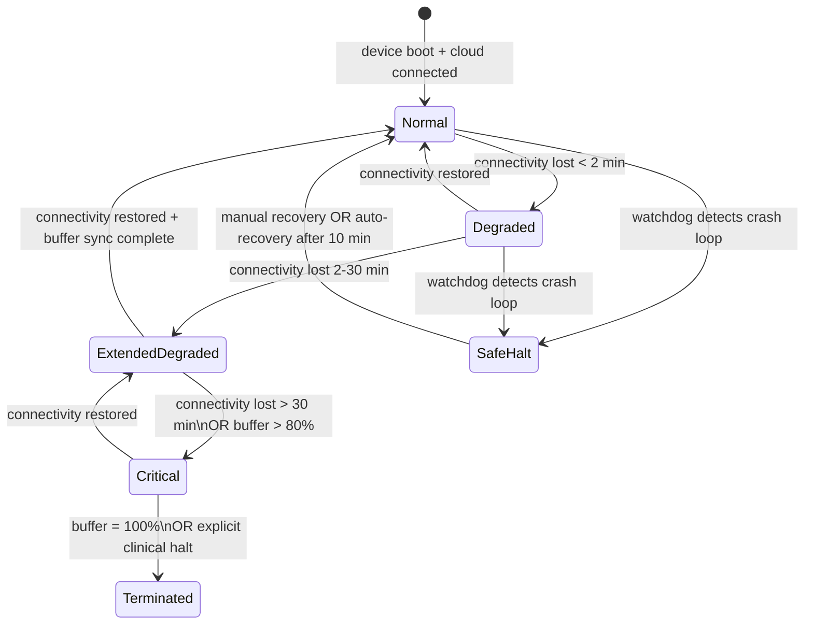

### Story Context

**Incident Report — NeuralBridge Device Operations**
**Incident ID**: INC-2026-0403
**Reported by**: Priya Sharma (Clinical Trials)
**Date**: Thursday 2:14pm
**Status**: Open

---

**Summary**: Patient in CognitiveTrain Trial (Subject CT-0047) reported that their neurofeedback headset "froze" during a 45-minute neurofeedback session at approximately the 22-minute mark. The device display went blank. The session was interrupted and restarted manually by the site coordinator. When the site coordinator reconnected the device, session data for minutes 22–45 was absent from the platform.

**Initial Timeline (reconstructed from device logs)**:

```
14:07:03  — Session CT-0047-S012 begins. Device online. Cloud sync active.
14:09:11  — Wi-Fi signal drops (site coordinator moved a cart near the router).
14:09:13  — Edge processor falls back to local storage mode. Buffering signals locally.
14:09:17  — Alert triggered: cloud connectivity lost. Alert delivered to... nowhere.
             (Alert config pointed to deprecated PagerDuty routing key.)
14:17:44  — Edge processor local buffer fills to capacity (512MB).
14:17:44  — Device enters "buffer full" state. Behavior undefined.
14:17:45  — Edge processor process crashes. Watchdog does not restart it.
14:17:46  — Device display goes blank. Session effectively terminated.
14:29:33  — Wi-Fi restored (coordinator moved cart back).
14:29:33  — Device boots. Session state lost. Local buffer cleared on restart.
14:45:00  — Session manually restarted. 23 minutes of data unrecoverable.
```

**Root Cause (initial analysis)**:
Edge processor has no defined behavior for "buffer full" state. When local storage fills during a connectivity loss event, the process exits with a fatal error. The watchdog timer is configured to restart the process after 30 seconds — but the buffer remains full, so the process immediately exits again. This creates a tight restart loop that drains battery and produces no useful state.

**Contributing factors**:
- Alert routing pointed to deprecated PagerDuty key (misconfigured 6 months ago, never tested)
- No graceful degradation mode for extended connectivity loss
- OTA update deployed 11 days ago changed the buffer flush behavior — the new behavior prioritizes data integrity (does not discard partial samples) but did not account for the "buffer completely full" edge case
- Edge processor has no circuit breaker for the "buffer full → crash → restart → buffer still full → crash" loop

**Impact**:
- 23 minutes of clinical trial data unrecoverable
- Patient CT-0047 must repeat session under trial protocol
- Regulatory team has been notified (adverse data event, not adverse patient event)
- Site coordinator is upset and asking for a better device experience

---

**#platform-eng — Thursday 2:51pm**

```
priya.sharma [2:51]: This is the third edge crash in two months. Dev, is there
a defined behavior for "extended connectivity loss" in the edge processor spec?

dev.okonkwo [2:53]: ...define "spec"

priya.sharma [2:53]: I'll take that as a no.

dev.okonkwo [2:54]: the edge processor was built by a contractor 18 months ago.
the original brief was "handle up to 30 seconds of connectivity loss." nobody
designed for 8 minutes.

[your name] [2:55]: how common are connectivity losses > 30 seconds?

dev.okonkwo [2:57]: INC logs show 14 incidents in 90 days where connectivity
loss exceeded 30 seconds. the 8-minute one today was the longest.

[your name] [2:58]: so "up to 30 seconds" was the wrong spec.

dev.okonkwo [2:58]: apparently.

priya.sharma [2:59]: and we have 200 devices in this trial. 14 incidents in
90 days means on average one device crashes every 6 days due to connectivity.
we have 18 months left in this trial.

[your name] [3:00]: 200 devices × 1 crash per 6 days = 33 crashes per day
in a 200-device trial. that can't be right.

dev.okonkwo [3:01]: no, 14 total incidents across all devices in 90 days.
about 0.16 per device per 90 days. but connectivity variance is high —
some trial sites have terrible wifi.

[your name] [3:02]: okay. so the immediate fix: we need defined behavior for
every failure mode. not just "30 seconds." what's the right design?
```

---

**Direct Message — Marcus Webb → [your name] — Thursday 5:30pm**

```
Marcus Webb: I heard you're doing the edge processor redesign at NeuralBridge.

[your name]: How did you hear that?

Marcus Webb: I know people. Listen: edge processing for medical devices is not
like edge processing for IoT sensors. When an AgroSense node loses connectivity,
you lose a temperature reading. When a BCI device loses connectivity mid-session,
you potentially lose clinical trial data that took months and thousands of dollars
to set up. The failure modes are different in kind, not just in severity.

Marcus Webb: The question isn't "what does the device do when connectivity is
lost?" The question is "what is the defined clinical outcome when this device
operates in each degraded mode?" Every failure mode needs a named clinical state.
Not just a technical state.

Marcus Webb: Define the states first. Then design the software.

[your name]: How do I know what states are clinically valid?

Marcus Webb: You ask the clinical team. That's the conversation you haven't
had yet.
```

You forward Marcus's message to Priya. She schedules a call for 6pm. On that call, she gives you five clinical states: Normal, Degraded (connectivity lost < 2 min, data buffered), Extended Degraded (connectivity lost 2–30 min, session continues with local storage), Critical (connectivity lost > 30 min or buffer > 80% full, session pauses automatically), and Terminated (buffer full or device error, session formally closed with partial data flag). These states need to map to device behaviors.

### Problem Statement

NeuralBridge's BCI device edge processor (ARM Cortex-A72, 4GB RAM, 32GB storage) has undefined behavior during extended cloud connectivity loss. The current design handles up to 30 seconds of disconnection by buffering locally, but has no defined fallback for longer disconnections. When the buffer fills, the process crashes in a tight restart loop, losing clinical trial data. The edge processor must be redesigned to support defined clinical operational states during all connectivity loss durations, operate indefinitely in degraded modes without data loss or device crash, and receive OTA firmware updates safely for a medical-grade device.

### Explicit Requirements

1. Define and implement five clinical operational states on the device: Normal, Degraded, Extended Degraded, Critical, and Terminated — each with explicit entry/exit criteria and defined device behavior
2. Buffer management: local storage must never fill to 100%; at 80% capacity, device enters Critical state automatically and triggers graceful session pause
3. Session continuity: data buffered during connectivity loss must be reliably synced to cloud when connectivity is restored; no data discarded without explicit clinical authorization
4. Watchdog redesign: the watchdog must detect the "buffer full → crash → restart" loop and enter a safe halt state rather than continuing to restart a process that cannot succeed
5. Alert routing audit: all alert routing keys must be validated and tested quarterly; stale routing targets must be automatically flagged
6. OTA update safety: firmware updates to a medical device must be: (a) staged (canary on 5 devices before fleet-wide), (b) validated with checksum and digital signature, (c) rollback-capable within 60 seconds if post-update health check fails, (d) never applied during an active clinical session
7. Observability: every device must report its current operational state to the platform every 30 seconds; state transitions must be logged with timestamps and reasons

### Hidden Requirements

**Hint 1**: Re-read the incident timeline: "OTA update deployed 11 days ago changed the buffer flush behavior." The OTA update is a contributing cause. What does this reveal about the OTA deployment process — specifically, what gate was missing that would have caught a behavior change in buffer handling before fleet deployment?

**Hint 2**: Re-read Marcus Webb's message: "Every failure mode needs a named clinical state. Not just a technical state." This is a hint about documentation. The FDA requires that all software failure modes in a medical device be documented in the software hazard analysis (from Ch. 179). How do the five clinical states map to the SHA entries?

**Hint 3**: Re-read the incident root cause: "No graceful degradation mode for extended connectivity loss." What does "indefinitely" mean for the Extended Degraded state — and what is the maximum local storage capacity before you need to make a data architecture decision about what gets buffered vs what gets dropped?

**Hint 4**: Re-read Dev's comment: "the original brief was 'handle up to 30 seconds of connectivity loss.' nobody designed for 8 minutes." This is a requirements failure. What is the correct process for deriving edge device requirements from clinical trial protocol — and who are the required stakeholders?

### Constraints

- **Hardware**: ARM Cortex-A72, 4GB RAM, 32GB onboard storage (20GB available for data after OS/firmware)
- **Data rate**: 64 electrodes × 30K samples/sec × 4 bytes = 7.68 MB/sec per device
- **Buffer capacity at 80% threshold**: 20GB × 0.8 = 16GB → 16,000 MB ÷ 7.68 MB/sec = ~2,083 seconds (~34 minutes) of data
- **Connectivity**: enterprise Wi-Fi at trial sites, 60% uptime guarantee per site (per trial coordinator survey)
- **Latency**: safety-critical edge decisions (seizure detection) must resolve within 10ms regardless of cloud connectivity
- **OTA update size**: firmware package ~200MB; update window typically at night outside trial hours
- **Fleet size**: 200 devices in current trial; 2,000 devices projected in 18 months
- **Battery**: 8-hour rated; connectivity retry loops can drain to 4 hours
- **Compliance**: 21 CFR Part 11, IEC 62304, ISO 14971 — any OTA update to a cleared medical device is a change that must be documented in the Design History File

### Your Task

Redesign the NeuralBridge BCI device edge processing architecture. Focus on:
1. The five clinical operational states: state machine design with explicit transitions
2. Buffer management strategy: what data is prioritized when buffer pressure builds
3. Connectivity recovery: reliable sync on reconnection with ordering guarantees
4. OTA update pipeline: safe staged rollout for a medical device fleet
5. Watchdog redesign: loop detection and safe halt state
6. Platform-side observability: fleet-level device state dashboard

### Deliverables

- [ ] Mermaid state machine diagram: five clinical operational states with transition conditions and actions
- [ ] Buffer management design:
  - Priority tiers for buffered data (safety-critical events vs raw signal vs processed features)
  - What is discarded first when storage pressure builds
  - Sync ordering guarantee on reconnection (FIFO vs priority-ordered)
- [ ] OTA update pipeline design:
  - Staged rollout: 5 devices → 20 devices → full fleet
  - Health check protocol: what is validated post-update
  - Rollback mechanism: how is firmware rolled back within 60 seconds
  - Active session gate: how OTA is blocked during live clinical sessions
- [ ] Watchdog redesign:
  - Loop detection algorithm (N consecutive restarts in T seconds)
  - Safe halt state definition and behavior
  - Recovery: how device exits safe halt without manual intervention
- [ ] Database schema (platform side):
  - `device_states` table: device_id, current_state, entered_at, connectivity_status, buffer_pct, last_sync_at
  - `ota_deployments` table: version, deployed_at, target_fleet, staged_count, full_fleet_at, rollback_at
  - Index strategy for fleet-level state queries
- [ ] Scaling estimation:
  - 200 devices × state update every 30 seconds = events/minute to platform
  - Fleet dashboard query: how many devices currently in each state (aggregate query design)
- [ ] Tradeoff analysis (minimum 3):
  - Local buffer priority: raw signal vs processed events (what has higher clinical value when space is scarce?)
  - OTA: delta updates vs full firmware image (bandwidth vs complexity)
  - Watchdog: aggressive restart vs conservative safe-halt (availability vs safety)
- [ ] Cost modeling: additional cloud storage for buffered data sync + OTA distribution CDN ($/month)
- [ ] Capacity planning: 200 devices → 2,000 devices; does the OTA pipeline design scale? What changes?

### Diagram Format

All architecture diagrams: Mermaid syntax.


