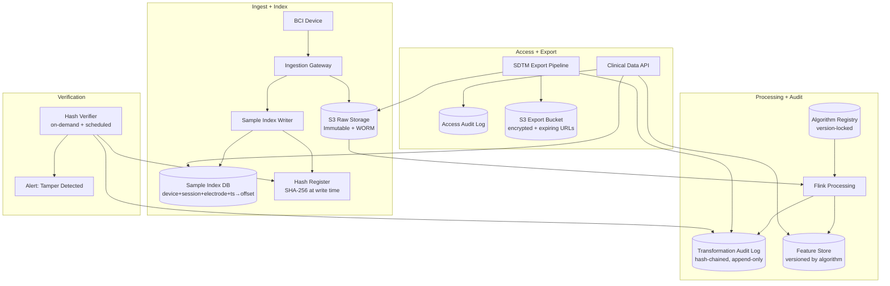

### Story Context

**Email chain — Friday through Sunday**

```
From: Rachel Ng <r.ng@neuralbridge.io>
To: [your name] <[you]@neuralbridge.io>
CC: Lena Strauss <l.strauss@neuralbridge.io>
Subject: FDA Reviewer — Monday Agenda + Documentation Gap
Date: Friday 6:42pm

The FDA field reviewer, Dr. Yolanda Park, arrives Monday at 10am. She has
confirmed the following agenda:

  10:00am — System overview and architecture walk-through
  11:30am — Live demonstration: signal capture, processing, output
  1:30pm  — Data integrity review: she wants to trace a specific data point
             from device measurement → raw storage → processing → analysis output
             and verify that no transformation modified the underlying data
             without an audit trail entry
  3:00pm  — Documentation review: SRS, test protocols, adverse event log
  4:30pm  — Closeout

For the 1:30pm data integrity review:

Dr. Park's standard procedure is to pick a random sample from a clinical trial
session and demand a full lineage trace. She will ask:
  (a) Show me the raw signal at timestamp T for device D, electrode E
  (b) Show me every transformation applied to that signal, in order, with
      the algorithm version, the parameters used, and who approved that version
  (c) Show me where the output of transformation N was stored and who accessed it
  (d) Show me the hash proof that the stored value was not modified after the fact

I am telling you this now because I need to know, by Sunday morning, whether
our current system can produce this trace.

Rachel
```

---

```
From: [your name]
To: Rachel Ng
CC: Lena Strauss
Subject: Re: FDA Reviewer — Monday Agenda + Documentation Gap
Date: Friday 7:53pm

Rachel,

Short answer: no. The current system cannot produce that trace.

What we have:
  - Raw signals stored in S3 (flat object per session, no per-sample indexing)
  - Flink job logs for processing steps (not stored as structured data)
  - Flink algorithm versions tracked in git (not linked to processed output)
  - Output stored in TimescaleDB (no provenance fields linking back to raw input)

What Dr. Park is describing is a full data lineage audit trail. The system
doesn't have one.

What I think we can do by Monday:
  (a) Raw signal retrieval: YES — with S3 key lookup by device ID + session ID
      + timestamp. Not elegant, but achievable.
  (b) Transformation trace: NO — Flink job logs exist but aren't queryable
      as structured audit events. We don't store "algorithm version + parameters"
      as a first-class record linked to processed output.
  (c) Output access log: PARTIAL — CloudTrail has S3 access logs; TimescaleDB
      query logs are disabled. Re-enabling them by Monday is possible.
  (d) Hash proof: NO — we don't compute or store hashes of raw signal objects.

My recommendation: we are honest with Dr. Park. We show her what we have,
present the clinical data platform redesign I'm working on, and commit to
a compliance timeline. Trying to mock up a system that doesn't exist will
fail under her questioning.

[your name]
```

---

```
From: Rachel Ng
To: [your name]
CC: Lena Strauss
Subject: Re: FDA Reviewer — Monday Agenda + Documentation Gap
Date: Friday 8:17pm

Thank you for the honest assessment. I've seen companies try to fake it with
Dr. Park before. She's been doing this for 22 years. She knows.

One more thing I should have mentioned earlier:

21 CFR Part 11 requires more than audit trails. It requires that the system
provide a means to generate accurate and complete copies of records in both
human-readable and electronic form suitable for inspection. That means Dr.
Park can ask us to export any clinical trial record in CDISC SDTM format
on demand.

Do we have CDISC SDTM export capability?

Rachel
```

---

```
From: Lena Strauss
To: [your name]
Subject: Call me — tonight if you can
Date: Friday 9:03pm
```

---

**Phone call — Lena Strauss / Your name — Friday 9:15pm**

```
Lena: "I read the thread. How bad is it?"

You: "It's bad, but it's honest-bad, not cover-it-up bad. The system doesn't
have the data lineage infrastructure for 21 CFR Part 11. It has some pieces.
It doesn't have the architecture."

Lena: "Will Dr. Park shut down the trial?"

You: "That's not typically the outcome of a field review finding gaps in
software documentation. More likely she issues a Form 483 observation —
a formal finding — and gives us 15 business days to respond with a
corrective action plan. The trial can continue if she determines the data
collected so far is reliable, even if the documentation infrastructure
is incomplete."

Lena: "What's our story for Monday?"

You: "Transparency. Here's what we have. Here's what we're building. Here
is the architecture for the clinical data platform that will meet 21 CFR
Part 11 in full. Here is the timeline. Here is the engineer responsible for it."

Lena: "And the engineer responsible?"

You: "Me."

Lena: "Okay. What do you need this weekend?"

You: "Dev and the S3 audit. I need to know how many sessions we have in
the last 30 days, how the raw signals are stored, and what we can actually
retrieve today. And I need to write the clinical data platform design —
the target state — so I have something real to show Dr. Park on Monday."
```

---

**Saturday morning. Dev pulls the S3 audit. 847 sessions. 23.4 TB of raw signal data. Every session is stored as a compressed binary blob. There is no per-sample index. Retrieving a specific sample at timestamp T requires decompressing the entire session object. Each session object is 27.6 GB on average.**

**You spend Saturday and Sunday writing.**

### Problem Statement

NeuralBridge's clinical data platform must be redesigned to meet 21 CFR Part 11 requirements for electronic records in clinical trials. The current system stores raw neural signals as unindexed compressed blobs, has no structured transformation audit trail, does not link algorithm versions to processed outputs, and cannot produce CDISC SDTM format exports. The new clinical data platform must provide: (1) per-sample addressable raw signal storage with cryptographic integrity proofs, (2) a fully auditable transformation pipeline where every processing step is recorded with algorithm version, parameters, and input/output hash, (3) CDISC SDTM export on demand, and (4) tamper-evident audit logs for all data access.

### Explicit Requirements

1. Raw signal storage must be per-sample addressable: given device ID + session ID + electrode ID + timestamp, the system must return the exact raw sample value in < 500ms
2. Every processing transformation must produce an audit record: transformation_id, input_hash, algorithm_version, parameters_used, output_hash, operator_id, timestamp — stored in an append-only, cryptographically linked audit log
3. Algorithm version governance: every change to a signal processing algorithm must be version-stamped; clinical trial data processed by algorithm version N must be permanently linked to that version; re-processing with a different version must produce a new output record, not overwrite the original
4. CDISC SDTM export: the system must export any clinical session in CDISC SDTM (Study Data Tabulation Model) format, conforming to the applicable CDISC domains (EG for electroencephalography)
5. Hash proof of immutability: every stored raw signal object must have a SHA-256 hash stored at write time; the hash must be verifiable on demand; any mismatch triggers an alert
6. Audit log tamper-evidence: the audit log must be implemented as a hash-chained or Merkle-tree structure such that any modification to a historical record is cryptographically detectable
7. Access audit: every read of clinical trial data must produce an access log record: who accessed what at what time, from which application, what data was returned (schema reference, not values)
8. Data export on demand: FDA field reviewers must be able to request a complete export of a clinical trial's data in < 4 hours for a standard trial size (200 devices × 90 days)

### Hidden Requirements

**Hint 1**: Re-read Rachel's final email: "21 CFR Part 11 requires a means to generate accurate and complete copies of records in both human-readable and electronic form." CDISC SDTM is mentioned as a format. But "human-readable" implies something different from SDTM. What is the human-readable format requirement, and what does it mean for the data model?

**Hint 2**: Re-read the S3 audit result: "Every session is stored as a compressed binary blob. Retrieving a specific sample at timestamp T requires decompressing the entire session object." This is a performance problem, not just a design problem. How do you retrofit a per-sample index onto 847 existing sessions (23.4 TB) without moving data?

**Hint 3**: Re-read the transformation audit requirement carefully. "Re-processing with a different version must produce a new output record, not overwrite the original." This is a bi-temporal data model requirement. How does this interact with the storage layer — and what does it mean for query complexity when a clinical investigator asks "what was the processed output of session S at analysis time T"?

**Hint 4**: Re-read the timeline pressure: "FDA field reviewer arrives Monday at 10am." You are designing the target state architecture over a weekend. What is the minimum viable artifact you can bring to Monday's meeting — not a fully-built system, but something that demonstrates architectural credibility to a 22-year FDA reviewer?

### Constraints

- **Current storage**: 847 sessions × 27.6 GB average = ~23.4 TB in S3; no per-sample index
- **New data rate**: 7.68 MB/sec per device × 200 devices = 1.5 GB/sec; 130 TB/day raw (requires compression: ~13 TB/day at 10:1 ratio)
- **Sample addressability**: < 500ms to retrieve any single sample given coordinates
- **CDISC SDTM export**: < 4 hours for a 90-day, 200-device trial export
- **Audit log**: append-only, hash-chained; write rate = every transformation event (~10K events/sec during full trial); retention 7 years
- **Algorithm governance**: 12 distinct processing algorithms currently; change frequency ~1 per month
- **Compliance**: 21 CFR Part 11, CDISC SDTM v1.7, 21 CFR Part 803 (adverse event reporting)
- **Budget**: $60K/month approved for clinical data platform infrastructure
- **Team**: Dev Okonkwo full-time + you for 6 weeks

### Your Task

Design the NeuralBridge Clinical Data Platform for 21 CFR Part 11 compliance. Focus on:
1. Per-sample addressable storage architecture (new data and retrofit strategy for existing 23.4 TB)
2. Transformation audit trail: schema, hash-chaining mechanism, write path
3. Algorithm version registry: data model and enforcement mechanism
4. CDISC SDTM export pipeline: how clinical data maps to SDTM domains
5. Tamper-evident audit log design
6. FDA on-demand export: how you produce a complete export in < 4 hours

### Deliverables

- [ ] Mermaid architecture diagram: full clinical data platform from signal ingest through audit trail to export pipeline
- [ ] Database schema (with column types and indexes):
  - `raw_signal_index` table: device_id, session_id, electrode_id, sample_timestamp, s3_key, byte_offset, byte_length, sha256_hash
  - `transformation_events` table: transformation_id (UUID), session_id, input_hash, algorithm_id, algorithm_version, parameters (JSONB), output_hash, operator_id, created_at — with hash chain column
  - `algorithm_registry` table: algorithm_id, version, deployed_at, deployed_by, source_commit, parameters_schema (JSONB), trial_clearance_status
  - `data_access_log` table: access_id, accessor_id, accessor_type, session_id, data_range, purpose, accessed_at, ip_address
- [ ] Retrofit plan for existing 847 sessions:
  - How do you build the per-sample index retroactively without moving data?
  - Timeline and resource estimate
- [ ] Hash-chaining audit log design:
  - How each record links to the previous record's hash
  - Verification procedure (spot check vs full chain verification)
  - Merkle root generation for epoch-based proofs
- [ ] CDISC SDTM export design:
  - What CDISC domains apply (EG, DM, SE, DS at minimum)
  - How NeuralBridge's data model maps to SDTM variable names
  - Export pipeline architecture (batch job? streaming?)
  - < 4-hour SLA for a 200-device × 90-day trial
- [ ] Scaling estimation:
  - Per-sample index write rate: 200 devices × 64 electrodes × 30K samples/sec = total index records/sec
  - Audit log write rate: transformation events/sec under full trial load
  - S3 storage with per-sample index: index overhead vs raw data size
- [ ] Tradeoff analysis (minimum 3):
  - Per-sample index in RDS vs dedicated time-series DB (query performance vs operational complexity)
  - Hash-chain audit log vs Merkle tree (verification speed vs storage overhead)
  - SDTM export: pre-computed vs on-demand generation (latency vs storage cost)
- [ ] Cost modeling: clinical data platform infrastructure $/month (S3, index DB, audit log service, SDTM export pipeline)
- [ ] Capacity planning: 200 devices in current trial → 2,000 devices in 18 months → how does the per-sample index scale?

### Diagram Format

All architecture diagrams: Mermaid syntax.


