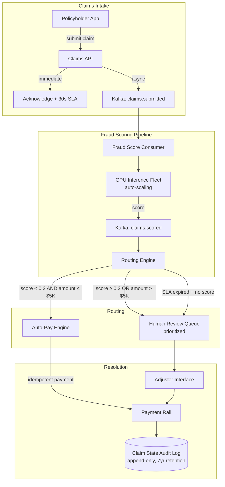

### Story Context

**#incidents — Saturday 6:47am**

```
pagerduty [6:47]: [P1] Claims Service — Response Time > 30s |
                  Triggered: claims-api-latency-p99 |
                  Value: 47,200ms | Threshold: 5,000ms

pagerduty [6:47]: [P1] Claims Queue — Queue Depth > 10,000 |
                  Triggered: claims-submission-queue-depth |
                  Value: 34,721 | Threshold: 10,000

omar.hassan [6:51]: I'm on. What happened?

kezia.walker [6:52]: Hurricane Dalton made landfall in Florida 3 hours ago.
Category 3. First reports from policyholders coming in.

omar.hassan [6:53]: How many claims submitted in the last 3 hours?

kezia.walker [6:54]: 18,247.

omar.hassan [6:54]: Normal Saturday morning for the last 30 days?

kezia.walker [6:55]: Average 73 claims between 6am and 9am Saturday.

omar.hassan [6:55]: So we're at 250x normal load.

kezia.walker [6:55]: Yeah.

[your name] [6:56]: What's the SLA on claims submission acknowledgment?

kezia.walker [6:57]: Customer must receive acknowledgment within 30 seconds
of submission per Florida insurance regulation FL 626.854.

[your name] [6:58]: Current p99 is 47 seconds. We're violating that SLA.

omar.hassan [6:58]: How many of those 18,247 claims got a 47-second response?

kezia.walker [6:59]: Checking. Approximately 6,400 claims acknowledged > 30
seconds. Some were acknowledged > 2 minutes.

[your name] [7:00]: Florida regulator gets notified automatically when
acknowledgment SLAs are missed. Has that triggered?

rachel.mbeki [7:01]: Yes. Compliance system sent notification to FL OIR
at 6:53am. They'll want an incident report within 48 hours.

omar.hassan [7:02]: Okay. What's causing the slowdown?

[your name] [7:03]: The fraud scoring service. Every claim submission
calls the fraud model API synchronously. The model API has a timeout of
25 seconds. It's saturating.

omar.hassan [7:04]: So the fraud check is blocking claim acknowledgment?

[your name] [7:04]: Yes. The claim can't be acknowledged until the fraud
score comes back. In normal volume that's fine — model responds in 200ms.
Under this load, model API is queuing and timing out.

kezia.walker [7:05]: Can we disable fraud scoring temporarily?

rachel.mbeki [7:05]: No. Regulatory requirement for claims > $1,000. We
can't auto-process without it.

[your name] [7:06]: We don't need to disable it. We need to decouple it.
Acknowledge the claim immediately. Score it asynchronously. Route to
human review if the score doesn't come back within our SLA.

omar.hassan [7:07]: That's not how it works right now.

[your name] [7:07]: I know. That's what we're changing. This morning.
```

---

**#incidents — Saturday 7:23am**

```
[your name] [7:23]: Emergency design decision for the bridge.

Current: claim submitted → fraud score (sync, 200ms normal) → acknowledge

We're changing to: claim submitted → acknowledge immediately with "pending
fraud review" status → async fraud score → update claim status

Claims in "pending fraud review" state:
  - Auto-pay threshold: $5K AND fraud score < 0.2 → auto-pay
  - High-risk: fraud score ≥ 0.2 OR score not returned in 4 hours → human queue
  - Large claims: > $50K regardless of fraud score → always human review

Florida reg requires acknowledgment within 30 seconds. It does NOT require
the fraud score to be complete before acknowledgment. I checked the statute.

omar.hassan [7:24]: I need legal to confirm before we deploy.

rachel.mbeki [7:25]: I'm confirming. FL 626.854 requires acknowledgment of
receipt, not completion of investigation. Async fraud scoring is compliant.

omar.hassan [7:26]: Do it.

[your name] [7:26]: Deploying now. ETA 15 minutes.
```

The immediate fix ships at 7:41am. By 8:15am, claim acknowledgment latency is back under 3 seconds. The fraud scoring queue is still backed up — 34,000 claims waiting for scores — but they are acknowledged and the regulatory SLA is being met.

The deeper problem: the claims processing pipeline was not designed for a 250x load spike. The fraud model runs on 3 GPU instances. The auto-pay logic runs in the claims API monolith. The human review queue is a PostgreSQL table with a basic CRUD interface. Nothing scales horizontally under hurricane load.

The 50,000 total claims you estimate will come in over the next 72 hours will expose every bottleneck.

**#incidents — Saturday 9:11am**

```
gabrielle.okonkwo [9:11]: [your name], Omar — good call on the async change.
Now let's talk about making this architecture survive the next 72 hours
and also the next hurricane season. Those are two different problems and
I want a plan for both by Monday morning.
```

### Problem Statement

ShieldMutual's claims processing pipeline was designed for steady-state load of approximately 200 claims/day. Hurricane Dalton is expected to generate 50,000 claims in 72 hours — 250x normal load. The synchronous fraud scoring architecture caused the initial incident. The immediate fix (async scoring) is deployed, but the pipeline still has multiple single points of failure: a single fraud scoring service (3 GPUs), a PostgreSQL-backed human review queue, and a monolithic auto-pay decision engine. Design the claims processing pipeline to handle hurricane-scale load while maintaining all regulatory requirements.

### Explicit Requirements

1. Claims submission acknowledgment within 30 seconds (Florida regulatory requirement) under any load condition, including 250x normal
2. Fraud scoring must remain mandatory for claims > $1,000 but must be asynchronous; claims must be acknowledged before fraud score is available
3. Auto-pay logic: claims where fraud score < 0.2 AND claim amount ≤ $5,000 are eligible for automatic payment; claims > $5,000 or fraud score ≥ 0.2 require human review
4. Fraud scoring SLA: score must be available within 4 hours of claim submission; claims that exceed the 4-hour SLA automatically route to human review with a flag
5. Human review queue must support 10,000 concurrent items with sub-second enqueue and < 1-second dequeue for adjusters; queue must be prioritized (storm claims, high-value claims, elderly/vulnerable policyholders flagged first)
6. Auto-pay execution: payments must be idempotent (no duplicate payments for the same claim); payment must complete within 24 hours of auto-pay determination
7. ML fraud model scaling: fraud scoring API must scale horizontally under load; GPU instances must be provisioned on-demand during storm events
8. Regulatory audit trail: every claim state transition must be logged with timestamp, actor (system or human), reason code; audit trail retained 7 years per state insurance regulation

### Hidden Requirements

**Hint 1**: Re-read rachel.mbeki's message: "FL 626.854 requires acknowledgment of receipt, not completion of investigation." This is the statute that lets you decouple acknowledgment from fraud scoring. But re-read the original incident: "Approximately 6,400 claims acknowledged > 30 seconds." There is a separate regulatory implication: what is the filing obligation when an SLA is missed due to a system failure, and what does that require architecturally (hint: it is an audit artifact, not just a report)?

**Hint 2**: Re-read Gabrielle's message: "the next 72 hours and also the next hurricane season. Those are two different problems." This is a hint about the architecture scope. The 72-hour solution is an operational runbook. The hurricane season solution requires what specific capacity planning artifact?

**Hint 3**: Re-read the auto-pay threshold definition carefully: "fraud score < 0.2 AND claim amount ≤ $5,000." What happens when the fraud model is temporarily unavailable? The claim is pending. After 4 hours it routes to human review. But if 30,000 claims are pending fraud scores simultaneously and the fraud model recovers, what happens to the human review queue? This is a thundering herd scenario.

**Hint 4**: Re-read the payment idempotency requirement. "No duplicate payments for the same claim." This is the PCI-DSS and insurance regulatory requirement combined. What is the idempotency key design for a claim payment — and what failure scenario does it specifically protect against in a distributed auto-pay system?

### Constraints

- **Normal load**: 200 claims/day (~8 claims/hour)
- **Hurricane load**: 50,000 claims in 72 hours (~700 claims/hour sustained; 1,500 claims/hour at peak)
- **Fraud model**: 3 GPU instances (g4dn.xlarge); capacity ~500 inference requests/minute total; hurricane load requires ~750/minute at peak
- **Auto-pay threshold**: ≤ $5,000 AND fraud score < 0.2
- **Human review queue**: target 5,000 adjusters during storm event (on-call workforce activation)
- **Payment processing**: through legacy insurance payment rail; idempotency keys required; payment processing vendor SLA: 24 hours
- **Regulatory SLAs**: Florida: 30-second acknowledgment, 10-day first response, 90-day settlement
- **Compliance**: FL 626.854 (acknowledgment), FL 627.70131 (claims handling), NAIC model act
- **Budget**: $120K/month current infra; $200K approved for storm event scaling
- **Data retention**: claims records 7 years, payment records 10 years

### Your Task

Design the ShieldMutual claims processing pipeline for hurricane-scale load. Focus on:
1. The async claims intake pipeline (submission → acknowledgment → fraud scoring → routing)
2. The fraud scoring service scaling model (auto-scaling GPU fleet on storm events)
3. The human review queue (priority design, adjuster assignment, SLA tracking)
4. The auto-pay execution engine (idempotency, payment rail integration)
5. The storm event runbook (how the system detects and responds to a hurricane-scale event automatically)
6. The regulatory audit trail design

### Deliverables

- [ ] Mermaid architecture diagram: full claims processing pipeline from submission through payment or human resolution
- [ ] Database schema (with column types and indexes):
  - `claims` table: claim_id (UUID), policy_id, submitted_at, acknowledged_at, amount, claim_type, status (enum), fraud_score, fraud_scored_at, adjuster_id, resolved_at, payment_id
  - `claim_state_transitions` table: transition_id, claim_id, from_status, to_status, actor_id, actor_type (system/human), reason_code, occurred_at
  - `fraud_score_requests` table: request_id, claim_id, submitted_at, completed_at, score, model_version, sla_status
  - Indexes: claims by status + submitted_at; transitions by claim_id; fraud requests by status + submitted_at
- [ ] Kafka topic design for async pipeline:
  - Topic names, partition strategy (what is the partition key for claims?), consumer groups
  - DLQ design for fraud scoring failures
- [ ] Fraud model scaling design:
  - Auto-scaling trigger: what metric triggers additional GPU instances?
  - Pre-provisioning: how do you provision capacity before a storm hits (weather API integration)?
  - Graceful scale-down: how do you drain the queue before terminating GPU instances?
- [ ] Human review queue priority design:
  - Priority tiers and scoring algorithm
  - Adjuster assignment logic
  - SLA tracking: how is the 10-day first-response SLA enforced and monitored?
- [ ] Auto-pay idempotency design:
  - Idempotency key construction (claim_id + payment_attempt_number? something else?)
  - What happens when payment rail is down during the 24-hour window?
  - How duplicate payment is detected and prevented
- [ ] Thundering herd analysis: 30,000 fraud scores complete simultaneously → human queue routing → design the queue admission rate limiter
- [ ] Scaling estimation:
  - Claims/hour at hurricane peak → Kafka producer throughput → fraud scoring throughput → queue depth math
  - GPU instance count required for 750 inferences/minute (with calculation)
  - Auto-pay throughput: how many payments/hour at peak storm processing?
- [ ] Tradeoff analysis (minimum 3):
  - Synchronous vs asynchronous fraud scoring (latency vs availability under load)
  - GPU auto-scaling vs pre-provisioned warm pool (cost vs readiness time)
  - Human review queue in Postgres vs dedicated queue system (operational simplicity vs scale)
- [ ] Cost modeling:
  - Normal operations $/month
  - Hurricane event 72-hour spike cost (GPU scale-out, queue depth, increased storage)
  - Annualized cost assuming 2 major hurricane events/year
- [ ] Capacity planning: current 200 claims/day normal load; what does growth to 500 claims/day normal load (internal target for 18 months) require in infrastructure terms?

### Diagram Format

All architecture diagrams: Mermaid syntax.


