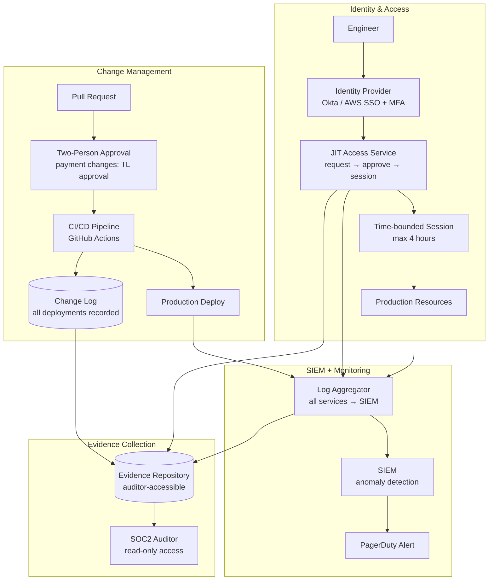

### Story Context

**Email chain — Three weeks after Hurricane Dalton**

```
From: Derek Wolfe <d.wolfe@shieldmutual.com>
To: Gabrielle Okonkwo <g.okonkwo@shieldmutual.com>
CC: [your name], Omar Hassan
Subject: Lost the TechAxis Deal — SOC2 Type II Required
Date: Monday 9:03am

Gabrielle,

I need to document this loss for the board report.

TechAxis Group — 2,800 employees, commercial property and D&O across
14 states — did not sign with us. Final reason cited by their procurement:

"ShieldMutual does not currently hold SOC2 Type II certification.
Our vendor security policy requires SOC2 Type II for any vendor
processing sensitive commercial insurance data. We will revisit in
12 months if certification is achieved."

This is the third enterprise deal this quarter lost for the same reason.
Combined revenue impact: $1.7M ARR.

Our current security posture: SOC2 Type I (point-in-time snapshot, 2023).
SOC2 Type II requires a 6-12 month audit period demonstrating continuous
controls. The gap analysis from our 2023 Type I identified 23 control gaps
that were not remediated.

I want to propose a 6-month sprint to achieve SOC2 Type II. What would
that require from engineering?

Derek Wolfe
VP, Enterprise Sales
```

---

```
From: Gabrielle Okonkwo
To: Derek Wolfe, [your name], Omar Hassan
Subject: Re: Lost the TechAxis Deal — SOC2 Type II Required
Date: Monday 9:47am

Derek,

I agree we need to do this. [your name], Omar — what do we actually need?

I want to understand the scope before I commit to Derek's timeline.

G.
```

---

```
From: [your name]
To: Gabrielle Okonkwo, Derek Wolfe, Omar Hassan
Subject: Re: Lost the TechAxis Deal — SOC2 Type II Required
Date: Monday 11:15am

Gabrielle,

I've done a preliminary review against the 2023 Type I gap report.
The 23 open gaps cluster into 4 categories:

Category 1 — Access Control (9 gaps)
  - No centralized identity and access management (engineers access prod
    databases with individual credentials, no MFA requirement enforced
    at the infra level)
  - No automated access review process (access rights are reviewed
    "annually" — last review was 2021)
  - Privileged access is not time-bounded (engineers have standing access
    to production, no just-in-time provisioning)
  - No separation of duties on claims payment (same engineer who deploys
    payment code could trigger a payment)

Category 2 — Change Management (6 gaps)
  - No formal change approval workflow for production deployments
    (engineers deploy via direct CI/CD push, no second approval required)
  - Rollback procedures exist but are undocumented
  - Database schema changes not tracked in change management system

Category 3 — Monitoring and Alerting (5 gaps)
  - No centralized log aggregation (each service logs independently)
  - No anomaly detection for privileged access
  - Alert thresholds not documented; alerting coverage gaps exist

Category 4 — Availability and Incident Response (3 gaps)
  - No documented Recovery Time Objective (RTO) or Recovery Point Objective (RPO)
  - Business continuity plan exists but hasn't been tested in 3 years
  - Incident response runbooks exist for only 2 of 11 identified failure modes

SOC2 Type II timeline: 6 months minimum for audit period AFTER controls are
implemented and demonstrably operating. We need approximately 3 months to
close the gaps before the audit period can begin. Total: 9 months is realistic.
6 months is only achievable if we start this week and prioritize it above
feature work.

I will also note: the access control gaps are not just a SOC2 issue.
They are a real security risk. We have engineering access to production
claim payment data with no MFA enforcement. This needs to be fixed
regardless of the audit.

[your name]
```

---

**1:1 — Gabrielle Okonkwo / Your name — Monday 2:30pm**

```
Gabrielle: "You said 9 months is realistic. Derek wants 6. What's the delta?"

You: "The delta is the audit period. SOC2 Type II auditors need to see
evidence of controls operating continuously for at least 6 months.
If we implement the controls today and start the clock today, 6 months
of continuous operation gets us to the audit in October. Add 8 weeks
for audit execution: December. That's possible if we start now and
don't slip on the implementation."

Gabrielle: "What are the hardest gaps to close?"

You: "Access control. Specifically just-in-time privileged access and
separation of duties on payment processing. These require changes to
how engineers work day-to-day. That's cultural change, not just
infrastructure change. Engineers will push back."

Gabrielle: "What's your approach?"

You: "Make the secure path the easy path. If I implement JIT access
in a way that adds 30 minutes of friction every time an engineer needs
to debug a production issue, they'll route around it. If the JIT
request takes 90 seconds and is self-service with automatic approval
for normal access levels, engineers use it by default."

Gabrielle: "And the monitoring gaps?"

You: "Those are tractable. Centralized logging, anomaly detection, alert
documentation. 6-8 weeks of implementation, then the audit period
covers them. The harder question is operational: who owns the security
monitoring dashboard going forward? That's not in anyone's current job
description."

Gabrielle: "Make it yours temporarily. We'll hire a Security Engineer
in Q3."

You: "Okay. Last thing: the gap report noted that we have no separation
of duties on claims payment. The person who deploys code can also trigger
payments. That's a SOC2 finding AND a fraud risk. I want to fix it.
But fixing it requires a deployment workflow change that will slow down
releases."

Gabrielle: "Define 'slow down.'"

You: "Right now engineers deploy in 20 minutes. With a two-person approval
requirement for payment-related changes, it becomes 4-hour minimum due
to review coordination. We'll need to define a clearer boundary between
payment code and non-payment code."

Gabrielle: "I'll support it. Write the RFC."
```

### Problem Statement

ShieldMutual must achieve SOC2 Type II certification within 6 months (audit period start) to recover $1.7M ARR in lost enterprise deals. A 2023 gap analysis identified 23 open control deficiencies across access control, change management, monitoring, and availability. The architecture must be redesigned to close these gaps in a way that is operationally sustainable — not bolted-on compliance theater. The access control gaps carry real security risk independent of the audit.

### Explicit Requirements

1. **Access Control (Category 1)**:
   - Centralized IAM with MFA enforcement at infrastructure level (no individual database credentials; all access through an identity provider with hardware MFA for production access)
   - Automated access review: all production access rights must be reviewed quarterly with automated expiry if not re-approved
   - Just-in-time privileged access: no standing production access; engineers request access on-demand with automated approval for standard requests, human approval for elevated access; all sessions time-bounded (max 4 hours)
   - Separation of duties for payment processing: engineer who deploys payment code cannot be the same engineer who approves a payment; enforced in deployment pipeline

2. **Change Management (Category 2)**:
   - All production deployments require a second approval from a senior engineer (or Team Lead for payment-related changes)
   - Rollback procedures documented and tested quarterly
   - Database schema changes tracked in the change management system with impact analysis required

3. **Monitoring and Alerting (Category 3)**:
   - Centralized log aggregation for all production services (all service logs forwarded to SIEM)
   - Anomaly detection for privileged access: alert when an engineer accesses production outside their normal access pattern
   - All alert thresholds documented in a runbook; alerting coverage audited monthly

4. **Availability (Category 4)**:
   - RTO and RPO defined and documented for all critical systems (claims, policy management, payment processing)
   - Business continuity test conducted annually with documented results
   - Incident response runbooks for all 11 identified failure modes

5. SOC2 audit evidence: the system must generate evidence artifacts automatically — access logs, change approval records, deployment approvals, test results — exportable in formats required by the auditor

### Hidden Requirements

**Hint 1**: Re-read the access control gap description: "same engineer who deploys payment code could trigger a payment." This is a separation of duties issue. But re-read Gabrielle's response: "I'll support it. Write the RFC." This is a hint about the mandatory story beat in Phase 3 — writing an RFC that gets challenged. What is the most politically sensitive part of the separation of duties proposal, and what stakeholder group will push back hardest?

**Hint 2**: Re-read [your name]'s framing: "Make the secure path the easy path." This is a UX design principle applied to security tooling. What specific developer experience metrics should you track to ensure the JIT access system doesn't create friction that leads to policy circumvention?

**Hint 3**: Re-read Derek's email: "SOC2 Type II requires a 6-12 month audit period." The 6-month audit period means auditors will review evidence from the ENTIRE period. What does this mean for the logging and audit trail architecture — specifically, what happens if logs from month 3 are missing or incomplete when the auditor requests them in month 7?

**Hint 4**: Re-read the gap: "No anomaly detection for privileged access." ShieldMutual processes insurance claims with PHI. What other regulatory framework (beyond SOC2) has specific requirements for anomaly detection on access to PHI, and does that change the monitoring architecture?

### Constraints

- **Engineering team**: 28 engineers across 6 squads; all need new access workflow
- **Audit period start**: must begin within 3 months; audit period must run 6 months
- **Timeline**: 9 months total (3 months gap closure + 6 months audit period)
- **Production services**: 11 microservices + 3 databases + 2 payment integrations
- **Compliance**: SOC2 Trust Service Criteria (Security, Availability, Processing Integrity, Confidentiality, Privacy); HIPAA for PHI in claims data
- **Budget**: $45K/month approved for security infrastructure
- **Current access model**: individual PostgreSQL credentials, SSH keys to EC2, no MFA enforcement
- **Deployment model**: GitHub Actions CI/CD, no approval gates currently

### Your Task

Design the SOC2 Type II compliance architecture for ShieldMutual. Focus on:
1. The centralized IAM architecture (JIT access, MFA, audit trail)
2. The change management and deployment approval pipeline
3. The centralized logging and SIEM architecture
4. The automated evidence collection pipeline for audit artifacts
5. The separation of duties enforcement model for payment code

### Deliverables

- [ ] Mermaid architecture diagram: IAM layer, SIEM, change management pipeline, evidence collection
- [ ] JIT access system design:
  - Request workflow (who requests, how, approval path, time bounds)
  - Access policy matrix: which roles can self-approve, which require human approval
  - Database schema for: `access_requests`, `access_sessions`, `access_reviews`
  - Session token generation and revocation mechanism
- [ ] Separation of duties enforcement:
  - How the CI/CD pipeline enforces two-person approval for payment-related changes
  - How "payment code" is defined and bounded (code ownership model)
  - What happens when only one engineer is available at 3am during an incident
- [ ] SIEM architecture:
  - Log sources: list all 11 services + databases + payment integrations
  - Log schema standardization (what fields are required on every log event?)
  - Anomaly detection: what baselines are established, what triggers an alert?
  - Retention: how long are logs retained for SOC2 audit purposes?
- [ ] Automated evidence collection:
  - What artifacts does the auditor need?
  - How are they generated automatically (not manually compiled before each audit)?
  - Storage format and access control for the evidence repository
- [ ] Scaling estimation:
  - Log volume: 11 services × average events/sec → GB/day to SIEM
  - Access request volume: 28 engineers × average access requests/week → requests/day
- [ ] Tradeoff analysis (minimum 3):
  - JIT access via internal tooling vs commercial PAM solution (build vs buy)
  - Centralized vs per-service log aggregation (operational simplicity vs blast radius for log loss)
  - Synchronous deployment approval (blocks CI/CD) vs asynchronous (allows deployment, alerts on bypass)
- [ ] Cost modeling: IAM tooling + SIEM + evidence storage $/month; external SOC2 auditor estimated cost
- [ ] Capacity planning: 28 engineers today → 60 engineers in 18 months (hiring plan). Does the JIT access system scale?

### Diagram Format

All architecture diagrams: Mermaid syntax.


