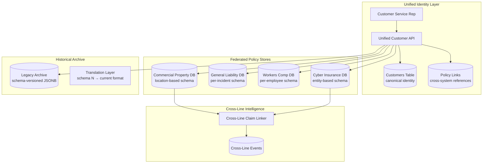

### Story Context

**Email chain — Six weeks post-hurricane**

```
From: Gabrielle Okonkwo <g.okonkwo@shieldmutual.com>
To: [your name], Omar Hassan, Rachel Mbeki
Subject: Acquisition Closed — CyberShield Integration Timeline
Date: Monday 8:22am

Team,

The acquisition of CyberShield LLC closed Friday. CyberShield is a
specialty cyber insurance provider: 3,400 commercial policies, $180M
in written premium, 42 employees, offices in Austin.

Their technical stack:
  - Core policy system: proprietary Python monolith, PostgreSQL
  - Claims: Salesforce Service Cloud (configured, not custom)
  - Billing: QuickBooks (yes, really)

Per the acquisition terms, we have committed to:
  - Migrating CyberShield policies to ShieldMutual's platform within
    12 months
  - Cross-selling ShieldMutual commercial property policies to
    CyberShield's customer base (and vice versa) starting in Q3
  - Producing a unified customer view for our enterprise customers
    who have both commercial property AND cyber policies

The cross-selling requirement is the hardest technical problem. Our data
model has no concept of "multi-line customer." A policyholder in our
system is attached to one line of business. A CyberShield customer
is a completely different record in a completely different system.

Before we can cross-sell, a customer service rep needs to see:
  "Acme Corp has a commercial property policy (ours), a general liability
   policy (ours), and a cyber policy (CyberShield's). Here are their
   claims, renewals, and premium amounts across all three."

We cannot do that today.

Timeline: unified customer view must be available to CSRs by end of Q3
(14 weeks). Full data migration (all CyberShield policies native in our
platform) within 12 months.

Gabrielle
```

---

```
From: Omar Hassan
To: Gabrielle Okonkwo, [your name], Rachel Mbeki
Subject: Re: Acquisition Closed — CyberShield Integration Timeline
Date: Monday 9:41am

Gabrielle — I've been on calls with CyberShield's technical lead (Soren
Andersen) this morning. Some context for the architecture:

CyberShield's policy data model is fundamentally different from ours.

ShieldMutual policies:
  - Core entity: Policy → PolicyLocation → Coverage
  - A commercial property policy covers specific LOCATIONS (buildings,
    equipment) with coverage amounts per location
  - State regulations are location-based (where is the property?)
  - Premium calculation: per location × coverage type × risk factors

CyberShield policies:
  - Core entity: Policy → CoveredEntity → CyberRisk
  - A cyber policy covers ENTITIES (companies, systems, data stores)
    with coverage for cyber events (breach, ransomware, business interruption)
  - State regulations are policyholder-domicile-based (where is the company?)
  - Premium calculation: per entity × security posture score × industry risk

These are not just different schemas. They represent different conceptual
models of what "a policy covers."

The 12-month migration deadline is going to require a significant data
model redesign.

Soren says CyberShield's system has 20+ years of cyber claims data.
That data has actuarial value — it informs their pricing models. We
cannot afford to lose schema nuance during migration.

Omar
```

---

**Design session — Tuesday 10am — Whiteboard room**

You, Omar, and Soren Andersen (CyberShield's technical lead) spend three hours mapping the two data models side by side. The session surfaces five structural incompatibilities:

1. **Insured object**: ShieldMutual insures physical locations. CyberShield insures legal entities and digital assets. No common parent type.

2. **State regulation mapping**: ShieldMutual regulation = where the property is. CyberShield regulation = where the company is domiciled. For a company with properties in 5 states and a headquarters in Delaware, these are different regulatory jurisdictions.

3. **Coverage definition**: ShieldMutual has 12 coverage types. CyberShield has 8 coverage categories. 3 of CyberShield's coverage categories have no ShieldMutual equivalent. 4 of ShieldMutual's coverage types have no CyberShield equivalent.

4. **Premium calculation**: completely different actuarial models. Merging these would corrupt both. They must remain separate calculators.

5. **Claims linkage**: a CyberShield claim (ransomware affects a company's servers at a data center in Dallas) could be linked to a ShieldMutual property claim (fire at the same data center triggers business interruption) if the customer has both lines. Today there is no way to link these.

Soren adds one more: "CyberShield has regulatory data files going back to 2005. Each year's data was filed in the format required by the state at the time. Some of those formats are genuinely incompatible with current schemas."

You write on the whiteboard: **"We are not migrating to a unified schema. We are building a unified view on top of federated schemas."**

Omar looks at it for a long moment. "That's either the right answer or the expensive answer."

"Both," you say.

### Problem Statement

ShieldMutual has acquired CyberShield, a specialty cyber insurer with a fundamentally different data model. The acquisition requires: (1) a unified customer view combining policies, claims, and premium data across commercial property, general liability, workers' compensation, and cyber lines within 14 weeks, and (2) full migration of CyberShield policies into the ShieldMutual platform within 12 months. The two systems have structurally incompatible data models. The solution must preserve the actuarial value of CyberShield's historical data, maintain state-specific regulatory compliance for each line of business, and enable cross-line claims linkage for enterprise customers.

### Explicit Requirements

1. Unified customer identity layer: a Customer record that spans all four insurance lines, links policies from both systems, and is the single identifier for cross-sell and customer service interactions
2. Federated policy storage: each insurance line (commercial property, general liability, workers' compensation, cyber) retains its own schema-appropriate data store; the unified layer provides a view, not a merge
3. Cross-line claims linkage: claims across different lines for the same customer can be linked when they share a triggering event (e.g., a cyber event that also triggers a business interruption claim on a property policy)
4. State regulation compliance per line: each line of business must enforce its own state-specific regulatory rules; a cyber policy regulated under Delaware law and a property policy regulated under Texas law for the same customer must be tracked and reported separately
5. Premium and actuarial isolation: premium calculation models for each line must remain independent; the unified schema must not force normalization that would corrupt actuarial data
6. Historical data preservation: CyberShield's 20+ years of claims data, including historical schema variants, must be stored with provenance — the original schema format must be preserved alongside any normalized representation
7. Migration path: CyberShield's policies must be migrated to the ShieldMutual platform in a phased approach; during the migration period, both the legacy system and the new platform must serve live policies

### Hidden Requirements

**Hint 1**: Re-read Omar's description of CyberShield's premium calculation: "per entity × security posture score × industry risk." This uses a real-time security posture score. What does "real-time" mean for a premium calculation? Does the security posture score change between policy issuance and renewal — and if so, what happens to the recorded premium calculation that was used at issuance time?

**Hint 2**: Re-read the structural incompatibility #5: "a CyberShield claim could be linked to a ShieldMutual property claim if the customer has both lines." The requirement says claims can be linked "when they share a triggering event." How is a triggering event defined across two systems with different event models — and who is the arbiter of that linkage (system-automated or human adjuster)?

**Hint 3**: Re-read Soren's note: "CyberShield has regulatory data files going back to 2005. Each year's data was filed in the format required by the state at the time." This is a bi-temporal data problem. The data was valid at the time it was filed. The filing format has since changed. What does it mean to "preserve historical schema variants" in a queryable way — and what is the specific pattern for this?

**Hint 4**: Re-read the migration timeline: "full data migration within 12 months." But also re-read: "during the migration period, both the legacy system and the new platform must serve live policies." What is the dual-write strategy, and who is the source of truth during the transition period? What event triggers the cutover?

### Constraints

- **ShieldMutual policies**: 47,000 active policies across commercial property, GL, and workers' comp; 20+ years of legacy data
- **CyberShield policies**: 3,400 active cyber policies; 20+ years of historical claims data
- **Lines of business**: 4 (commercial property, general liability, workers' compensation, cyber)
- **State regulations**: 50 states × different regulations per line = complex regulatory matrix
- **Migration timeline**: 14 weeks for unified customer view; 12 months for full migration
- **Data volume**: ~500 GB ShieldMutual historical data; ~80 GB CyberShield historical data
- **Team**: ShieldMutual platform team (4 engineers + you) + CyberShield technical lead (Soren)
- **Budget**: $80K/month approved for integration infrastructure
- **Compliance**: NAIC model act, state-specific insurance regulations per line, HIPAA for any health-related claims data

### Your Task

Design the ShieldMutual multi-line insurance data architecture. Focus on:
1. The unified customer identity model
2. The federated policy store design (how four schemas coexist)
3. The unified view layer (how cross-line queries are executed)
4. Cross-line claims linkage model
5. Historical data preservation with provenance
6. The migration strategy from CyberShield's legacy system to the unified platform

### Deliverables

- [ ] Mermaid architecture diagram: unified customer identity layer, federated policy stores, unified view layer, cross-line claims linkage
- [ ] Database schema (with column types and indexes):
  - `customers` table: customer_id (UUID), canonical_name, tax_id, domicile_state, created_at, source_systems (JSONB array)
  - `customer_policy_links` table: link_id, customer_id, line_of_business (enum), external_policy_id, system_source, linked_at
  - `cross_line_events` table: event_id, customer_id, event_type, event_date, triggering_description, linked_claim_ids (UUID array)
  - `legacy_data_archives` table: archive_id, source_system, schema_version, valid_from_date, data (JSONB), migration_status
  - Index strategy for cross-customer, cross-line queries
- [ ] Federated query design:
  - How does "get all policies for customer X" execute across 4 different schemas?
  - Latency budget for the unified view query
  - Caching strategy for frequent cross-line lookups
- [ ] State regulation compliance matrix:
  - How is the applicable state regulation determined per policy per line?
  - How do you prevent a Texas property regulation from applying to a Delaware cyber policy for the same customer?
- [ ] Migration strategy:
  - Phase 1: unified customer identity (14 weeks)
  - Phase 2: CyberShield policies migrated to ShieldMutual platform (12 months)
  - Dual-write design during migration
  - Cutover criteria and rollback plan
- [ ] Historical data preservation design:
  - How are 2005-format regulatory files stored alongside current-format data?
  - Query interface for historical data (how does an actuary query 2008 cyber claims in their original format?)
- [ ] Scaling estimation:
  - Unified customer view query: 47,000 + 3,400 = 50,400 policies; query throughput for CSR dashboard
  - Cross-line event linking: how many events/day are candidates for linking (estimate)?
- [ ] Tradeoff analysis (minimum 3):
  - Federated view vs merged schema (actuarial data integrity vs query complexity)
  - GraphQL federation vs REST aggregation for the unified customer view
  - Migrate historical data to new schema vs archive-in-place with a translation layer
- [ ] Cost modeling: unified view infrastructure + migration tooling $/month; one-time migration effort in engineer-weeks
- [ ] Capacity planning: 50,400 policies today → 150,000 policies in 18 months (organic + acquisition growth). Does the federated model scale?

### Diagram Format

All architecture diagrams: Mermaid syntax.


