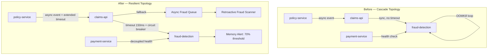

### Story Context

**#incidents — ShieldMutual Engineering**

```
03:04 AM — PagerDuty [Bot]
CRITICAL: claims-api p99 latency > 30,000ms. Error rate: 94%. Firing for 3 minutes.
Runbook: https://wiki.shieldmutual.internal/runbooks/claims-api-degraded
On-call: @brianna-walsh
```

```
03:06 AM — Brianna Walsh [Claims Platform On-Call]
On it. Checking dashboards now.
```

```
03:07 AM — Brianna Walsh
Claims API is returning 503s. Tracing shows all requests timing out at fraud-detection-service.
Paging @derek-osei for fraud service.
```

```
03:08 AM — Derek Osei [Fraud Detection On-Call]
Awake. fraud-detection-service pods are OOMKilling. Memory usage climbing continuously.
Not stabilizing. Something is leaking.
```

```
03:09 AM — Brianna Walsh
@you — escalating to Staff. This is cascading. payment-service is now alerting too.
```

```
03:09 AM — you
On bridge. Starting incident.
```

```
03:10 AM — you
This is IC. I'm taking command. Derek, Brianna, who else is on?
```

```
03:10 AM — Fatima Okonkwo [Payment Service On-Call]
Payment service here. We're timing out on fraud-detection health checks.
Payment processing is circuit-broken — no new claims being paid out.
```

```
03:11 AM — Samuel Reyes [Policy Service On-Call]
Policy service is degraded. Queries are backing up waiting for claims-api to
acknowledge new policy events. Queue depth is 14,000 and climbing.
```

```
03:11 AM — you
Okay. Four services down. Let me build the dependency map.
claims-api → fraud-detection (sync, no timeout)
payment-service → fraud-detection (health check)
policy-service → claims-api (async event, backing up)
```

```
03:12 AM — you
Immediate action: Derek, what's the memory ceiling on fraud-detection pods?
```

```
03:12 AM — Derek Osei
Pods are configured at 4GB limit. They're hitting 4GB and OOMKilling.
New pods spin up, hit 4GB in about 6 minutes, OOMKill again.
It's a crash loop. Restart rate is now 47 in the last 20 minutes.
```

```
03:13 AM — Brianna Walsh
I can cut claims-api → fraud-detection by flipping the fraud_check_required feature flag to false.
That'll stop the cascade but we'd be processing claims without fraud screening.
```

```
03:14 AM — you
Hold. What changed in fraud-detection in the last 24 hours?
```

```
03:14 AM — Derek Osei
Checking deployment log...
```

```
03:15 AM — Derek Osei
Deployment at 23:07 PM last night. Model update: fraud-model v2.3.1 → v2.4.0.
Deployed by automated CI/CD after model validation passed in staging.
Staging uses 1GB memory limit. Production is 4GB.
```

```
03:16 AM — you
There it is. Derek, roll back to v2.3.1 immediately.
Brianna, flip the flag now as a parallel mitigation — claims will process without
fraud screening for 10 minutes while Derek rolls back. We'll run a batch fraud
scan on any claims processed during the window.
Fatima, hold payment-service in degraded mode. Don't restart it yet.
Samuel, increase the policy event queue consumer timeout to 30 minutes. Don't let it DLQ.
```

```
03:16 AM — Derek Osei
Rolling back now.
```

```
03:17 AM — Brianna Walsh
Flag flipped. Claims are flowing again. Error rate dropping.
```

```
03:21 AM — Derek Osei
Rollback complete. fraud-detection-service is healthy. Memory stable at 1.2GB.
```

```
03:22 AM — you
Fatima, restore payment-service normal mode.
Samuel, lower the consumer timeout back to normal. Queue should drain.
```

```
03:24 AM — Fatima Okonkwo
Payment service restored. Claims being processed and paid.
```

```
03:25 AM — Brianna Walsh
Claims API error rate: 0.1%. We're recovered.
```

```
03:26 AM — Samuel Reyes
Policy queue draining. 8,200 events processed in the last 2 minutes. Down from 14K.
```

```
03:27 AM — you
Good. Bridge stays open. I want a timeline.
What was the blast radius? How many claims processed without fraud screening?
```

```
03:28 AM — Brianna Walsh
8 minutes of unscreened processing. Preliminary count: 312 claims.
We need to run retroactive fraud scan on all 312. I'll kick that off now.
```

```
03:29 AM — you
Log the 312 claim IDs to the incident record. State insurance regulators require
us to notify within 72 hours if a claims processing control fails during a window
longer than 5 minutes. We're at 8 minutes. Legal needs to know by 6am.
```

```
03:30 AM — Derek Osei
For the postmortem: v2.4.0 was a new transformer-based model with significantly
larger attention matrices. Staging validation never caught the memory profile
because our staging pods are 4× smaller than production. The model passed all
accuracy tests. Nobody checked the memory footprint delta.
```

```
03:31 AM — you
Derek, I want a full memory profile comparison between v2.3.1 and v2.4.0
in the postmortem doc. We need to understand why the CI/CD gate didn't catch this.
Okay everyone — incident is mitigated. Postmortem scheduled for Thursday 2pm.
I'm declaring severity P1. I'll write the incident summary. Get some sleep.
```

---

**INCIDENT TIMELINE — P1-2024-0312**

| Time  | Event |
|-------|-------|
| 23:07 | fraud-detection v2.4.0 deployed to production via automated CI/CD |
| 23:09 | Memory usage begins climbing on fraud-detection pods (not alerted — below threshold) |
| 03:01 | First pod OOMKills. Pod restarts, memory leak restarts. |
| 03:04 | PagerDuty fires: claims-api latency > 30s |
| 03:06 | Brianna begins investigation |
| 03:08 | Cascade identified: fraud-detection → claims-api → payment-service |
| 03:09 | You take IC command |
| 03:14 | Deployment log checked — v2.4.0 identified as root cause |
| 03:16 | Feature flag flip + rollback initiated (parallel) |
| 03:21 | Rollback complete, fraud-detection healthy |
| 03:25 | Full service restoration |
| 03:27 | 312 unscreened claims identified |
| 03:29 | Regulatory notification timer started (72-hour window) |

---

### Problem Statement

The cascade failure was caused by three simultaneous architectural failures: (1) no memory profiling gate in the ML model deployment pipeline, (2) synchronous coupling between claims-api and fraud-detection with no circuit breaker or timeout, and (3) the fraud-detection service had no bulkhead — a single failing component exhausted all resources and brought down every downstream consumer.

Your task is to design the post-incident architecture that would have prevented this cascade, contained its blast radius, and enabled faster detection and recovery. This is not a pure incident response chapter — you must produce a concrete architectural redesign, including the ML deployment pipeline safeguards, the circuit breaker topology, and the bulkhead strategy.

---

### Explicit Requirements

1. ML model deployment pipeline with mandatory pre-production gates: accuracy validation, memory footprint profiling, latency benchmarking, and comparison against current production model before promotion
2. Circuit breakers between claims-api and fraud-detection with configurable failure thresholds, half-open probe logic, and fallback behavior (degrade gracefully rather than fail)
3. Bulkhead isolation: fraud-detection failures must not exhaust connection pools or thread pools in claims-api
4. Timeout enforcement on all synchronous calls between services (no unbounded waits)
5. Feature flag system for fraud screening with: per-claim-type controls, automatic fallback to async fraud scan mode, and audit logging of all flag state changes
6. Retroactive fraud scan pipeline: when fraud screening is bypassed (flag or circuit breaker), all claims processed during the window must be queued for deferred fraud review
7. Regulatory notification trigger: automatic detection of claims processing control failures exceeding 5-minute windows, with 72-hour alert to compliance team
8. Memory alerting on ML serving pods: alert before OOMKill, not after

---

### Hidden Requirements

- **Hint: re-read Derek's message at 03:30 AM.** The root cause was a memory profile mismatch between staging (1GB pods) and production (4GB pods). The CI/CD pipeline promoted the model because accuracy tests passed — but it was never tested under production-equivalent resource constraints. The hidden requirement is **environment parity in ML evaluation**: staging must mirror production resource limits, or the CI/CD gate must include an explicit production-equivalent memory benchmark job before promotion.

- **Hint: re-read your message at 03:29 AM** about the regulatory notification timer. State insurance regulators have specific rules about claims processing control failures: any failure exceeding 5 minutes triggers a 72-hour notification SLA. The system must automatically detect this condition and trigger the compliance workflow — not rely on a human in an incident bridge at 3:30 AM to remember the regulatory requirement.

- **Hint: re-read Samuel's message at 03:11 AM** about the policy queue depth reaching 14,000. The policy-service consumes a claims event queue. During the cascade, the queue backed up because claims-api was down. The hidden requirement: the queue consumer must have a configurable extended timeout during declared incidents to prevent 14,000 events from DLQ-ing — a second-order disaster after the first one is mitigated.

- **Hint: re-read Brianna's 03:07 message** — "all requests timing out at fraud-detection-service." The claims-api was making synchronous calls to fraud-detection with apparently no timeout configured. The cascade happened not because fraud-detection failed, but because claims-api had no timeout and held all its threads open waiting. The thread pool exhaustion on claims-api was the actual blast-radius amplifier.

---

### Constraints

- **Services affected**: claims-api, fraud-detection-service, payment-service, policy-service
- **Incident duration**: 21 minutes total outage, 8 minutes of unscreened claims processing
- **Unscreened claims**: 312 claims requiring retroactive fraud review
- **Regulatory SLA**: 72-hour notification window (state insurance department), 10-day first response SLA per claim
- **ML model deployment frequency**: fraud model updated 2–4 times per month as new fraud patterns emerge
- **Fraud detection latency requirement**: p99 < 200ms for synchronous claims processing
- **Memory budget**: fraud-detection pods have 4GB memory limit in production; staging pods have 1GB
- **Team**: 6 engineers, 2 dedicated to ML infra, small SRE team
- **Infrastructure**: Kubernetes on AWS EKS, CI/CD via GitHub Actions + ArgoCD, Prometheus + Grafana for observability
- **Compliance**: state insurance department notification requirements (varies by state — up to 50 different regulatory bodies)

---

### Your Task

Design the post-incident architecture. Your output must cover:

1. The ML model deployment pipeline with production-equivalent resource validation gates
2. Circuit breaker topology for the claims-api → fraud-detection dependency (specify: failure threshold, timeout, probe interval, fallback behavior)
3. Bulkhead design: thread pool isolation and connection pool separation between claims-api and fraud-detection
4. The async fallback path: when fraud screening is bypassed, how are claims routed to deferred fraud review?
5. The retroactive fraud scan pipeline for the 312-claim window
6. The regulatory notification trigger: automatic detection of control failures + 72-hour SLA tracker
7. Memory alerting: pre-OOMKill alerting strategy for ML serving pods
8. Postmortem action items (5–7 specific, measurable, time-bound items — the kind you'd actually assign in a real postmortem)

---

### Deliverables

- [ ] Mermaid architecture diagram showing the redesigned service topology with circuit breakers, bulkheads, async fallback, and the ML deployment pipeline
- [ ] Database schema for: `ml_model_deployments`, `fraud_screening_bypasses`, `retroactive_fraud_queue`, `regulatory_notifications`, `incident_claims_window` (with column types, indexes)
- [ ] Scaling estimation — show your math:
  - Fraud detection throughput required: what is peak claims volume per second at ShieldMutual? At 200ms p99, how many concurrent requests can fraud-detection serve per pod?
  - Retroactive scan pipeline: 312 claims × average fraud feature computation cost = how long to complete retroactive review?
  - Policy queue math: 14,000 events × average event size = queue storage; at normal consumer throughput, how long to drain after service restoration?
- [ ] Tradeoff analysis (minimum 3):
  - Synchronous fraud check (current) vs. async fraud check with optimistic claims approval (latency vs. risk)
  - Per-model-version memory budget enforcement (strict, blocks deployment) vs. alert-only (flexible, but as we saw, dangerous)
  - Bulkhead via thread pool isolation vs. bulkhead via separate fraud-detection replica set dedicated to claims-api
- [ ] Incident response runbook: write the first 5 steps of an improved runbook for the "fraud-detection degraded" scenario that would have led to faster root cause identification (the deployment log check should be step 2, not step 14)
- [ ] Cost modeling: what does adding circuit breakers, bulkheads, and a proper ML deployment validation stage cost in infrastructure? Include: additional staging environment compute, sidecar overhead, Prometheus memory for new alert rules
- [ ] Capacity planning: ShieldMutual expects to grow claims volume 40% YoY. At current architecture, when does fraud-detection become the bottleneck? Design the scaling strategy for the next 18 months.

### Diagram Format

Mermaid syntax (renders in GitHub Issues).



*Expand this significantly — add the ML deployment pipeline, the bulkhead layer, the regulatory notification trigger, and the circuit breaker state machine.*
