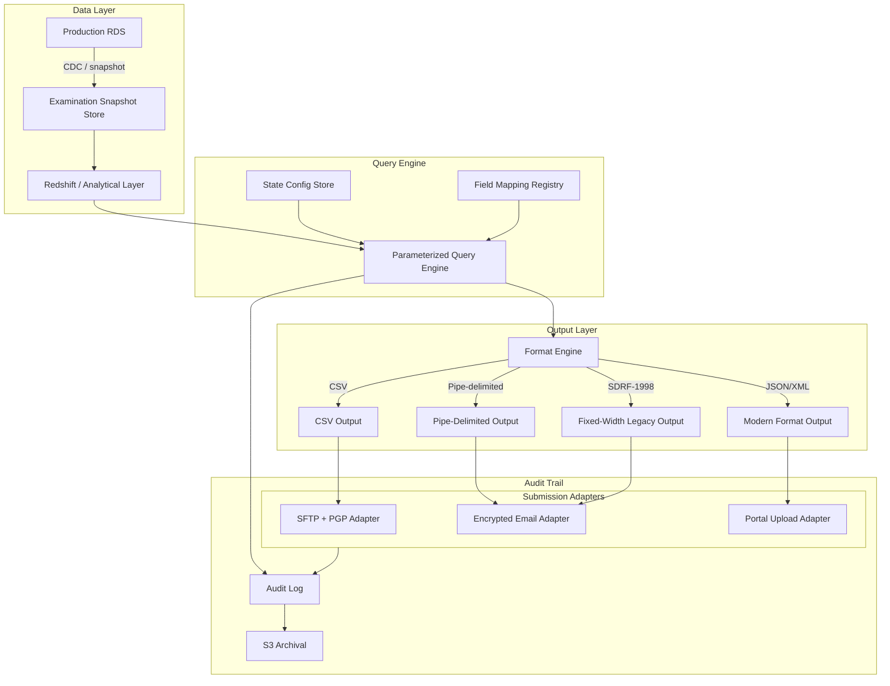

### Story Context

It's 9:17 AM on a Monday. You're in the middle of reviewing a PR when five Slack notifications arrive in quick succession. Then your email client shows 5 unread messages, all flagged high priority. Then your calendar shows a meeting request for 10:00 AM from Constance Dupree, ShieldMutual's General Counsel.

You open the emails first.

---

**Email 1**

**From**: examinations@tdi.texas.gov
**To**: compliance@shieldmutual.com
**Subject**: Market Conduct Examination — Request for Data Production
**Received**: 8:03 AM Monday

ShieldMutual Insurance Company:

Pursuant to Texas Insurance Code §751.152, the Texas Department of Insurance hereby initiates a market conduct examination of ShieldMutual Insurance Company. You are required to produce the following data within 30 days of this notice:

- All personal auto claims filed in Texas: January 1, 2022 – December 31, 2023
- Policy issuance and cancellation records for the same period
- Complaint log (TDI Form MC-12) in CSV format with the following field order: [17-field specification attached]

Please deliver all files to examinations@tdi.texas.gov via secure encrypted email or the TDI SFTP server at sftp.tdi.texas.gov.

---

**Email 2**

**From**: marketconduct@insurance.ca.gov
**To**: compliance@shieldmutual.com
**Subject**: CDI Market Conduct Examination 2024-MC-0847
**Received**: 8:31 AM Monday

ShieldMutual Insurance Company:

The California Department of Insurance has initiated market conduct examination 2024-MC-0847. Data production is required within 30 days. Requested data sets:

- All homeowners and auto claims: January 1, 2021 – December 31, 2023
- Underwriting guidelines and rating factors for California policies
- Complaint register per CDI Bulletin 2019-10 format

Data must be transmitted via SFTP to sftp.insurance.ca.gov using PGP encryption. Contact your assigned examiner, Linda Fuentes, at lfuentes@insurance.ca.gov.

---

**Email 3**

**From**: marketconduct@dfs.ny.gov
**To**: compliance@shieldmutual.com
**Subject**: DFS Examination — Secure Portal Access Provisioned
**Received**: 8:44 AM Monday

ShieldMutual Insurance Company:

The New York State Department of Financial Services has provisioned a secure portal for examination data submission. Login credentials are attached. You will be required to upload all requested data through the DFS ExamPortal. Direct file transfer is not accepted.

Required data: claims, complaints, and underwriting records for New York policyholders, 2021–2023. Full field specification available in the portal after login.

Please complete upload within 30 days.

---

**Email 4**

**From**: examinations@floir.com
**To**: compliance@shieldmutual.com
**Subject**: Florida OIR Market Conduct Examination Notice
**Received**: 8:59 AM Monday

ShieldMutual Insurance Company:

Pursuant to Section 624.3161, Florida Statutes, you are required to provide claims and policy data per the Florida Office of Insurance Regulation Standard Data Request Format (SDRF), version 1.4, 1998.

Field specifications and layout documentation for SDRF v1.4 are available upon request from this office.

Please submit to examinations@floir.com within 30 days.

---

**Email 5**

**From**: marketconduct@doi.illinois.gov
**To**: compliance@shieldmutual.com
**Subject**: Illinois Market Conduct Examination — Data Request
**Received**: 9:11 AM Monday

ShieldMutual Insurance Company:

The Illinois Department of Insurance requires data production per the attached specification. Please submit as pipe-delimited text files. XML submissions are not accepted.

Contact: James Okafor, Examination Director. (312) 814-XXXX.

---

You close the emails and open Slack.

---

**#legal-compliance-alerts**

```
9:17 AM — Constance Dupree [General Counsel]
@you — are you seeing these? Five states. Same Monday. This is not a coincidence.
There's an NAIC coordinated examination initiative underway. I found out last week
but I expected maybe two states. Not five simultaneously.
```

```
9:18 AM — you
I see them. Meeting at 10?
```

```
9:18 AM — Constance Dupree
Yes. Bring whoever you need from engineering.
```

```
9:19 AM — Preethi Nair [VP Engineering]
I'll be there. @you this is going to be bad, isn't it.
```

```
9:20 AM — you
It's going to be educational.
```

---

**Meeting transcript — 10:00 AM, Constance Dupree's office**

**Constance**: Okay. Here's the situation. We operate in 23 states. We just got simultaneous examination notices from five of them. Based on the NAIC initiative, we should expect the other 18 to follow within the next six months. The 30-day response window is the same for all of them. The problem is — and I'm going to be very direct here — our data team currently produces these reports manually. Our compliance analyst, Deborah, runs SQL queries and exports CSV files. That process takes three weeks per state. We have five simultaneous requests. The math does not work.

**Preethi**: How long has this been the manual process?

**Constance**: Since we got our first examination notice in 2019. At the time it was once every two years from one state. We never imagined this scenario.

**You**: What does Deborah's process look like technically?

**Constance**: She connects to the production claims database, runs queries written by our previous DBA who left in 2021, filters by state, and exports. The queries take 8–12 hours to run. She's done this six times in five years.

**Preethi**: So the queries are running directly against production. And they take 12 hours.

**Constance**: Yes.

**You**: And Florida's format references a 1998 standard.

**Constance**: [pause] I'm sorry?

**You**: The Florida email references SDRF version 1.4, 1998. That's a data format standard from before most of our engineers were in high school. Do we have documentation for it?

**Constance**: I'll find out.

**You**: [to Preethi] Here's what I'm thinking. We need to build a regulatory reporting system that can run examinations in parallel, on a read replica, with state-specific output configurations. The manual process dies today.

**Preethi**: Agreed. How long?

**You**: Two weeks to have the first version serving the five current requests. Ongoing iteration to add all 50 states. Constance, I need one thing from you: the complete field specifications for all five current requests, plus whatever historical examination responses Deborah has produced, so we can validate our output matches what regulators accepted before.

**Constance**: I'll have that to you by noon.

---

### Problem Statement

ShieldMutual operates in 23 states and is facing simultaneous market conduct examinations from 5 state insurance departments, with 18 more expected within 6 months. Each state has its own: data request format, field specifications, field ordering requirements, submission mechanism (SFTP, portal, encrypted email), data date ranges, and legal authority. The current process is entirely manual and cannot scale.

You must design a regulatory reporting platform that can produce accurate, state-specific examination responses within compliance windows, running on non-production infrastructure to avoid impacting live claims processing.

---

### Explicit Requirements

1. State-specific output format engine: support CSV, pipe-delimited text, XML, JSON, and legacy fixed-width formats (including 1998-era SDRF for Florida); all formats configurable per state without code changes
2. State-specific field mapping: each state's examination request maps to a different subset and ordering of ShieldMutual's internal data fields; field mappings must be versioned (regulations change)
3. Parallel examination execution: run 5+ simultaneous state examinations without performance interference
4. Isolation from production: all examination queries run on a dedicated read replica or analytical warehouse; zero production DB impact
5. Submission mechanism adapters: SFTP with PGP encryption (Texas, California, Illinois), portal upload (New York DFS), encrypted email (Florida, others); each adapter independently configurable per state
6. Examination audit trail: every data production must be logged with: exact data snapshot time, query version, field mapping version, output checksum, and submission confirmation
7. Historical data access: examinations typically request 2–3 years of historical claims and policy data; the system must handle point-in-time data access for the examination period
8. 30-day SLA tracking: automated reminder and escalation if a state response is not submitted within 25 days (5-day buffer before deadline)

---

### Hidden Requirements

- **Hint: re-read the Florida email carefully.** Florida's SDRF v1.4 from 1998 predates JSON, predates modern CSV standards, and likely uses fixed-width or very specific delimiter conventions that differ from modern interpretations. The system needs a **legacy format compatibility layer** with the ability to load format specifications from archived documentation — not just write code per format. If Florida updates their format specification (they're still on the 1998 version), the system needs to be able to update without an engineering deployment.

- **Hint: re-read Constance's note that Deborah's queries "take 8–12 hours to run against production."** The queries run 12 hours because they're doing full table scans against a live OLTP database with no analytical indexes. The hidden requirement is that the regulatory reporting system needs **a pre-built analytical layer** (materialized views or a data warehouse snapshot) so that examination queries run in minutes, not hours. Otherwise the 30-day window still has a 12-hour production risk built into it.

- **Hint: re-read your question to Constance** about field specifications and historical examination responses. Constance's answer implies Deborah has six years of manually-produced examination files. These are the ground truth for format validation. The system needs an **acceptance testing pipeline** that compares new system output against historically-accepted examination files to verify format compliance before submitting to regulators.

- **Hint: re-read Constance's statement** that "the NAIC coordinated examination initiative" is underway and 18 more states are expected. The five current states are the pilot. The system must be designed from day one to support **all 50 states + DC**, not just 23 currently operating states — because examination notices can arrive from states where ShieldMutual sold policies years ago and has since exited the market.

---

### Constraints

- **Operating states**: 23 current, potentially all 50 + DC for historical examination
- **Simultaneous examinations**: 5 current, peak estimate 18 simultaneous during NAIC initiative
- **Response window**: 30 days per examination (5-day internal buffer = 25-day engineering SLA)
- **Historical data depth**: 3 years minimum, 7 years for some states (New York DFS statute of limitations)
- **Data volume per examination**: estimated 500K–2M records per state per 2-year examination period
- **Submission mechanisms**: SFTP+PGP (majority), portal upload (NY DFS), encrypted email (FL), proprietary format (some smaller states)
- **Format diversity**: CSV, pipe-delimited, fixed-width/SDRF-1998 (FL), JSON (modern states), XML (older state portals)
- **Query performance**: must complete in under 2 hours on read replica (not 12 hours on production)
- **Team**: 4 engineers (2 backend, 1 data, 1 compliance liaison) for 2-week initial delivery
- **Compliance**: examination responses are legal documents; output must be reproducible (if regulator questions a number, you must be able to re-run the exact same query against the same data snapshot)
- **Infrastructure**: AWS RDS PostgreSQL (production), AWS Redshift (analytical), S3 for archival
- **Budget**: compliance projects at ShieldMutual are approved without a budget ceiling for regulatory obligations — but "no ceiling" isn't "no accountability"

---

### Your Task

Design the regulatory reporting platform end-to-end. Your design must cover:

1. Data layer: how do you snapshot examination-period data reliably and make it available for analytical queries without touching production?
2. Query engine: how do you build examination queries that are state-parameterizable (date range, state code, data fields) without hardcoding one query per state?
3. Field mapping and transformation layer: how do you represent the 50-state field mapping configurations so they're editable by compliance analysts (not engineers)?
4. Format output engine: how do you support legacy fixed-width formats (1998 SDRF) alongside modern CSV and JSON without writing one code path per format?
5. Submission adapter layer: SFTP+PGP, portal upload, encrypted email — how do you make these independently swappable?
6. Audit and reproducibility: how do you guarantee that you can reproduce the exact output of any past examination response, even 5 years later?
7. SLA tracking: automated 30-day countdown with internal escalation at day 25
8. Acceptance testing pipeline: validating new output against historically-accepted examination files

---

### Deliverables

- [ ] Mermaid architecture diagram covering: data snapshot layer → query engine → field mapping engine → format output engine → submission adapters → audit trail
- [ ] Database schema for: `examination_requests`, `state_configurations`, `field_mappings`, `format_templates`, `examination_runs`, `submission_log`, `sla_tracker` (with column types, indexes, and versioning strategy)
- [ ] Scaling estimation — show your math:
  - 18 simultaneous examinations × 2M records each = total records in flight
  - Query performance: at Redshift scan rate of ~200MB/s, how long does a 3-year claims scan take for a mid-sized state (500K claims, ~500 bytes/record)?
  - Storage: 50 states × 7-year retention × 2M records/state/year = total snapshot storage; at what point does Redshift become cost-prohibitive vs. S3 + Athena?
- [ ] Tradeoff analysis (minimum 3):
  - Redshift (pre-warmed analytical queries) vs. S3 + Athena (cheaper, slower, on-demand)
  - Configuration-driven field mapping (editable by compliance team) vs. code-driven mapping (versioned, tested, but requires engineer)
  - Full data snapshot per examination vs. point-in-time query against production replica (reproducibility vs. operational simplicity)
- [ ] State configuration schema: write the TypeScript interface for a `StateExaminationConfig` that captures format type, field mapping, submission mechanism, required date ranges, and SLA days
- [ ] Cost modeling:
  - Redshift cluster for regulatory reporting: $X/month at what node configuration?
  - S3 storage for 7-year examination archive: $X/month
  - SFTP infrastructure (outbound submissions): negligible or meaningful?
  - Total cost of compliance platform vs. cost of Deborah manually running queries (FTE hours × hourly cost × examination frequency)
- [ ] Capacity planning: NAIC initiative is pushing all 50 states toward annual examinations. At 50 examinations/year with staggered timing, what is the steady-state infrastructure requirement? Design the autoscaling strategy.

### Diagram Format

Mermaid syntax (renders in GitHub Issues).



*Expand significantly — add SLA tracker, acceptance testing pipeline, state configuration management UI, and the 50-state configuration store.*
