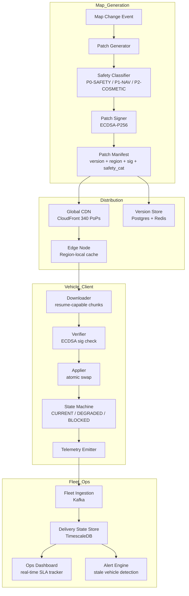

### Story Context

The AutoMesh Maps Team war room smells like cold coffee and anxiety. It is 9:47 AM on a Tuesday and you are sitting across from Hiroshi Tanaka, the Maps Infrastructure lead, who has been at the office since 5 AM. He has printed out a Slack thread and slid it across the table without a word. You read it.

---

**#fleet-safety-incidents** — Monday, 06:14 AM

**[AutoMesh Safety Monitor — BOT]**
`INCIDENT-2847` | Severity: P0-SAFETY
Zone: `INT-SFO-9831` (Market St & 4th St, San Francisco)
Vehicles involved: `AMV-00412`, `AMV-00889`, `AMV-02201`
Anomaly: Map version divergence detected in active intersection zone
`AMV-00412`: map_version=`sfbay_v4.2.17` (construction diversion active)
`AMV-00889`: map_version=`sfbay_v4.2.17` (construction diversion active)
`AMV-02201`: map_version=`sfbay_v4.2.14` (no diversion — lane data stale by 72h)
Near-miss logged. No collision. Human safety operator notified.
Telemetry attached.

---

**Hiroshi Tanaka** [06:22 AM]
how did 00412 and 00889 get 4.2.17 but 00412 did not

**Priya Kamath** [06:24 AM]
fleet region is sfbay_west — all three vehicles should have pulled from the same CDN edge node

**Hiroshi Tanaka** [06:26 AM]
check the pull timestamps

**Priya Kamath** [06:29 AM]
00412 pulled at 03:18 UTC
00889 pulled at 03:21 UTC
00412 — wait, typo. 02201 pulled at 03:19 UTC
all within 3 minutes of each other

**Soren Hauge** [06:31 AM]
the delta patch for 4.2.15 → 4.2.17 was 840MB
02201 was in a low-signal zone (Caltrain underpass) during the pull
our CDN client retried twice, then fell back to the last confirmed version
the fallback logic accepts "last known good" if download fails 3 times

**Hiroshi Tanaka** [06:33 AM]
so a download failure silently left the vehicle on a stale map

**Soren Hauge** [06:33 AM]
yes

**Hiroshi Tanaka** [06:34 AM]
and nothing told the vehicle it was operating on stale safety data

**Soren Hauge** [06:34 AM]
correct. the app just... drove.

**Hiroshi Tanaka** [06:35 AM]
this cannot happen again

---

Hiroshi sets a second document in front of you — the AutoMesh HD Map distribution architecture diagram, hand-drawn in dry-erase marker and photographed. You study it.

The current system works like this: map regions are 2GB binary files, broken into delta patches averaging 600-900MB. When a new map version is cut, patches are pushed to a global CDN (CloudFront), and each vehicle polls for updates on a 4-hour cycle. If the vehicle is driving, the download happens in the background. If the download fails, the vehicle falls back silently to its local cache.

There are 200,000 vehicles in the fleet. Each vehicle covers 1 to 3 map regions depending on its operating zone. A typical software update cycle produces 3-4 new map patches per region per day (construction events, signal timing, lane closures). The update pipeline currently generates approximately 47 distinct regional map variants per day across the full fleet.

"The fallback to last-known-good made sense when maps were navigation hints," Hiroshi says. "Now a map miss is a safety event. We need the vehicle to *know* it's operating on stale data, and we need it to behave differently when it does. We also need the distribution system to stop pretending a failed download is fine."

You open your laptop. You have three weeks before the safety board review.

---

**[DM — Marcus Webb → You]** — 07:02 AM (same day)

**Marcus Webb**: Heard about the SFO intersection thing. Three words: version vector clocks.
Every vehicle should know not just *what* version it has, but *whether that version is safe for its current zone*.
Fallback to stale is a navigation feature, not a safety feature. You can't reuse the same mechanism for both.
Different failure modes need different defaults.

**You**: we're thinking about adding a "map health" status that vehicles report

**Marcus Webb**: Don't add a status. Change the default behavior.
An unknown map state should make the vehicle *more conservative*, not transparent.
The system shouldn't need to tell the car it's lost. The car should already know.

---

You close the laptop and start sketching. The problem has three distinct parts:

1. **Distribution consistency**: How do you ensure that all vehicles operating in the same intersection zone converge on the same map version within a bounded time window?
2. **Failure detection**: How does a vehicle know its map state is stale or partial, and how does it communicate that to the fleet?
3. **Safe degradation**: When a vehicle cannot confirm its map version is current, what is the correct operational behavior?

Hiroshi refills both your coffees. "The board is going to ask about the 72-hour staleness window," he says. "We had a vehicle driving on a 3-day-old construction map. In a city. In morning traffic."

You nod. "What's the maximum acceptable staleness for a safety-critical zone annotation?"

Hiroshi doesn't hesitate. "Four hours. Maybe six at the outside."

You write that down. That number will drive the entire architecture.

---

### Problem Statement

AutoMesh distributes HD map data to 200,000 autonomous vehicles. Maps are segmented by geographic region (2GB per region), delivered as delta patches over cellular and Wi-Fi. A safety incident caused by map version divergence — three vehicles at the same intersection running different map versions — has exposed a fundamental flaw in the distribution model: failed downloads fall back silently to stale data, and vehicles have no mechanism to signal or act on map staleness.

You must redesign the HD map distribution system to guarantee that: (a) all vehicles operating in the same geographic zone converge on the same map version within a defined consistency window; (b) vehicles can detect and report their own map health state; and (c) vehicles operating with unconfirmed or stale map data degrade safely to a more conservative operational mode. The system must handle 200,000 concurrent vehicle endpoints, partial downloads over degraded cellular links, and a patch generation rate of 47 regional variants per day.

---

### Explicit Requirements

1. All vehicles in the same intersection zone must converge on the same map version within 4 hours of a safety-critical patch being published.
2. Vehicles must be able to detect that their local map version is stale relative to the authoritative version for their current geographic zone.
3. When a vehicle cannot confirm map currency, it must automatically enter a conservative driving mode (reduced speed, expanded following distance, no autonomous lane changes).
4. Delta patches must support resume-on-failure — a partial download must not require a full 2GB re-fetch.
5. The distribution system must handle 200,000 vehicles polling for updates with peak overlap periods (e.g., fleet-wide overnight update windows).
6. Map versions must be cryptographically signed; vehicles must refuse to apply unsigned or tampered patches.
7. The fleet operations center must have real-time visibility into the distribution state of any safety-critical patch across all vehicle segments.
8. Delta patch delivery must be optimized for constrained cellular links (LTE at 10-50 Mbps, with intermittent connectivity in tunnels and parking structures).

---

### Hidden Requirements

1. **Hint: re-read Soren's message at 06:31 AM.** The vehicle was in a "low-signal zone during the pull." The hidden requirement is that the distribution system must account for *predictable* low-connectivity corridors (tunnels, parking structures, urban canyons). The architecture should pre-position patches before a vehicle enters a known dead zone — not retry after the fact.

2. **Hint: re-read Marcus Webb's DM.** "Different failure modes need different defaults." The hidden requirement is that the fallback behavior for a *navigation* patch failure and a *safety-critical* patch failure must be architecturally separate. The system must classify patches by safety category at publish time, and the vehicle client must apply different degradation policies per category.

3. **Hint: re-read the incident report.** Vehicle `AMV-02201` was on version `sfbay_v4.2.14` — stale by 3 versions, not 1. The hidden requirement is that the fleet must not allow version gaps to accumulate silently. The system needs a *maximum version lag* policy: if a vehicle falls more than N versions behind for a safety-critical region, it must be flagged for intervention before being permitted to operate autonomously.

4. **Hint: Hiroshi said "4 hours, maybe 6 at the outside."** This is a consistency SLA, not a suggestion. The hidden requirement is that the distribution system must be able to *prove* to an auditor (ISO 26262 review, NHTSA inspection) that a given safety patch reached >= 99.5% of the active fleet within the 4-hour window. This means the system must produce immutable delivery receipts, not just CDN access logs.

---

### Constraints

- Fleet size: 200,000 vehicles (active at any time: ~60,000 during peak hours, ~25,000 overnight)
- Map regions: ~340 distinct geographic regions globally; average vehicle covers 2.3 regions
- Patch size: delta patches average 700MB; full region fetch is 2GB
- Patch frequency: 47 regional patch variants per day (safety-critical: ~8/day; navigation/cosmetic: ~39/day)
- Cellular bandwidth per vehicle: 10-50 Mbps LTE; average usable throughput for background downloads: 8 Mbps
- Download time per 700MB patch at 8 Mbps: ~11.6 minutes
- Fleet-wide daily patch data volume: 200,000 vehicles × 2.3 regions × 700MB × (fraction needing update) — at 30% daily patch applicability: ~96TB/day
- Consistency SLA: 99.5% of active fleet on current safety-critical version within 4 hours of publish
- Latency for version check (vehicle → server): <= 200ms p99
- Storage per vehicle (local map cache): 10-15GB (5-7 regions at full resolution)
- Infrastructure budget: included in Ch. 198 cost model (~$2.3M/month total infra)
- Team: 6 engineers on maps infrastructure, 3 on vehicle client SDK
- Regulatory: NHTSA FMVSS No. 150, ISO 26262 ASIL-B minimum for safety-critical data paths

---

### Your Task

Design the HD map distribution and consistency system for AutoMesh's 200,000-vehicle fleet. Your design must address the distribution pipeline (patch generation → CDN → vehicle), the vehicle-side client behavior (download, verify, apply, degrade), and the fleet-side observability layer (delivery tracking, staleness detection, intervention triggers). The design must satisfy the 4-hour consistency SLA for safety-critical patches and produce audit-grade delivery evidence.

---

### Deliverables

- [ ] **Mermaid architecture diagram** showing: patch generation pipeline, CDN topology, vehicle client state machine (downloading / verifying / applying / degraded), fleet telemetry ingestion, and operations dashboard
- [ ] **Database schema** for the fleet map state store: vehicle_map_state table (vehicle_id, region_id, installed_version, patch_status, safety_category_lag, last_confirmed_at, degraded_mode_active) with column types and indexes
- [ ] **Scaling estimation** (show math step by step):
  - Peak concurrent download load (vehicles × patch size × parallel pull rate)
  - CDN egress cost at 96TB/day
  - Version check RPS at fleet scale (200,000 vehicles on a 15-minute poll cycle)
  - 4-hour SLA feasibility: can 99.5% of 60,000 active vehicles complete a 700MB download in 4 hours over LTE?
- [ ] **Tradeoff analysis** (minimum 3):
  - Delta patches vs. full region re-fetch on version gap > N
  - Push (server-initiated) vs. pull (vehicle-initiated) distribution model
  - CDN edge caching consistency vs. cache invalidation latency for safety patches
  - Pre-positioning patches before dead zones vs. on-demand retry
- [ ] **Vehicle client state machine** (written as a TypeScript enum + transition table): states include CURRENT, DOWNLOADING, VERIFYING, APPLYING, DEGRADED_STALE, DEGRADED_PARTIAL, BLOCKED
- [ ] **Delivery receipt schema**: immutable append-only record per vehicle per patch (vehicle_id, patch_id, safety_category, download_started_at, download_completed_at, verification_result, applied_at, confirmed_at) — suitable for ISO 26262 audit
- [ ] **Consistency SLA proof**: show mathematically that the 4-hour window is achievable for 99.5% of 60,000 active vehicles given the bandwidth constraints, and identify the conditions under which it is not (dead zones, bandwidth floor)

### Diagram Format

All architecture diagrams: Mermaid syntax (renders in GitHub Issues).

> Note: The diagram above is a starter scaffold. Your deliverable must expand each subgraph with the pre-positioning logic, version lag policy enforcement, and the degraded-mode feedback loop to the vehicle autonomy stack.
