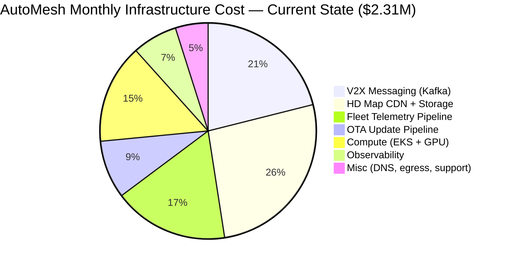

### Story Context

The calendar invite arrived Friday at 4:52 PM, the time slot reserved for things no one wants to announce publicly.

**Subject**: Infrastructure Cost Review — 30 min
**Organizer**: Patricia Sandoval (CFO)
**Attendees**: You, Dmitri Volkov (VP Engineering), Lena Brandt (Head of Finance)
**Location**: Board Room B
**Time**: Monday, 10:00 AM

No agenda. No pre-read. You have seen this kind of invite before.

You spend the weekend pulling numbers. The picture is not flattering.

---

**AutoMesh Infrastructure Cost Summary — Month-over-Month**

| Month | Monthly Infra Spend | Fleet Size | Cost/Vehicle/Month |
|-------|--------------------|-----------|--------------------|
| M-6   | $742K              | 98,000    | $7.57              |
| M-5   | $801K              | 105,000   | $7.63              |
| M-4   | $889K              | 118,000   | $7.53              |
| M-3 (pre-RoamDrive) | $953K | 124,000 | $7.69         |
| M-2 (RoamDrive onboarding) | $1.61M | 198,000 | $8.13    |
| M-1   | $2.11M             | 204,000   | $10.34             |
| M-0 (current) | $2.31M       | 207,000   | $11.16             |

The fleet size roughly doubled (+67% in two months). The cost increased 3.1x. Cost per vehicle went from $7.57 to $11.16 — a 47% increase per unit. That asymmetry is what finance noticed.

You build the breakdown:

**Current Monthly Spend by Service (~$2.31M)**
- V2X Messaging Infrastructure (Kafka, coordination layer): $487K (21%)
- HD Map CDN + Storage (CloudFront, S3): $612K (26%)
- Fleet Telemetry Ingestion + Processing (Kafka, TimescaleDB): $398K (17%)
- OTA Update Pipeline (build, signing, distribution): $201K (9%)
- Compute (EKS, EC2, GPU for map processing): $344K (15%)
- Observability (Datadog, PagerDuty, tracing): $156K (7%)
- Misc (DNS, VPN, egress, support contracts): $113K (5%)

You walk into the board room at 9:58 AM. Patricia is already seated, a printed copy of the AWS cost explorer report open in front of her. Lena Brandt has a spreadsheet. Dmitri Volkov arrives at 10:01, slightly flushed.

---

**[Meeting Transcript — Board Room B, Monday 10:00 AM]**

**Patricia Sandoval**: Let's not waste time. Three months ago we were spending eight hundred thousand dollars a month. We're now at two point three million. The fleet is sixty-seven percent larger. The bill is two-hundred-and-ten percent larger. Someone explain that to me.

**Dmitri Volkov**: The RoamDrive integration accelerated our timeline significantly. We onboarded eighty thousand vehicles in eight weeks instead of a planned eighteen months. The architecture was designed for incremental growth, not a step-function event. Some of the cost is—

**Patricia Sandoval**: Dmitri. I'm not asking for context. I'm asking: what are we going to do about it?

**Dmitri Volkov**: We're working on—

**Patricia Sandoval**: *(turning to you)* You've been the infrastructure consultant on this engagement for four months. You designed half of what we're paying for. What does the twelve-month picture look like if we do nothing?

**You**: If we maintain current architecture and the fleet grows another twenty percent to approximately two hundred and fifty thousand vehicles by Q4, we'll be at three point one million per month. That's thirty-seven million annually. At our current Series B burn rate, that number becomes a board conversation by Q3.

**Patricia Sandoval**: That is already a board conversation. What's the target?

**You**: The engineering team has identified a path to one point four million per month — a forty percent reduction — within eight months, without sacrificing safety-critical reliability. I want to be precise about what that means: some of these cuts have zero risk, some have managed risk, and two components I would argue we should not cut at all.

**Patricia Sandoval**: Walk me through it.

**You**: I'll take it service by service.

The HD map CDN and storage is our largest single line at six hundred and twelve thousand per month. Sixty-two percent of that is egress — we're pushing full delta patches to every vehicle on a four-hour polling cycle regardless of whether the vehicle's region has changed. We can implement region-aware patch targeting: a vehicle that hasn't left the same three regions in seven days doesn't need to pull patches for forty other regions. Estimated saving: one hundred and eighty thousand per month. Zero safety impact — we're reducing unnecessary data transfer, not reducing data to vehicles that need it.

**Lena Brandt**: That's a configuration change?

**You**: Mostly. Three to four weeks of engineering time. The second CDN optimization is tiered storage: maps older than sixty days move from S3 Standard to S3 Intelligent-Tiering. The full map archive for historical versions is three hundred terabytes. We're paying Standard pricing for all of it. Moving inactive versions to cold tiers saves approximately forty-four thousand per month with no operational impact — vehicles never fetch versions older than thirty days in normal operation.

**Patricia Sandoval**: What about compute?

**You**: The GPU cluster for map processing is overprovisioned. We provisioned for peak map generation throughput during the RoamDrive onboarding — that was a temporary spike. We're currently running fourteen p3.2xlarge instances continuously. The actual map processing workload needs eight, with two in hot standby. We can right-size to ten instances and use spot for the overflow batch jobs. Saving: approximately eighty-five thousand per month. The risk here is queue latency during peak map generation events — we mitigate with a burst capacity reservation.

**Dmitri Volkov**: The spot instance interruption risk—

**You**: Is acceptable for map *processing*, not for map *serving*. The pipeline jobs can tolerate a two-minute interruption and checkpoint resume. The serving layer stays on on-demand. That distinction matters.

**Patricia Sandoval**: What about the Kafka costs? You have almost five hundred thousand going to V2X messaging.

**You**: This is the one I want to be careful about. The V2X messaging infrastructure carries safety-critical vehicle-to-vehicle coordination messages. The cost is high because we run three availability zones, synchronous replication, and zero compression on safety messages to minimize latency. I would not recommend reducing replication factor or moving to async on safety-critical topics. That's not a cost optimization target — it's a liability.

**Patricia Sandoval**: You're telling me half a million a month is off the table?

**You**: I'm telling you that four hundred and twenty thousand of it is off the table. There's roughly sixty thousand in Kafka management overhead — schema registry, control plane, monitoring — that we can consolidate. And we're running separate Kafka clusters for V2X, telemetry, and OTA. We can merge the telemetry and OTA clusters. Saving: approximately sixty-five thousand per month, ninety-day migration, zero safety impact.

**Lena Brandt**: What does the full picture look like?

**You**: *(sliding a one-page summary across the table)*

**12-Month Cost Optimization Summary**

| Initiative | Monthly Saving | Timeline | Risk Level |
|------------|---------------|----------|------------|
| Region-aware CDN targeting | $180K | 4 weeks | None |
| Tiered storage (historical maps) | $44K | 2 weeks | None |
| GPU cluster right-sizing | $85K | 3 weeks | Low |
| Kafka cluster consolidation | $65K | 90 days | Low |
| Observability tool consolidation (Datadog → partial migration) | $48K | 60 days | Medium |
| EKS node group right-sizing | $32K | 2 weeks | Low |
| Reserved instance purchases (1-year) | $205K effective savings | Upfront $820K | None |
| **Total ongoing savings** | **$454K/month** | **Within 8 months** | — |
| **Total one-time cost** | $820K (reserved instances) | — | — |

Current run rate: $2.31M/month
Post-optimization target: $1.86M/month ongoing, or $1.4M if we make the reserved instance commitment (the $820K upfront buys $205K/month in effective savings over 12 months — net positive by month five).

**Patricia Sandoval**: What is the payback on the reserved instances?

**You**: We break even on the upfront cost at month four point seven. After that it's pure savings. At the current growth trajectory the reserved instances also absorb the twenty percent fleet growth at no additional marginal cost.

**Patricia Sandoval**: *(to Dmitri)* I want this plan formalized and on my desk by Thursday. Line items, owners, dates, risk owners. *(to you)* What did you say we absolutely cannot cut?

**You**: The V2X safety replication. And the observability on safety-critical services. Last month we had a P0 incident where map version divergence caused a near-miss at a San Francisco intersection. We found it in eleven minutes because of the monitoring pipeline. The cost of that detection capability is about forty thousand a month. The cost of a missed safety incident — regulatory, legal, reputational — is not a number I can put in a spreadsheet.

A pause. Patricia looks at you for a long moment.

**Patricia Sandoval**: That's the first honest answer I've gotten in this room in three months. *(closes her folder)* Thursday. We're done.

---

### Problem Statement

Following the RoamDrive fleet doubling (Ch. 196), AutoMesh's monthly infrastructure spend grew from $742K to $2.31M — a 3.1x increase for a 1.67x fleet size increase. The CFO has requested a 40% cost reduction to $1.4M/month within 8 months. As the infrastructure consultant with the deepest system knowledge, you must produce a cost optimization plan that identifies safe cuts, manages risky cuts, and explicitly protects the safety-critical infrastructure that cannot be reduced without accepting unacceptable risk.

The challenge is not finding the cuts — it is correctly classifying each component's cost, risk, and business criticality, then building a sequenced, owner-assigned execution plan that finance can hold engineering accountable to.

---

### Explicit Requirements

1. Produce a 12-month infrastructure cost model showing current spend, savings initiatives, and projected run rate at 3, 6, and 12 months.
2. Classify each cost reduction initiative by risk level: None / Low / Medium / High.
3. Identify components that must not be reduced (safety-critical), with written justification.
4. Include reserved instance / savings plan analysis with payback period math.
5. Account for projected 20% fleet growth in the capacity plan (fleet: 207K → 250K vehicles by month 12).
6. Produce a Mermaid diagram showing cost attribution by service layer.
7. Show the cost-per-vehicle trend and the target cost-per-vehicle at optimization completion.
8. All cost reduction initiatives must have an assigned engineering owner and delivery timeline.

---

### Hidden Requirements

1. **Hint: re-read Patricia's question about the observability tooling.** The line item shows $156K/month for "Datadog, PagerDuty, tracing." The hidden requirement is that the observability *migration* plan (partial Datadog → open-source) must not reduce coverage on safety-critical services. A rushed migration that drops the V2X alerting pipeline to save money creates exactly the visibility gap that caused the Ch. 197 near-miss to take 11 minutes to detect instead of 2.

2. **Hint: re-read the cost-per-vehicle table.** The cost per vehicle jumped from $7.57 to $11.16 — a 47% increase — during the RoamDrive onboarding. The hidden requirement is that the unit economics model must be validated against the RoamDrive contract pricing. If AutoMesh charges RoamDrive a flat per-vehicle fee that was priced at the $7.57 cost basis, the company is currently losing money on every RoamDrive vehicle. This is a pricing architecture problem, not just an ops problem.

3. **Hint: re-read Dmitri's concern about spot instance interruption risk.** The hidden requirement is that the compute right-sizing plan must include a formal *blast radius analysis*: if a spot instance is interrupted mid-map-processing-job, what is the worst-case outcome? The answer determines whether the job can safely run on spot at all, and whether checkpoint/resume is sufficient mitigation.

---

### Constraints

- Current monthly spend: $2.31M
- Target monthly spend: $1.4M (40% reduction)
- Timeline: 8 months
- Available upfront capital for reserved instances: up to $1M (CFO approval required above $500K)
- Engineering team capacity for optimization work: 20% of team bandwidth (the rest goes to product roadmap)
- Fleet growth projection: 207K → 250K vehicles by month 12 (+21%)
- Safety-critical SLA: must not be degraded (99.999% V2X messaging availability)
- Regulatory constraint: ISO 26262 audit in 3 weeks (no infra changes that affect safety data paths during audit window)

---

### Your Task

Produce the complete infrastructure cost optimization plan for the CFO presentation. This includes the 12-month cost model, risk classification, reserved instance analysis, capacity growth projection, and a clear articulation of what cannot be cut and why. The deliverable must be suitable for a non-technical CFO to approve and a technical VP to execute.

---

### Deliverables

- [ ] **12-month infrastructure cost model** (table format, before/after per initiative, projected monthly spend at M+3, M+6, M+12, accounting for 21% fleet growth)
- [ ] **Risk matrix** (table: initiative, monthly saving, one-time cost, risk level, engineering owner, timeline, rollback plan)
- [ ] **"Do Not Cut" list** with written technical justification for each protected component (minimum 2 components)
- [ ] **Mermaid diagram** of cost attribution by service layer (current state, with % breakdown)
- [ ] **Capacity planning math** (step by step):
  - Current cost/vehicle: $2.31M / 207K = $X
  - Post-optimization cost/vehicle target
  - At 250K vehicles, what is the projected monthly spend at current architecture vs. optimized architecture?
  - Reserved instance payback: $820K upfront ÷ $205K/month saving = X months
- [ ] **RoamDrive unit economics analysis**: at current $11.16 cost/vehicle and the original contract pricing assumption, what is the per-vehicle margin? What contract amendment is required?
- [ ] **Tradeoff analysis** (minimum 3):
  - Reserved instances (upfront commitment) vs. on-demand flexibility during rapid growth
  - Spot instance compute savings vs. job interruption risk for safety-adjacent workloads
  - Kafka cluster consolidation savings vs. blast radius if consolidated cluster has an outage
  - Observability cost reduction vs. detection latency risk on safety-critical alerting

### Diagram Format

All architecture diagrams: Mermaid syntax (renders in GitHub Issues).

> Note: The pie chart above is a starter. Your deliverable must produce a second diagram showing the post-optimization target state by the same breakdown, and a third diagram showing the 12-month cost trajectory as a Gantt or timeline of initiative deliveries.
