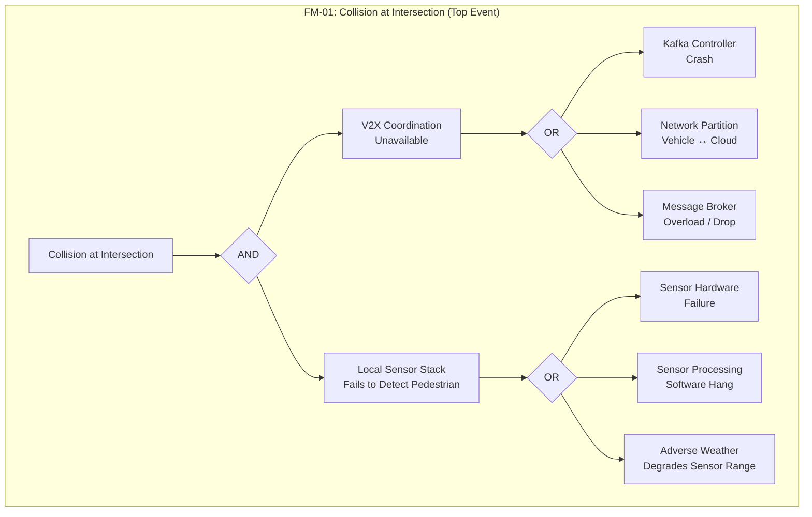

### Story Context

The Slack message arrives at 7:14 AM on a Thursday, which is early even for Hiroshi.

---

**[DM — Hiroshi Tanaka → You]** — Thursday, 07:14 AM

**Hiroshi Tanaka**: We're filing for FMEA certification under ISO 26262 in three weeks. Our certification partner — TÜV SÜD — scheduled the architecture review for the 18th. I need you to run a full failure mode analysis across the V2X stack, OTA pipeline, and HD map distribution before we go in. If we miss something and TÜV finds it before we do, the certification timeline slips six months. That's not acceptable.

**You**: How formal does it need to be?

**Hiroshi Tanaka**: ASIL-B minimum across all safety-critical paths. ASIL-D for anything that can directly cause a collision with no human fallback. FMEA table, fault trees for the top failure modes, and architecture recommendations for anything we find. I want a workshop next Tuesday. Full day.

**You**: Who's in the room?

**Hiroshi Tanaka**: You, me, Elena Rodriguez from SRE, Priya Kamath from maps, Soren Hauge from vehicle client SDK, and Dr. Amara Osei — she's our new functional safety engineer. She came from Continental. She's going to be the hardest person in the room.

**You**: Good.

**Hiroshi Tanaka**: One more thing. Don't go easy on us. I'd rather hear the brutal version from you than the diplomatic version from TÜV.

---

The FMEA workshop is scheduled for Tuesday, 8 AM to 5 PM, Conference Room A. You spend the weekend in preparation.

You print out the full architecture for the three systems under review:

**System 1: V2X Communication Stack** — Vehicle-to-infrastructure messaging, including intersection coordination, emergency vehicle preemption, and pedestrian detection broadcast. The messaging backbone runs on a custom DSRC + C-V2X hybrid, with a Kafka-based aggregation layer in the cloud.

**System 2: OTA Update Pipeline** — Over-the-air software and map update delivery. Packages are signed with ECDSA-P256, verified on-vehicle before apply, and applied atomically with rollback capability. Covers both firmware updates and HD map patches.

**System 3: HD Map Distribution Pipeline** — As designed in Ch. 197. Delta patch generation, CDN distribution, vehicle client state machine (CURRENT / DOWNLOADING / VERIFYING / APPLYING / DEGRADED_STALE / DEGRADED_PARTIAL / BLOCKED).

---

**[Tuesday, 8:03 AM — Conference Room A]**

Dr. Amara Osei sets her notebook on the table before anyone else is seated. She is wearing a Continental Automotive lanyard from a conference two years ago. She opens with: "I want to be clear about something before we start. ISO 26262 FMEA is not a document exercise. It is a forcing function. If we find something today that requires an architectural change, we either make the change or we accept the risk in writing. There is no third option."

No one disagrees.

Elena Rodriguez opens her laptop. "I'm starting with what I know is broken. The V2X message broker has a single coordinator node per region — we use Kafka, and each region has a dedicated controller. If the controller goes down, the region's intersection coordination messages stop. Vehicles fall back to their local sensor stack. How long is acceptable for that fallback?"

**Dr. Amara Osei**: "Under ISO 26262, the tolerable hazard rate for a function that can cause a serious collision — Category 3 injury — is one-in-ten-to-the-eighth per hour of operation. If your fallback degrades intersection awareness, you need to prove the combined probability of controller failure AND fallback failure AND resulting collision is below that threshold. What's the controller MTBF?"

**Elena Rodriguez**: "We don't have a measured MTBF. We've never had a controller failure in production."

**Dr. Amara Osei**: "That's not MTBF. That's absence of data. How old is the fleet?"

**Elena Rodriguez**: "Oldest production deployment is fourteen months."

**Dr. Amara Osei**: "With two hundred thousand vehicles running eighteen hours a day, you have approximately three point six million vehicle-hours of operation. A zero-failure count over that period gives you a ninety percent confidence interval upper bound of about eight point three times ten to the negative seven per vehicle-hour for controller-related failures. That is above the ASIL-D threshold. You need redundancy or you need to lower your hazard category."

Hiroshi rubs his eyes. Soren Hauge, the vehicle client engineer, is already typing.

The day proceeds methodically. Each component is broken down. Each failure mode is named. Each consequence is traced to its worst-case outcome. By 2 PM the whiteboard has seventeen failure modes identified. Eight are rated Severity >= 8. Three are rated Severity 10 — meaning the failure can directly cause a collision with no human intervention available in time.

The three Severity-10 failures are:

**FM-01: V2X Controller Single Point of Failure**
If the regional Kafka controller crashes and the vehicle's local sensor stack cannot detect a pedestrian in the intersection, the vehicle may proceed through a red phase without stopping.

**FM-02: HD Map Silent Stale Delivery**
As triggered by the Ch. 197 incident: if a vehicle receives a failed patch download and falls back to a stale map without entering conservative mode, it may navigate a construction zone using incorrect lane geometry.

**FM-03: OTA Rollback Failure Under Power Loss**
If an OTA firmware update is interrupted by power loss during the atomic swap phase, and the rollback fails to complete, the vehicle may boot into a partially-applied firmware state with undefined behavior in the autonomy stack.

You spend the final two hours of the workshop designing mitigations. Dr. Osei writes the final line of the day on the whiteboard:

*"Every failure mode we found today was already in the architecture. We just hadn't named it yet."*

---

**[DM — Marcus Webb → You]** — Tuesday, 6:47 PM

**Marcus Webb**: Heard you ran an FMEA today. First one I did was at Delco Electronics, 1998. We found seventeen failure modes in a cruise control system. Fixed twelve. Documented the other five as "acceptable risk." Three years later one of the unfixed ones showed up in a recall.
Don't let anyone talk you out of fixing the Severity-10s.
The paper trail of "we knew and accepted it" is not a defense. It's an exhibit.

---

### Problem Statement

AutoMesh must complete an ISO 26262 FMEA (Failure Mode and Effects Analysis) certification review covering three interconnected safety-critical systems: the V2X communication stack, the OTA update pipeline, and the HD map distribution pipeline. The FMEA must identify failure modes for each component, classify severity and detectability, and produce architecture recommendations for all failures rated Severity >= 7. The three highest-severity failure modes (Severity 10) must produce fault tree analyses and concrete design changes.

This is not a documentation exercise. It is an architecture exercise that uses FMEA methodology as a forcing function to find real design weaknesses before TÜV SÜD does. The output must be suitable for submission to a TÜV certification body and for presentation to the AutoMesh board as evidence of safety engineering maturity.

---

### Explicit Requirements

1. Produce a complete FMEA table covering all three systems: V2X stack, OTA pipeline, HD map distribution.
2. Each failure mode entry must include: component, failure mode, failure effect, severity (1-10), occurrence likelihood (1-10), detection difficulty (1-10), Risk Priority Number (RPN = S × O × D), and current mitigation.
3. All failure modes with Severity >= 8 must have a proposed architectural mitigation.
4. The three Severity-10 failure modes (FM-01, FM-02, FM-03) must each produce a fault tree diagram.
5. Architecture recommendations must include: what to change, why, and the expected reduction in RPN.
6. The FMEA must reference ISO 26262 ASIL categories (A, B, C, D) for each failure mode where applicable.
7. The analysis must cover failure modes at the component level (e.g., Kafka controller), the system level (e.g., V2X stack during regional failover), and the integration level (e.g., OTA update that corrupts a map patch mid-apply).
8. The output must include a prioritized remediation backlog: severity-ordered list of architectural changes, estimated engineering effort, and recommended timeline.

---

### Hidden Requirements

1. **Hint: re-read Dr. Amara Osei's MTBF calculation.** She derived a confidence interval upper bound from observed fleet hours, not a measured failure rate. The hidden requirement is that the FMEA must include a **data collection plan**: for each unmeasured failure mode, what telemetry must the system emit to build a real MTBF estimate? FMEA without continuous measurement is a point-in-time snapshot that becomes stale. ISO 26262 requires ongoing functional safety monitoring.

2. **Hint: re-read Marcus Webb's DM about the Delco recall.** "The paper trail of 'we knew and accepted it' is not a defense." The hidden requirement is that any failure mode classified as "acceptable risk" must include a formal risk acceptance record signed by a named responsible engineer and reviewed by Dr. Osei as the functional safety officer. The architecture must make this workflow structurally enforced — risk acceptance cannot be informal.

3. **Hint: re-read FM-03 (OTA rollback under power loss).** The OTA rollback failure mode involves an interrupted atomic swap. The hidden requirement is that the vehicle firmware architecture must support an **A/B partition model** (two firmware slots: active and inactive) so that power loss during an OTA write can never result in a partially-applied image. The vehicle always boots from a known-good slot. This is a well-established pattern in automotive OTA (used by Tesla, Rivian, GM's OTA programs) but it requires the bootloader to be designed for it — a change that has implications for the entire firmware distribution architecture.

4. **Hint: re-read Elena's comment about the regional Kafka controller.** She said "we've never had a controller failure in production" but also admitted the fleet is only 14 months old. The hidden requirement is that the FMEA must account for **infant mortality vs. wear-out failure curves**: new systems fail for different reasons than mature systems. The FMEA should note which failure modes are likely in the first 24 months (integration failures, configuration drift) vs. which emerge at scale (contention, memory leaks, data volume saturation).

---

### Constraints

- Three systems under analysis: V2X stack, OTA pipeline, HD map distribution
- Fleet: 200,000 vehicles; 60,000 active at peak; 3.6M vehicle-hours/month
- ISO 26262 target: ASIL-B for V2X coordination, ASIL-D for direct collision-causal paths
- ASIL-D tolerable hazard rate: <= 10^-8 per vehicle-hour for Severity-10 failures
- TÜV SÜD review: 18 days from today
- Engineering bandwidth for FMEA remediation: 30% of team for 90 days (3 engineers full-time equivalent)
- Systems are live and serving production traffic — no big-bang redesign possible; changes must be incremental with no service interruption
- Bootloader/firmware partition model change (FM-03 mitigation) requires hardware team involvement and a 6-month rollout for existing fleet (new vehicles can be manufactured with the new bootloader; existing fleet requires a staged OTA that itself must be FMEA'd)

---

### Your Task

Conduct the FMEA analysis for AutoMesh's three safety-critical systems. Produce the complete FMEA table, fault tree diagrams for the top 3 failure modes, and an architecture redesign recommendation for each Severity >= 8 item. Then produce a prioritized remediation backlog with effort estimates and timeline. The output must satisfy TÜV SÜD's ISO 26262 Part 3 (Concept Phase) and Part 4 (Product Development: System Level) requirements for FMEA documentation.

---

### Deliverables

- [ ] **FMEA table** covering all three systems (minimum 20 failure modes total):
  - Columns: Component | Failure Mode | Failure Effect | ASIL Category | Severity (S) | Occurrence (O) | Detection (D) | RPN | Current Mitigation | Proposed Mitigation | Post-Mitigation RPN Target
- [ ] **Fault tree diagram** (Mermaid) for each of the three Severity-10 failure modes:
  - FM-01: V2X Controller SPOF → collision in intersection
  - FM-02: HD Map Silent Stale Delivery → incorrect lane navigation
  - FM-03: OTA Rollback Failure → undefined firmware state
- [ ] **Architecture redesign recommendations** for all failure modes with Severity >= 8:
  - For each: current design, failure risk, proposed change, expected RPN reduction, effort estimate
- [ ] **A/B firmware partition design**: describe the A/B slot model for OTA updates, the bootloader contract, and the transition plan for existing fleet vehicles
- [ ] **Telemetry data collection plan**: for each unmeasured failure mode, specify the exact metric that must be emitted, the aggregation method, and the alert threshold that would indicate early failure mode emergence
- [ ] **Risk acceptance register template**: schema for formally documenting accepted risks (risk_id, failure_mode_id, accepting_engineer, safety_officer_sign_off, acceptance_rationale, review_date, expiry_date)
- [ ] **Prioritized remediation backlog** (ordered by RPN, not by engineering convenience):
  - Each item: failure mode, current RPN, target RPN, architectural change, owner, timeline, dependencies
- [ ] **Scaling and reliability math**:
  - At 3.6M vehicle-hours/month, what is the expected number of FM-01 events per month if MTBF of Kafka controller is 18 months?
  - What replication factor / availability architecture achieves < 10^-8 per vehicle-hour for FM-01?
- [ ] **Tradeoff analysis** (minimum 3):
  - ASIL decomposition (splitting one ASIL-D requirement across two independent ASIL-B systems) vs. single ASIL-D system
  - A/B partition OTA model (safe, costly to retrofit) vs. checkpointed atomic swap with hardware watchdog (cheaper, lower safety guarantee)
  - Regional Kafka controller redundancy (active-active, complex) vs. fast failover to local sensor fallback (simpler, degrades coverage quality)

### Diagram Format

All architecture diagrams: Mermaid syntax (renders in GitHub Issues).

> Note: The fault tree above is a starter for FM-01. Your deliverable must produce complete fault trees for FM-01, FM-02, and FM-03, including basic events (leaf nodes with probability estimates) and intermediate gates.
