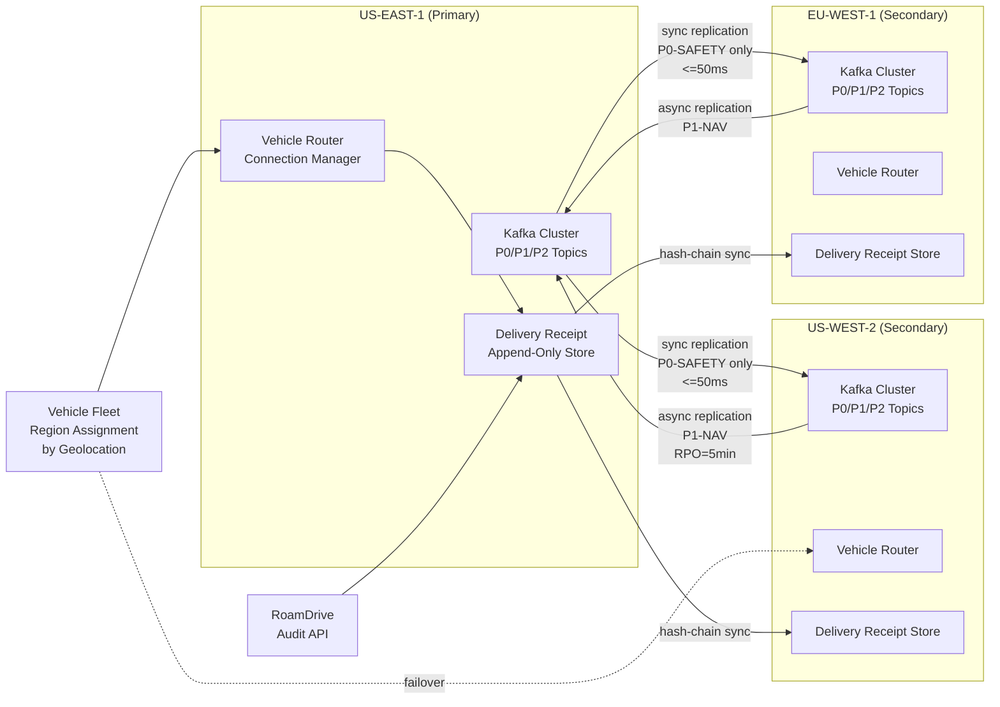

### Story Context

The contract rider arrives as a PDF attached to an email with a subject line that reads: "RoamDrive Partnership Renewal — Revised SLA Addendum — Action Required by EOD Friday."

You forward it to Hiroshi Tanaka without comment. He reads it and calls you immediately.

"They want five nines," he says.

"For what scope?"

"Safety-critical V2X messages. No message loss. No degraded mode during a region failure. They're citing the SFO near-miss as a contractual trigger — apparently it was close enough to involve a RoamDrive vehicle and their legal team noticed."

"What are we at today?"

"Three nines. Officially. In practice, closer to three-and-a-half because we've been lucky. But the architecture isn't designed for anything higher."

You open Slack.

---

**#v2x-architecture** — Thursday, 2:31 PM

**You**: RoamDrive wants 99.999% availability SLA on safety-critical V2X messaging. That's 5.26 minutes of downtime per year. Current architecture has a single regional Kafka controller per region. We need to redesign the backbone. Starting a thread.

**Hiroshi Tanaka**: Context for anyone joining: the SFO incident (INCIDENT-2847) involved a RoamDrive vehicle. Their legal team flagged it during renewal. We have 30 days to commit to the SLA or they walk. Revenue impact is ~$4.1M ARR.

**Elena Rodriguez** [SRE]: Five nines for a *cloud-connected* safety system is not a cloud problem, it's a network problem. Every vehicle goes through a cellular carrier. Carrier SLAs are 99.9%. You can't offer a higher SLA than your last-mile transport layer.

**You**: That's the conversation we need to have. The SLA has to be scoped correctly. "Safety-critical V2X message delivery" — we need to define what that means. Is it message delivery to the cloud? Message delivery to the vehicle? Message delivery *between* vehicles in real time?

**Elena Rodriguez**: If it's cloud-to-vehicle, you're bounded by cellular. If it's vehicle-to-vehicle local (DSRC/C-V2X sidelink), that's a different protocol that doesn't touch our infrastructure at all.

**Hiroshi Tanaka**: The RoamDrive contract specifies "cloud coordination messages for intersection management." Not sidelink. They want the backend system to be five nines.

**Elena Rodriguez**: Okay. Backend five nines. That I can reason about.

**Soren Hauge**: What's the failure scenario we're designing for? Regional failure? AZ failure? Full cloud outage?

**You**: Per FMEA findings: the top failure mode is regional Kafka controller failure. Second is network partition between vehicle and cloud edge. Full cloud outage is low probability but high severity — that's our ASIL-D scenario.

**Elena Rodriguez**: For a full region failure, vehicles need to operate in autonomous sensor-only mode. The question is: for how long? And what messages, if any, can be rerouted?

**Hiroshi Tanaka**: Here's my position: we cannot deliver five nines by adding more cloud infrastructure alone. The architecture has to change. We need active-active, not active-passive. And we need to scope the SLA precisely so we're not promising something we literally cannot deliver over cellular.

**Soren Hauge**: Agreed. "Five nines for the cloud system, measured from our API endpoint inward" is achievable. "Five nines end-to-end including cellular last mile" is not a real commitment — that's a misrepresentation.

**You**: So the deliverable is: a multi-region active-active V2X messaging backbone that can survive a full region failure with no message loss *within the cloud layer*, plus an honest SLA definition that scopes out the cellular last mile with transparent degradation handling.

**Elena Rodriguez**: That I can sign off on from an SRE perspective.

**Hiroshi Tanaka**: Then let's design it.

---

**[1:1 transcript — You and Dmitri Volkov (VP Engineering), Thursday 4:15 PM]**

**Dmitri Volkov**: Walk me through what five nines actually costs us.

**You**: Active-active multi-region for a stateful Kafka workload means: three regions minimum, synchronous cross-region replication on safety topics, latency-aware routing for vehicle connections, conflict-free message ordering across regions. Rough infrastructure delta: two hundred to two-hundred-and-fifty thousand additional per month. On top of the current four eighty-seven.

**Dmitri Volkov**: The RoamDrive contract is four point one million ARR. So the cost is justifiable if we keep them.

**You**: Yes. But I want to be precise with you about one thing. Five nines for the *cloud backbone* is achievable. Five nines *end-to-end including vehicle cellular connectivity* is not achievable by anyone. If RoamDrive's lawyers have written the SLA in a way that covers the cellular link, we have a contract problem, not an architecture problem.

**Dmitri Volkov**: I'll get the contract language clarified. What do you need to start?

**You**: Two things. First, Elena needs to own the SRE definition of what "availability" means for this SLA — specifically: is a message that is queued but not yet delivered to a degraded-connectivity vehicle counted as "delivered" or "lost"? Second, I need Hiroshi to sign off on the consistency model for cross-region replication. If we go active-active with synchronous replication, we add twenty to forty milliseconds of latency on every safety message. That's a tradeoff he needs to own.

**Dmitri Volkov**: How do we prove five nines to RoamDrive?

**You**: Immutable delivery receipts per message, per vehicle, per region. Third-party-auditable. Same pattern as the delivery receipts from the HD map system — append-only, cryptographically chained. We generate a monthly SLA report and give them API access to query their fleet's delivery metrics directly. No black boxes.

**Dmitri Volkov**: Do it.

---

That evening, you sit alone in the office long after everyone else has left, looking at the architecture diagram on your laptop. Active-active Kafka across three geographic regions, with synchronous replication on P0-SAFETY topics only. Async replication on P1-NAV. No replication on P2-COSMETIC. The design is sound. The cost is justified. The SLA scope is honest.

But something Marcus Webb said years ago surfaces: *"A system that fails gracefully is not the same as a system that doesn't fail."*

The five nines is not really about uptime. It is about what happens in the 0.001% of the time when it fails. A vehicle at a busy intersection, cellular signal dropping, regional failover mid-message, safety coordination in an ambiguous state for eleven seconds. The architecture has to make that eleven seconds survivable.

You open a new document and start writing the degradation contract between the cloud backbone and the vehicle autonomy stack.

---

### Problem Statement

RoamDrive's contract renewal requires AutoMesh to commit to a 99.999% availability SLA (5.26 minutes downtime/year) for safety-critical V2X intersection coordination messages. The current architecture has a single active Kafka controller per region, providing approximately 99.9% availability. To meet the SLA, AutoMesh must redesign the V2X messaging backbone as a multi-region active-active system capable of surviving a full region failure with no message loss within the cloud layer.

The design must address cross-region replication consistency, message ordering guarantees for safety-critical topics, vehicle connection routing during regional failover, and the precise SLA scope definition that honestly excludes the cellular last-mile (which is bounded by carrier SLAs). It must also define the degradation contract: what happens to a vehicle during the brief window of regional failover, and how the autonomy stack is notified of degraded cloud coordination availability.

---

### Explicit Requirements

1. Design a multi-region active-active V2X messaging backbone across 3 geographic regions (e.g., US-EAST, US-WEST, EU-WEST).
2. Safety-critical (P0-SAFETY) topics must use synchronous cross-region replication — no message loss on single region failure.
3. P1-NAV topics may use asynchronous replication with a defined RPO (recovery point objective).
4. P2-COSMETIC topics may use regional-only storage (no cross-region replication required).
5. Regional failover for vehicle connections must complete within 30 seconds (30s of degraded coordination is acceptable per FMEA findings; below that threshold the vehicle autonomy stack falls back to local sensors).
6. Message ordering guarantees must be preserved per-vehicle-per-topic across regions.
7. The SLA definition must be formally scoped: availability is measured at the cloud API endpoint, not end-to-end through the cellular carrier.
8. Delivery receipts must be immutable, append-only, and accessible to RoamDrive via auditable API for monthly SLA reporting.
9. Latency budget: P0-SAFETY message cloud-to-cloud replication must complete within 50ms to fit within the vehicle's intersection approach decision window.

---

### Hidden Requirements

1. **Hint: re-read Elena Rodriguez's comment about cellular carrier SLAs.** "You can't offer a higher SLA than your last-mile transport layer." The hidden requirement is that the SLA contract must include a **vehicle-side availability buffer**: if a vehicle loses cellular connectivity for < 30 seconds and the cloud system queues messages during that window, the queued messages must be delivered in order when connectivity restores. This requires a per-vehicle message buffer in the cloud (not just at the vehicle) — essentially an outbox per vehicle ID. Without this, even a cloud system at 99.999% looks like a lower SLA from the vehicle's perspective because brief cellular drops cause message gaps.

2. **Hint: re-read the discussion about synchronous replication adding 20-40ms latency.** The hidden requirement is that the replication latency must be modeled against the vehicle's **intersection approach decision window**. A vehicle approaching an intersection at 35 mph needs to make a stop/go decision approximately 3.5 seconds before the intersection. A 40ms replication delay is negligible in that window — but only if the coordination message is sent *before* the vehicle enters the decision zone. The system must implement **predictive message pre-send**: push coordination messages to the vehicle when it is 10 seconds from an intersection, not when it arrives.

3. **Hint: re-read Dmitri's question "How do we prove five nines to RoamDrive?"** The hidden requirement is that the delivery receipt system must be **cryptographically chained** (like a Merkle chain or append-only hash chain) so that AutoMesh cannot retroactively alter delivery records to manipulate SLA compliance reports. RoamDrive's legal team will ask for this — and if the audit trail is mutable, the contract is unenforceable.

---

### Constraints

- Three regions: US-EAST-1, US-WEST-2, EU-WEST-1
- Fleet: 200,000 vehicles; ~70,000 active in any given hour; distributed across regions
- P0-SAFETY message volume: ~12,000 messages/second at peak (intersection coordination, emergency preemption)
- P1-NAV message volume: ~85,000 messages/second
- P2-COSMETIC: ~140,000 messages/second (traffic, weather, POI updates)
- Cross-region replication latency target: <= 50ms for P0-SAFETY (synchronous)
- Regional failover target: vehicle connection re-established within 30 seconds
- Current monthly cost of V2X infrastructure: $487K/month
- Additional cost budget for five-nines upgrade: up to $250K/month additional (Dmitri approved)
- SLA measurement window: monthly (calendar month), reported to RoamDrive with API access
- Contract value at risk: $4.1M ARR
- Regulatory: DSRC/C-V2X sidelink is outside scope (handled at vehicle hardware layer)

---

### Your Task

Design the multi-region active-active V2X messaging backbone that satisfies the 99.999% cloud-layer availability SLA for RoamDrive. Produce the full architecture including cross-region replication topology, vehicle connection routing and failover, per-topic replication policies (P0/P1/P2), the vehicle-side degradation contract, and the delivery receipt audit system. Include the precise SLA definition language that correctly scopes what is and is not covered.

---

### Deliverables

- [ ] **Mermaid architecture diagram**: three-region active-active topology, vehicle connection routing, Kafka cross-region replication per topic tier, failover path, delivery receipt pipeline
- [ ] **Database schema** for the delivery receipt store:
  - `v2x_delivery_receipt` table: receipt_id, message_id, vehicle_id, topic, safety_category, sent_at, received_at_cloud_endpoint, delivered_at_vehicle (nullable), region_of_delivery, failover_used (bool), hash_chain_prev
  - Indexes for SLA query patterns (vehicle_id + time range, topic + safety_category + time range)
- [ ] **Scaling estimation** (show math step by step):
  - Peak message throughput: 12K P0 + 85K P1 + 140K P2 = 237K msg/sec total
  - Cross-region replication bandwidth: P0 at 12K msg/sec × average 512 bytes/msg = X MB/sec per cross-region link
  - Delivery receipt storage: 237K msg/sec × 86,400 sec/day × receipt record size = X TB/day
  - What Kafka partition count supports 12K P0 msg/sec with synchronous cross-region replication at <= 50ms?
- [ ] **SLA definition document** (1 page): precise scope, measurement methodology, exclusion clauses (cellular last mile, vehicle hardware failures, scheduled maintenance windows), and RoamDrive API access spec
- [ ] **Degradation contract** (written as a TypeScript interface):
  - Events the vehicle autonomy stack must handle: `CloudCoordinationDegraded`, `CloudCoordinationRestored`, `RegionalFailoverActive`
  - Per-event: what the vehicle must do (conservative mode, speed reduction, intersection behavior change)
- [ ] **Tradeoff analysis** (minimum 3):
  - Synchronous vs. asynchronous replication for P0-SAFETY: latency cost vs. durability guarantee
  - Active-active vs. active-passive: complexity cost vs. failover time
  - Per-vehicle message buffer in cloud (outbox per vehicle) vs. client-side replay: storage cost vs. cellular gap handling
  - Hash-chained delivery receipts vs. standard append-only log: tamper-evidence vs. write overhead
- [ ] **Five-nines math**:
  - 99.999% = 5.26 minutes downtime/year = 26.3 seconds/month
  - With 3 regions, what is the required availability per region to achieve 99.999% composite? (Hint: use P(at least one region available) = 1 - P(all regions down simultaneously))
  - What MTBF is required per region to achieve that per-region availability target?

### Diagram Format

All architecture diagrams: Mermaid syntax (renders in GitHub Issues).

> Note: The diagram above is a starter scaffold. Your deliverable must expand it with: the per-vehicle message outbox (cloud-side buffer), the predictive pre-send path for intersection approach messages, and the SLA measurement probe that continuously verifies message delivery latency and reports to the monthly SLA dashboard.
