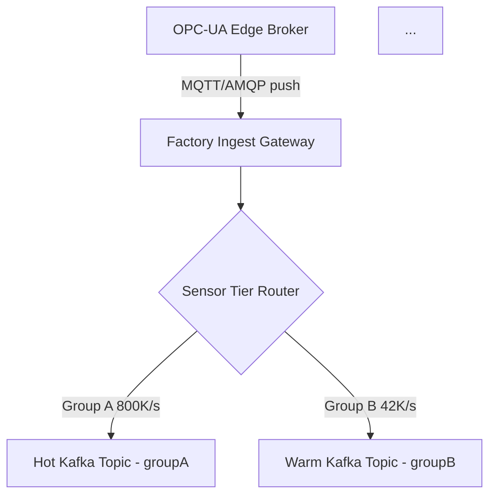

### Story Context

**Slack — #platform-team — Monday, 8:47 AM**

```
Svetlana Volkov [9:47 AM]
Welcome to your first real day. Before standup, read this.
[attached: Detroit_Tier1_Contract_Annex_B.pdf]

You [9:49 AM]
Reading now. This says they want the digital twin live in 90 days.

Svetlana Volkov [9:51 AM]
Correct. And "live" means sub-10ms sensor update latency for
Group A sensors. Read the annex more carefully.

You [9:53 AM]
Wait — there are two sensor tiers? Group A (critical) at 10ms,
Group B (non-critical) at 1-second?

Svetlana Volkov [9:54 AM]
Now you see it. The contract has SLA teeth. If Group A latency
exceeds 10ms for more than 0.1% of readings in any rolling
24-hour window, there's a $50K penalty clause. Per factory.

You [9:55 AM]
Per factory. And we're onboarding 3 factories in 6 months.

Svetlana Volkov [9:56 AM]
And 12 in 18 months. Good morning.
```

---

**Email chain — received 8:12 AM same day**

```
From: Tariq Hussain <t.hussain@forgesense.io>
To: Engineering Team <eng@forgesense.io>
Subject: Detroit Tier 1 — Kickoff Notes
Date: Monday

Team,

Quick notes from Friday's call with Karl Bauer (VP Operations,
Detroit Tier 1):

1. They are running 50,000 sensors across the Detroit facility.
   ~8,000 of those are Group A (critical path: press lines, weld
   cells, torque stations). The remaining 42,000 are Group B
   (environmental, inventory, auxiliary).

2. Karl's exact words: "We are losing two million dollars a week
   to unplanned downtime. If your digital twin catches one
   compressor failure before it happens, it pays for itself in
   a day." He means it. This is not a pilot — it's a production
   commitment with financial consequences.

3. They want to see the first live factory mirror by end of Q2.
   I've committed to that. I need the platform team to confirm
   feasibility by Thursday EOD.

4. One thing Karl mentioned that I want engineering to think
   about: they run ISO/TS 16949 quality audits quarterly. During
   an audit, certain sensor streams need to be "frozen" — no
   writes, read-only mode — while the auditors review the data.
   He said the last platform they tried locked up entirely during
   audit mode. We need to handle this gracefully.

Let's make this work.

Tariq
```

---

**1:1 — Svetlana Volkov and You, ForgeSense Corktown Office, Monday 2 PM**

Svetlana pulls up a whiteboard diagram from the last sprint. It shows the current architecture: a single Node.js service polling OPC-UA endpoints, writing to InfluxDB, and serving a React dashboard.

"This is what we built for our first two factory pilots. It works. For two factories." She circles the Node.js service with the red marker. "One service. One database. One dashboard. Add a third factory and the polling loop takes 18 seconds. We're scheduled for 12 factories by end of next year."

You look at the diagram. "What's the current Group A latency?"

"On a good day, 40ms. On a bad day — when the OPC-UA server is under load — 200ms. The contract says 10ms."

"That's not a gap. That's a canyon."

She nods. "The delta between what we have and what we need is why you were hired. The digital twin needs to be a real system. Not a demo that happens to be running in production."

She writes two numbers on the whiteboard: **50,000** and **10ms**.

"That's your problem statement. Figure out the architecture by Thursday. Tariq needs to tell Karl it's feasible."

---

### Problem Statement

ForgeSense needs to build a production-grade digital twin platform for automotive parts factories. The digital twin is a real-time virtual model of the physical factory: every sensor reading, machine state, and production line status mirrored in software with sub-10ms update latency for critical sensors.

The current platform — a single polling service writing to InfluxDB — cannot handle more than 2 factories before latency degrades to 200ms. The contract requires 10ms Group A latency across 3 factories by Q2 and 12 factories by Q3 of next year. Design the digital twin architecture that fulfills the contract SLAs.

---

### Explicit Requirements

1. Support 50,000 sensors per factory, scalable to 12 factories (600,000 sensors total)
2. Group A sensors (8,000 per factory): update latency < 10ms, p99
3. Group B sensors (42,000 per factory): update latency < 1 second, p99
4. Digital twin state must be queryable: "What is the current state of machine X?"
5. Historical playback: replay any 1-hour window of factory state for post-incident analysis
6. Multi-factory isolation: a failure in one factory's data pipeline must not affect others
7. Onboarding: 3 factories simultaneously within 6 months, 12 within 18 months

---

### Hidden Requirements

- **Hint**: Re-read Tariq's email about the ISO/TS 16949 audit. Karl says "certain sensor streams need to be frozen — no writes, read-only mode — while auditors review the data." What does this imply about the write path? How do you support audit-mode freezing on a subset of sensor streams without halting the entire pipeline?

- **Hint**: The contract annex mentions "Group A sensors" include press lines, weld cells, and torque stations. These are sequential operations in an assembly line. What does this imply about data ordering requirements for Group A? Is best-effort ordering sufficient, or must events be strictly ordered per machine?

- **Hint**: Svetlana's current architecture uses InfluxDB. She hasn't said anything about migrating away from it. But the new design needs to support historical playback of 12 factories' full sensor state. What are the storage and query implications at that scale? Is InfluxDB the right store, or is there a separation of concerns needed?

---

### Constraints

- **Sensors**: 50,000 per factory, 12 factories target = 600,000 total sensors
- **Group A throughput**: 8,000 sensors × 100 readings/sec = 800,000 msg/sec per factory
- **Group B throughput**: 42,000 sensors × 1 reading/sec = 42,000 msg/sec per factory
- **Total per factory**: ~842,000 msg/sec
- **Total at 12 factories**: ~10M msg/sec
- **Group A latency SLA**: < 10ms p99 (sensor → digital twin state updated)
- **Group B latency SLA**: < 1 second p99
- **Penalty**: $50K/factory/day for SLA violation in any rolling 24-hour window
- **Historical retention**: 90 days full fidelity, 1 year downsampled
- **Team size**: 4 backend engineers (including you)
- **Timeline**: 3-factory live in 90 days, 12-factory in 18 months
- **Budget**: ~$80K/month cloud infrastructure cap (existing contracts)

---

### Your Task

Design the digital twin platform architecture. Your design must:

1. Separate the Group A (critical, 10ms) and Group B (1-second) data paths explicitly
2. Support per-factory isolation so a pipeline failure in one factory doesn't affect others
3. Define the state model for the digital twin (what does "current state of machine X" look like in the data model?)
4. Design the historical playback system
5. Handle audit-mode freezing on a subset of sensor streams
6. Show how the system scales from 3 factories to 12 without architectural changes

---

### Deliverables

- [ ] Mermaid architecture diagram showing the full digital twin platform (sensor edge → ingest → state store → query API → historical store)
- [ ] Database schema for the digital twin state model (machine, sensor, reading, state snapshot — with column types and indexes)
- [ ] Scaling estimation:
  - Messages/sec at 3 factories, 12 factories
  - Storage/day at full fidelity for 12 factories (Group A + Group B)
  - Network bandwidth requirements from factory to cloud
  - Show your math step by step
- [ ] Tradeoff analysis:
  - Tradeoff 1: Push (sensor streams to cloud) vs. Pull (cloud polls OPC-UA) for Group A latency
  - Tradeoff 2: Single time-series DB vs. separate hot/warm/cold stores for different retention tiers
  - Tradeoff 3: Per-factory Kafka cluster vs. shared cluster with factory-namespaced topics
- [ ] Cost modeling: estimated monthly infrastructure cost at 3 factories and 12 factories
- [ ] Capacity planning: describe how you would scale from 3 factories to 12 without downtime
- [ ] Audit-mode design: describe (in 1-2 paragraphs) how the pipeline handles audit-mode freezing for a subset of sensor streams

### Diagram Format

All architecture diagrams must use Mermaid syntax:


