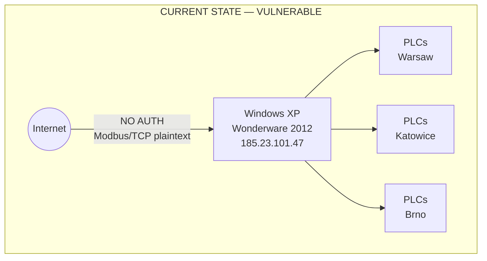

### Story Context

You've been at ForgeSense three weeks. The previous architect — a contractor named Dmitri Volkov — left abruptly six months ago. His documentation: three PowerPoint presentations dated 2017, a Confluence page titled "SCADA Notes - TODO: update this," and a sticky note on his old monitor that reads "ask Brent about the tunnel."

Brent retired eight months ago.

You're reviewing the network topology diagram trying to understand the on-premise footprint when you notice something. A server at IP `10.4.18.9` — labeled in the spreadsheet as "LEGACY-SCADA-01" — is not behind the corporate VPN. It has a direct internet-facing static IP: `185.23.101.47`.

You open a ticket with the network team.

---

**#infra-security** — Tuesday, 09:14

**@you**: Hey — quick question about 185.23.101.47. Is that supposed to be internet-facing?

**@Tomás Reyes** (Infra Lead): That's the SCADA box. Yeah it's always been like that. Dmitri set it up that way so the factory team could access it from home during COVID. Never got changed back.

**@you**: What authentication does it use?

**@Tomás Reyes**: 🤔 honestly I don't know. That's Dmitri's stuff. The factories know how to connect to it.

**@you**: Which factories?

**@Tomás Reyes**: Warsaw, Katowice, and the Brno plant. All three are running off it for their floor PLC coordination. It's the main SCADA for those sites.

---

You pull the access logs for `185.23.101.47`. The log format is unlike anything you've seen — plaintext, written by a custom script, timestamped in local Warsaw time with no timezone indicator.

You spend 45 minutes parsing it. Then you find the entries you didn't want to find.

```
2025-10-14 03:22:18 - CONNECT - 185.34.200.112 - SUCCESS
2025-10-14 03:22:31 - CMD: STATUS_ALL - 185.34.200.112
2025-10-14 03:22:44 - CMD: READ_PLC_MAP - 185.34.200.112
2025-10-14 03:25:01 - DISCONNECT - 185.34.200.112

2025-10-22 02:58:44 - CONNECT - 185.34.200.112 - SUCCESS
2025-10-22 02:58:57 - CMD: STATUS_ALL - 185.34.200.112
2025-10-22 02:59:12 - CMD: READ_PLC_MAP - 185.34.200.112
2025-10-22 02:59:28 - CMD: ENUMERATE_DEVICES - 185.34.200.112
2025-10-22 03:01:55 - DISCONNECT - 185.34.200.112
```

You run a WHOIS on `185.34.200.112`. The IP block is registered to a hosting provider in Minsk, Belarus.

You check the known factory IPs. Warsaw: `91.211.88.0/24`. Katowice: `91.211.89.0/24`. Brno: `85.162.114.0/24`.

`185.34.200.112` is none of these.

It's 10:47am. You escalate immediately.

---

**Slack DM — @you → @Miriam Osei (CISO)**

**@you**: Miriam — I need 15 minutes. I found something serious in the SCADA logs. External IP connected twice last month and ran enumeration commands. The SCADA box has no auth as far as I can tell and is directly internet-facing.

**@Miriam Osei**: I'll be there in 5.

---

The next two hours are a blur of calls. Miriam loops in the VP Engineering, Rafal Nowak. Rafal contacts the factory floor managers in Warsaw and Katowice. The discovery: the SCADA system is a Windows XP box, running Wonderware System Platform 2012, last patched in 2019. It coordinates PLCs across all three factories — motor speed controls, temperature regulation for the forging presses, safety interlock signaling.

It has no authentication layer. Dmitri implemented IP allowlist as the sole access control. Somewhere in the last six months, the allowlist was not updated when factory external IPs rotated.

You now have two simultaneous problems:
1. An active security incident: unknown actor has performed reconnaissance on live factory systems
2. A critical architecture gap: three live factories depend on a 15-year-old, unauthenticated, internet-exposed SCADA system that cannot be simply turned off

---

**#incident-bridge** — Tuesday, 11:03

**@Miriam Osei**: Declaring P1. We are treating the Belarusian IP accesses as hostile reconnaissance until proven otherwise. @you owns the technical investigation and migration planning. Goal: understand blast radius, contain exposure, design migration path that does NOT take factories offline.

**@Rafal Nowak**: Warsaw floor manager confirms all three factories are running normally. We do not have evidence of command injection — only reads. That does not mean we are safe.

**@you**: I'm going to need everything Dmitri left. Tomás, can you get me into the SCADA box console? And I need network topology for all three factory floors.

**@Tomás Reyes**: I can get you the credentials. Fair warning: the UI is... Wonderware 2012.

**@you**: I've seen worse. Probably.

---

The system you're now responsible for: a Wonderware SCADA running on Windows XP hardware, coordinating Siemens S7-300 PLCs at three factories across two countries. It was designed to be a local system and was never meant to face the internet. It does not support modern authentication protocols. The Modbus/TCP and OPC-DA interfaces it uses are unencrypted by design — these were industrial protocols from an era when "air gap" was the security model.

You have four deliverables to juggle simultaneously: understand what the external actor saw, contain the exposure immediately, design a migration path to a modern SCADA architecture, and brief the board before market open tomorrow.

The sticky note on Brent's old monitor is starting to make a lot more sense.

---

### Problem Statement

You have inherited a critically underdocumented SCADA system serving three live manufacturing facilities. The system is internet-exposed with no authentication, runs on end-of-life hardware and software, and has been accessed by what appears to be a hostile external actor performing reconnaissance. You cannot take the factories offline — production loss is $180K/hour across all three sites. You must simultaneously execute a security response and design a migration path from this legacy system to a secure, modern OT architecture.

### Explicit Requirements

1. Immediate containment: remove internet exposure without disrupting factory operations
2. Forensic investigation: determine the full scope of what the external actor accessed
3. Migration path: design zero-downtime migration from Windows XP Wonderware to modern OT architecture
4. Authentication and access control for the replacement system
5. Audit logging for all SCADA commands (who, what, when, from where)
6. Factory floor network segmentation (OT/IT network separation)
7. Board briefing document: timeline, risk assessment, remediation plan

### Hidden Requirements

- **Hint**: Re-read the access log entries carefully. The second session includes `ENUMERATE_DEVICES` — a command that maps the full PLC topology. What does an attacker do after they have the device map?
- **Hint**: Windows XP is no longer receiving security patches. What does this mean for the CVE exposure of the SCADA host itself, independent of the authentication issue?
- **Hint**: Tomás says "the UI is Wonderware 2012." Wonderware System Platform 2012 uses OPC-DA (not OPC-UA). What does an OPC-DA to OPC-UA migration require, and does it affect the PLC firmware?
- **Hint**: The log format is "written by a custom script." Who wrote that script? What happens if it's also exploitable?

### Constraints

- 3 live factories: Warsaw, Katowice (Poland), Brno (Czech Republic)
- Production downtime cost: $180K/hour across all three sites ($60K/hour each)
- SCADA hardware: Windows XP, 2009-era rack server (Wonderware System Platform 2012)
- PLCs: Siemens S7-300, firmware from 2011-2014
- Factory network connectivity: MPLS links between factories and HQ (not internet-routed)
- Zero-downtime constraint: factories run 24/7 (3 shifts), no planned downtime windows for 6 weeks
- Threat timeline: two external access events in the last month, most recent 3 weeks ago
- Team: 2 OT engineers (contracted, part-time), 1 security analyst (Miriam's team), you
- Budget: emergency security spend approved up to €150K; migration budget TBD pending board approval
- Regulatory: NIS2 Directive (EU critical infrastructure, applies to manufacturing above threshold)

### Your Task

Deliver both a security incident response plan (immediate actions, forensics, containment) and a zero-downtime migration architecture for the SCADA system. These must be coordinated — the migration cannot create new exposure windows while the active threat exists.

### Deliverables

- [ ] **Mermaid architecture diagram**: Current state (with vulnerabilities annotated) and target state (modern OT architecture)
- [ ] **Database schema**: SCADA command audit log table — every command sent to every PLC, with attribution, timestamp, source IP, and result
- [ ] **Scaling estimation**: Command volume per factory floor per day; log storage over 7-year retention horizon (NIS2 requirement); forensic log analysis compute cost
- [ ] **Tradeoff analysis** (minimum 3):
  - Emergency network isolation (immediate, disruptive) vs. managed IP allowlist lockdown (slower, safer)
  - Parallel-run migration (high cost, zero risk) vs. strangler fig per-factory (lower cost, sequenced risk)
  - OPC-DA to OPC-UA in-place upgrade vs. new SCADA platform alongside legacy
- [ ] **Cost modeling**: Emergency containment cost + parallel SCADA run cost + full migration cost ($X/month)
- [ ] **Security incident response timeline**: Hour-by-hour actions for the first 72 hours
- [ ] **Board briefing outline**: 1-page risk summary with remediation timeline

### Diagram Format

Mermaid syntax. Show two diagrams: (1) current state with vulnerability annotations, (2) target state with DMZ, jump server, mTLS OPC-UA bridge, network segmentation.


