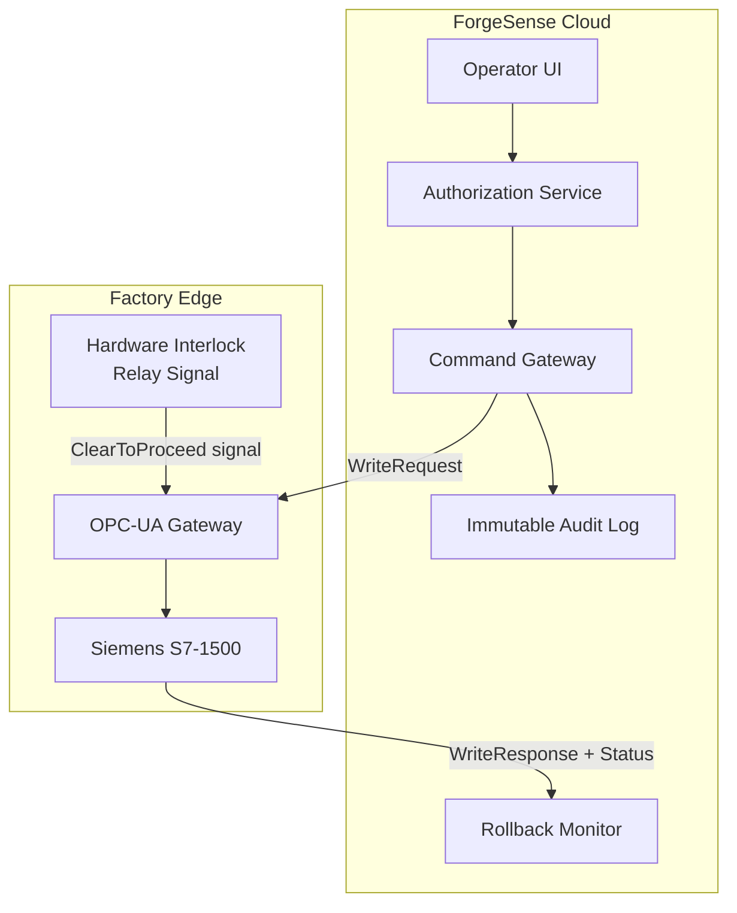

### Story Context

Two weeks after the SCADA containment. The immediate threat has been neutralized — the legacy system is now behind a VPN jump server with IP restrictions and MFA. The board approved €1.2M for the full migration. You've been building the integration architecture for three weeks: the ForgeSense cloud platform connecting to factory floor equipment via an OPC-UA gateway layer.

Today is the architecture review. Conference room 4B. Present: you, Rafal Nowak (VP Engineering), Helena Varga (CTO), Tomás Reyes (Infra Lead), and — surprise addition logged thirty minutes before the meeting — Benedikt Schreiber, VP of Enterprise Sales.

You did not know Benedikt would be in this meeting.

You open with the architecture diagram. The story you've been telling for three weeks: ForgeSense collects data from factory equipment, ingests it into the digital twin pipeline, enables predictive analytics and dashboards. The integration layer reads from equipment via OPC-UA. Read-only. Clean separation. No risk of a software bug in the cloud accidentally sending a command to a forging press.

You're four slides in when Benedikt raises his hand.

---

**Meeting transcript — Conference Room 4B, 14:22**

**Benedikt Schreiber**: Before we go further — I want to make sure I understand the architecture. This is read-only from the factory floor?

**You**: Correct. We pull telemetry. The OPC-UA gateway subscribes to data nodes on the PLCs and publishes to Kafka. Nothing writes back to equipment.

**Benedikt**: Right. Here's my concern. We closed the Volkswagen contract last week. €4.2M, three-year deal. I was in Wolfsburg on Friday. I had a very specific conversation with their head of manufacturing. They want — and this is in the contract — bidirectional control. Remote parameter adjustment, recipe management, setpoint writes.

*[Silence for three seconds.]*

**Helena Varga**: Benedikt, is that in the signed contract?

**Benedikt**: Page 47. Exhibit C. "Platform shall support remote parametric write operations to connected equipment subject to operator authorization." We signed it two weeks ago.

**Helena Varga**: [to you] Did you know about this?

**You**: No. This is the first I'm hearing of it.

**Benedikt**: I assumed the architecture supported it. ForgeSense is a platform company. Write operations are table stakes for the segment we're selling into.

**Helena Varga**: Okay. Let's not have that conversation right now. [to you] What would it take to support bidirectional control?

**You**: [pause] It's... a fundamentally different system. Read operations have no consequences if they fail. Write operations to factory equipment — a failed or incorrect command can stop a production line, damage equipment, or in the worst case, cause a safety incident. The authorization model, the audit trail, the rollback mechanism — all of it has to be built ground-up.

**Benedikt**: Can you do it?

**You**: We can build it. But I need to redo this entire design.

**Helena Varga**: How long?

**You**: Give me 72 hours to redesign and present a revised architecture.

**Rafal Nowak**: You have 48.

---

You leave the conference room. Your hands are slightly cold.

The problem is not the engineering — you can design a command dispatch system. The problem is what it means for equipment on a factory floor. A forging press operates at 1,200°C. The PLCs manage the press cycle, the cooling system, the safety interlocks that prevent the die from closing when a human hand is in the workspace. You're now being asked to send write commands to these systems over a cloud platform.

OPC-UA supports write operations — `WriteRequest` alongside `ReadRequest`. But the protocol support is the easy part. The hard part is:
- Authorization: who is allowed to send which commands to which equipment, and how do you verify this before the command executes?
- Command audit log: every write operation, immutable, with operator identity, timestamp, equipment ID, parameter changed, old value, new value, and outcome
- Rollback: if a setpoint write succeeds at the PLC but the equipment behaves unexpectedly, how do you revert?
- Safety interlocks: OSHA 1910.147 (lockout/tagout) equivalent in software — certain commands must be physically confirmed at the machine before remote execution is allowed
- Latency: the Volkswagen contract specifies sub-2s acknowledgment for parameter writes; your cloud-to-factory round-trip is currently 180ms average, 420ms p99

You also have a second meeting in 48 hours with Helena and Benedikt. Benedikt will be cheerful. Helena will be watching you carefully. Rafal will say very little, but everything he says will matter.

---

**Slack DM — @Marcus Webb → @you** *(10:47pm)*

**Marcus**: Heard you got ambushed today. Sales signed a contract your architecture can't fulfill?

**You**: Something like that. Bidirectional control to factory equipment. I designed read-only.

**Marcus**: I've seen this exact scenario three times. Once in power grid control systems, once in a semiconductor fab, once in a building automation company. You know what they all had in common?

**You**: They all figured it out?

**Marcus**: One of them did. The other two had "incidents." The one that figured it out treated the command channel as a separate system with separate threat modeling, separate authorization, and a hardware-enforced safety layer that the software could not override. The software was not the last line of defense.

**You**: What does hardware-enforced mean in this context?

**Marcus**: That's the right question. Now go sleep and answer it tomorrow.

---

### Problem Statement

ForgeSense must extend its factory integration architecture to support bidirectional control — sending write commands to factory equipment via OPC-UA. The original read-only design must be extended (not replaced) with a command dispatch layer that includes operator authorization, immutable command audit logging, rollback on failure, and integration with physical safety interlocks that cannot be bypassed by software. The Volkswagen contract specifies sub-2s write acknowledgment.

### Explicit Requirements

1. OPC-UA `WriteRequest` support for parametric adjustments (setpoints, recipe parameters, speed limits)
2. Operator authorization: role-based, per-equipment, per-command-type, time-bounded sessions
3. Immutable command audit log: every write operation logged with identity, timestamp, target PLC, node ID, old value, new value, outcome
4. Command rollback: automatic revert if equipment status indicates unexpected behavior within 30 seconds of write
5. Safety interlock integration: certain command classes require physical "clear to proceed" signal from equipment before remote execution
6. Sub-2s acknowledgment SLA (Volkswagen contract requirement)
7. Command dry-run mode: validate command against equipment capability without executing

### Hidden Requirements

- **Hint**: Marcus says "the software could not override" the hardware safety layer. OPC-UA has a concept of `StatusCode` on write responses. What happens if the PLC accepts the write but the interlock hardware prevents execution? How does your system know the difference between "write accepted" and "command executed safely"?
- **Hint**: Benedikt says "recipe management." A recipe is not a single setpoint — it's a coordinated sequence of parameter changes across multiple PLCs that must be applied atomically or rolled back entirely. What does "rollback" mean for a multi-PLC recipe?
- **Hint**: The VW contract says "operator authorization." In manufacturing, operators work in shifts. A shift change mid-recipe is a real scenario. What happens to an in-progress recipe when the authorizing operator's shift ends?
- **Hint**: Re-read Marcus's message about "three times." The two that had incidents — what type of incidents does inadequate command authorization cause in industrial environments?

### Constraints

- OPC-UA write operations target Siemens S7-1500 PLCs (VW Wolfsburg), Allen-Bradley ControlLogix (other factories)
- Round-trip latency: cloud-to-factory 180ms average, 420ms p99 via MPLS
- Sub-2s acknowledgment SLA (from operator UI action to `WriteResponse` received)
- Safety interlock: hardware relay signal (digital input on gateway machine), cannot be software-simulated
- Command volume: ~500 write operations/day across all factories (low volume, high criticality)
- Audit log retention: 10 years (EU machinery directive, product liability)
- Authorization model: 3 roles — Operator (limited setpoints), Process Engineer (full recipe access), Safety Engineer (interlock bypass, emergency only)
- Rollback window: 30 seconds post-write before automatic rollback assessment
- PLC firmware constraints: S7-1500 supports OPC-UA write natively; ControlLogix requires EtherNet/IP-OPC-UA bridge (adds 40ms latency)
- Team: you + 2 OT engineers, 48-hour window

### Your Task

Redesign the ForgeSense integration architecture to support bidirectional control while preserving the read telemetry path. Design the complete command dispatch system including authorization, audit logging, safety interlock integration, rollback, and multi-PLC recipe atomicity. Present the revised architecture in 48 hours.

### Deliverables

- [ ] **Mermaid architecture diagram**: Read path (unchanged) + Command dispatch layer (new) with authorization service, command gateway, audit log, interlock integration
- [ ] **Database schema**: Command audit log table, authorization session table, recipe execution table (with column types and indexes)
- [ ] **Scaling estimation**: 500 write ops/day × 10-year retention = storage; audit log write throughput; rollback assessment latency budget
- [ ] **Tradeoff analysis** (minimum 3):
  - Synchronous command confirmation (operator waits for full execution confirmation) vs. async with webhook callback (better UX, harder audit)
  - Hardware interlock as hard gate (command blocked until cleared) vs. soft advisory (operator proceeds at own risk with additional confirmation)
  - Multi-PLC recipe as distributed transaction (2PC) vs. saga with compensating commands (rollback individual PLCs sequentially)
- [ ] **Cost modeling**: Gateway infrastructure + audit log storage + authorization service ($X/month)
- [ ] **Safety design doc**: 1-page threat model for the command channel — what happens if the command gateway is compromised?

### Diagram Format

Mermaid syntax. Clearly separate the read telemetry path from the command dispatch path. Show the safety interlock gate as a distinct component.

