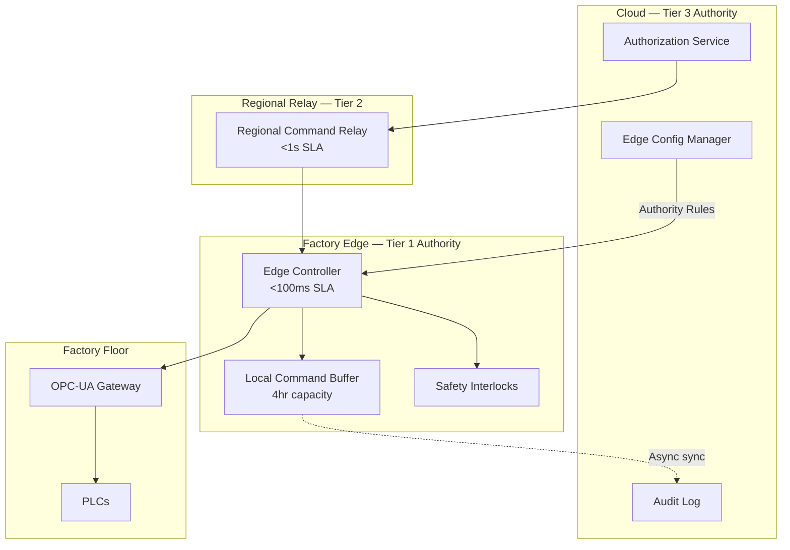

### Story Context

The Volkswagen contract is live. Bidirectional control is deployed across two of the four Wolfsburg lines. The read telemetry path is running cleanly — 12,000 metrics per second from 847 OPC-UA nodes across the factory floor.

Then the email arrives.

---

**Email chain**

**From**: Klaus Hoffmann, Head of Manufacturing Systems, Volkswagen Wolfsburg
**To**: Helena Varga, CTO, ForgeSense
**CC**: you, Rafal Nowak, Benedikt Schreiber
**Subject**: CRITICAL: ForgeSense Latency — Production Impact, Line 3

Helena,

I need to raise a serious problem before our next steering committee meeting.

Last Thursday (March 12), our precision welding operation on Line 3 experienced a safety deviation. The ForgeSense platform issued a "stop current pulse" command to the Lincoln Electric Power Wave welder at 14:22:07. The command was acknowledged by your system at 14:22:07.412. The welder received the command at 14:22:07.841.

The total cloud-to-actuator latency was **841 milliseconds**.

The precision welding cycle for this component has a **200ms control window**. This is not a preference — it is a physical constraint. The weld pool solidification time determines whether we get a Grade A joint or a reject. Once the window closes, a "stop" command is irrelevant. The weld has already been made incorrectly.

We are attaching a video file from our line camera. You can see the moment the command arrived versus the moment it would have needed to arrive.

This is the third occurrence this month. We have been generous in not raising this in writing until now.

If ForgeSense cannot deliver sub-200ms command execution for safety-critical operations, we need to discuss a redesign of the integration model — or the terms of the contract.

With respect,
Klaus Hoffmann

---

**Re: CRITICAL: ForgeSense Latency — Production Impact, Line 3**

**From**: Helena Varga
**To**: Klaus Hoffmann
**CC**: you, Rafal Nowak, Benedikt Schreiber
**Subject**: Re: CRITICAL: ForgeSense Latency — Production Impact, Line 3

Klaus,

Thank you for raising this directly. I've looped in our lead architect. We take this seriously and will have a root cause analysis and proposed solution architecture within 5 business days.

Helena

---

**Slack DM — @Helena Varga → @you** *(immediately after)*

**Helena**: Did you read that email?

**You**: Yes. Just opened it.

**Helena**: 841ms. We promised sub-2s acknowledgment. Acknowledgment, not execution. But that's semantics now — their use case requires sub-200ms execution at the actuator.

**You**: Our p99 RTT to their factory via MPLS is 420ms. Even if we had zero processing latency, we cannot do sub-200ms from cloud.

**Helena**: I know. What do we do?

**You**: We move the control logic to the edge. The cloud is too far away for safety-critical operations. But then we have three different control planes — cloud, edge, and PLC — and we have to define which one is authoritative for what.

**Helena**: Can we do that?

**You**: We can. But it's a fundamental architectural shift. Some commands need to run locally. Others can run from cloud. We need a latency-tiered command hierarchy.

**Helena**: How long?

**You**: To design: one week. To build and test: two months on the current lines before we roll out to others.

**Helena**: You have the week to design. Present to me and Klaus together.

---

You look at the video attachment Klaus sent. The weld goes in at the 180ms mark. The ForgeSense "stop" command arrives 841ms later. You can see the control room indicator turn yellow when the command arrives — the system correctly registers that the command was late. The weld joint would be a reject.

The problem is architectural. Every command in the current design travels:

`Operator UI → Cloud → Command Gateway → VPN → Factory Edge → OPC-UA Gateway → PLC → Actuator`

At minimum: 180ms cloud processing + 420ms MPLS round trip + 80ms OPC-UA gateway processing = 680ms before any actuator receives anything. On a good day. The p99 is well over 800ms.

The VW welding process has three command types:

1. **Safety-critical commands** (< 100ms to actuator): "Stop current pulse," "Emergency halt," "Abort cycle." These cannot wait for cloud round-trip. Must execute locally.
2. **Process commands** (< 1s to actuator): "Adjust wire feed speed," "Change voltage setpoint," "Update shield gas flow." These can tolerate one MPLS round-trip but no more.
3. **Recipe commands** (< 10s to actuator): "Load weld program 47B," "Update batch parameters." These can route through cloud with full authorization and audit.

The insight Marcus gave you: "The software is not the last line of defense." For Tier 1 commands, the edge must be the first line of execution — not a relay to the cloud.

But this creates a distributed control plane. If the edge gateway makes safety decisions autonomously, and the cloud also has a command interface, you can have conflicts. A process engineer in Hamburg sends a "reduce current" command at the same time the local edge safety controller fires a "halt cycle." Who wins?

You sketch three words on the whiteboard: **Authority. Override. Reconciliation.**

---

**Slack DM — @you → @Marcus Webb** *(Tuesday, 23:14)*

**You**: Question. In a hierarchical control system, who has final authority — edge or cloud?

**Marcus**: Wrong question. Ask: "Which layer owns which class of decisions?" Safety decisions are never made from the slowest, most failure-prone layer of your stack.

**You**: So edge is sovereign for safety-critical commands.

**Marcus**: Edge is sovereign for time-critical commands. Safety-critical is a subset. There's also time-critical commands that aren't about safety. Don't conflate them.

**You**: How do you handle conflicts between edge and cloud authority?

**Marcus**: You define pre-emption rules. Cloud can schedule. Edge can execute or veto based on real-time sensor state. Edge never waits for cloud permission to halt something dangerous. Cloud never issues a command the edge considers unsafe. These are not negotiated in real time — they're configured in advance.

**You**: And if the edge disconnects from cloud?

**Marcus**: That's your exam question. Think carefully.

---

### Problem Statement

ForgeSense must redesign its command dispatch architecture to support three latency tiers: sub-100ms (safety-critical, executed at edge), sub-1s (process commands, single MPLS round-trip), and sub-10s (recipe commands, full cloud authorization). The current architecture routes all commands through cloud, making Tier 1 and Tier 2 commands physically impossible to deliver within their SLAs. The new architecture must define clear authority boundaries between edge, factory gateway, and cloud — and handle the case where edge loses connectivity to cloud.

### Explicit Requirements

1. Three latency tiers: Tier 1 (< 100ms actuator), Tier 2 (< 1s), Tier 3 (< 10s)
2. Tier 1 commands execute at edge without cloud round-trip
3. Tier 2 commands: one MPLS hop to nearest regional node, not full cloud
4. Tier 3 commands: full cloud authorization, audit, multi-PLC recipe support
5. Edge autonomy: Tier 1 must function during cloud disconnect
6. No command conflicts between edge and cloud control planes
7. All commands (even Tier 1) logged to immutable audit trail (async for Tier 1, sync for Tier 3)
8. Edge configuration managed from cloud: authority rules, interlock thresholds, pre-emption policy

### Hidden Requirements

- **Hint**: Klaus says "safety deviation" — not just a latency problem. Under EU Machinery Directive 2006/42/EC, safety functions must be designed to a specific Safety Integrity Level (SIL). What SIL level is required for a system that controls a welding operation, and what does that mean for edge software design?
- **Hint**: Marcus says "if the edge disconnects from cloud — think carefully." Edge disconnection means: Tier 1 runs fine, but Tier 3 authorization is offline. What happens to an in-progress recipe that requires cloud authorization mid-execution during a disconnect?
- **Hint**: Tier 1 commands execute without cloud authorization. What prevents a compromised edge gateway from firing Tier 1 commands maliciously? (The SCADA security incident from Ch. 205 is relevant here.)
- **Hint**: The video shows the weld control at 180ms — which is inside the 200ms window. But ForgeSense's command arrives at 841ms. What is ForgeSense's value proposition for Tier 1 commands if the edge is making decisions locally?

### Constraints

- Cloud-to-factory latency: 180ms average, 420ms p99 (MPLS)
- Edge hardware: industrial PC at each factory — 16-core Intel Xeon, 32GB RAM, NVMe, no GPU
- Edge-to-PLC: OPC-UA via industrial Ethernet, 2ms round-trip (in-plant)
- Tier 1 budget: < 100ms total (edge processing + OPC-UA + actuator response)
- Tier 2 budget: < 1s (edge processing + 1x MPLS hop to regional relay + OPC-UA)
- Tier 3 budget: < 10s (full cloud routing + multi-PLC coordination)
- Command volume: ~50 Tier 1/day, ~300 Tier 2/day, ~150 Tier 3/day per factory
- Factories: 4 (Wolfsburg VW + 3 others), each with 1 edge gateway
- Edge disconnect frequency: ~2 per month (MPLS maintenance windows), max 4-hour duration
- VW contract SLA: Tier 1 at 99.99% within 100ms; penalties apply from first breach
- Audit log sync: Tier 1 logs must reach cloud within 60 seconds of execution

### Your Task

Design the hierarchical edge-cloud control architecture for ForgeSense. Define the authority model (which layer owns which tier), the conflict resolution protocol, the disconnected-edge behavior, and the audit log sync mechanism. Present to Helena Varga and Klaus Hoffmann as a joint architecture review.

### Deliverables

- [ ] **Mermaid architecture diagram**: Three-tier control hierarchy (cloud, regional relay, edge) with command routing per tier and audit log async path
- [ ] **Database schema**: Edge command log (append-only, synced to cloud), edge configuration table (authority rules, pre-emption policies), cloud-side reconciliation log
- [ ] **Scaling estimation**: Show math: 500 commands/day × 4 factories × 10-year audit retention; Tier 1 processing latency budget breakdown (100ms across 5 hops — allocate each); edge storage sizing for 4-hour disconnect buffer
- [ ] **Tradeoff analysis** (minimum 3):
  - Edge-autonomous Tier 1 (lower latency, harder audit) vs. pre-authorized command cache (edge executes pre-approved commands with cloud token, better audit)
  - Single regional relay vs. cloud-direct for Tier 2 (latency vs. infrastructure cost)
  - Optimistic conflict resolution (edge executes, cloud reconciles) vs. pessimistic (cloud lock before edge executes)
- [ ] **Cost modeling**: Edge infrastructure per factory + regional relay + audit log storage ($X/month for 4 factories)
- [ ] **SIL design note**: 1-paragraph assessment — what Safety Integrity Level does this control system need, and what are the software design implications?

### Diagram Format

Mermaid syntax. Show the three layers. Show Tier 1 command path (stays at edge), Tier 2 path (edge → regional relay), Tier 3 path (edge → cloud). Show audit log async sync path.

