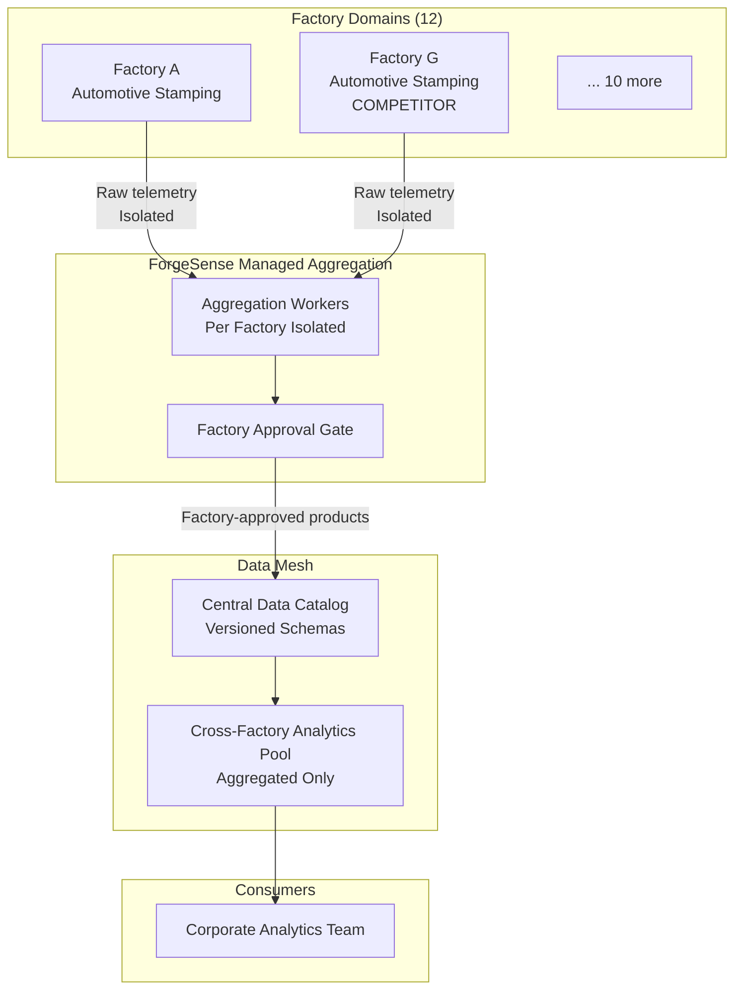

### Story Context

ForgeSense has 12 customer factories on the platform. The original sales pitch was simple: "We make your factory smarter." But three months ago, the corporate analytics team at headquarters — a separate business unit that reports to the CFO, not to any factory — made a request that is now sitting in your Jira backlog and climbing in priority.

---

**Email chain**

**From**: Nora Blackwood, Head of Supply Chain Analytics, ForgeSense Corporate
**To**: you, Rafal Nowak
**Subject**: Cross-factory analytics access — Q2 initiative

Hi,

I'm reaching out from the corporate analytics team. Our VP Supply Chain has committed to the board that we'll have a cross-factory optimization model ready for Q2. The model needs production rate data, equipment utilization, downtime reasons, and cycle time per product family across all 12 factories.

I've spoken to the data engineering team and they've confirmed the data exists in ForgeSense's data lake. Can we get access?

Thanks,
Nora

---

**Reply**

**From**: you
**To**: Nora Blackwood, Rafal Nowak
**Subject**: Re: Cross-factory analytics access — Q2 initiative

Nora,

Thanks for reaching out. Before I grant access to the data lake, I need to understand the ownership model. These 12 factories are our customers — some of them are direct competitors. Factory A and Factory G both manufacture automotive stampings. Their raw production rates are commercially sensitive.

Can we set up a call to discuss what data products the analytics model actually needs, and design something where the factories own and govern their own data?

---

**Reply**

**From**: Nora Blackwood
**To**: you, Rafal Nowak
**Subject**: Re: Cross-factory analytics access — Q2 initiative

I understand the concern but I'm not sure "data products" are in scope for this timeline. The model needs raw data for training. Can we just restrict access to the analytics team only?

---

**Reply**

**From**: Rafal Nowak
**To**: Nora Blackwood, you
**Subject**: Re: Cross-factory analytics access — Q2 initiative

Nora, I've asked our lead architect to drive this. We need to get this right — if one of our factory customers discovers their raw production data was shared with a competitor, we lose the contract. Let's find the right design.

---

The call with Nora is scheduled for Thursday. You have until then to design the data mesh architecture that makes her model possible without sharing raw factory data between competitors.

You pull up the list of 12 factories. You recognize the names. Three of them — Wrocław Stamping, Bratislava Presswerk, and Nord-Stanz GmbH — all make automotive door panels. They are direct market competitors. They know each other's names but have never compared production rates. Their data lives in the same ForgeSense data lake partition with the same schema.

If Nora's team queries the raw data, they see which factory is running faster, which is having more downtime, which is running cheaper per cycle. That information would be worth millions to the right buyer. Or the right competitor.

---

**#architecture-discussion** — Wednesday, 15:33

**@you**: Okay, I've been thinking about the Nora request. Here's the problem: the corporate model needs cross-factory signals, but the factories can't share raw data. The answer is data products — each factory publishes aggregated, governed outputs. The analytics team queries those, not the raw telemetry.

**@Tomás Reyes**: But won't the factories push back on defining data products? They don't have data engineers.

**@you**: That's the governance question. ForgeSense defines the schema contract. The factory approves which metrics to include. We do the aggregation on their behalf in an isolated compute environment. They sign off on the aggregated output before it enters the cross-factory pool.

**@Tomás Reyes**: And if a factory refuses to publish certain metrics?

**@you**: Then the corporate model doesn't have that signal. That's the factory's right. We don't override it.

**@Tomás Reyes**: Nora is going to hate this.

**@you**: Nora needs a model that works. An architecture that exposes raw competitive data to the analytics team is a time bomb. One leak and we lose three contracts in the same week.

---

**Slack DM — @you → @Marcus Webb** *(Wednesday, 21:18)*

**You**: Working on a data mesh problem. 12 factories, shared platform, competitive sensitivity. Classic data product architecture — but the factories don't have data engineering teams. How do you handle domain ownership when the domain doesn't want to own anything?

**Marcus**: Data mesh isn't an org structure — it's a contract structure. The factory doesn't need to write pipelines. They need to sign the contract that says "my domain publishes this. This is what it means. This is the SLA." ForgeSense can operate the pipes on their behalf. That's not a violation of domain ownership. That's a managed data product.

**You**: And the federation layer? Central catalog or distributed?

**Marcus**: Central catalog, federated governance. You need somewhere for Nora's team to discover what's available. But the approval for what goes into that catalog has to come from the factory. You can't have corporate analytics overriding factory decisions about what they publish. That's the whole point.

**You**: Makes sense. What do you do when a factory changes their production process and the data product contract breaks?

**Marcus**: Versioned contracts. Same as API versioning. The analytics team subscribes to a version. Factory can release v2. v1 stays live until consumers migrate. Sound familiar?

**You**: Feels like every problem is really an API versioning problem.

**Marcus**: Most problems are. Good night.

---

### Problem Statement

ForgeSense must build a data mesh architecture spanning 12 factory domains. Each factory owns its operational data and must approve what enters the cross-factory analytics pool. The corporate analytics team needs cross-factory signals (production rates, equipment utilization, downtime, cycle time per product family) to train a supply chain optimization model. Factories that are direct competitors must not see each other's raw data. ForgeSense must operate the data product pipelines on behalf of factories that lack data engineering teams, without violating the domain ownership principle.

### Explicit Requirements

1. Each factory is a data domain with ownership over its data product definitions
2. Data products are aggregated, governed outputs — not raw telemetry
3. Factory must approve data product schema and content before it enters the cross-factory pool
4. Competing factories cannot see each other's individual raw data or identify-able production rates
5. Central data catalog: analytics team discovers available data products and their schemas
6. Versioned data product contracts: factories can release new versions without breaking consumers
7. ForgeSense operates aggregation pipelines on factory behalf (managed data products)
8. Audit trail: who queried which data product, when, with what purpose

### Hidden Requirements

- **Hint**: Re-read Nora's message: "The model needs raw data for training." A supply chain optimization model trained on aggregated data may have lower accuracy than one trained on raw data. What design choice do you make when a customer explicitly wants raw data that you've determined is unsafe to share?
- **Hint**: Three factories make automotive door panels and are direct competitors. What happens when the corporate analytics model trains on their aggregated data and produces a recommendation that disproportionately benefits one of them? Who owns the model output?
- **Hint**: Tomás asks "what if a factory refuses to publish certain metrics?" Think about what happens to the corporate model's accuracy if 3 of 12 factories opt out of the downtime signal. The model is trained on 9 factories and deployed across 12. What does this do to model predictions for the opted-out factories?
- **Hint**: Marcus says "versioned contracts." A factory upgrades equipment and their cycle time metric changes definition (now includes changeover time; previously didn't). How do you handle historical data comparability across this definition change?

### Constraints

- 12 factory domains, 3 pairs of direct competitors (within the 12)
- Data types: production rate (parts/hour), equipment utilization (%), downtime events (category + duration), cycle time (seconds/part), product family SKU codes
- Aggregation time bucket: minimum 1-hour granularity in published data products (prevents reverse-engineering of individual shift data)
- Data lake: existing AWS S3/Athena-based lake, partitioned by factory and date
- Corporate analytics team: 4 data scientists, SQL + Python, no streaming — they need batch exports
- Data product refresh cadence: hourly (near-real-time for operational signals), daily (for cost and quality signals)
- Analytics query volume: 10-20 queries/day during model training, 2-3/day in steady state
- Cross-factory pool storage: estimated 50GB/year (aggregated data is small)
- Factory approval workflow: factory ops manager signs off on data product schema; automated email approval gate
- Data product contract SLA: 99.5% availability, 4-hour max lag from event to published product
- Team: you + 1 data engineer, 6-week build timeline

### Your Task

Design the ForgeSense data mesh architecture. Define the data product schema contract, the aggregation pipeline (managed by ForgeSense on factory behalf), the central catalog, the cross-factory analytics pool, and the versioning strategy. Present to Nora Blackwood and the factory operations managers simultaneously — the design must satisfy both audiences.

### Deliverables

- [ ] **Mermaid architecture diagram**: Factory domain layer → aggregation pipeline (ForgeSense-managed) → data product catalog → cross-factory analytics pool → corporate model
- [ ] **Database schema**: Data product catalog table (domain, product name, version, schema, SLA, approval status), data product subscription table (consumer, product, version, purpose), aggregated metrics table (per factory, time-bucketed, approved fields only)
- [ ] **Scaling estimation**: 12 factories × hourly aggregation × 10 metrics = storage/year; query volume; aggregation compute cost; catalog query latency at 20 concurrent data scientists
- [ ] **Tradeoff analysis** (minimum 3):
  - 1-hour aggregation granularity (prevents reverse-engineering, lower utility) vs. 15-minute granularity (higher utility, higher risk of competitive inference)
  - Central aggregation engine (simpler, ForgeSense as single point of control) vs. per-factory aggregation workers (domain ownership, but harder to operate for factories without engineers)
  - Append-only data product versioning (analytics team gets full history per version) vs. snapshot versioning (analytics team always sees current, historical queries require version pinning)
- [ ] **Cost modeling**: Aggregation compute + catalog infrastructure + cross-factory pool storage ($X/month for 12 factories)
- [ ] **Governance document**: 1-page data product contract template that a factory operations manager can read, understand, and sign in under 5 minutes

### Diagram Format

Mermaid syntax. Show all 12 factory domains as separate nodes (group competitors visually). Show aggregation pipeline layer. Show catalog. Show the analytics team as the consumer.

