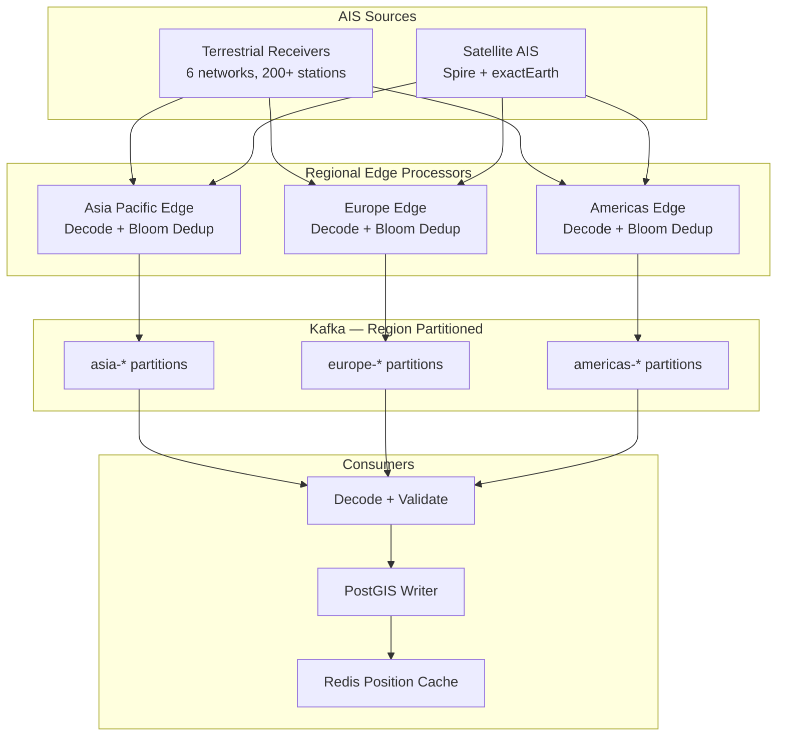

### Story Context

Day two. Erik drops you into the deep end — the AIS ingestion pipeline. The runbook says: "Messages occasionally lost during peak periods. Known issue. Restart the consumer if lag exceeds 500K messages." You read this twice. The first time to understand it. The second time to appreciate the audacity of documenting a known data loss as acceptable behavior.

AIS — the Automatic Identification System — is the heartbeat of maritime traffic. Every commercial vessel over 300 gross tons, every passenger vessel, and most fishing vessels over 15m are legally required to transmit AIS signals. The signals contain position (lat/long, accuracy ~10m), speed over ground, course over ground, heading, vessel identity (MMSI), vessel name, IMO number, destination, and estimated time of arrival.

The problem is geography. Vessels don't distribute themselves uniformly across the world's oceans.

---

**#engineering-data** — Day 3, 09:17 Bergen time

**@Erik Solberg** (VP Engineering): @you — pulled the message loss logs from last week. Take a look when you're set up.

**@you**: Looking now. This is the Singapore Strait data?

**@Erik**: Yes. Every Thursday 06:00-10:00 UTC we see message loss in the 15-25% range. The Strait is one of the busiest shipping lanes on Earth. ~1,000 vessels/day through a corridor 2.8km wide at the narrowest point.

**@you**: How many terrestrial AIS receivers are covering that area?

**@Erik**: Two. One at Raffles Lighthouse, one at Changi. Neither of us owns them — we're licensed consumers of the feed from MarineTraffic.

**@you**: And satellite AIS?

**@Erik**: We have Spire satellite coverage for that region. But satellite AIS has a problem in dense traffic — when too many vessels transmit on the same frequency simultaneously, the satellite receiver can't decode them. It's called collision. Peak collision rate in the Singapore Strait during morning traffic: ~30%.

**@you**: So during peak traffic we have: terrestrial AIS losing messages because our ingestion can't keep up, and satellite AIS losing messages because of radio frequency collision.

**@Erik**: That's the summary, yes.

**@you**: What's the current Kafka topic partition count for the AIS feed?

**@Erik**: 12.

**@you**: And message rate during Singapore Strait peak?

**@Erik**: We measured 98,000 messages/minute at peak last Thursday. That's 1,633 messages/second. Through 12 partitions that's 136 messages/second per partition.

**@you**: What's our consumer lag alarm threshold?

**@Erik**: 500,000 messages.

**@you**: At 1,633 msg/sec inbound, 500K lag is 306 seconds. That's 5 minutes of data. For live vessel tracking, that means ships in the Singapore Strait are showing positions 5 minutes old. In a 2.8km corridor with vessels traveling at 14 knots — that's a 600-meter position error.

**@Erik**: When you put it that way it sounds bad.

**@you**: It is bad. Someone is routing ships with 600-meter position errors in the world's most congested shipping lane.

*[Silence in the channel for 12 seconds.]*

**@Erik**: Fix it.

---

You spend the rest of the day understanding the architecture. The current pipeline:

`AIS Sources (terrestrial receivers + satellites)` → `NMEA/AIS decoder service` → `Kafka (12 partitions, keyed by MMSI)` → `Position update consumers (3 instances)` → `PostGIS` + `Redis (current vessel positions)`

The partition key is MMSI (9-digit vessel identifier). This creates a fundamental problem: MMSI is uniform across all vessels globally, but vessel density is not uniform. During Singapore Strait peak, 1,000+ vessels in a tiny geographic area are all transmitting — and their MMSI keys are distributed across all 12 partitions. Every partition is receiving Singapore traffic. There's no way to isolate the hotspot.

You call Dr. Adaeze Obi. She's in Singapore for a conference.

---

**Phone call — Day 3, 14:22 Bergen / 21:22 Singapore**

**Dr. Adaeze Obi**: I've been waiting for someone to call about the Singapore problem. Dmitri — I mean, the previous team — tried adding more partitions twice. It didn't help. Why do you think that is?

**You**: Because the bottleneck isn't the partition count. It's the consumer processing rate. We're decoding NMEA sentences, validating, deduplicating, and writing to PostGIS in the same consumer loop.

**Dr. Adaeze**: Yes. And what's the deduplication doing?

**You**: Checking if we've seen this MMSI in the last 10 seconds. Redis lookup. If we have, and the position delta is less than 50 meters, we drop the message as a likely duplicate.

**Dr. Adaeze**: How long does that Redis lookup take at peak?

**You**: I'd need to check. Probably 2-5ms under normal load. Under peak... I don't know.

**Dr. Adaeze**: The Redis cluster is in Frankfurt. Singapore AIS receivers are feeding directly to Bergen. The deduplication Redis lookup is Bergen → Frankfurt → Bergen for every message. At 1,633 messages per second.

**You**: ...that's the bottleneck.

**Dr. Adaeze**: The ocean teaches you where the latency is. I'll send you a diagram I drew on the plane. It's a bit rough but the insight is there.

---

The diagram arrives 40 minutes later. A photograph of a paper napkin, sketched in pencil. It shows the AIS signal path from the Singapore Strait, with latency annotations for each hop. At the bottom, circled twice: "DEDUP MUST BE LOCAL."

---

### Problem Statement

DeepOcean's AIS ingestion pipeline loses 15-25% of messages during Singapore Strait peak traffic (1,633 messages/second for 4 hours, Thursday mornings). The root cause is a combination of: insufficient partition count relative to peak volume, a remote Redis deduplication lookup that creates 20-30ms latency per message, and consumer processing (NMEA decode + PostGIS write) in the same loop. The redesigned pipeline must handle peak load without message loss, with geographic partitioning that isolates hotspots, and local (edge) deduplication before the Kafka write.

### Explicit Requirements

1. Handle 100,000 msg/sec peak (global ceiling, not just Singapore)
2. Geographic partitioning: route messages by ocean region, not by MMSI
3. Local deduplication: dedup before Kafka, not in consumers (eliminate remote Redis round-trip)
4. Consumer lag alarm threshold: < 30 seconds of data at peak rate
5. Satellite vs. terrestrial source differentiation: same vessel may appear in both with different accuracy
6. Position accuracy metadata: each stored position must record whether source was satellite, terrestrial, or both-merged
7. Data completeness monitoring: per-region message loss rate, alertable
8. Historical replay capability: ability to replay last 7 days of AIS for backfill

### Hidden Requirements

- **Hint**: Erik says "two terrestrial receivers" for Singapore. AIS on Class A transponders transmits on two frequencies (161.975 MHz and 162.025 MHz) alternating. A single terrestrial receiver with one antenna can decode both, but receiver sensitivity degrades with distance. What does this mean for vessel coverage near the edges of each receiver's range?
- **Hint**: Dr. Adaeze's diagram says "DEDUP MUST BE LOCAL." Deduplication at the ingestion edge means deduplication state can't be shared across edge nodes without remote calls. What happens when the same vessel signal is received by two different terrestrial receivers and both edge nodes independently accept it as non-duplicate?
- **Hint**: The current MMSI partition key creates the hotspot problem. But geographic partitioning by ocean region creates a new risk: what happens to the Kafka consumer group when a region partition becomes a hotspot? Can you rebalance without restarting consumers?
- **Hint**: Re-read: "every Thursday 06:00-10:00 UTC." This is Singapore morning rush hour for merchant shipping. Is this a random peak or a predictable one? What does predictability enable?

### Constraints

- Current AIS feed: 20,000 msg/sec steady-state global, 100,000 msg/sec design ceiling
- Singapore Strait peak: 98,000 msg/min measured = ~1,633 msg/sec
- AIS source types: 6 terrestrial receiver networks (licensed), 2 satellite AIS providers (Spire, exactEarth)
- Satellite AIS collision rate in dense traffic: 25-35%
- Deduplication window: 10 seconds per vessel (industry standard for AIS processing)
- Message size: AIS NMEA sentence ~82 ASCII characters; decoded JSON ~400 bytes
- Kafka cluster: 3-broker, AWS MSK, current 12 partitions
- PostGIS: AWS RDS PostgreSQL + PostGIS, current 4TB SSD, 16-core, 64GB RAM
- Redis for current vessel positions: AWS ElastiCache, eu-central-1 (Frankfurt) — this is the problem
- Consumer instances: 3 (single-threaded), AWS ECS Fargate
- Vessel position table: 100K vessels × latest position = 100K rows; historical positions = 50B rows/year
- Budget: $8K/month current infra; approved to $15K/month for redesign

### Your Task

Redesign the AIS ingestion pipeline to eliminate message loss during Singapore Strait peaks. Design the geographic partitioning scheme, the edge deduplication architecture, and the consumer separation (decode vs. store). Provide a monitoring design for per-region completeness.

### Deliverables

- [ ] **Mermaid architecture diagram**: Ingestion edge (per source), geographic router, Kafka (region-partitioned), consumer pipeline (decode + dedup + store separated), PostGIS + Redis position cache
- [ ] **Database schema**: AIS position record schema (with source type, accuracy, geometry type, indexes), vessel registry cache schema, completeness monitoring table (per region, per time bucket, expected vs. received count)
- [ ] **Scaling estimation**: Show math — 100K msg/sec × 400 bytes = 40MB/sec inbound; Kafka partition sizing (target 10K msg/sec/partition); PostGIS write rate; consumer throughput per instance; 7-day replay storage
- [ ] **Tradeoff analysis** (minimum 3):
  - Geographic vs. MMSI partitioning (hotspot isolation vs. vessel-consistent ordering)
  - In-process bloom filter dedup (memory, no remote call) vs. Redis dedup (accurate, remote latency)
  - Satellite + terrestrial merge at ingestion (single record, higher accuracy) vs. separate tables (preserves source data, more complex queries)
- [ ] **Cost modeling**: New Kafka partition count + consumer instance count + PostGIS read replica for analytics + edge dedup memory ($X/month)
- [ ] **Completeness monitoring design**: How do you know how many messages you *should* have received from a region? What's your ground truth for completeness measurement?

### Diagram Format

Mermaid syntax. Show source types (terrestrial, satellite) feeding into regional edge processors, then into partitioned Kafka, then into separated decode/store consumers.

