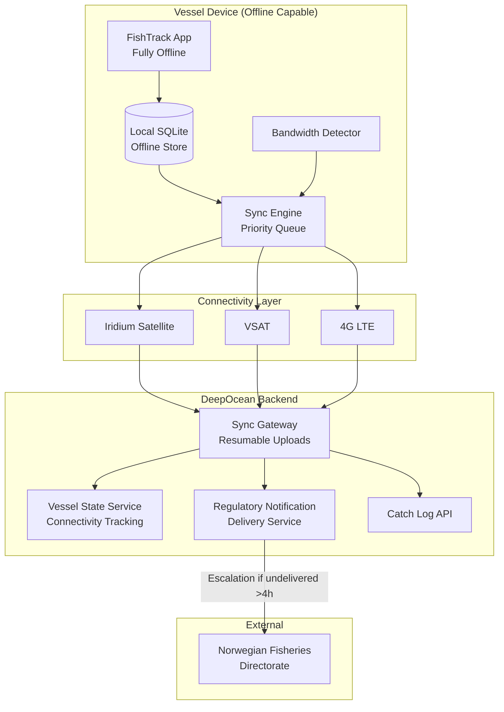

### Story Context

The Norwegian fishing trawler *Bjørnøy* left Tromsø on February 14th and entered the Barents Sea. She has a crew of six, a hold full of deep-sea shrimp quota, and a DeepOcean vessel management application on the bridge terminal — a rugged industrial tablet running the FishTrack module. The captain, Ingrid Halvorsen, has been a DeepOcean customer for four years.

Three weeks later, on March 7th, *Bjørnøy* comes back into Iridium satellite coverage range approximately 240 nautical miles north of Tromsø. The FishTrack app, which has been running in full offline mode since departure, begins attempting to sync.

It does not succeed.

---

**Zendesk ticket #48821** — Submitted: March 7th, 18:44 UTC

**Subject**: App won't sync — lost 3 weeks of catch data???

**From**: ingrid.halvorsen@bjornoy-fiske.no

Hi DeepOcean support,

We've been at sea for 22 days. FishTrack has been working great offline — we logged all our catches, weather events, equipment notes, everything. Now that we're back in range the app says "Sync failed: connection error" and I'm worried our data is lost.

We have 6 hours until we reach port. We need our catch log for customs in Tromsø. Also we have a regulatory notification from Norwegian Fisheries Directorate that came in 10 days ago that we haven't seen. Something about quota adjustments for the current species in our area.

Please help urgently.

Ingrid Halvorsen
Captain, F/V Bjørnøy

---

**#support-escalations** — March 7th, 19:01

**@Sunniva Berg** (Support Lead): Escalating this to engineering. Captain Halvorsen has 22 days of catch data on a local device, needs to sync in the next 6 hours before port. Sync is failing. Also has an unread regulatory notification that may affect her quota compliance.

**@you**: I'm on it. What's the sync failure mode?

**@Sunniva Berg**: "Connection error" — that's all the app shows. But I've checked our API logs and we're NOT seeing any inbound connection attempt from her vessel IP in the last 2 hours.

**@you**: So the app isn't even reaching our servers. This is a client-side failure. What's the Iridium satellite link bandwidth?

**@Sunniva Berg**: Iridium OpenPort, rated at 128kbps. But actual throughput on these links is often 40-60kbps.

**@you**: How much unsynced data does she have?

**@Sunniva Berg**: I can't see — her device hasn't checked in. But 22 days of catch logging... the catch log entries are JSON, typically 2-5KB each. A typical trawler logs 20-30 haul events per day. That's maybe 600-900 events × ~3KB = 2-3MB of catch data, plus photos of hauls (1-2MB each), plus vessel logs...

**@you**: Photos.

**@Sunniva Berg**: She might have 50-100 catch photos. Each 1-2MB. That's up to 200MB in photo attachments.

**@you**: At 40kbps actual Iridium bandwidth, 200MB would take 11 hours to upload. She has a 6-hour window.

**@Sunniva Berg**: Oh no.

**@you**: The sync is failing because the app is trying to send everything — photos included — in a single POST request that's timing out. We need to fix this right now for her specifically, and then fix the sync architecture for everyone.

---

You push an emergency hotfix: a flag in the app config server that routes her device to a priority sync endpoint that uses chunked upload, sends regulatory notifications first (pull priority), and defers photos to background sync that can continue after port arrival. The catch log text data goes first: 22 days × 25 events × 3KB = ~1.65MB. On a 40kbps link: 330 seconds. Under 6 minutes. She gets her customs data.

The regulatory notification — the quota adjustment — downloads first: 8KB, immediate.

Captain Halvorsen sends a thank-you email at 23:18. She's docked. Customs cleared.

---

But the hotfix was a one-off. The architectural problem remains: DeepOcean's sync is designed for vessels with reliable connectivity. The FishTrack offline mode was bolt-on. Every fishing vessel, research ship, and offshore supply vessel on the platform faces the same problem:

- They operate offline for days to weeks
- They have connectivity windows: hours, not always predictable
- During offline periods, data accumulates on the device
- Shore-side data also changes: quota updates, chart corrections, weather warnings, regulatory notifications
- When sync happens, both device and shore have changes — neither is the master

There is also a conflict scenario no one has documented: *Bjørnøy* might log a catch event offline, while shore-side a quota adjustment invalidates that quota class for her area. When she syncs: is her catch log accepted (it was a valid catch at time of logging), or does it need to be flagged for quota office review?

---

**1:1 call — you and Dr. Adaeze Obi** — March 8th, 11:00 Bergen

**Dr. Adaeze**: The Halvorsen incident — how close was it to a real compliance failure?

**You**: She had a regulatory notification she hadn't seen for 10 days. If the quota adjustment meant she was overfished and she kept fishing after that...

**Dr. Adaeze**: She would have been unaware. Because our notification system doesn't have an "urgent + offline vessel" priority path.

**You**: Correct. The notification sat unread on our server for 10 days.

**Dr. Adaeze**: And we had no way to know she was offline and hadn't received it.

**You**: Exactly. If you know a vessel is offline, you don't just queue the notification — you flag it for delivery at the first available sync opportunity, and you alert the regulatory body that you couldn't confirm delivery.

**Dr. Adaeze**: That's a fundamental design change. The system has to be aware of vessel connectivity state.

**You**: Offline-first isn't a feature. It's a different mental model. You design for disconnection as the default, and treat connectivity as a temporary luxury.

**Dr. Adaeze**: Write that down. I want it in the architecture RFC.

---

### Problem Statement

DeepOcean's vessel management platform must be redesigned with an offline-first architecture. Vessels operate with intermittent or no connectivity for days to weeks. When connectivity is available, syncing must happen in priority order: regulatory notifications first, then critical vessel data, then bulk data (photos, full logs) in background. Conflicts between device-side and shore-side data must be resolved deterministically. The system must track vessel connectivity state and flag undelivered high-priority notifications to the appropriate regulatory body.

### Explicit Requirements

1. Priority sync queue: regulatory notifications (P1), catch logs (P2), chart updates (P3), photos (P4, background only)
2. Bandwidth-aware sync: detect available bandwidth and adjust sync behavior accordingly
3. Conflict resolution: device wins for operational events logged during offline period; shore wins for quota/regulatory updates (with device-side flagging, not silent overwrite)
4. Vessel connectivity tracking: last-seen, estimated reconnection (based on voyage plan), notification delivery confirmation
5. Undelivered high-priority notification escalation: after N hours undelivered, alert sender
6. Resumable uploads: sync must survive connectivity interruption mid-transfer
7. Sync status UI: captain can see what's synced, what's pending, what failed
8. Offline mode completeness: app must be fully functional (logging, charts, regulatory reference) without connectivity

### Hidden Requirements

- **Hint**: Dr. Adaeze says "alert the regulatory body that you couldn't confirm delivery." Norwegian Fisheries Directorate sent a quota adjustment. Under Norwegian Maritime Law, quota adjustments are legally binding from time of issue — not from time of receipt. If *Bjørnøy* fished for 10 days after the adjustment without knowledge of it, what is the legal status of those catches? Does your architecture need to timestamp the "vessel was offline, could not deliver" event?
- **Hint**: The offline period is 22 days. DeepOcean's chart database updates weekly. *Bjørnøy* has a 22-day-old chart. What happens if a new hazard was charted in her fishing area during those 22 days and she navigated near it?
- **Hint**: Re-read: "shore wins for quota/regulatory updates (with device-side flagging, not silent overwrite)." If the catch log is flagged for review, does it affect the customs export? What format does Norwegian Customs expect for the catch log — and does it accept flagged/disputed records?
- **Hint**: The connectivity window is "approximately 6 hours before reaching port." This is not exact. What happens if the vessel's Iridium connection drops during sync and reconnects 2 hours later? What state must the sync protocol preserve?

### Constraints

- Vessel count: 12,000 active vessels on platform, ~2,000 fishing vessels with intermittent connectivity
- Offline durations: 1 day (coastal vessels) to 42 days (Southern Ocean research)
- Connectivity types: Iridium (128kbps rated, 40-60kbps actual), VSAT Ku-band (1-2Mbps), 4G LTE (near shore, up to 50Mbps), WiFi at port
- Sync window durations: 30 min (Iridium pass) to 12 hours (port stay)
- Device specs: industrial Android tablet, 4GB RAM, 64GB local storage, DeepOcean app
- Data types per vessel: catch events (2-5KB each), photos (1-2MB each), vessel log (1KB/entry), chart updates (~50MB per region per week), regulatory notifications (1-50KB)
- Typical offline accumulation: 25 events/day × 22 days × 3KB = 1.65MB (text); 75 photos × 1.5MB = 112MB
- Priority queue design: P1 must complete before P2 begins; P4 runs only when connection > 200kbps
- Conflict types: operational events (device-authoritative), regulatory data (shore-authoritative), quota status (shore-authoritative with audit flag)
- Norwegian Fisheries Directorate notification SLA: delivery confirmation required within 4 hours of vessel reconnection
- Local storage: device must buffer up to 45 days of data (longest expected offline voyage)

### Your Task

Design the offline-first sync architecture for DeepOcean's vessel management platform. Define the priority queue, the conflict resolution policy, the connectivity state model, and the regulatory notification escalation path. The design must work across all connectivity types from Iridium (40kbps) to port WiFi (50Mbps).

### Deliverables

- [ ] **Mermaid architecture diagram**: Vessel device (offline store, sync engine, priority queue) ↔ sync gateway (bandwidth detection, resumable upload) → shore-side services (regulatory notifications, catch log, chart updates)
- [ ] **Database schema**: Device-side sync queue table (item, priority, size, status, created_at, last_attempt), shore-side vessel connectivity table (vessel_id, last_seen, estimated_return, undelivered_notifications), conflict resolution log (item_id, resolution_type, device_version, shore_version, resolved_at)
- [ ] **Scaling estimation**: 2,000 fishing vessels × peak sync at port arrival Friday evening = concurrent sync sessions; bandwidth calculation for P1-P4 sync at different connection types; local device storage at 45 days × 25 events/day
- [ ] **Tradeoff analysis** (minimum 3):
  - Device-wins conflict resolution for all operational data (simple, authoritative) vs. per-field conflict resolution (accurate, complex)
  - Bandwidth detection before sync start (accurate, adds latency) vs. adaptive rate limiting during sync (immediate start, wastes time on failed large uploads)
  - Full offline app (large app binary, higher capability) vs. online-required for non-essential features (smaller, simpler, more brittle)
- [ ] **Cost modeling**: Sync gateway + storage for buffered vessel data + regulatory notification system ($X/month for 12,000 vessels)
- [ ] **Regulatory escalation design**: Define the exact escalation timeline and notification format for Norwegian Fisheries Directorate when a P1 notification cannot be delivered

### Diagram Format

Mermaid syntax. Show device-side offline store and sync engine. Show connectivity state detection. Show shore-side priority handling. Show regulatory escalation path.

