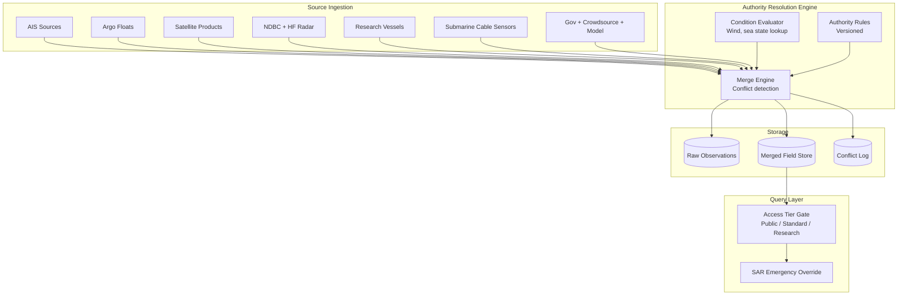

### Story Context

The photograph arrives in your Slack DMs at 11:43pm on a Tuesday. Dr. Adaeze Obi is on a flight from Geneva to Bergen. She sketched it on a paper napkin — three overlapping circles drawn with a ballpoint pen, each labeled with a data source type. In the center where all three overlap, she drew an asterisk and circled it twice.

Her message: "What happens when these two sources disagree about sea surface temperature?"

She does not say which two sources. She does not say what the answer is.

---

**Slack DM — @Dr. Adaeze Obi → @you** *(Tuesday, 23:43)*

**Dr. Adaeze**: [photo attached: napkin diagram]

Three circles: Argo floats (real-time in-situ measurement, high accuracy, sparse coverage), satellite altimetry (broad coverage, sea surface only, 1-3°C accuracy), research vessel CTD profiles (highest accuracy, point measurements, infrequent).

The asterisk is the overlap region. I was sitting next to a physical oceanographer from NOAA on the plane. She told me something that's been bothering me ever since.

She said: "Your platform shows sea surface temperature as a single value. But that value is wrong for about 30% of the ocean at any given time, because your satellite source has known cold biases in high-wind conditions and you're not correcting for it."

I asked her: "What do you do when two sources disagree?"

She said: "We know which one is right based on environmental conditions. Under 6 m/s wind: satellite is reliable. Over 8 m/s: use the float. Between 6-8: interpolate with uncertainty bounds."

I'm sending you this because I think we're treating all source disagreements the same way: last-write-wins. And I think that's wrong.

What's our conflict resolution policy for multi-source oceanographic data?

---

You read the message. Then you read it again. You open the DeepOcean data lake schema.

The `sea_surface_temperature` field in the `ocean_conditions` table has one column: `sst_celsius`. One value. No source metadata. No uncertainty bounds. No authority level. Last write wins.

You query the audit log. There isn't one.

---

**#data-engineering** — Wednesday, 09:15

**@you**: Question for the team. When we receive conflicting SST readings from two sources for the same geographic point and time — how do we resolve it currently?

**@Piotr Kaminski** (Data Engineer): We process sources in order: Argo floats first, then satellite, then research vessel. Each source overwrites the previous value if it's newer.

**@you**: "Newer" meaning what — newer measurement timestamp, or newer ingestion timestamp?

**@Piotr**: ...ingestion timestamp.

**@you**: So if a satellite reading arrives 2 minutes before an Argo float reading that was actually measured 3 hours earlier, the Argo float wins — even though the satellite observation is more recent?

**@Piotr**: That's... yes, that's what happens.

**@you**: And if the Argo float reading is from yesterday and the satellite reading is from an hour ago?

**@Piotr**: The Argo float wins because it was ingested last.

**@you**: That's not right.

**@Piotr**: ...no, I don't think it is.

---

You spend the next two days mapping the full set of data sources DeepOcean ingests. The list is longer than you expected.

**DeepOcean data source inventory:**

| Source | Type | Coverage | Update Frequency | Accuracy | Authority Level |
|--------|------|----------|-----------------|----------|-----------------|
| AIS terrestrial | Real-time vessel position | Coastal (50nm) | 2-10 sec | High | Ground truth |
| AIS satellite | Real-time vessel position | Global | 2 min-4 hr | Medium | Secondary to terrestrial |
| Argo floats | Subsurface ocean profile | Global sparse | 10-day cycle | Very high | Primary for subsurface |
| Satellite SST | Sea surface temperature | Global | Daily | Medium-Low in high wind | Primary in low-wind |
| HF radar | Surface current vectors | Coastal only | Hourly | High | Ground truth for coastal currents |
| NDBC buoys | Wind, wave, SST | Fixed US stations | 30 min | Very high | Ground truth at station |
| Research vessel CTD | Full water column profile | Track of vessel | As surveyed | Highest | Reference standard |
| Numerical ocean model | Forecast + analysis | Global | 6-hourly | Variable | Background field |
| Submarine cable sensors | Temperature at cable depth | Fixed cable routes | 10 min | High | Ground truth at cable |
| Government agency feeds | Various | Regional | Varies | High | Jurisdiction-dependent |
| Crowdsourced vessel | Weather + sea state | Along commercial routes | Event-driven | Variable | Low |
| Sentinel-6 altimeter | Sea surface height | Global | 10-day repeat | Very high | Primary for SSH |

Twelve source types. Each with different coverage patterns, update frequencies, accuracy characteristics, and authority levels. Each capable of producing readings that contradict other sources. Currently merged by last-write-wins on ingestion timestamp.

The NOAA oceanographer on the plane was right. And DeepOcean's customers — including coast guards who make routing decisions based on this data — are using the merged output.

---

**Video call — you and Dr. Adaeze Obi** — Wednesday, 15:00

**Dr. Adaeze**: I've been thinking about the authority level problem. In physical oceanography, we don't pick a winner — we produce a field estimate with uncertainty. The numerical ocean model is the background. Observations assimilate into it, each weighted by their accuracy and the environmental conditions at that location and time.

**You**: Data assimilation. That's the scientific term.

**Dr. Adaeze**: Yes. But that's computationally expensive and requires domain expertise to tune. My question for you is a simpler one: before we get to full data assimilation, what's the minimum viable conflict resolution policy that's better than last-write-wins?

**You**: Authority tiers. Each source has a defined authority level per variable per environmental condition. When sources conflict, higher authority wins. Ties go to most recent measurement time. And we always store the conflict — we don't silently discard the losing value.

**Dr. Adaeze**: Good. And uncertainty bounds?

**You**: We store them. For now, source-declared uncertainty. Later, we can calculate them from inter-source disagreement.

**Dr. Adaeze**: There is one more thing. Some of our data sources have usage restrictions. Research vessel CTD data from NOAA is publicly available. CTD data from a commercial survey vessel — oil and gas exploration — may be proprietary. We license it. Our customers can query it. But we cannot redistribute the raw observations.

**You**: So the data mesh has access tiers too.

**Dr. Adaeze**: The ocean has layers. So does the data about it.

---

### Problem Statement

DeepOcean must redesign its multi-source oceanographic data integration layer from a last-write-wins merge strategy to a governed data mesh with explicit authority tiers, environmental condition-dependent source selection, conflict storage, and access controls for licensed data. Twelve data source types must be integrated across different coverage areas, update frequencies, and accuracy profiles. The merged output must carry uncertainty bounds and source attribution.

### Explicit Requirements

1. Authority tier system: each source has a defined authority level per variable per environmental condition
2. Conflict storage: when sources disagree, both values stored with conflict flag — never silently discard
3. Measurement time vs. ingestion time: use measurement time for freshness comparison
4. Source attribution: every merged field must carry its winning source identity and timestamp
5. Uncertainty bounds: every merged field must carry an uncertainty value (source-declared initially)
6. Access tiers: licensed data accessible to subscribers only; public data accessible to all
7. Condition-based authority override: authority tier can be overridden by environmental conditions (e.g., wind speed for satellite SST reliability)
8. Data product versioning: authority rules are versioned — disputes about past authority decisions can be replayed under new rules

### Hidden Requirements

- **Hint**: Dr. Adaeze says "some data sources have usage restrictions." A coast guard using DeepOcean for a SAR (search and rescue) operation queries sea state data. The best available data is from a proprietary commercial survey vessel — licensed to DeepOcean for operational use. Can you use licensed commercial data in a SAR operation? What does your access tier design need to say about emergency override?
- **Hint**: Submarine cable sensors provide temperature at fixed cable depth along fixed cable routes. If two adjacent submarine cables provide different temperatures at their crossing point (roughly — cables don't exactly cross), which is authoritative? Neither is wrong; the ocean has spatial temperature gradients. What does this tell you about the granularity of your authority tier system?
- **Hint**: Dr. Adaeze says "data product versioning — disputes about past authority decisions can be replayed under new rules." This means historical merged records may be incorrect under the new rules. How do you handle a customer who made a navigation decision 6 months ago based on an SST value that would be different under the new authority rules?
- **Hint**: "Crowdsourced vessel" is in the list with authority level "Low." But a crowdsourced report of a rogue wave — a 20-meter wave 200 miles from the nearest buoy — would be discarded under a strict authority tier system. What's the design for handling low-authority outlier reports that may be the only source for rare events?

### Constraints

- 12 data source types (see table above)
- Total data volume: AIS is dominant at 20K-100K msg/sec; ocean condition data is ~500K measurements/hour globally
- Geographic grid: 0.1° × 0.1° (~11km × 11km at equator) — standard oceanographic resolution
- Variables: SST, sea surface height, subsurface temperature profiles, surface currents, wind, significant wave height, salinity
- Authority rules: environmental condition lookup adds latency — must be < 10ms for authority tier resolution
- Conflict log retention: 5 years (scientific dispute resolution timescale)
- Licensed data access: 3 tiers — public (all registered users), standard (paid subscribers), research (academic + government)
- Condition data update frequency: SST merged field refreshed every 6 hours globally; near-real-time for coastal areas
- Data assimilation (future): architecture must be extensible to full Kalman filter data assimilation without rewrite
- Customer SLA: merged data fields available within 15 minutes of source data ingestion for standard tier
- Team: you + Dr. Adaeze (domain expertise) + 2 data engineers

### Your Task

Design the global ocean data mesh architecture. Define the authority tier system, the conflict resolution policy, the condition-based override mechanism, and the access tier model. The design must be scientifically defensible (Dr. Adaeze will review for oceanographic accuracy) and operationally practical (the data engineering team will implement it).

### Deliverables

- [ ] **Mermaid architecture diagram**: 12 source ingesters → authority resolution engine (condition lookup) → merged field store (with conflict log) → access tier gate → customer APIs
- [ ] **Database schema**: `ocean_observations` (raw, per source, with measurement_time, ingestion_time, source_id, variable, value, uncertainty, geometry), `ocean_merged_fields` (grid cell, variable, merged_value, uncertainty, winning_source, authority_tier_used, condition_overrides), `source_conflicts` (grid_cell, variable, timestamp, source_a, value_a, source_b, value_b, winner, reason), `authority_rules` (version, source_id, variable, condition_field, condition_min, condition_max, authority_tier)
- [ ] **Scaling estimation**: 0.1° × 0.1° grid = 1.3M ocean grid cells × 7 variables × 6-hour refresh = writes/hour; conflict log size at 5% conflict rate × 5-year retention; authority rule lookup latency budget
- [ ] **Tradeoff analysis** (minimum 3):
  - Condition-based authority override (accurate, complex, adds latency) vs. static authority tiers (simple, occasionally wrong, fast)
  - Store all conflicting observations (full audit, expensive storage) vs. store only winner + metadata (compact, loses original data)
  - Per-source ingestion pipelines (isolated, scalable) vs. unified ingestor with source plugins (simpler ops, shared failure mode)
- [ ] **Cost modeling**: Merged field storage (1.3M cells × 7 vars × 6hr × 5yr) + conflict log + source ingestor fleet ($X/month)
- [ ] **Emergency override design**: Define the access control mechanism for SAR operations that need licensed data outside normal subscription tiers

### Diagram Format

Mermaid syntax. Show the 12 source types grouped by category. Show the authority resolution engine as a distinct component with condition lookup. Show the conflict log as a parallel write. Show access tiers at the query layer.

