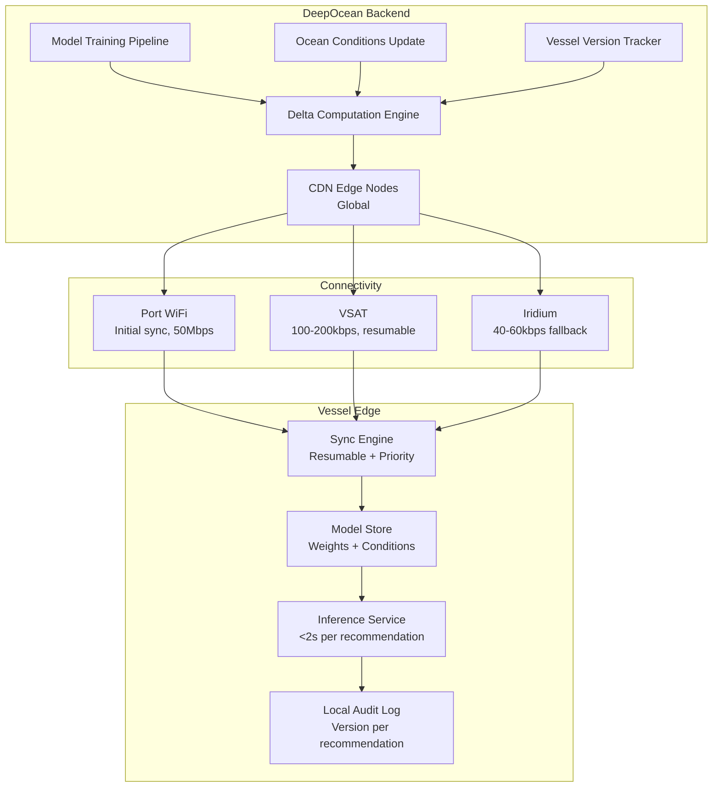

### Story Context

The container ship *Maersk Valiant* is in the South Pacific. She left Auckland 11 days ago. Destination: Callao, Peru. 7,200 nautical miles. She will not see land for another 14 days.

Her communications: a VSAT Ku-band dish on the superstructure. Bandwidth: up to 2Mbps download, 512kbps upload when the satellite is well above the horizon. In practice: 100-200kbps is normal. During tropical squalls — which are frequent in this part of the Pacific — the link drops entirely for 20-40 minutes at a time.

*Maersk Valiant* is running DeepOcean's VoyageOptimize module. An ML model that recommends optimal routing, speed adjustment, and fuel trim based on current ocean conditions. The model is trained on historical voyage data from 8,000 ships, updated weekly with fresh ocean condition data. Current model size: 200MB.

The first mate, Officer Thanh Nguyen, files a support ticket.

---

**Zendesk ticket #51220** — March 18th, 14:22 UTC

**Subject**: VoyageOptimize hasn't updated in 6 weeks

**From**: tnguyen@maersk-valiant.net

Hi,

VoyageOptimize shows "Model last updated: February 4th" — today is March 18th. That's 42 days without an update. I understand there was an ocean conditions update 3 weeks ago. The model should have new data.

Every time we try to update, the app downloads for a while and then shows "Update failed: connection timeout." We've tried 8 times.

The current model is recommending we maintain our course through the South Pacific High. Ocean conditions data says the High has shifted 200 nautical miles north since February. We're routing into worse weather than necessary.

Can we force an update somehow?

**---**

**#support-escalations** — March 18th, 16:01

**@Sunniva Berg**: Engineering attention needed. VoyageOptimize model updates timing out on deep ocean vessels. Known issue?

**@you**: Looking now. What's the model update package size?

**@Piotr Kaminski**: 200MB. Full model download. We don't have differential updates.

**@you**: On a 100kbps VSAT link, 200MB would take — let me calculate — 200MB × 8 bits/byte ÷ 100,000 bits/sec = 16,000 seconds. 4.4 hours. Uninterrupted. On a link that drops every 20-40 minutes during squalls.

**@Piotr**: ...

**@you**: Every time the link drops, the download restarts?

**@Piotr**: Yes. We don't have resumable download support.

**@you**: So in 42 days of trying, the model has never successfully downloaded because the South Pacific link quality doesn't support a 4.4-hour uninterrupted download.

**@Piotr**: That appears to be correct.

**@you**: How many vessels are in this situation?

**@Piotr**: VoyageOptimize is deployed on 340 vessels. About 60% run deep ocean routes where VSAT bandwidth is < 200kbps. So... 200 vessels approximately.

**@you**: 200 vessels running a 6-week-old routing model in current ocean conditions.

*[silence in channel for 8 seconds]*

**@you**: Okay. Emergency fix first: implement resumable download (HTTP Range headers) so the download can pick up after a link drop. Second: we need differential model updates. This week.

---

The emergency fix is straightforward — HTTP Range headers let the download resume from the last byte received. You ship it in 6 hours. But the real problem is the 200MB model size.

You dig into the model architecture. It's a gradient boosting model (XGBoost) + an ocean conditions embedding layer. The full model weights are 200MB because the embedding layer includes the full global ocean conditions dataset: SST, currents, wave height — at 0.25° resolution for the full globe, updated weekly.

Each weekly update changes approximately 15-20% of the ocean conditions embedding. The model weights change by 5-8% (new training data incorporated). But the entire 200MB is downloaded every time.

You research differential model updates. The techniques exist: model diffing (binary diff of weights files), parameter-level delta encoding, feature store separation (model weights separate from ocean conditions data). A 200MB model with 5% weight change could be delivered as a ~12MB delta. The ocean conditions update that changed 15% could be delivered as ~30MB of changed grid cells.

Total update: ~42MB instead of 200MB. At 100kbps: 56 minutes. Still needs to survive link drops, but achievable across a normal 2-3 hour connectivity window.

---

**1:1 call — you and Dr. Adaeze Obi** — March 19th, 10:30

**Dr. Adaeze**: The differential update problem is solvable. But I want to raise something adjacent. The vessel is running inference locally on the bridge terminal. What hardware is that?

**You**: Industrial PC. Specs vary by customer. Most are 8-core, 16-32GB RAM. Some have the newer Jetson boards for GPU inference.

**Dr. Adaeze**: The gradient boosting model runs fine on CPU. But we're designing the next generation: a neural sea state predictor that needs GPU inference for the attention layers. 5 billion parameter model.

**You**: 5 billion? That's 10GB of weights at float16.

**Dr. Adaeze**: 20GB at float32. And we want to update it as ocean conditions evolve. We cannot download 20GB over VSAT.

**You**: Then we need to rethink what we're sending to the vessel. The ocean conditions are the volatile part — the model architecture is stable. We send ocean condition deltas to the vessel, and the model runs inference locally using the stored model and the updated conditions.

**Dr. Adaeze**: Exactly. But now you have a new problem: the vessel needs to store the full global ocean conditions dataset locally. At 0.25° resolution, 7 variables — that's 1.3M grid cells × 7 × 4 bytes = ~36MB. At 0.1° resolution: ~320MB. The delta updates are small. The initial download is large.

**You**: Initial sync at port. Delta updates at sea.

**Dr. Adaeze**: Yes. How long does the delta for a weekly ocean conditions update take to compute?

**You**: That's what I need to design.

---

### Problem Statement

DeepOcean's VoyageOptimize ML model runs on vessel edge hardware (industrial PC, 8-32GB RAM). The current update mechanism downloads the full 200MB model on every update, which is undeliverable over deep ocean VSAT links (100-200kbps with frequent drops). The redesigned model update system must: (1) support resumable downloads, (2) send differential model updates (weight deltas + ocean condition deltas separately), (3) support model architecture separation so the large stable model can be synced at port and only the volatile ocean conditions are updated at sea. Future design must accommodate a next-generation 20GB neural model.

### Explicit Requirements

1. Resumable downloads: HTTP Range headers, downloads survive link drops and resume
2. Differential weight updates: binary delta of changed model weights only
3. Separate ocean conditions updates from model weights
4. Per-grid-cell delta for ocean conditions: only changed grid cells transmitted
5. Initial full sync at port: large files delivered over port WiFi/high-bandwidth connection
6. At-sea updates: only deltas, within 2-hour connectivity window at 100kbps
7. Model version tracking: vessel records installed model version and ocean conditions version
8. Inference performance: model must run on CPU (8-core) in < 2 seconds per recommendation
9. Graceful degradation: if ocean conditions are > 7 days stale, show warning but continue routing

### Hidden Requirements

- **Hint**: Dr. Adaeze describes the next-generation 20GB model. At 100kbps download speed, the initial model download at port requires: 20GB × 8 / 100,000 = 1,600 seconds = 26 hours. Port stays for large container ships are typically 12-48 hours. What happens if the vessel leaves port before the initial model download completes?
- **Hint**: The model delta is computed server-side. You're diffing XGBoost weights (binary format). What's the delta size distribution — is it always 5%, or does it spike when a major ocean pattern shift occurs (e.g., El Niño onset)? What do you do when the delta is larger than the full model?
- **Hint**: Officer Nguyen says "The current model is recommending we maintain our course through the South Pacific High." Routing recommendations have direct safety and commercial implications. If the model is stale and recommends an incorrect route that results in storm damage, what is DeepOcean's liability? Does your architecture need to track the model version used for each recommendation, as part of a liability audit trail?
- **Hint**: Vessels may be operated by the same shipping company but flagged in different countries with different software certification requirements. Lloyd's Register and DNV require type approval for software used in navigation decisions. Does your differential update mechanism need to go through type approval before being deployed to vessels running certified navigation software?

### Constraints

- VSAT Ku-band: 100-200kbps effective, 800ms RTT, drops every 20-40 min during squalls
- Iridium fallback: 40-60kbps, 1,500ms RTT (used when VSAT unavailable)
- Port WiFi: up to 50Mbps (initial sync only)
- Edge hardware: 8-16 core Intel CPU, 16-32GB RAM, 256GB-1TB SSD (no GPU on most vessels)
- Current model: 200MB XGBoost + ocean conditions embedding
- Next-gen model: 20GB neural (GPU required), estimated 18 months from production
- Ocean conditions update: weekly, 15-20% of grid cells change per update
- Connectivity window: 2-3 hours of adequate VSAT per 24-hour period (open ocean estimate)
- Update frequency: model weights monthly, ocean conditions weekly
- Delta computation: must run on DeepOcean servers (not vessel-side)
- 340 vessels in fleet, 60% on deep ocean routes
- Vessel software certification: DNV/Lloyd's type approval required for navigation-critical components
- Update delivery SLA: all vessels updated within 10 days of release (not all simultaneously)

### Your Task

Design the differential model update system for DeepOcean. Define the delta computation pipeline, the download protocol, the vessel-side sync engine, the ocean conditions store, and the graceful degradation behavior. The design must work for the current 200MB model and scale to the future 20GB model.

### Deliverables

- [ ] **Mermaid architecture diagram**: Server-side delta computation pipeline + CDN delivery + vessel sync engine + local model/conditions store + inference service
- [ ] **Database schema**: Vessel model version table (vessel_id, model_version, conditions_version, last_sync, next_expected_sync, stale_warning_at), update manifest table (version, base_version, delta_type, delta_size_bytes, checksum, patch_instructions), inference audit log (vessel_id, recommendation_id, model_version, conditions_version, timestamp, output)
- [ ] **Scaling estimation**: 340 vessels × weekly 42MB delta = weekly transfer volume; peak port sync (10 vessels arriving same port simultaneously, initial 20GB model); CDN costs; delta computation time on server (binary diff of 200MB XGBoost model)
- [ ] **Tradeoff analysis** (minimum 3):
  - Separate weights and conditions store (flexible, complex sync logic) vs. single model package (simple, larger deltas when either changes)
  - Server-side delta computation (centralized, requires knowing vessel's current version) vs. vessel-side patching from base (vessel always downloads latest base + cumulative patches)
  - Ship early with 100ms resume gap tolerance (fast, occasionally re-downloads 100ms of data) vs. byte-perfect resumption with checksum (slower, uses Range headers, no re-download)
- [ ] **Cost modeling**: CDN delivery for 340 vessels × weekly 42MB delta + port sync CDN + delta computation compute ($X/month)
- [ ] **Degradation policy**: Define the stale model behavior at 7, 14, and 30 days — what does the UI show, what is the recommendation mode, and when does the system refuse to make routing recommendations?

### Diagram Format

Mermaid syntax. Show server-side delta pipeline, CDN, vessel sync engine with resume logic, and inference service with version tracking.

