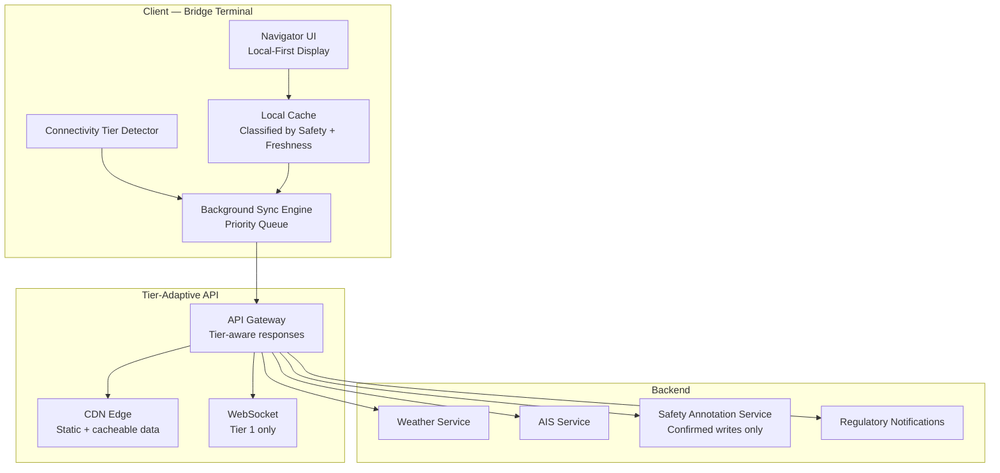

### Story Context

The UX research report lands in your inbox on a Monday morning. DeepOcean commissioned a user study — 40 navigators across 15 vessels, mix of nationalities, mix of vessel types. The headline finding is highlighted in yellow by the researcher, Hanne Lindqvist, who also bolded it, underlined it, and added a comment in the margin that says "this is the finding."

> **67% of navigators report abandoning the DeepOcean platform mid-task because it is "too slow." 43% say they use paper charts for operational decisions and use DeepOcean only for reporting.**

The full report includes verbatim quotes:

*"When I click on a weather overlay, I wait 30 seconds. Sometimes a minute. By the time it loads, I've already made the decision."* — Chief Officer, bulk carrier

*"On the satellite link we have now, every button click feels like a gamble. Will it load or will it spin forever? I stopped trusting it."* — Navigator, VLCC tanker

*"The app was designed by people who live on land. It assumes the internet works. Out here it doesn't."* — Captain, research vessel

---

**#product-engineering** — Monday, 09:47

**@Erik Solberg**: I want engineering perspective on this UX report. @you — thoughts?

**@you**: The problem is architectural. The app is built on a synchronous request-response model. Every user action triggers an API call to our backend. At 800ms RTT (satellite), that's 1.6 seconds minimum before the user sees any response — and that's before any server processing time. For a page with multiple widgets, each with their own API call, you're looking at 5-15 seconds to load.

**@Erik**: So every feature load is a round-trip?

**@you**: Yes. The web app treats our Bergen servers like they're in the next room. For a navigator on Inmarsat C with a 5-second RTT, Bergen might as well be on another planet.

**@Hanne Lindqvist** (UX Researcher): The most abandoned task is "load weather overlay." It requires 3 API calls sequentially: authentication check, data availability check, then the weather data itself. That's 3 × 800ms RTT = 2.4 seconds minimum, plus data transfer. On bad links: 20-30 seconds. Navigators have 45-second attention spans for software before they return to their physical instruments.

**@you**: We need to redesign the data access architecture for three connectivity tiers. Not just "handle offline" — actually design for each tier as a first-class citizen.

---

You map the three connectivity tiers you need to design for:

**Tier 1: Connected (port WiFi, near-shore 4G)**
- Bandwidth: 10-50Mbps
- RTT: 20-80ms
- Availability: continuous
- Current platform: works acceptably

**Tier 2: Satellite (VSAT Ku-band, Inmarsat FB)**
- Bandwidth: 100-2,000kbps
- RTT: 600-900ms
- Availability: ~80% (weather drops, horizon blockage)
- Current platform: 30-second page loads, navigators abandoning

**Tier 3: Deep satellite (Iridium, Inmarsat C)**
- Bandwidth: 1.2kbps (Inmarsat C, telex-grade) to 60kbps (Iridium OpenPort)
- RTT: 1,500-5,000ms
- Availability: ~70% (Iridium), ~90% for Inmarsat C
- Current platform: completely unusable

**Tier 4: Disconnected**
- No connectivity
- Current platform: non-functional (API calls fail)
- Must be: fully functional for local data

The navigators in the study who are using the platform for "reporting only" are in Tier 2 or 3 environments. The 67% who abandon mid-task are facing Tier 2 latency. Nobody has designed for Tier 3 at all.

---

**DM — @you → @Dr. Adaeze Obi** — Monday, 14:15

**You**: Looking at the UX report. The problem is clear — every interaction requires a server round-trip. I'm thinking about optimistic updates and local-first data.

**Dr. Adaeze**: Yes. But there's a nuance. Navigation decisions have safety implications. If a navigator makes an optimistic update to a waypoint — marking a hazard on the chart — and that optimistic update fails to sync, and another navigator on the same vessel loads the chart... what happens?

**You**: The hazard doesn't appear.

**Dr. Adaeze**: Correct. So optimistic updates for safety-relevant data need conflict resolution that errs on the side of caution. A pessimistic merge for safety annotations: if you can't confirm the annotation reached the server, it stays on the local chart but is marked "unconfirmed."

**You**: And for non-safety data — weather overlays, AIS tracks — full optimistic?

**Dr. Adaeze**: Full optimistic with local cache. Weather data doesn't change from user interaction. It changes from our backend. The pattern there is: cache everything, show stale data with a freshness indicator, refresh in background.

**You**: The core insight is: classify every data type by safety relevance and freshness tolerance. Different sync strategies per class.

**Dr. Adaeze**: That's the design. Now do the engineering.

---

### Problem Statement

DeepOcean's web/app platform was designed assuming reliable low-latency connectivity. Navigators in Tier 2 (satellite, 800ms RTT) and Tier 3 (deep satellite, 5000ms RTT) environments find it unusable. The redesigned architecture must: classify data by safety relevance and freshness tolerance, apply optimistic updates for non-safety data, show stale-but-available data with freshness indicators, function fully offline (Tier 4), and degrade gracefully through connectivity tiers. An 800ms RTT must feel fast to the navigator.

### Explicit Requirements

1. Local-first data: all frequently-accessed data cached locally, displayed from cache immediately
2. Freshness indicators: every cached data item displays its age; navigator always knows if data is current
3. Optimistic updates for non-safety data: write locally, sync in background, resolve conflicts server-side
4. Conservative sync for safety-critical annotations: confirmed write before UI shows success
5. Tier-aware API: client declares its connectivity tier, API adapts response (full data for Tier 1, compressed/minimal for Tier 3)
6. Background sync queue: all pending writes queued, sent in priority order, survived link drops
7. Progressive loading: show cached version immediately, update in-place when fresh data arrives
8. Offline indicator: clear visual state for each data type (fresh / stale / unavailable / pending)

### Hidden Requirements

- **Hint**: The UX report says 43% use paper charts for operational decisions. Under SOLAS Chapter V, vessels are required to carry paper charts for the area of operation. DeepOcean is a supplementary tool, not a replacement. But if navigators are relying on paper because DeepOcean is too slow, what does that mean for DeepOcean's ability to deliver its core value proposition (better routing) if the navigators don't trust the platform enough to use it operationally?
- **Hint**: Hanne mentions "authentication check" as one of the 3 sequential API calls for weather overlay. Why does a weather overlay load require an authentication check on every load? What does this tell you about the session management design? How does this change when RTT is 800ms?
- **Hint**: Inmarsat C bandwidth is 1.2kbps — telex grade. At this bandwidth, a single compressed API response of 50KB takes over 5 minutes to download. What is the minimum viable data packet you need to send to a vessel on Inmarsat C? What can't you include at this bandwidth at all?
- **Hint**: Re-read Dr. Adaeze's point about safety annotations: "marked as unconfirmed." What does a vessel's chart look like after 3 weeks offline if the navigator has added 15 hazard annotations, all marked "unconfirmed"? When they reconnect, all 15 are synced. What if one of those "unconfirmed" annotations was based on incorrect observation? How do you handle correction or deletion of unconfirmed annotations after sync?

### Constraints

- Connectivity Tier 1: 10-50Mbps, 20-80ms RTT (port/coastal)
- Connectivity Tier 2: 100-2,000kbps, 600-900ms RTT (VSAT)
- Connectivity Tier 3: 1.2-60kbps, 1,500-5,000ms RTT (Iridium/Inmarsat C)
- Connectivity Tier 4: 0kbps (full disconnect)
- Data types: weather overlays, AIS vessel positions, charts/hazards, voyage plan, safety annotations, regulatory notifications, catch/cargo logs
- Safety-critical data: hazard annotations, safety equipment status, MOB (man overboard) alerts, collision avoidance vectors
- Non-critical data: weather overlays, AIS track history, fuel consumption estimates
- Local storage: 4GB usable on bridge terminal for DeepOcean app cache
- Max response size for Tier 3: 5KB per API response (fits in one Iridium data burst)
- Cache freshness thresholds: AIS positions (5 min), weather (6 hours), charts (7 days), voyage plan (immediate sync required)
- Background sync priority: safety annotations (P1), regulatory notifications (P1), voyage plan changes (P2), weather refresh (P3), AIS track history (P4)

### Your Task

Design the connectivity-tier-aware data access architecture for DeepOcean's platform. Define the data classification (by safety relevance and freshness tolerance), the caching strategy per class, the optimistic update flow, the tier-adaptive API design, and the offline-to-online transition.

### Deliverables

- [ ] **Mermaid architecture diagram**: Client (local cache + sync engine + tier detector) → tier-adaptive API gateway → backend services; show the optimistic write path and the confirmed write path separately
- [ ] **Database schema**: Client-side cache manifest (data_type, item_id, cached_at, freshness_ttl, sync_status, safety_critical flag), pending writes queue (item_id, type, payload_hash, priority, created_at, last_attempt, attempt_count)
- [ ] **Scaling estimation**: Local cache sizing (4GB budget for 12 data types × freshness windows); background sync bandwidth per connectivity tier per day; concurrent sync sessions at major port (200 vessels simultaneously arriving)
- [ ] **Tradeoff analysis** (minimum 3):
  - Optimistic writes for all data (fast UX, complex conflict resolution) vs. conservative writes for all (safe, terrible UX on satellite)
  - Tier detection at client (immediate, imprecise) vs. tier negotiation via API handshake (accurate, adds round-trip)
  - Full offline capability (large local cache, complex sync) vs. offline for critical data only (smaller footprint, reduced capability)
- [ ] **Cost modeling**: Backend API serving optimized for Tier 3 (more CDN edge nodes, compression, response size reduction) vs. current backend cost ($X/month difference)
- [ ] **Tier 3 design spec**: For Inmarsat C (1.2kbps), define exactly what a navigator can and cannot do in terms of platform features — this is the minimum viable maritime experience

### Diagram Format

Mermaid syntax. Show client-side architecture (tier detector, cache, sync queue) and server-side (tier-adaptive API, CDN for static data, WebSocket fallback for Tier 1 only).

