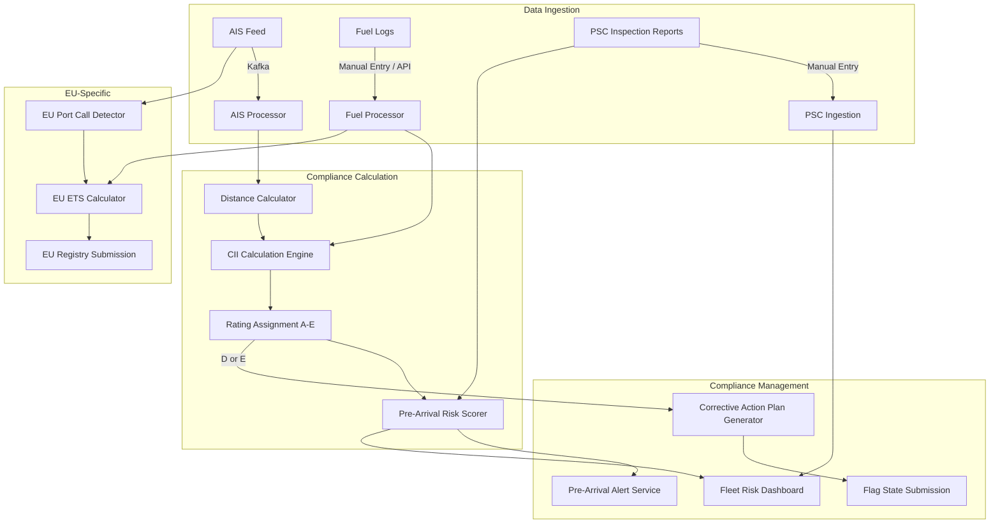

### Story Context

The email arrives on a Tuesday morning and you read it twice before fully understanding what it means.

---

**Email Chain**

**From**: Captain Rodrigo Ferreira (M/V Pacific Meridian)
**To**: Henrik Larsen (Ship Manager, Nordic Marine Management)
**Subject**: PSC DETENTION — Rotterdam — URGENT
**Sent**: 06:14 AM UTC

Henrik,

Pacific Meridian has been detained by Port State Control at Rotterdam this morning following routine inspection. Inspector from Dutch Human Environment and Transport Inspectorate has cited the following:

1. ISM Code deficiency: SMS procedures not updated since 2021 (12 deficiencies, non-detainable)
2. MARPOL Annex VI deficiency: Tier II NOx technical file incomplete (1 deficiency, non-detainable)
3. **CII Rating deficiency — vessel rated D for 2023 operational year. Flag State (Marshall Islands) has not received corrective action plan. Inspector states this is detainable per EU Regulation 2023/1805.**

Ship cannot depart until deficiency #3 is resolved to inspector's satisfaction.

We have legal counsel in Rotterdam. They are reviewing the detention notice now.

Rodrigo Ferreira, Master
M/V Pacific Meridian
IMO 9487234

---

**From**: Henrik Larsen (Ship Manager, Nordic Marine Management)
**To**: Astrid Voss (VP Operations, DeepOcean)
**Subject**: FWD: PSC DETENTION — Rotterdam — URGENT
**Sent**: 07:02 AM UTC

Astrid,

Forwarding urgent. Pacific Meridian is detained in Rotterdam — CII deficiency. Third detention this quarter related to emissions compliance. I have to be direct: our records in DeepOcean do not reflect CII ratings at all. The regulation came into force in January 2023 and I do not believe we have any system support for it. We have been calculating CII manually in spreadsheets, and apparently we have not been submitting the corrective action plans required for D-rated vessels.

I believe the legal exposure here is significant. I am requesting an urgent meeting.

Henrik

---

**From**: Astrid Voss (VP Operations, DeepOcean)
**To**: you
**Subject**: FWD: FWD: PSC DETENTION — Rotterdam — URGENT
**Sent**: 07:44 AM UTC

Reading this email chain is not going to make your morning better. I'm sorry.

Here's the context you need: CII (Carbon Intensity Indicator) is an EU shipping emissions regulation that became mandatory in January 2023. Every commercial vessel over 5,000 GT must calculate its annual CII rating (A through E). D or E rated vessels must submit a corrective action plan to their flag state. E-rated vessels face flag state action.

We never built CII into DeepOcean. Not because we didn't know about it — we knew — but because when it was announced in late 2021 we were in the middle of rebuilding the MARPOL reporting module and the CII project got deprioritized. Our customers have been calculating CII manually. Apparently some of them haven't been calculating it at all.

Pacific Meridian's detention is the third this quarter from our customer base. I got calls from two other ship managers last week who didn't tell me about detentions — they were hoping to fix it quietly. After this morning I expect more to surface.

We need to build this. How fast can you move?

Astrid

---

You forward the email thread to your Slack.

---

**#deepocean-engineering — DM**

```
8:01 AM — you → Tomás Eriksen [Lead Backend Engineer]
Tomas — read this thread. I'm going to need everything you know about
our current compliance data model. Specifically: what do we store about
vessel operations that could be used to calculate CII?
```

```
8:07 AM — Tomás Eriksen
CII calculation requires: distance traveled (nautical miles), fuel consumption
by fuel type (HFO, LNG, MDO, etc.), and vessel DWT or GT.
We have: AIS position data (latitude/longitude, speed, timestamps) — we can
derive distance. We have fuel consumption from voyage reports — but only when
the ship manager manually enters it. Maybe 60% of our fleet has consistent fuel data.
DWT/GT is in the vessel registry. That's solid.
The gap: 40% of fleet has incomplete fuel consumption data.
```

```
8:09 AM — you
How far back does the fuel data go?
```

```
8:10 AM — Tomás Eriksen
For customers who enter it consistently: 4 years. For the others: 0-2 years,
with gaps. Some vessels have no fuel data at all.
```

```
8:11 AM — you
And what do we store about PSC inspections?
```

```
8:14 AM — Tomás Eriksen
We store inspection records when the ship manager enters them. Deficiencies
are free text. Detentions are a boolean field. We do not parse deficiency codes.
We have no structured data on WHY a vessel was detained. Just "yes/no detained."
```

```
8:15 AM — you
Okay. That needs to change. Let me think about the scope of what we're building.
```

---

You spend the next hour mapping the regulatory landscape on a whiteboard. Maritime compliance operates across four distinct legal authorities:

1. **Flag State** — the country where the vessel is registered (Marshall Islands in Pacific Meridian's case). Sets the vessel's operating certificate. CII corrective action plans go to the flag state.
2. **Port State** — any country whose ports the vessel visits. Port State Control (PSC) inspectors can detain vessels for deficiencies. Each major port region has a PSC MOU: Paris MOU (Europe), Tokyo MOU (Asia-Pacific), US Coast Guard.
3. **International** — IMO instruments: MARPOL (pollution), SOLAS (safety), ISM Code (management system). These are treaties ratified by flag states.
4. **EU Regulation** — directly applicable in EU ports, regardless of flag state. CII is the current example. EU ETS (emissions trading) begins 2024 for ships.

The complexity is geometric. A vessel registered in Marshall Islands (flag state), calling at Rotterdam (Paris MOU PSC), carrying cargo under a UK charter party, with a Filipino crew under MLC (Maritime Labour Convention), is simultaneously subject to at least six different compliance regimes.

DeepOcean has never modeled this as a system. It has modeled it as a series of manual entry forms.

---

### Problem Statement

DeepOcean must build a maritime compliance architecture that models the multi-jurisdictional regulatory environment vessels operate in: flag state authority, port state control across multiple MOU regions, international IMO conventions, and emerging EU-specific regulations like CII ratings and EU ETS. The CII detention crisis has exposed that the current system has no structured regulatory data model — compliance state is inferred from manual form entries, not computed from operational data.

The system must be able to: calculate CII ratings from operational data, track PSC inspection history with structured deficiency codes, flag vessels approaching detention risk before port arrival, and generate corrective action plans in flag-state-specific formats.

---

### Explicit Requirements

1. CII (Carbon Intensity Indicator) calculation engine: compute annual CII rating (A–E) per vessel from AIS-derived distance and fuel consumption data; handle missing fuel data with estimation models and clearly flagged uncertainty
2. Structured PSC inspection database: deficiencies stored by IMO deficiency code (not free text), detention reason, PSC MOU region, port, and inspector; searchable by deficiency code across fleet
3. Pre-arrival risk scoring: for any vessel planning a port call, compute PSC detention risk score based on: time since last inspection, deficiency history, flag state performance (Paris MOU targeting factor), CII rating, and vessel age
4. Flag state compliance tracker: for each vessel's flag state, track: certificate validity dates (SMC, DOC, IOPP), CII corrective action plan submission status, flag state-specific requirements
5. EU ETS integration (2024): track EU port calls, calculate CO2 emissions, compute ETS allowance obligation; support report submission to EU Registry
6. Regulatory calendar: per-vessel calendar of upcoming certificate renewals, required surveys, and regulatory deadlines; alert at 90/60/30/14 days
7. Corrective action plan generator: produce flag-state-formatted corrective action plan documents for D/E-rated vessels; template per flag state
8. Historical data backfill pipeline: for existing customers with 60% fuel data coverage, identify gaps, prompt for manual backfill, and compute best-available CII estimates for 2023 (the year that produced detentions)

---

### Hidden Requirements

- **Hint: re-read the detention notice detail** — "EU Regulation 2023/1805." This is a real EU regulation that created a new obligation on top of the existing IMO CII framework. The EU implementation has specific requirements that differ from the IMO baseline: EU ports can detain vessels for CII deficiencies even if the IMO only requires a corrective action plan. The hidden requirement: the compliance engine must distinguish between the IMO obligation (submit a plan, no detention risk) and the EU obligation (detention risk at EU ports even with a plan). **The same CII deficiency has different legal consequences depending on which port you enter.**

- **Hint: re-read Henrik's email** — "Third detention this quarter related to emissions compliance." This is not one vessel. It's a fleet-wide pattern. The system needs a **fleet-level risk dashboard** that aggregates compliance health across all vessels in a ship manager's fleet — not just vessel-by-vessel views. Henrik couldn't see the pattern because there was no fleet view. Three detentions in one quarter should have triggered an alert weeks before the third one.

- **Hint: re-read Tomás's message** about "40% of fleet has incomplete fuel consumption data." The CII calculation requires complete annual fuel data. For vessels with gaps, you have two options: (1) flag as "unable to compute" or (2) use AIS speed/distance data with vessel-class fuel consumption estimation curves (known from IMO energy efficiency databases). The hidden requirement is a **fuel estimation model** for data-gap vessels — because "unable to compute" means "unable to flag detention risk," which is exactly the wrong outcome.

- **Hint: re-read the regulatory landscape mapping** you did on the whiteboard. The Paris MOU has a "concentrated inspection campaign" (CIC) each year focusing on a specific regulation. In 2024 the CIC is focused on ISM Code. The hidden requirement: the system must support **regulatory campaign awareness** — alerting customers when a port region's CIC matches a known deficiency category in their fleet. Paris MOU CIC data is published annually.

---

### Constraints

- **Fleet size**: DeepOcean manages data for approximately 3,400 vessels across 200+ ship manager customers
- **Port calls per vessel**: average 24 port calls/year = 81,600 total port call records/year
- **AIS data**: vessel position updates every 2–10 minutes while at sea; approximately 400M AIS points per year across fleet
- **Fuel data**: 60% of vessels have consistent fuel log entries; 40% have gaps ranging from monthly to never
- **Regulatory frameworks**: 4 primary (flag state, port state, IMO, EU); 8+ secondary (individual port state MOU regions: Paris, Tokyo, Indian Ocean, etc.)
- **Flag states**: 140+ active maritime flag states; top 10 account for 70% of fleet (Panama, Marshall Islands, Liberia, Bahamas, Singapore, Malta, Cyprus, Hong Kong, Isle of Man, Cayman Islands)
- **Certificate types**: SMC, DOC, IOPP, IAPP, ISSC, MLC, ETC — each with 1–5 year validity and survey requirements
- **CII calculation frequency**: annual (calendar year), but mid-year projections required for proactive management
- **EU ETS**: applies to all vessels >5,000 GT calling at EU ports; CO2 monitoring began 2023, financial obligation begins 2024
- **Team**: 8 engineers (3 backend, 2 data, 1 frontend, 1 ML/data science for fuel estimation, 1 infra)
- **Infrastructure**: AWS, TimescaleDB (time-series AIS data), PostgreSQL (compliance records), S3 (documents), existing Kafka pipeline for AIS ingestion

---

### Your Task

Design the maritime compliance architecture. Your output must cover:

1. Data model for multi-jurisdictional regulatory state per vessel (flag state obligations, PSC history, IMO certificate status, EU-specific obligations)
2. CII calculation engine: data inputs, calculation formula (IMO CII = CO2 emissions / (capacity × distance)), rating boundaries, and handling of fuel data gaps via estimation
3. Pre-arrival risk scoring model: what signals feed the risk score, how is it computed, and how is it surfaced to ship managers?
4. Fleet-level risk dashboard: how do you aggregate across 3,400 vessels for 200 ship managers with different fleet compositions?
5. AIS-to-distance pipeline: how do you derive nautical miles from raw AIS position data (accounting for vessel stops, anchorages, port stays, and AIS signal gaps)?
6. EU ETS integration: tracking EU port calls, computing CO2 obligation, and generating EU Registry submissions
7. Corrective action plan generator: template architecture for flag-state-specific document generation
8. Historical backfill: strategy for recovering 2023 CII ratings for the 40% of fleet with incomplete fuel data

---

### Deliverables

- [ ] Mermaid architecture diagram: AIS pipeline → CII calculation → PSC risk scoring → compliance dashboard → document generation
- [ ] Database schema for: `vessels`, `vessel_certificates`, `port_calls`, `psc_inspections`, `psc_deficiencies`, `fuel_logs`, `cii_annual_ratings`, `cii_corrective_plans`, `eu_ets_obligations`, `regulatory_calendars` (column types, indexes, partitioning for time-series data)
- [ ] Scaling estimation — show your math:
  - AIS data: 3,400 vessels × 288 position updates/day × 365 days = total annual AIS records; at 100 bytes/record, what is annual storage?
  - PSC inspection database: 81,600 port calls × detention rate ~5% = expected inspections/year; at average 3 deficiencies per inspection, total deficiency records/year
  - CII calculation: 3,400 vessels × 1 annual calculation × complexity O(n fuel log entries) — what is the compute cost of the annual batch run?
- [ ] Tradeoff analysis (minimum 3):
  - AIS-derived distance vs. reported voyage distance (accuracy vs. dependency on manual entry)
  - Per-vessel CII calculation on demand vs. nightly batch computation for all vessels (latency vs. compute cost)
  - Flag-state-specific corrective action plan templates maintained as code vs. document templates managed by compliance team (engineer dependency vs. flexibility)
- [ ] Fuel estimation model: describe the approach for estimating missing fuel consumption from AIS speed/distance data and vessel class efficiency curves; what are the uncertainty bounds and how do you communicate them to customers?
- [ ] Cost modeling:
  - TimescaleDB cluster for 400M AIS points/year × 5-year retention: $X/month
  - Nightly CII batch calculation compute: $X/year
  - Document generation and storage (corrective action plans, EU ETS reports): $X/month
  - Total platform cost vs. revenue opportunity (CII compliance module as paid add-on at $X/vessel/year × 3,400 vessels)
- [ ] Capacity planning: EU ETS becomes mandatory in 2024 and the regulation is expanding. IMO is introducing the Carbon Levy in 2027. Plan the compliance architecture for the next 3 years of expanding regulatory requirements — what needs to be extensible by design?

### Diagram Format

Mermaid syntax (renders in GitHub Issues).



*Expand significantly — add the fuel estimation model for data-gap vessels, the regulatory calendar service, the Paris MOU targeting factor API integration, and the fleet-level aggregation layer.*
