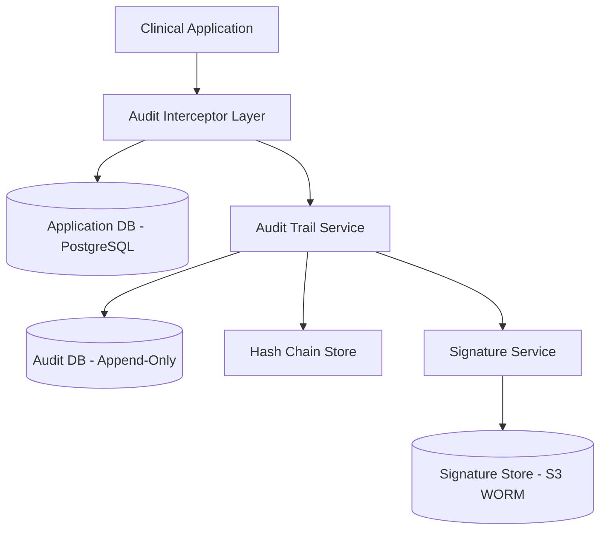

### Story Context

**Day 4 at PharmaSync. 9:14am.**

You are still reading onboarding docs when Tariq Osei appears in the doorway of the small conference room you've claimed as a temporary desk.

"Close your laptop," he says. "Something just happened."

---

**#incidents — Slack**

**9:07am — Tariq Osei [Engineering Manager]**
> @channel FDA warning letter received by Valorex Pharma (customer). Related to their STAR-291 trial data. Pulling their PharmaSync config now.

**9:09am — Preethi Nair [Regulatory Affairs]**
> I'm on a call with Valorex's VP of Regulatory now. The letter cites data integrity issues under 21 CFR Part 11. Specifically:
> - No audit trail on record modifications
> - Electronic signatures not meeting 11.50 requirements
> - No system access controls documentation
> This is not a minor finding. They have 30 days to respond or FDA may issue a clinical hold on STAR-291.

**9:11am — Tariq Osei**
> @preethi what trial phase is STAR-291?

**9:12am — Preethi Nair**
> Phase 2. 340 patients enrolled. They're 14 months into a 24-month trial.
> A clinical hold means everything stops. Potentially permanently.

**9:14am — Tariq Osei**
> @here we have 2 active trials (NEXO-18, APEX-77) running on the same platform configuration as Valorex. If they're non-compliant, we almost certainly are too. Everyone drop what they're doing.

---

**Conf room, 9:31am. You, Tariq, Preethi Nair.**

Preethi pulls up the FDA warning letter on a shared screen. It's six pages long, dense with regulatory citations.

"Walk me through what Part 11 actually requires," Tariq says, looking at you.

"I read the regulation this morning," you say. "ALCOA principles. Attributable — every record must be traceable to the person who created it. Legible — records must be readable now and in the future. Contemporaneous — recorded at the time the activity occurred. Original — first capture, not a copy. Accurate — free from error."

"Right," Preethi says. "And Part 11 specifically adds: audit trails that capture date, time, prior value, new value, and the identity of the person who made the change. For every modification. Not just creates. Every modification."

"Our current audit log," Tariq says, "captures creates and deletes. Not modifications. And it doesn't capture prior value."

Silence.

"How long has it been like this?" you ask.

"Since we launched the platform in 2020."

---

**Slack DM — Preethi Nair → You — 10:02am**

> **Preethi**: Before you design anything — read section 11.10(e) carefully. "Use of computer-generated, time-stamped audit trails to independently record the date and time of operator entries and actions that create, modify, or delete electronic records." The word "independently" is load-bearing. The audit trail must be separate from the record itself. A record cannot audit itself.

> **You**: So the audit trail can't be a column in the same table as the record?

> **Preethi**: Correct. If I can modify the record row, I can modify the audit column. That defeats the purpose. The trail must be in a system where the application cannot update it — only append.

> **You**: What about electronic signatures? The letter calls out 11.50.

> **Preethi**: 11.50 requires the signature to contain: the full name of the signer, the date and time of signing, and the meaning of the signature (review, approval, authorship). The signature must be permanently linked to the record. If the record is deleted, the signature record must still exist showing what was signed.

> **Preethi**: One more thing. 11.100 — each electronic signature must be unique to one individual and not reused. A shared service account signing records is a violation.

---

**Email — From: Valorex VP Regulatory → Preethi Nair — 10:45am**
**Subject: RE: STAR-291 Warning Letter Response Timeline**

> Preethi —
>
> Our legal team has reviewed the warning letter. We have 30 days to respond to FDA with:
> 1. Root cause analysis
> 2. CAPA (Corrective and Preventive Action) plan
> 3. Evidence that remediation is underway
>
> For items 1 and 3, we need PharmaSync to provide:
> - Audit architecture documentation showing how Part 11 will be satisfied
> - A timeline for implementation
> - Evidence that the new architecture has been validated
>
> I want to be clear: if this trial goes on clinical hold, we lose approximately $18M in sunk costs and 14 months of enrollment. Our board is aware. This is not a routine compliance discussion.
>
> — Ingrid Hoffmann, VP Regulatory Affairs, Valorex Pharma

---

**1:1 — Tariq Osei → You — 11:15am**

> **Tariq**: "You're the newest person here, which means you haven't built bad habits yet with our existing system. I need you to design the Part 11 compliance architecture from scratch. Not patch what exists. Assume the existing audit system is gone and build what should have been there from day one."

> **You**: "How much of the existing system can I break to do this?"

> **Tariq**: "None of it. NEXO-18 and APEX-77 are live trials. We cannot take downtime. Whatever you design has to be deployable alongside the existing system while we migrate."

> **You**: "What's the timeline?"

> **Tariq**: "Valorex's lawyers want architectural documentation in 10 days. We need a defensible design they can put in their FDA response. Implementation after that — but the design needs to be solid enough that Preethi would stake her FDA career on it."

He pauses.

> **Tariq**: "She literally would be. She's signing the regulatory response."

---

**Slack DM — Marcus Webb → You — 2:47pm**

> **Marcus**: Heard you landed at PharmaSync. Congratulations on immediately being handed an FDA crisis.
> Couple of things I've seen go wrong with Part 11 implementations.
> First: engineers treat it as a logging problem. It's not. It's a trust chain problem.
> The question is: who can you trust, and to what extent?
> Second: "append-only" sounds simple until you realize append-only at the database level is different from append-only at the application level.
> What does your threat model say about a compromised database admin?

> **You**: We'd need a separate audit database that the app DB admin can't write to directly.

> **Marcus**: Good. And what about the audit database admin?

> **You**: ...hardware timestamp authority? Cryptographic signing of audit records?

> **Marcus**: Now you're asking the right questions. The FDA doesn't require cryptographic signing. But it does require that the audit trail be "protected against editing and deletion." Figure out what that means at every layer of your stack. Don't just build what gets you past the letter. Build what actually protects the trial data.

---

### Problem Statement

PharmaSync's current audit logging system does not meet FDA 21 CFR Part 11 requirements. It captures record creation and deletion but not modifications, does not capture prior values, and is co-located with application data in a way that allows modification. Electronic signatures are stored as simple boolean flags with no metadata.

You must design a compliant electronic records and electronic signatures (ERES) platform that satisfies 21 CFR Part 11 for all PharmaSync customers running active clinical trials — without taking the live system offline during the migration.

### Explicit Requirements

1. Audit trail must capture: date, time, prior value, new value, user identity for every create, modify, and delete operation on clinical records
2. Audit trail must be "independently maintained" — separate from the records being audited, not modifiable by the application
3. Electronic signatures must capture: full name, date/time, meaning of signature (review/approval/authorship)
4. Each electronic signature must be linked permanently to the specific record version it signed
5. User identity must be unique — no shared service accounts for record authorship
6. Audit trail must be queryable (FDA inspectors need to view full record history)
7. System must be available 99.9% uptime during active trials
8. The solution must not require downtime on the existing NEXO-18 and APEX-77 trials

### Hidden Requirements

- **Hint**: Re-read Preethi's Slack DM. She says "The audit trail must be in a system where the application cannot update it — only append." What does this mean for your database user privilege model? If the application's database user can INSERT and UPDATE audit records, the system is non-compliant regardless of application-level controls.

- **Hint**: Re-read Marcus Webb's final question — "What about the database admin?" The FDA requires protection "against editing and deletion." A database admin with root access can truncate any table. What architecture prevents this? (Think: append-only event streams, write-once object storage, cryptographic hash chaining.)

- **Hint**: Re-read Valorex's email. They need "evidence that the new architecture has been validated." Validation documentation (IQ/OQ/PQ) is a deliverable alongside the architecture. The design must include a validation approach. (See Ch. 222 for full treatment.)

- **Hint**: Ingrid Hoffmann mentions "CAPA plan." Part 11 requires that if a violation is discovered, the corrective action itself must be documented in the audit trail. The system you design must be capable of auditing its own migration process.

### Constraints

- **Live trials**: NEXO-18 (Phase 2, 280 patients), APEX-77 (Phase 3, 1,200 patients) — zero downtime acceptable
- **Data volume**: ~50,000 clinical records across active trials, ~2,000 modifications/day
- **Audit trail retention**: 21 CFR Part 11 requires retention for at least the lifetime of the study plus 2 years; typically 7-15 years
- **Query SLA**: FDA inspector audit trail queries must complete in < 30 seconds
- **Team**: 7 engineers, 2 data scientists
- **Timeline**: Design documentation in 10 days; implementation in 60 days
- **Infrastructure**: AWS (us-east-1 primary), existing PostgreSQL on RDS, existing Node.js/TypeScript API layer

### Your Task

Design the complete 21 CFR Part 11 compliant electronic records and electronic signatures (ERES) architecture for PharmaSync. The design must address the trust chain at every layer: application, database, infrastructure, and cryptographic.

### Deliverables

- [ ] Mermaid architecture diagram showing the complete ERES system including audit trail storage, electronic signature service, identity management, and their separation from the application database
- [ ] Database schema for: `audit_trail` table (with column types and indexes), `electronic_signatures` table, `audit_trail_hash_chain` table
- [ ] Scaling estimation:
  - Current: 50K records × ~40 modifications/record lifecycle = 2M audit events
  - Growth: 3 new trials/quarter × 5,000 patients each × 50 events/patient = 750K events/quarter
  - Storage math: audit event average size, 7-year retention total
  - Query performance: how to serve inspector queries at scale
- [ ] Tradeoff analysis (minimum 3):
  - Append-only audit DB (PostgreSQL RLS) vs. write-once object storage (S3) vs. dedicated audit service (Immudb)
  - Cryptographic hash chaining vs. hardware timestamp authority (HSM) vs. external notarization
  - Synchronous audit writes (guaranteed consistency, adds latency) vs. async audit via CDC (performance, slight consistency risk)
- [ ] Cost modeling: estimate monthly AWS cost for audit infrastructure at current + 12-month projected scale
- [ ] Capacity planning: 18-month horizon with 3 new trials/quarter
- [ ] Migration plan: how to deploy this alongside live trials without downtime, including how to audit the migration itself

### Diagram Format

All architecture diagrams in Mermaid syntax.

Expand this significantly in your deliverable — include identity service, inspector query API, hash chain verification endpoint, and the database privilege model showing what each DB user can and cannot do.
