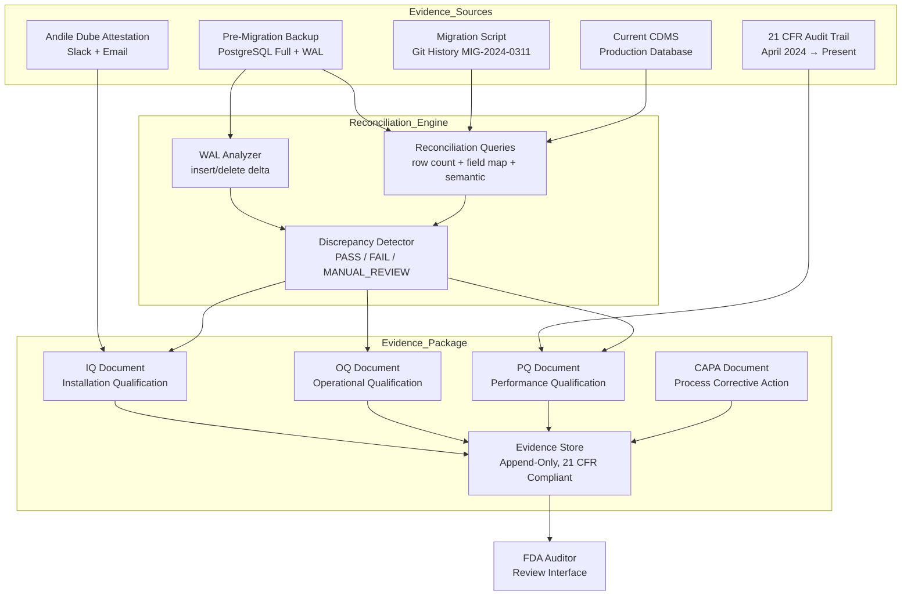

### Story Context

The email arrives on a Tuesday at 6:48 AM. You are on your second coffee. The subject line is eight words and they are not good words.

---

**From**: Dr. Fatima Diallo (Validation Lead, PharmaSync)
**To**: You, Rajesh Subramaniam (CTO), Nadia Osei (VP Regulatory Affairs)
**Subject**: FDA 510(k) Audit — Validation Gap — URGENT ACTION REQUIRED
**Date**: Tuesday, 07:48 AM EST

Rajesh, Nadia —

TÜV Rheinland has completed the pre-audit gap assessment on our 510(k) submission for the Clinical Data Management System (CDMS v3.0). They flagged one critical finding.

The validation protocol (IQ/OQ/PQ — Installation, Operational, and Performance Qualification) references database migration `MIG-2024-0311` as a validated configuration change. However:

1. The migration was executed on March 11, 2024.
2. The IQ/OQ/PQ protocol was written *after* the migration — specifically, the migration completion was cited as evidence of Installation Qualification, but no formal validation protocol existed *at the time of the migration*.
3. The migration touched **2,347,891 clinical records** across 14 study datasets.
4. 21 CFR Part 11 §11.10(a) requires that systems be validated to ensure accuracy, reliability, consistent intended performance, and ability to discern invalid or altered records. A post-hoc validation document does not satisfy this requirement.

The FDA audit is in **10 days**.

I want to be absolutely clear: I am not asking us to lie. I am not asking us to backdate documents. I am asking us to design a **retroactive validation evidence package** that is honest about what happened, demonstrates that the migration produced correct results despite the documentation gap, and addresses the process failure with a corrective action plan.

This is a compliance architecture problem. We need a plan by Thursday EOD.

— Fatima

---

**[Reply — Rajesh Subramaniam → All]** — 08:14 AM

Fatima — understood. Please loop in [you] on this directly. I want a plan of record by Thursday. If we cannot produce an honest, defensible validation package, we need to know that now, not in ten days.

This is not about protecting the company. This is about whether our system is actually safe to use for clinical data. Start there.

---

**[DM — Dr. Fatima Diallo → You]** — 08:22 AM

**Dr. Fatima Diallo**: Are you free to talk at 9?

**You**: Yes.

**Dr. Fatima Diallo**: I'll send a Teams link. I need you to understand something before we start. I have been a validation lead for nineteen years. I have been in FDA audits where someone tried to paper over a gap. Every single time, the auditor found it. The ones who survived were the ones who told the truth, showed their work, and demonstrated corrective action. That is the only strategy I am willing to pursue.

**You**: Understood. What do we have?

**Dr. Fatima Diallo**: We have everything the migration produced. We have the pre-migration backup. We have the post-migration row counts. We have the application logs. We have user acceptance testing records from the month after the migration. We have the system's audit trail logs showing no data was altered after migration. What we do not have is a *prospective* validation protocol that was approved before the migration ran.

**You**: So the question is: can we construct a retroactive IQ/OQ/PQ that demonstrates the migration met the validation criteria — and be honest that it was retroactive?

**Dr. Fatima Diallo**: Exactly. And we attach it to a CAPA — Corrective and Preventive Action — that says: here is what we should have done, here is why we did not do it, here is what we have changed so it never happens again. FDA does not expect perfection. They expect honesty and control.

**You**: What's the hardest part technically?

**Dr. Fatima Diallo**: Proving data integrity. The migration moved 2.3 million clinical records from a legacy schema to the new CDMS schema. We need to demonstrate that every record arrived intact, every field mapped correctly, and no data was lost, duplicated, or silently altered. That is a data lineage problem. And we have 10 days to build the proof.

---

**[Call notes — 9:04 AM]**

You spend the first twenty minutes of the call understanding what actually happened in `MIG-2024-0311`.

The migration was a schema normalization. The legacy system stored clinical observations in a single wide table with 87 columns, many nullable, with free-text encoding for structured fields (e.g., dosage stored as "10mg BID" in a VARCHAR rather than a numeric amount + unit + frequency in separate columns). The new CDMS schema is properly normalized: separate tables for observations, dosage, adverse events, and subject demographics, with typed columns and controlled vocabularies.

The migration was written by a contractor — Andile Dube — who left PharmaSync four months after the migration ran. The migration script is in version control. The script ran in 3 hours and 12 minutes. There was no pre-migration dry run on production data. There was no reconciliation query run after migration. There was a Slack message from Andile to Rajesh that read: "Migration complete. Spot-checked 500 records. Looks good."

That Slack message is currently the only contemporaneous evidence of migration validation.

**Dr. Fatima Diallo**: "Looks good" is not a validation record under 21 CFR Part 11.

You are quiet for a moment.

**You**: The data is still there. The original backup is still there. We can run the reconciliation queries now. If the data is correct — and there's a reasonable chance it is, because the system has been in production use for nine months with no data integrity complaints from any clinical trial coordinator — then we can produce the proof retroactively and be transparent that we're doing so.

**Dr. Fatima Diallo**: That is exactly the approach. But the reconciliation queries need to be airtight. If we produce a validation report that says "99.97% of records reconciled correctly" and the auditor finds the 0.03%, we have made it worse, not better.

**You**: Then we find the 0.03% first.

---

**[DM — Marcus Webb → You]** — 11:45 AM (same day)

**Marcus Webb**: Heard you're doing FDA validation archaeology. Done it once. 2007, medical device software at a company in Minnesota. The team tried to reconstruct audit trails from application logs because the actual audit table had been truncated. Lesson: the database *always* knows more than the application thinks it wrote. Check the WAL. Check the backup transaction logs. The truth is in there somewhere.
Also: don't let legal near this until you have the technical picture. Legal will turn "we made a process mistake and corrected it" into "we cannot confirm or deny" and that is always worse.

---

### Problem Statement

PharmaSync's clinical data management system (CDMS v3.0) is subject to an FDA 510(k) audit in 10 days. A pre-audit gap assessment found that database migration `MIG-2024-0311` — which moved 2,347,891 clinical records to a new normalized schema — was executed without a prospective validation protocol, violating 21 CFR Part 11 §11.10(a) requirements.

The system has been in production for 9 months. There is no evidence of data corruption — but there is also no formal proof of data integrity at migration time. You must design a retroactive validation evidence package that: (a) honestly documents what happened; (b) produces rigorous technical proof that the migration produced correct results; (c) identifies any data integrity gaps; and (d) attaches a CAPA (Corrective and Preventive Action) plan that satisfies FDA expectations for process improvement. The package must be complete and defensible in 10 days without falsifying any documentation.

---

### Explicit Requirements

1. Produce a retroactive IQ/OQ/PQ structure that honestly represents the migration timeline and clearly labels sections as retrospective evidence.
2. Design and specify the data reconciliation queries that prove migration correctness: row count parity, field-level mapping verification, data type conversion accuracy, and referential integrity across the new normalized schema.
3. The reconciliation must cover all 2,347,891 records across 14 study datasets.
4. Any records that cannot be fully reconciled must be identified, documented, and assessed for clinical significance.
5. The validation package must include a formal audit trail demonstrating the chain of custody from pre-migration backup → migration execution → post-migration state.
6. The CAPA must describe the process failure, root cause, immediate corrective action, and long-term preventive action with named owners and completion dates.
7. All validation evidence must be stored in a 21 CFR Part 11-compliant audit trail: append-only, timestamped, non-repudiable, with electronic signature support.
8. The complete package must be ready for FDA auditor review within 10 days.

---

### Hidden Requirements

1. **Hint: re-read Marcus Webb's DM about the WAL.** "The database always knows more than the application thinks it wrote." The hidden requirement is that the pre-migration PostgreSQL backup includes the write-ahead log (WAL) segments from the migration window. These WAL segments contain the exact sequence of every write made during the 3-hour-12-minute migration — including any rows that were inserted and then deleted (which would not appear in a final row count reconciliation). The WAL is the most authoritative source of migration truth available and must be analyzed as part of the evidence package.

2. **Hint: re-read Dr. Fatima Diallo's description of the legacy schema.** "Free-text encoding for structured fields — dosage stored as '10mg BID' in a VARCHAR." The hidden requirement is that the migration performed *semantic transformation* (parsing free text into structured fields), not just structural transformation (moving rows between tables). Semantic transformations can fail silently: "10mg BID" parses correctly, but "10 MG twice daily" or "10mg b.i.d." might not. The reconciliation must verify that free-text-to-structured-field conversions were applied correctly — or flag records where the conversion result cannot be machine-verified and require manual clinical review.

3. **Hint: re-read Rajesh's email: "If we cannot produce an honest, defensible validation package, we need to know that now, not in ten days."** The hidden requirement is that the validation package must include a **worst-case disclosure document**: a clear, pre-prepared statement of what the data integrity gap is *if* the reconciliation finds errors, what the clinical impact would be, and what the remediation plan is. FDA auditors expect companies to have thought through their failure scenarios. Arriving at an audit without a disclosure-ready document suggests the company is hoping not to find errors rather than managing the risk of finding them.

4. **Hint: re-read the note about the contractor Andile Dube's Slack message: "Spot-checked 500 records. Looks good."** The hidden requirement is that the 500-record spot check is potentially *evidence* — not conclusive evidence, but a contemporaneous attestation that a qualified person reviewed the output. The validation package must assess whether this spot check, combined with 9 months of production use without reported data errors, constitutes sufficient post-hoc operational validation to satisfy the "consistent intended performance" criterion in 21 CFR Part 11 §11.10(a). The answer may be "yes, partially" — and a partial credit argument, honestly made, is better than ignoring the evidence entirely.

---

### Constraints

- Migration date: March 11, 2024 (9 months ago)
- Records migrated: 2,347,891 across 14 study datasets
- Legacy schema: single wide table, 87 columns, VARCHAR-encoded structured fields
- New CDMS schema: fully normalized, 23 tables, typed columns, controlled vocabularies
- Pre-migration backup: available (full PostgreSQL backup + WAL segments from migration window)
- Migration script: available in Git history (Python, 847 lines)
- Post-migration data: currently in production CDMS
- Contractor (Andile Dube): no longer at company; reachable via email for attestation
- 21 CFR Part 11 audit trail system: implemented in Ch. 216, operational since April 2024
- Time to FDA audit: 10 days
- Team available for validation work: Fatima Diallo (validation lead), you (architecture), 2 senior engineers for query development
- Rajesh Subramaniam: available for executive signature on CAPA
- Budget: unlimited for this work — the 510(k) submission is worth approximately $18M in SaaS revenue if approved

---

### Your Task

Design the retroactive validation evidence package for migration `MIG-2024-0311`. This includes: the IQ/OQ/PQ structure with retrospective labeling, the data reconciliation architecture (queries, sampling strategy, discrepancy handling), the audit trail chain of custody design, and the CAPA. You must also design the infrastructure that will execute and store the reconciliation evidence in a 21 CFR Part 11-compliant way — because the reconciliation itself must be auditable.

---

### Deliverables

- [ ] **Mermaid architecture diagram**: validation evidence generation pipeline — pre-migration backup → WAL analysis → migration script static analysis → post-migration CDMS → reconciliation engine → discrepancy report → evidence package store (append-only, 21 CFR Part 11-compliant)
- [ ] **Database schema** for the validation evidence store:
  - `validation_evidence` table: evidence_id, evidence_type (IQ/OQ/PQ/RECONCILIATION/CAPA), study_dataset_id, record_count_expected, record_count_actual, discrepancy_count, discrepancy_severity, generated_at, generated_by, electronic_signature_hash, parent_evidence_id
  - `migration_record_audit` table: record_id (legacy), record_id_new (CDMS), field_map_json, semantic_conversion_result (PASS/FAIL/MANUAL_REVIEW), reconciliation_run_id, verified_at
  - Indexes for: study_dataset + reconciliation_run, semantic_conversion_result (for flagging failures)
- [ ] **Reconciliation query design** (pseudocode):
  - Row count parity query per study dataset
  - Field mapping verification query (sample: dosage free-text → structured fields)
  - Referential integrity check across normalized tables
  - Semantic conversion failure detection (regex mismatch, unparseable values)
  - WAL-based insertion/deletion discrepancy query
- [ ] **IQ/OQ/PQ document structure** (outline with section headings and honest retrospective labels):
  - IQ: Installation Qualification — what was the system state before and after migration?
  - OQ: Operational Qualification — does the system perform as specified under defined conditions?
  - PQ: Performance Qualification — does the system consistently perform correctly under production load?
  - Each section: what evidence exists, what is retrospectively constructed, what is missing and why
- [ ] **CAPA document structure**:
  - Problem statement
  - Root cause analysis (5-why)
  - Immediate corrective action (already taken)
  - Long-term preventive action (process changes, tooling changes, owner, completion date)
  - Effectiveness verification plan
- [ ] **Scaling estimation** (show math):
  - Reconciliation query execution time: 2.3M records × average join complexity = estimated query runtime at current CDMS hardware
  - WAL segment analysis: 3h12m of WAL at average write rate = estimated WAL data volume to parse
  - Evidence package storage: how many rows in `migration_record_audit` table, what is storage size?
- [ ] **Tradeoff analysis** (minimum 3):
  - Full reconciliation (every record) vs. statistical sampling (95% confidence interval) — completeness vs. 10-day timeline
  - Retroactive validation with honest labeling vs. not disclosing the gap — regulatory risk comparison
  - Machine-verified reconciliation vs. manual clinical review for semantic conversion failures — accuracy vs. speed
  - Engaging Andile Dube for attestation vs. relying on production operational evidence alone

### Diagram Format

All architecture diagrams: Mermaid syntax (renders in GitHub Issues).

> Note: The diagram above is a starter scaffold. Your deliverable must expand the Reconciliation Engine subgraph to show the specific query types (row count parity, semantic conversion verification, WAL delta analysis) and must add the electronic signature workflow: each evidence document requires a named signer, a timestamp, and a hash that is appended to the audit chain.
