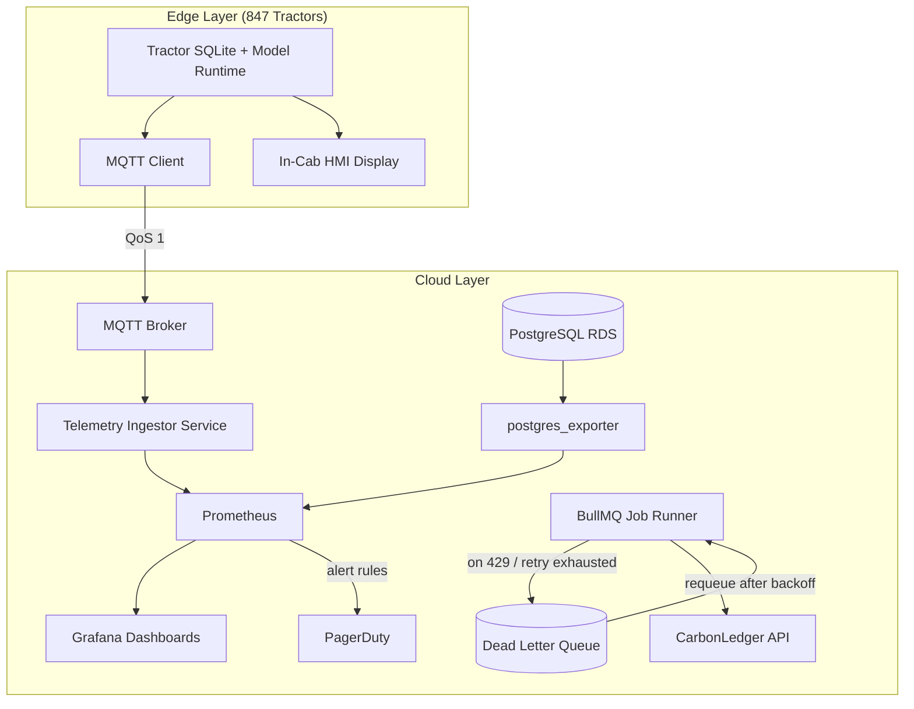

### Story Context

---

**[INTERNAL DOCUMENT — HarvestAI Engineering]**
**Document type**: Blameless Postmortem — End-of-Season Incident Review
**Date**: March 24, 2026
**Facilitator**: Priya Sundaram, Head of Engineering
**Scribe**: Raj Patel, Infrastructure Engineering
**Participants**: Dr. Aisha Kamara (Lead Data Scientist), Carlos Mendes (Senior Engineer, Brazil & Southern Cone), Raj Patel, Priya Sundaram
**Severity**: Three P2 incidents consolidated for review
**Distribution**: Engineering All-Hands, CTO, VP of Customer Success

---

**OPENING NOTE — Priya Sundaram**

This document is blameless. We are here to understand what happened and why our systems allowed it to happen. We are not here to identify who made a mistake. We shipped a planting season on minimal sleep across three continents and four timezones. The systems mostly held. "Mostly" is what we are here to fix.

Three incidents. Three different failure modes. All three were preventable. None of them required heroics to resolve — they required monitoring we did not have.

We will not leave this meeting without concrete action items, owners, and due dates.

Let's go.

---

**INCIDENT 1 — Geospatial Query Regression**
*Presented by: Raj Patel*

**Timeline**

| Time (UTC) | Event |
|---|---|
| 2026-03-08 06:14 | Planting-season dashboard load times begin climbing. P95 latency for `/api/v2/field-analysis` crosses 8 seconds. |
| 2026-03-08 06:29 | First customer complaint via support chat: "Maps are frozen, I can't see my planting zones." (Farm ID: BRA-0041, Mato Grosso, Brazil) |
| 2026-03-08 06:31 | Carlos flags elevated response times in #eng-brazil Slack channel. |
| 2026-03-08 06:44 | Raj pages on-call. Identifies database CPU at 94% on primary. Suspects query regression. |
| 2026-03-08 07:02 | Query analysis begins. `EXPLAIN ANALYZE` run on geospatial join query — sequential scan on `field_geometries` (38M rows). Estimated cost: 2.1M. Actual runtime: 45 seconds. |
| 2026-03-08 07:09 | Root cause identified: `auto_analyze` was disabled on `field_geometries` table in October 2025 during a bulk data import from the Mato Grosso state agricultural registry (220K new field polygons). It was never re-enabled. Statistics were 5 months stale. |
| 2026-03-08 07:14 | Manual `ANALYZE field_geometries;` executed. Query planner switches to GiST index scan. Query time drops to 180ms. |
| 2026-03-08 07:18 | Incident resolved. Duration: 2 hours 4 minutes. Affected farms: ~800 across Brazil and Argentina. |

**Contributing Factors**

1. `auto_analyze` was disabled as a deliberate, time-limited performance optimization during the October bulk import. The Jira ticket tracking re-enablement was closed with "resolved" status when the import finished — not when `auto_analyze` was re-enabled. These were treated as the same task.

2. We have no alerting on PostgreSQL statistics age. The `pg_stat_user_tables.last_analyze` column is queryable. We do not query it.

3. The geospatial query had never been tested against a statistics-stale database in our staging environment. Staging is refreshed from production snapshots monthly. The last refresh was February 1.

4. The GiST index on `field_geometries.polygon` exists and is correct. The planner simply chose not to use it because its cost estimate was based on October statistics that described a table one-sixth its current size.

**What went well**: Carlos's Slack message came 2 minutes after the first symptoms. Raj had `EXPLAIN ANALYZE` running within 15 minutes. We identified root cause without a full rollback. No data was lost.

**What did not go well**: 800 farms could not see their planting zone data during peak morning hours in Brazil. We found the problem by looking at a query plan, not because a monitor told us the statistics were stale.

---

**INCIDENT 2 — Carbon Credit Submission Silent Failure**
*Presented by: Carlos Mendes*

"I want to start by saying this one is the one I keep thinking about at night. The other two were latency and stale predictions. This one was money. Forty farms didn't get paid."

**Timeline**

| Time (UTC) | Event |
|---|---|
| 2026-03-10 02:00 | Scheduled job `carbon-credit-submitter` begins nightly batch submission to CarbonLedger API. Processes 1,847 farm submissions from the prior 24-hour window. |
| 2026-03-10 02:11 | CarbonLedger API begins returning HTTP 429 (Too Many Requests). Our job implements retry with exponential backoff, max 3 attempts. |
| 2026-03-10 02:14 | After 3 failed attempts per record, job begins writing failures to `submission_errors` table. Records are not re-queued. |
| 2026-03-10 02:31 | Job completes. Exit code: 0. Logs show 1,807 successes, 40 failures. Job reports success because it completed without throwing an uncaught exception. |
| 2026-03-10 02:31 | No alert fires. No Slack message. No PagerDuty notification. Nothing. |
| 2026-03-12 09:17 | Customer support receives email from Fazenda Esperança (Farm ID: BRA-0219): "Our carbon credits for March 10 were not submitted. CarbonLedger shows no record. Please advise." |
| 2026-03-12 09:41 | Support escalates to Carlos. Carlos queries `submission_errors`. Finds 40 records. Discovers the pattern: all 40 farms are in the São Paulo state region, which was added to our carbon program in January 2026. Their submissions were clustered in the same API call window as a large Minas Gerais batch. |
| 2026-03-12 10:15 | Carlos manually resubmits 40 records via a script. CarbonLedger accepts all 40. Two days late. |
| 2026-03-12 10:30 | Carlos notifies affected farms via email. |
| 2026-03-13 | CarbonLedger confirms submissions are processed but flags them as late. Farms receive credits but miss the early-submission pricing window. Estimated revenue impact: $3,200 across 40 farms (~$80/farm on average). |

**Contributing Factors**

1. The job's definition of "success" was "did not crash." Partial success (40 of 1,847 failures) was not treated as an alertable condition. This is a fundamental error in job design: **exit code conflates process health with business outcome.**

2. There was no monitoring on `submission_errors` table row count. A simple query — `SELECT COUNT(*) FROM submission_errors WHERE created_at > NOW() - INTERVAL '24 hours'` — would have caught this within minutes of the job completing.

3. The CarbonLedger rate limit was undocumented in our runbook. It was 500 requests per 10-minute window. We were submitting 1,847 in sequence with no burst throttling on our side. We hit the ceiling approximately 11 minutes in.

4. No dead-letter queue or retry queue existed for this job. Failed records went into an error table that was read only by humans, not by any automated process.

5. The affected farms were all new to the carbon program (added January 2026). Onboarding did not include validation that their submission volume would stay within rate limits.

"I wrote this job in November," Carlos said, looking at the table. "I thought the retry logic was sufficient. I didn't think about what happens when the retry logic fails. I should have."

Priya interrupted: "Carlos. That's the kind of thing we say before we figure out what the system should have done differently. The system should not have let 40 silent failures sit for 48 hours. The system failed here, not you."

**What went well**: Manual resubmission worked. CarbonLedger accepted all 40 late submissions. Customer communication was handled within the same business day the issue was discovered.

**What did not go well**: 48-hour detection gap. Revenue impact to customers. No automated requeue mechanism.

---

**INCIDENT 3 — Tractor SQLite Schema Migration Corruption**
*Presented by: Dr. Aisha Kamara*

"This one is mine. The model update process was mine. I want to walk through exactly what happened."

**Timeline**

| Time (UTC) | Event |
|---|---|
| 2026-03-14 11:00 | Aisha pushes model update package v2.4.1 to OTA delivery queue. Update includes: new fertilizer-rate prediction model, updated feature pipeline, and a SQLite schema migration (adds `nitrogen_estimate_v2` column to `field_predictions` table). |
| 2026-03-14 11:00–14:00 | OTA package delivered to 847 tractors. 827 tractors complete update successfully. 20 tractors in the São Paulo cluster receive the package but report `MIGRATION_FAILED` status. |
| 2026-03-14 14:00 | OTA system marks 20 tractors as `UPDATE_FAILED`. No alert is sent to the Data Science team. Alert goes to the device management queue, which is monitored by the IoT ops team. IoT ops team is at a tradeshow in Ribeirão Preto. |
| 2026-03-14 14:00–next morning | 20 tractors continue operating using the local SQLite database. The migration failure left the database in a partially-migrated state: the new schema was applied, but the migration script's `CREATE TABLE IF NOT EXISTS field_predictions_new` had already run, leaving the old table orphaned. The tractor software reads from the new table, which is empty. All predictions return null. The tractor software's null-handling logic falls back to a hardcoded default: "apply medium rate." |
| 2026-03-14 14:00–2026-03-15 08:00 | 20 tractors operate for approximately 18 hours on stale/default predictions. Operators notice nothing unusual — medium-rate fertilization looks normal. |
| 2026-03-15 08:12 | Farm manager at Fazenda Vitória (Farm ID: SP-0088) calls support: "Our tractor says medium rate everywhere. That's not right for this field. Something is wrong." |
| 2026-03-15 09:00 | Aisha is paged. Investigates OTA log. Discovers 20 failed migrations. |
| 2026-03-15 09:45 | Root cause identified: the migration script used `ALTER TABLE field_predictions ADD COLUMN nitrogen_estimate_v2 REAL;` — this is valid SQLite 3.37+. The 20 affected tractors are running SQLite 3.35.5, shipped with their firmware version from 2023. `ADD COLUMN` with no default value fails on SQLite < 3.37 when the column has no default. |
| 2026-03-15 10:30 | Rollback package v2.4.0 pushed to 20 affected tractors. Tractors restore from pre-migration snapshot (we do take snapshots before migration — this saved us). |
| 2026-03-15 11:15 | All 20 tractors operational with v2.4.0. |
| 2026-03-15 14:00 | Fixed migration script (adds `DEFAULT NULL`) tested against SQLite 3.35.5, 3.36, 3.37, 3.38 in CI. v2.4.2 pushed to affected tractors. |
| 2026-03-15 15:30 | All 847 tractors on v2.4.2. |

**Contributing Factors**

1. The CI pipeline for model updates did not test against the full fleet's SQLite version range. We tested against SQLite 3.38 (current). The fleet spans SQLite 3.34 through 3.39 across hardware generations. This was known, undocumented, and unaddressed.

2. The migration was not backwards-compatible. Adding a column with no default value is a breaking change on older SQLite versions. A `DEFAULT NULL` would have made this a non-issue.

3. The OTA failure alert routing sent `UPDATE_FAILED` events to the device management queue, not to the team that owns the update artifact (Data Science). No one who knew the migration existed was paged.

4. The fallback behavior for null predictions was "apply medium rate." This is reasonable for a brief cache miss. It is not appropriate for an 18-hour outage. The null-fallback should have triggered an alert after more than 15 minutes of null predictions on a moving tractor.

5. We had no integration test that simulated a partial migration failure and verified that the pre-migration snapshot restore path worked correctly. The snapshot mechanism worked — but we had never tested it in a real scenario.

"The snapshot saved us," Aisha said. "If we hadn't taken a pre-migration snapshot, those 20 tractors would have needed a manual SQLite database rebuild in the field. That means a technician driving to 20 farms across São Paulo state. We got lucky that we built the right thing for the wrong reason."

---

**CONSOLIDATED ACTION ITEMS**

| # | Action | Owner | Due | Priority |
|---|---|---|---|---|
| A1 | Re-enable `auto_analyze` on all production tables. Add Terraform config to enforce it. | Raj | 2026-03-28 | P1 |
| A2 | Add PostgreSQL statistics-age alerting: alert if `last_analyze` > 7 days on any table > 1M rows | Raj | 2026-04-04 | P1 |
| A3 | Require `auto_analyze` re-enablement as an explicit step in the runbook for any bulk import > 100K rows | Raj | 2026-04-04 | P2 |
| A4 | Rebuild `carbon-credit-submitter` with dead-letter queue (DLQ) and automatic retry via BullMQ | Carlos | 2026-04-11 | P1 |
| A5 | Add alerting: fire PagerDuty if `submission_errors` has > 0 new rows after any job run | Carlos | 2026-04-04 | P1 |
| A6 | Add CarbonLedger rate limit to the job: 450 req / 10-min window, burst throttle in BullMQ config | Carlos | 2026-04-11 | P1 |
| A7 | Add job-level business-outcome metrics: `submissions.attempted`, `submissions.succeeded`, `submissions.failed` as Prometheus counters | Carlos | 2026-04-11 | P2 |
| A8 | Expand CI pipeline for model updates to test SQLite migrations against all fleet SQLite versions (3.34–3.39) | Aisha | 2026-04-04 | P1 |
| A9 | Mandate `DEFAULT NULL` (or explicit default) for all `ADD COLUMN` migrations in the edge SQLite schema | Aisha | 2026-03-28 | P1 |
| A10 | Fix OTA alert routing: `UPDATE_FAILED` events must also notify the artifact owner team (Data Science), not only IoT ops | Raj + Aisha | 2026-04-04 | P1 |
| A11 | Add edge-device staleness alert: if any tractor returns null predictions for > 15 consecutive minutes during operating hours, page on-call | Aisha | 2026-04-11 | P2 |
| A12 | Add integration test for migration rollback path (simulate failure, verify snapshot restore completes cleanly) | Aisha | 2026-04-18 | P2 |

---

**CLOSING — Priya Sundaram**

"Three incidents. Zero data loss. Zero safety events. Partial revenue impact to customers that we are working to make right. The system mostly held.

But I want to be honest with you all: if Carlos's support ticket had come in one day later, we would have had 40 farms wondering where their credits went at end-of-season settlement. If Fazenda Vitória's farm manager hadn't called us, those 20 tractors would have run on default predictions for the entire week. We got lucky twice.

We are a Staff-level engineering team. 'Getting lucky' is not a reliability strategy.

The pattern across all three incidents is the same: **we optimized for the happy path and did not design for observable failure.** The geospatial bug was observable — we chose not to observe it. The carbon job failure was observable — we chose to treat process-exit-zero as success. The tractor migration failure was observable — we routed the alert to the wrong team.

Every one of these action items is about making failure loud. That's what we're building next."

---

### Problem Statement

HarvestAI completed its first full planting season at scale across 847 active farm clients in Brazil and Argentina. The platform survived — but three P2 incidents revealed a systemic gap: the observability and reliability infrastructure was built for happy-path success, not for detecting and surfacing partial failures in distributed, heterogeneous systems (cloud services, edge devices, third-party APIs).

Your task is to design the observability and reliability improvements that would have prevented all three incidents, and to produce a forward-looking architecture that makes failure impossible to miss — whether it occurs in a PostgreSQL query planner, a third-party API integration, or a SQLite database running on a tractor in São Paulo state.

### Explicit Requirements

1. Implement database health monitoring that detects stale query planner statistics before they affect query performance. Alert threshold: `last_analyze` older than 7 days on any table with more than 1 million rows.
2. Rebuild the carbon credit submission job with a durable dead-letter queue, automatic retry, and business-outcome metrics distinct from process-health metrics.
3. Add alerting on job silence: if a scheduled job has not produced a success metric within 10% of its scheduled window, page on-call.
4. Implement CarbonLedger API rate-limit-aware submission with configurable burst throttling (450 requests per 10-minute window).
5. Expand the CI pipeline for edge model updates to test SQLite schema migrations against all SQLite versions present in the active fleet (minimum range: 3.34 through 3.39).
6. Implement OTA update failure alert routing so that `UPDATE_FAILED` events reach both IoT ops and the artifact owner team within 5 minutes of the event.
7. Add edge-device staleness detection: alert if any active tractor returns null predictions for more than 15 consecutive minutes during operating hours (05:00–20:00 local time per farm).
8. All new alerting must route through PagerDuty with severity tiers (P1: immediate page, P2: Slack + ticket, P3: daily digest).

### Hidden Requirements

1. **Hint: re-read Carlos's closing comment about the 40 affected farms being "new to the carbon program" (added January 2026).** What does this imply about how the system validates the submission volume profile of newly onboarded farms before their first batch job run? There is an onboarding validation requirement buried here.

2. **Hint: re-read Aisha's note that "the snapshot mechanism worked — but we had never tested it in a real scenario."** The rollback path is untested in production-equivalent conditions. This implies a need for regular chaos/game-day validation of the snapshot-restore pipeline, not just CI coverage. What does a quarterly edge-device chaos exercise look like?

3. **Hint: re-read the tractor timeline: "Operators notice nothing unusual — medium-rate fertilization looks normal."** The fallback behavior was silent from the operator's perspective. This means the tractor HMI (the in-cab display) did not surface a "running on defaults" warning to the operator. There is a requirement for human-visible degraded-mode indicators at the edge device level, not just cloud-level alerting.

4. **Hint: re-read Raj's Incident 1 contributing factor #3: "Staging is refreshed from production snapshots monthly."** A monthly staging refresh means staging is structurally unable to catch statistics staleness that accumulates over 1–5 months. What is the right refresh cadence, and should staging also run `ANALYZE` as part of the refresh process?

### Constraints

- Fleet: 847 active tractors, SQLite versions 3.34–3.39 across hardware generations
- Active farms: 847 across Brazil and Argentina; ~200 in São Paulo state (carbon program)
- Carbon credit submission volume: approximately 1,800–2,200 submissions per nightly batch
- CarbonLedger API rate limit: 500 requests per 10-minute window (undocumented; discovered empirically)
- Database: PostgreSQL 15 on RDS (primary + 1 read replica); `field_geometries` table: 38M rows, growing ~220K rows per major agricultural registry import
- OTA delivery infrastructure: custom-built; edge devices connect via 4G LTE with intermittent connectivity; average OTA delivery window: 3 hours per fleet-wide push
- Observability stack: Prometheus + Grafana (cloud metrics), Datadog (APM), PagerDuty (alerting); edge device telemetry via MQTT to a cloud broker
- Team size: 4 engineers; on-call rotation shared across all 4
- Budget constraint: no new SaaS observability tools; improvements must use existing stack or open-source additions to it
- Planting season: September–March (Southern Hemisphere). Next season begins September 2026. Action items due before June 2026.

### Your Task

Produce a redesigned observability and reliability architecture that addresses all three incident classes. The design should be actionable by a 4-person team and completable before the next planting season. Include monitoring coverage for cloud infrastructure, third-party API integrations, and edge devices.

### Deliverables

- [ ] **Mermaid architecture diagram**: observability architecture covering cloud DB monitoring, job monitoring with DLQ, and edge device telemetry pipeline (MQTT → cloud → alerting)
- [ ] **Database schema**: updated `submission_errors` table schema and new `job_run_metrics` table schema (with column types and indexes) that support the carbon credit job monitoring requirements
- [ ] **Scaling estimation**: calculate the volume of metrics data generated per day by the full fleet (847 tractors × telemetry frequency) and estimate Prometheus storage requirements over a 90-day retention window
- [ ] **Tradeoff analysis**: minimum 3 explicit tradeoffs in the redesigned architecture (e.g., MQTT QoS 1 vs QoS 2 for edge telemetry; alert sensitivity vs alert fatigue; staging refresh cadence vs infrastructure cost)
- [ ] **Revised job design**: TypeScript interface sketch for the rebuilt `CarbonCreditSubmitter` class showing the DLQ integration, rate-limit-aware submission, and business-outcome metric emission points
- [ ] **Alert coverage matrix**: a table mapping each of the three incident classes to the specific metric, threshold, alert severity, and routing destination that would have caught it within 15 minutes

### Diagram Format

All architecture diagrams must use Mermaid syntax (renders in GitHub Issues).

Example skeleton for the observability architecture:

Expand this into a complete diagram covering all three incident class mitigations.
