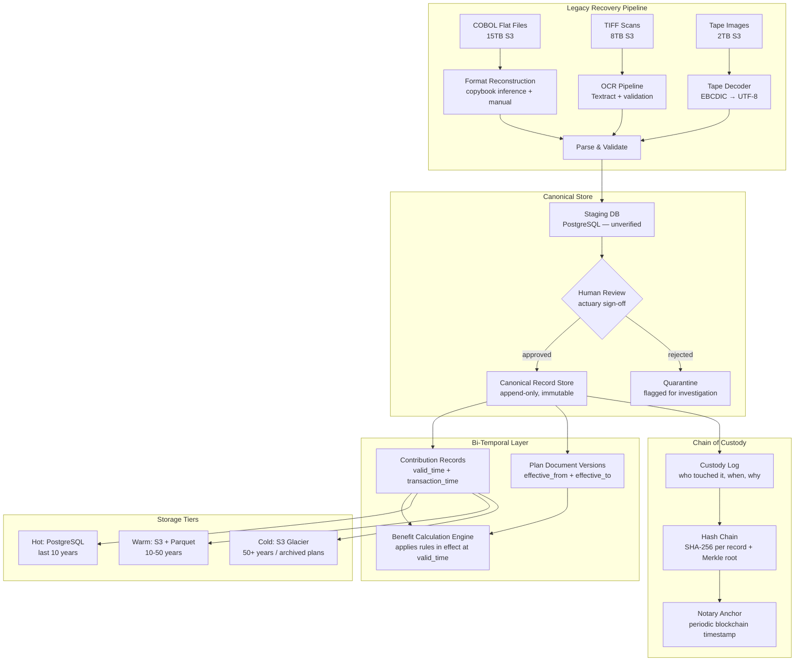

### Story Context

**Day 1. NexusWealth HQ, Philadelphia. Conference Room "Vanguard." 9:14 AM.**

Priya Nair slides a printed email across the table. It's from the law firm Hartwell & Crane, LLP, dated three weeks ago.

> **To**: Diane Yoshida, CTO, NexusWealth
> **From**: Patricia Hartwell, Partner, Hartwell & Crane LLP
> **Re**: Pension Benefit Dispute — James R. Calvert, Participant #1987-004-22817
>
> Dear Ms. Yoshida,
>
> Our client, Mr. James R. Calvert (age 74), is a participant in the Consolidated Steel Workers Pension Trust (Plan #1987-004), administered by NexusWealth since 1994. Mr. Calvert disputes the benefit amount of $2,847/month currently being paid to him.
>
> Mr. Calvert contributed to this plan from January 1974 through December 1998 — a period of 24 years. NexusWealth's benefit calculation uses only the contribution records from 1994 onward (the date of your administration assumption). Records prior to 1994, covering Mr. Calvert's first 20 years of contributions, appear to have been lost or are inaccessible.
>
> Under ERISA Section 209, plan administrators are required to maintain records sufficient to determine benefits due. Mr. Calvert believes his benefit may be understated by as much as $1,200/month. Over his expected remaining lifespan, this represents approximately $260,000 in underpayments.
>
> We are requesting all contribution records from January 1974 through December 1998. We expect a response within 30 days.
>
> Regards,
> Patricia Hartwell

Priya watches you read it. Robert Osei, the Chief Actuary, sits across the table with his arms crossed. He has the look of a man who has been waiting for someone else to solve a problem for months.

"How many participants are in this situation?" you ask.

Robert exhales. "We don't know exactly. The 1994 administration assumption covered 847 plans. Plans started as far back as 1968. When we acquired the book of business, the data transfer was..." He pauses. "It was a different era."

"What format is the original data in?"

"Mostly COBOL flat files. Some paper records that were scanned to TIFF in the late 1990s. Some records we genuinely cannot find — they may have been on tape that was overwritten."

You turn to Priya. "What's the current system showing for Calvert's account?"

She pulls up a laptop. "Ten years of contribution history. Starting 2014."

"You have a 10-year lookback window?"

"We have *capability* for 10 years. Our hot database goes back 10 years. Cold storage is... inconsistent."

---

**#legal-triage — Slack channel — 9:47 AM**

**@diane.yoshida**: Everyone read the Calvert letter by now? We need to understand the full scope before legal responds.

**@robert.osei**: I've been saying for 18 months that the pre-1994 data migration was never completed. This is the first time it's become a legal exposure.

**@priya.nair**: We have the files. They're in S3 cold storage. The problem is we can't *read* them reliably. The COBOL copybooks (the format definitions) were never migrated. We have the data, we don't have the schema.

**@diane.yoshida**: How much data are we talking about?

**@priya.nair**: Rough estimate: 15TB of COBOL flat files spanning 1968-1993. Another 8TB of TIFF scans. Plus some IBM 9-track tape images that someone digitized in 2003 but nobody documented what was on them.

**@robert.osei**: For Calvert specifically — if his pre-1994 records are in there somewhere, we could recalculate his benefit. But we'd need to parse those files, validate the data, and trust it enough to change a benefit payment.

**@priya.nair**: That's the real problem. Even if we can read the files, how do we prove the data is intact and unmodified since the 1980s? We need chain of custody.

**@diane.yoshida**: @consultant — this is why you're here. What are we actually dealing with architecturally?

---

**1:15 PM — Whiteboard session with Robert Osei**

Robert draws on the whiteboard. He's an actuary, not an engineer, but he thinks in systems.

"A pension plan has three data categories," he says, drawing three columns. "Contribution records — every paycheck deduction since the participant started. Benefit records — what we've paid out. And plan documents — the legal rules of the plan, which can change over time."

He draws arrows between columns. "The problem is that plan documents from 1978 may have rules that apply to contributions from 1978. If you have the contribution data but not the plan document version that was in effect at the time — you can't correctly calculate the benefit."

"So it's not just the records," you say. "It's the temporal relationship between the records and the rules."

"Exactly. ERISA requires us to apply the rules that were in effect when the work was performed. Not today's rules. The rules *then*."

You look at the whiteboard for a long moment. "How many plan document versions do you have archived?"

Robert hesitates. "That's... also something we need to figure out."

---

**Slack DM — 4:33 PM**

**@marcus.webb**: Saw your name on the NexusWealth engagement announcement. Pension data. Fun.

**@you**: Marcus. You know anything about ERISA?

**@marcus.webb**: Enough to know it's not the fun kind of compliance. HIPAA has a 6-year lookback. ERISA has no end date. Those records need to exist until the last beneficiary dies. Could be 2060.

**@you**: The pre-1994 data is in COBOL flat files. No copybooks.

**@marcus.webb**: Well. That's a problem. COBOL without copybooks is like reading a database without a schema. You can see the bytes, you can't interpret them.

**@you**: We're going to have to reconstruct the copybooks from the data patterns.

**@marcus.webb**: I've seen this before. Insurance company in 1998. They spent $4M reverse-engineering their own data. Took 2 years. You know what they found at the end?

**@you**: What?

**@marcus.webb**: The original copybooks. In a filing cabinet. On the 4th floor. Nobody had checked.

**@you**: ...

**@marcus.webb**: Check the filing cabinets.

---

### Problem Statement

NexusWealth administers pension plans with participant histories stretching back to 1968. A beneficiary dispute has revealed that contribution records prior to 1994 are inaccessible — stored as COBOL flat files without format documentation, IBM tape images, and TIFF scans of paper records. The current hot database has a 10-year lookback. There is no unified long-term retention architecture.

You must design a long-term data retention and accessibility architecture that:
1. Makes 50+ years of participant records queryable
2. Maintains data integrity with provable chain of custody
3. Preserves the temporal relationship between records and the plan rules that applied at the time
4. Supports future format migrations without losing the ability to query historical data

The architecture must satisfy ERISA's record retention requirements and support benefit dispute resolution at any point in the plan's life.

### Explicit Requirements

1. Retain all contribution records, benefit payment records, and plan documents for the full life of each pension plan (50+ years from plan inception)
2. Support point-in-time queries: "What was participant X's contribution balance as of December 31, 1985?"
3. Preserve plan document versions with effective date ranges — queries must apply the rules in effect at the time, not current rules
4. Ingest and make queryable: COBOL flat files (no copybooks), TIFF scans (OCR), IBM tape images
5. Maintain cryptographic chain of custody — records must be provably unmodified since ingestion
6. Support benefit dispute resolution queries with full audit trail of what data was used
7. Enable regulatory responses (DOL audit, participant requests) within 30 days

### Hidden Requirements

- **Hint**: Re-read Robert Osei's whiteboard explanation. He said "ERISA requires us to apply the rules that were in effect when the work was performed." This implies the system must store not just data, but *which version of the plan rules applied to each record at the time it was created*. A simple append-only log is not sufficient — you need bi-temporal modeling (valid time + transaction time).

- **Hint**: Re-read Marcus Webb's DM about the insurance company. He found the copybooks in a filing cabinet. This hints that the COBOL format reconstruction should include a physical document scanning and cataloging step — the copybooks may exist in paper form somewhere. Your architecture should account for "the format definition arrives after the data" as a first-class scenario.

- **Hint**: Priya mentioned "chain of custody" explicitly. This is not just about data integrity. In a legal dispute (Calvert), the chain of custody documentation must be presentable in court. Hash-based integrity is necessary but not sufficient — you need a custody log that shows who touched the data, when, and for what purpose.

- **Hint**: The letter mentions ERISA Section 209 specifically. Section 209 requires records "sufficient to determine benefits due." If a tape image is partially corrupted, you cannot simply omit it — you must document what is missing and why, and any benefit calculation on incomplete data must flag itself as potentially incomplete. The system must handle "known unknowns."

### Constraints

- **Scale**: 12M participants, 847 pension plans, data from 1968–present
- **Historical data volume**: ~15TB COBOL flat files, ~8TB TIFF scans, ~2TB tape images
- **Active data volume**: ~4TB relational data (last 10 years), growing ~400GB/year
- **Query patterns**: predominantly read (dispute resolution, audits, annual statements); ~99% read / 1% write on historical data
- **Latency**: DOL audit response: 30-day SLA; participant self-service: < 5 seconds for recent data; historical queries: best-effort (minutes acceptable)
- **Correctness requirement**: Zero tolerance for benefit calculation errors; a wrong number directly harms a retiree
- **Legal requirement**: Chain of custody documentation admissible in ERISA arbitration
- **Budget**: $3M initial migration budget (one-time); $500K/year ongoing operations
- **Team**: 6 engineers assigned to this workstream

### Your Task

Design the long-term data retention architecture for NexusWealth's pension records. Your design must address both the legacy data recovery problem (COBOL files, tape images, TIFF scans) and the ongoing retention architecture for new data.

### Deliverables

- [ ] **Mermaid architecture diagram**: Full retention system — ingestion layer (legacy recovery), storage tiers, query layer, audit/chain-of-custody layer
- [ ] **Database schema**: Bi-temporal schema for contribution records (valid_time, transaction_time, record_hash, custody_log); plan document version table with effective date ranges
- [ ] **Legacy data recovery pipeline**: Step-by-step pipeline for COBOL flat file ingestion (format reconstruction → parse → validate → hash → store → index)
- [ ] **Scaling estimation**: Storage growth math — current 29TB legacy + active growth rate × 50-year horizon; tiering strategy (hot/warm/cold/archive)
- [ ] **Tradeoff analysis**: Minimum 3 tradeoffs:
  - Bi-temporal vs append-only event log for historical records
  - Reconstruct-on-read vs pre-materialized historical snapshots
  - Full-fidelity COBOL preservation vs normalized relational migration
- [ ] **Cost modeling**: $X/month estimate — storage tiers (S3 Standard / S3-IA / S3 Glacier Deep Archive), compute for OCR/parsing, index storage
- [ ] **Capacity planning**: 6-month legacy migration timeline + 18-month ongoing growth projection

### Diagram Format

All architecture diagrams: Mermaid syntax.

