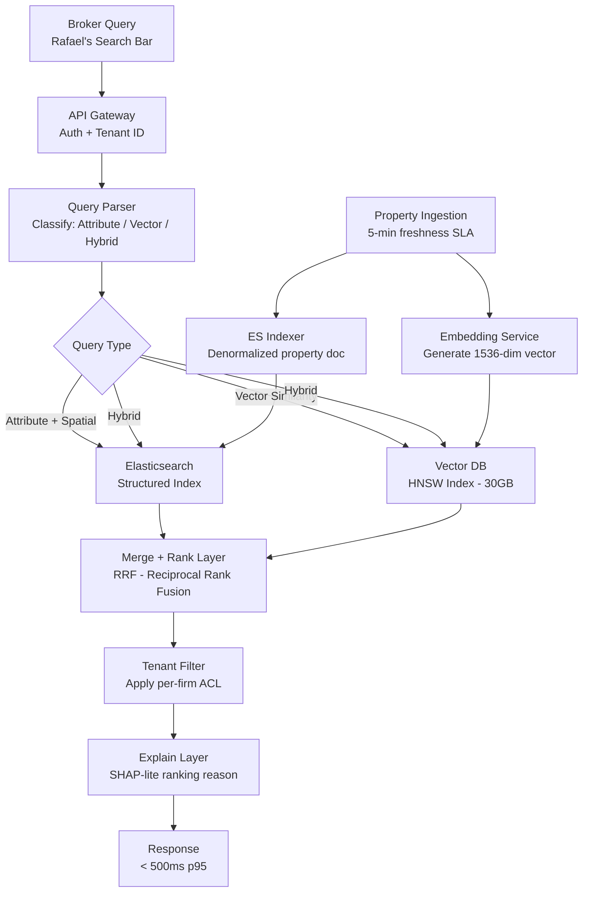

### Story Context

It's a Wednesday morning in PropIQ's Austin office. The weekly product review opens with a demo, not a slide deck — Priya Nair, PropIQ's CTO, believes in showing real user sessions, not curated screenshots.

The user on screen is Rafael Mendez, a senior broker at Meridian Capital. He's been a PropIQ customer for 11 months. His screen recording starts at 9:14am.

**Loom Recording Transcript — Rafael Mendez, Senior Broker, Meridian Capital**
*Recorded: Tuesday, 8 sessions reviewed*

"Okay. I have a client — tech company, wants to lease 50,000 to 75,000 square feet of Class A office space in Austin, Texas. Built after 2010. LEED certified. Available now or within 90 days. Let me show you what PropIQ gives me."

*He types into the PropIQ search bar: "Class A office Austin TX 50000 sqft LEED certified available"*

*10,200 results load. No ranking explanation. Page 1 contains a building from 2007 in Round Rock. Another is a warehouse listed as "office-adjacent." The LEED certification filter is a checkbox that clearly didn't work — a 1968 building appears on the first page.*

"I spent six hours on Monday doing this search. Six hours. I'm a $2M/year revenue broker. You are paying me $2M to be your research intern."

*He closes the tab.*

"Now let me show you the second thing. My client also asked me to find properties *similar* to 123 Main Street in Chicago — same building class, similar tenant mix, comparable age — but located in Dallas or Houston. That building is their gold standard. They want something that *feels like it* in a different market."

*He types: "similar to 123 Main St Chicago in Dallas or Houston"*

*The search returns 0 results with the suggestion: "Try removing some filters."*

"I called your support line. They said, and I'm quoting here: 'PropIQ doesn't support that type of query.' I have 14 other searches exactly like this every month. I'm going to CoStar."

The recording ends. The product review room is quiet.

Priya speaks first. "Rafael is not an edge case. We surveyed brokers last quarter — 67% of active users report they can't find what they're looking for on the first try. The search system was built in 2021 by two engineers who are no longer at the company. It's Elasticsearch on top of a denormalized property table. That's it."

She pulls up the Slack thread from the support team.

---

**#support-escalations** | Tuesday 4:22 PM

**Diego Vargas** [Support]: Rafael Mendez at Meridian Capital is threatening to churn. $180K ARR. He's asking for a feature we don't have: "find properties similar to this property, but in a different market." I flagged it as a product request but wanted engineering to know.

**Ananya Krishnan** [Product]: This is the "find similar" use case. We've had 34 tickets like this in 6 months. I've been calling it "property comps search." We always close it as "not on roadmap."

**Priya Nair** [CTO]: @you — can we talk about this today? Not the UI problem. The architecture problem underneath it.

---

You join Priya in a small conference room at 2pm. She pushes a printed page across the table — a heat map of failed searches. The red area covers most of the advanced broker query patterns.

"The 'find similar' problem," she says, "requires that we represent what a building *is* — its character, its class, its tenant mix, its era — as something you can compare mathematically. Keyword search can't do that. It's not a bug. It's a different search paradigm."

She draws a line on the whiteboard. On one side: attribute search (filterable facets). On the other: vector similarity search (embeddings of property characteristics).

"Rafael's two queries aren't the same problem. The first is broken faceted search. The second is a missing capability we've never built. We need both. And we need them to feel like one search bar."

She slides the capacity numbers across the table: 5 million commercial properties in the index. Average broker runs 40–60 searches per day. 3,200 concurrent broker users at peak.

"Sub-500ms at p95. That's the SLA. It was in the original contract with Meridian Capital." She points to the page. "We already missed it. We're at 1.8 seconds p95."

The "similar to" query Rafael described — it was never in the original product spec. It's in his second request, almost casual, as if it were a minor feature. But what he described is a fundamentally different search paradigm: vector similarity over property characteristic embeddings, with geographic constraints layered on top.

You start sketching on the whiteboard.

### Problem Statement

PropIQ's commercial real estate search system serves 3,200 concurrent broker users querying a corpus of 5 million commercial properties. The current system — an Elasticsearch index over a denormalized property table — cannot handle multi-dimensional searches combining spatial constraints, structured facets, and semantic similarity.

Two distinct search paradigms must be unified in a single query experience: (1) attribute-based filtered search with geographic spatial queries, and (2) vector similarity search ("find properties like this one, but in a different market"). Both must deliver results under 500ms p95, with strict tenant isolation between brokerage firms.

### Explicit Requirements

1. Multi-dimensional property search: building class (A/B/C), size range (sqft), year built, LEED certification level, availability window, zoning type
2. Geographic search: by city, submarket, ZIP code, radius, and bounding box
3. Vector similarity search: given a reference property, find properties with similar characteristics (class, tenant mix, age cohort, amenity profile) in a different geographic market
4. Faceted filtering with result counts that update as filters are applied (facet counts must remain accurate)
5. Per-firm tenant isolation: Meridian Capital cannot see off-market listings belonging to Blackwood Realty
6. p95 search latency < 500ms for all query types
7. Index freshness: new listings must appear within 5 minutes of ingestion
8. Explain why results are ranked as they are (relevance explanation for top results)

### Hidden Requirements

- **Hint**: Re-read Rafael's second request. "Find properties *similar to* 123 Main Street Chicago — same building class, similar tenant mix, comparable age — but in Dallas or Houston." The phrase "similar tenant mix" implies tenant composition data must be encoded into property embeddings — but tenant data is often confidential (tenants don't disclose their leases publicly). Where does this data come from, and who can see it?

- **Hint**: Priya says "3,200 concurrent broker users." But the heat map of failed searches shows that failures cluster at 9–10am and 2–3pm. This implies query burst patterns, not sustained load — caching strategy must account for temporal clustering, not average throughput.

- **Hint**: The support ticket mentions "off-market listings belonging to Blackwood Realty." Tenant isolation in search is harder than tenant isolation in a database — search indexes are typically built from a unified index. A misconfigured filter = data leak between brokerage clients.

- **Hint**: The original Meridian Capital contract specifies "sub-500ms p95." PropIQ is currently at 1.8 seconds. This is already a contract breach. A compliance/SLA audit is likely incoming — the system needs to produce latency evidence, not just meet the SLA going forward.

### Constraints

- **Corpus**: 5M commercial properties; 200 structured attributes per property; 1,536-dimensional embedding per property (property characteristic vector)
- **Concurrency**: 3,200 concurrent users; peak burst 6,000 QPS (morning + afternoon spikes)
- **Latency SLA**: p50 < 200ms, p95 < 500ms, p99 < 1,200ms
- **Index freshness**: new listings visible within 5 minutes
- **Tenant isolation**: 47 brokerage firms; each firm has private listings not visible to others; some shared MLS listings visible to all
- **Vector index size**: 5M × 1,536 dimensions × 4 bytes = ~30GB per index (fits in memory for HNSW)
- **Facet count accuracy**: must be exact for structured attributes (users make filter decisions based on counts)
- **Team**: 4 engineers (2 backend, 1 ML, 1 infra)
- **Budget**: $35K/month infrastructure ceiling

### Your Task

Design a unified property search system that handles both attribute-based faceted search and vector similarity search. The system must maintain per-firm tenant isolation, meet sub-500ms p95 latency, and provide result ranking explanations. Design the embedding strategy for property vectors, the index architecture (Elasticsearch for structured + a vector store for similarity), and the query fan-out and merge layer that unifies results from both paradigms.

### Deliverables

- [ ] Mermaid architecture diagram showing query path through both search paradigms (attribute + vector) with merge layer
- [ ] Database schema: property table, embedding store schema, tenant access control table
- [ ] Vector embedding strategy: which property attributes go into the embedding? How do you handle missing data (e.g., confidential tenant data)?
- [ ] Tenant isolation design: how do you prevent cross-firm data leaks in a unified Elasticsearch index?
- [ ] Scaling estimation (show math step by step):
  - Query volume: 3,200 users × 40 searches/day = ?
  - Peak QPS: how do you calculate it given the burst pattern?
  - HNSW index memory: 5M × 1,536 dims × 4 bytes = ?
  - Elasticsearch index size for 5M properties × 200 attributes?
- [ ] Tradeoff analysis (minimum 3):
  - Elasticsearch + separate vector DB vs. a hybrid search system (e.g., Weaviate, Qdrant, Elasticsearch dense_vector)
  - Exact facet counts vs. approximate facet counts (and when each is acceptable)
  - Pre-computing "similar properties" offline vs. real-time vector query
- [ ] Cost modeling: Elasticsearch cluster sizing, vector DB hosting, embedding generation cost ($X/month)
- [ ] Capacity planning: How does the index grow if PropIQ adds residential properties (50M properties)? What changes first?

### Diagram Format

Mermaid syntax. Show: broker query → API gateway → query parser → fan-out to (Elasticsearch attribute query + HNSW vector query) → merge/rank layer → tenant filter → response. Include index update path from property ingestion pipeline.

