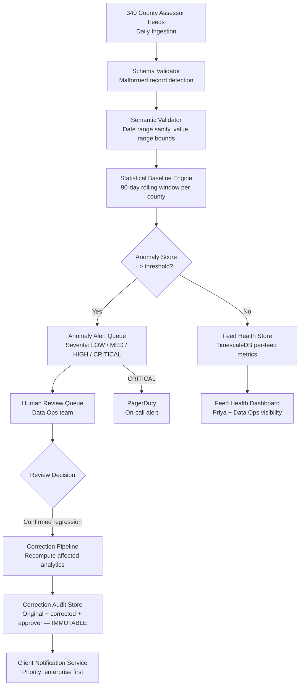

### Story Context

The ticket arrives on a Thursday afternoon at 3:47pm. It's routed to you because you're the most senior engineer who touched the data pipeline recently. Subject line: "Pricing analytics discrepancy — Meridian Capital, $4M gap."

You assume it's a rounding error.

---

**Email Thread**

**From**: Dominique Farrell, VP Client Success
**To**: You, Priya Nair
**Subject**: RE: RE: RE: Meridian Capital — Urgent data discrepancy — requires immediate response
**Date**: Thursday, 3:47 PM

> Michael Chen at Meridian Capital called me directly. Not their usual account manager — Michael Chen, their CFO.
>
> They're modeling a mixed-use acquisition in Denver. They ran PropIQ's pricing trend analytics for the submarket. PropIQ showed 0.1% appreciation over 12 months. Their internal model, built from primary source county records, showed 7.8% appreciation for the same submarket and period.
>
> The discrepancy is $4.2M on a $54M deal.
>
> Michael's exact words: "Either your data is wrong or our model is wrong. We'd like to know which before we close next Tuesday."
>
> I told him we'd investigate. That was 45 minutes ago.

---

You pull the Denver submarket analytics query. The numbers match what Dominique described — nearly flat appreciation for a market that, looking at raw lease transactions, was clearly moving upward. You run the same query for Chicago. Chicago shows negative appreciation for a period where you know prices were rising.

Something is wrong upstream.

You go to the data pipeline. The county assessor feed. The Denver feed is processed by `county_assessor_ingest.ts`, written by someone named Jae-Won Oh — who left the company 4 months ago.

You read the code.

Line 247:

```typescript
const assessedYear = parseInt(record.assessment_date.substring(0, 4)) - 1;
// Assessment dates are reported for the prior year
```

The comment is wrong. Denver County reports assessment dates for the *current* assessment year, not the prior year. The code has been subtracting one year from every assessed value date since it was written. As a result: 2024 assessed values are being stored with a 2023 date. When the price trend calculation computes "change from 2023 to 2024," it's comparing 2024 values to... 2024 values. Zero change.

Your hands go cold.

You check the git blame. The `county_assessor_ingest.ts` file was first deployed: **November 14th, 2024**. Three months and eleven days ago.

You pull the affected counties. The off-by-one-year bug affects any county assessor feed that reports current-year assessment dates — which turns out to be 23 counties across 11 states, including Cook County (Chicago), Denver County, King County (Seattle), and Travis County (Austin).

You write a quick query to find all PropIQ clients who ran pricing analytics queries against these counties in the affected window.

The query returns 50 client accounts. You start scanning names.

Row 34: **NexusWealth Partners**.

You stop.

NexusWealth. The pension fund manager from the 12-nexuswealth arc — the one managing $2.4B in pension assets for municipal employees. They were a PropIQ client. They appear in your client list with 847 analytics queries over the past 3 months, most of them concentrated on office tower acquisitions.

You search PropIQ's CRM for their recent deal activity.

**CRM Note — NexusWealth Partners, updated 6 weeks ago**:
*"NexusWealth closed 450 Civic Center Plaza, Chicago — $45M office tower acquisition. PropIQ analytics cited in deal memo. Client very satisfied. Upsell opportunity: enterprise tier."*

$45M. Six weeks ago. Cook County. Inside the affected window.

You sit very still for a moment.

Then you open a new Slack DM to Priya.

---

**Slack DM — You → Priya Nair**
*Thursday 4:31 PM*

**You**: I found the Denver bug. County assessor date parsing — off by one year. Has been running since November 14th. 23 counties affected.

**Priya**: How bad?

**You**: 50 clients affected. All pricing trend analytics in those counties are wrong for the past ~3.5 months. Appreciation showing near-zero when actual appreciation was 5-9%.

**You**: One of the 50 clients is NexusWealth. They closed a $45M acquisition in Cook County six weeks ago. The deal memo cited PropIQ analytics.

*[3 minutes pass]*

**Priya**: I'm calling Legal. Do not send anything to clients yet. Do not delete or modify any data. Document everything you find.

**Priya**: I need a full impact assessment by 8pm tonight. Which clients, which queries, which time window, which properties. Exact numbers.

**Priya**: And I need to understand how this wasn't caught.

---

You build the impact assessment. You also start thinking about the second problem: how does a data quality regression this severe go undetected for 110 days?

The answer is: there is no data quality monitoring. The pipeline has error handling for malformed records, but no semantic validation — no checks that say "if a market shows 0% price movement for 60 days, that's anomalous and should alert."

The data was wrong. The data looked plausible. No one looked.

### Problem Statement

PropIQ's county assessor data ingestion pipeline contained a date-parsing bug introduced 110 days ago. The bug caused pricing trend analytics for 23 counties to show near-zero appreciation when actual market appreciation was 5–9%. Fifty clients ran analytics against corrupted data; one — NexusWealth, a pension fund — made a $45M acquisition decision citing PropIQ analytics.

The immediate task is triage and impact assessment. The architectural task is designing a data quality monitoring system that detects semantic regressions before they reach clients — not just schema errors, but "this market showing 0% movement for 60 days is anomalous given comparable market benchmarks."

### Explicit Requirements

1. Complete impact assessment: all affected queries, clients, properties, and time windows
2. Data recalculation: re-run all affected analytics with corrected data; produce correction deltas for each affected client
3. Client notification design: what do you tell clients, when, in what order?
4. Data quality monitoring architecture: detect anomalous data patterns within 24 hours of introduction
5. Regression testing for data pipelines: "does this feed produce results consistent with expected market behavior?"
6. Pipeline change management: no pipeline change goes to production without data quality gate
7. Audit trail for data changes: every correction must be logged with who approved it, when, and what changed

### Hidden Requirements

- **Hint**: Priya says "Do not delete or modify any data." This is a legal hold instruction, not a casual preference. If NexusWealth's lawyers issue a litigation hold, any data modification after this point is spoliation of evidence. The architecture must support immutable audit trails for all corrections — the original corrupted data must be preserved alongside the corrected data.

- **Hint**: The CRM note says NexusWealth was "very satisfied" and was being upsold to enterprise tier. If the legal team decides to notify NexusWealth proactively, PropIQ must be able to produce the exact queries NexusWealth ran, the exact results they received, the exact analytics cited in the deal memo, and the exact corrected values — all in a format suitable for legal discovery. This is a data lineage problem, not just a data quality problem.

- **Hint**: The 23 affected counties include Travis County (Austin). PropIQ's own headquarters is in Austin. Check whether PropIQ's internal deal tracking (used by their sales team for sales intelligence) also ran analytics against Travis County during the affected window.

- **Hint**: The county assessor feed is one of approximately 340 data feeds PropIQ ingests from third-party sources. Each feed has its own quirks, reporting conventions, and documentation quality. The real question the data quality monitoring system must answer is not "is this specific bug fixed" but "how do we systematically detect when any of 340 feeds produces semantically wrong data?"

### Constraints

- **Affected window**: November 14, 2024 → March 4, 2025 (110 days)
- **Affected counties**: 23 counties, 11 states
- **Affected clients**: 50 accounts; 847 analytics queries from NexusWealth alone
- **Affected properties**: ~180,000 properties in affected counties in the pricing trend index
- **Recalculation window**: all pricing trend analytics must be recomputed; estimate 72 hours for full recalculation at batch processing rates
- **Legal hold**: all original (corrupted) data must be preserved; corrections stored as deltas, not overwrites
- **Client notification SLA**: enterprise clients (NexusWealth tier) must be notified within 24 hours of confirmed impact assessment
- **Data quality monitoring latency**: anomalous feed behavior detected within 24 hours of regression introduction
- **Team**: 4 engineers; during incident, 2 on triage, 2 on monitoring architecture
- **Regulatory context**: NexusWealth manages pension assets subject to ERISA; if they suffered financial harm from bad data, there are fiduciary duty implications for PropIQ as a data vendor

### Your Task

Design two things:

1. **Immediate response**: the data correction and client notification architecture — how do you safely recompute analytics for 50 clients, preserve legal hold, and notify clients in a legally defensible way?

2. **Long-term**: a data quality monitoring system for PropIQ's 340 data feeds that detects semantic regressions — not just malformed records, but "this feed is producing statistically anomalous results compared to cross-validated benchmarks" — within 24 hours of introduction.

### Deliverables

- [ ] Mermaid architecture diagram: data quality monitoring pipeline — feed ingestion → statistical validation layer → anomaly detection → alert routing
- [ ] Database schema: data corrections audit table (preserves original + corrected values + approval chain), feed health metrics table, anomaly alerts table
- [ ] Impact assessment methodology: how do you calculate exactly which clients received corrupted analytics? Show the query logic.
- [ ] Statistical anomaly detection design: what baseline metrics do you compute per feed? What z-score threshold triggers an alert? How do you avoid false positives for genuinely flat markets?
- [ ] Scaling estimation (show math step by step):
  - 340 feeds × average 50K records/feed/day = baseline ingestion volume
  - Statistical baseline computation: rolling 90-day window per county × 23,000 counties in US = compute cost
  - Recalculation: 180,000 properties × 110 days of corrections = row operations needed
- [ ] Tradeoff analysis (minimum 3):
  - Real-time statistical validation vs. daily batch anomaly detection
  - Immutable correction model (append corrections as new rows) vs. in-place update with audit log
  - Automated anomaly alerts vs. human review queue (what's the right threshold for automated vs. human?)
- [ ] Cost modeling: data quality monitoring infrastructure cost ($X/month) vs. cost of one more incident like this one
- [ ] Capacity planning: PropIQ is adding 20 new county assessor feeds per month — how does monitoring scale?
- [ ] Client notification design: draft the notification message for NexusWealth (a pension fund that made a $45M decision on bad data). What do you say? What do you not say?

### Diagram Format

Mermaid syntax. Show feed ingestion, statistical validation layer (per-feed baseline computation), cross-feed anomaly detection, alert routing, and the legal hold immutable store for corrections.


