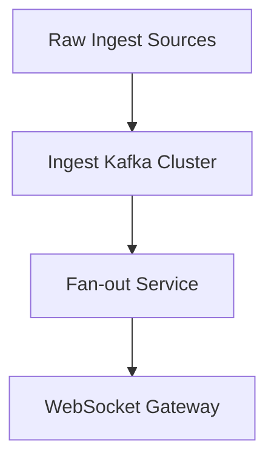

### Story Context

**#platform-team — Monday, October 6, 10:14 AM**

```
priya_nair [VP Eng]: Morning everyone. Quick reminder — new Staff Eng starts today.
                     Give them a warm welcome and a firehose.

jordan_wu [Staff Eng, Platform]: lol "warm welcome". I'll pull up the championship
                                  postmortem. That's warm enough.

priya_nair: Jordan.

jordan_wu: I'm kidding. Kind of.

priya_nair: @new-hire — when you're settled, come find me. We need to talk about
             the event pipeline before the afternoon game.
```

---

You find Priya in her glass-walled office at 10:30. She slides a printed document across the desk without preamble. It is last year's championship postmortem. The title is handwritten in red marker across the top: **READ THIS FIRST**.

You read it in 12 minutes. The incident summary:

- **What happened**: The fan feed service became unresponsive at 9:47 PM ET during the fourth quarter of Game 7, Championship Final. 15.2 million active users lost live updates. App latency went from 45ms to 22,000ms. Total outage: 11 minutes.
- **Root cause**: The Kafka consumer group for the fan feed service fell behind during a rapid burst of play-by-play events (final quarter, high-scoring game). Consumer lag grew to 4.2 million messages. The lag triggered cascading restarts. Each restart caused a partition rebalance. Each rebalance paused consumption for 8–12 seconds. The restarts fed on themselves.
- **Business impact**: 15.2M users lost service. Twitter mentions: 2.1M in 11 minutes. ESPN segment: "NovaSports app crashes during most-watched moment of the season." Sportsbook partner (BetStream): $800K in failed bet placements during outage window.

Priya is watching you read. When you look up, she says: "We process 50 million events per second at championship peak. Twenty games simultaneously during playoffs. Every play, every player position update, every social mention, every bet. It all goes through one Kafka cluster. Tell me what you'd change."

---

**#architecture-design — Monday, October 6, 2:17 PM**

```
jordan_wu: @new-hire welcome to the design channel. Quick context dump:

           Current state:
           - 1 Kafka cluster (3 brokers, 200 partitions)
           - 4 consumer groups: fan-feed, analytics, sportsbook-odds, social-digest
           - All 4 groups read the SAME topics
           - Peak throughput: ~12M events/sec (regular season peak)
           - Championship estimated: 50M events/sec (never actually hit this —
             we crashed before we got there)

           The 4 groups are NOT isolated. When fan-feed rebalanced last year,
           it triggered coordinator churn across ALL groups including sportsbook-odds.
           That's how the bets broke.

new-hire: So the fan feed crash propagated to sportsbook because they share
          the same broker coordination?

jordan_wu: Exactly. One group's rebalance storm triggers broker load spikes
           that degrade consumer performance for all groups on those brokers.

new-hire: What's the data model? What exactly is an "event"?

jordan_wu: Good question. Four event streams:
           1. Play-by-play: ~200 events/game/min at peak. 20 games = 4,000/min
              = ~67/sec. Small.
           2. Player tracking: 10 players × 2 teams × 30fps = 600 position
              updates/sec per game. 20 games = 12,000/sec.
           3. Social mentions: scraped from Twitter/Reddit/Instagram. Burst-heavy.
              During championship: ~800K mentions/min = ~13,000/sec.
           4. Bet placements: from sportsbook partner. Peak: ~100K bets/min
              during final quarter = ~1,667/sec.

           So the 50M number... let me find where that came from.

new-hire: 50M seems much higher than what you just described.

jordan_wu: Oh right. The 50M includes ALL the downstream fan feed generation.
           For each play event, we fan out personalized events to ~180K fans of
           the players involved. THAT's where the 50M comes from.
           The raw ingest is ~30K events/sec. The fan-out is 50M events/sec.

new-hire: ...so the 50M is output, not input.

jordan_wu: Right. And we've been treating them as the same problem.
           That's probably important.
```

---

**Direct Message — Priya Nair to you, 4:55 PM**

```
priya_nair: How are you settling in?

new-hire: Reading a lot. Jordan's been helpful. The 50M events thing —
          I think we've been conflating ingest volume with fan-out volume.
          They're different problems with different solutions.

priya_nair: Go on.

new-hire: Raw ingest (player tracking, play-by-play, social) is ~30K events/sec.
          That's a well-understood Kafka problem. Fan-out to 35M users is a
          different beast — that's push notification infrastructure, websocket
          management, personalization pipeline.

priya_nair: Yes. And the outage last year was in the fan-out layer, not the
             ingest layer. But because everything was on the same Kafka cluster,
             ingest throughput degradation caused fan-out consumer lag.

new-hire: What's the SLA for a play-by-play event reaching a fan's screen?

priya_nair: Sub-100ms end-to-end. During last year's Q4 meltdown, it was 22 seconds.

new-hire: And the sportsbook SLA?

priya_nair: [pause] We've never formally defined it.
             BetStream has a contractual requirement of < 200ms for odds updates.
             We've never missed it — until last year.

new-hire: That's in the hidden requirements.
          I'll have a design doc by Thursday.

priya_nair: Wednesday. Season's already started.
```

---

### Problem Statement

NovaSports' event streaming infrastructure serves 35M users during live sports events. The raw event ingest layer (player tracking, play-by-play, social mentions) handles ~30K events/sec during regular season and up to 50K events/sec at championship peak. The downstream fan-out layer generates ~50M events/sec at championship peak, personalizing content for millions of concurrent users.

The current architecture uses a single Kafka cluster for both ingest and fan-out, with no isolation between consumer groups. Last year's championship outage demonstrated that a rebalance storm in one consumer group can cascade across all groups, taking down sportsbook odds updates alongside fan feeds. Design a resilient, isolated event streaming infrastructure that can sustain championship-level throughput with sub-100ms fan update latency and 99.99% availability.

---

### Explicit Requirements

1. Handle 50K raw events/sec at championship peak (player tracking, play-by-play, social, bets)
2. Fan-out to 35M users with sub-100ms end-to-end latency for live game updates
3. 15M concurrent users during championship peak
4. 20 simultaneous games during regular playoff window
5. Complete isolation between fan feed, analytics, sportsbook, and social consumer groups — a failure in one must not affect others
6. Sportsbook odds updates: sub-200ms from play event to odds recalculation
7. Player tracking: 30 fps per player, 10 players per team, 2 teams per game
8. 99.99% availability SLA for the sportsbook integration (contractual)
9. 99.9% availability SLA for fan feed
10. All raw events must be persisted for 90 days (replay, analytics, audit)

---

### Hidden Requirements

- **Hint**: Re-read Jordan's explanation of the fan-out. "For each play event, we fan out personalized events to ~180K fans." What happens if the same user follows multiple players who are all involved in the same play? Does the user receive duplicate notifications?

- **Hint**: Re-read Priya's comment about the sportsbook SLA: "We've never formally defined it." If the contractual SLA is 200ms and NovaSports has no formal measurement, what does that mean for the sportsbook partnership contract during a future outage? What data do you need to have retained?

- **Hint**: Jordan mentions "social mentions: scraped from Twitter/Reddit/Instagram. Burst-heavy." Social scraping is a pull operation on external APIs with rate limits. How does a bursty pull operation fit into an event-driven push architecture? What happens when a social API goes down?

- **Hint**: "The 50M number includes all the downstream fan feed generation." If fan-out is the bottleneck, and fan-out is driven by personalization state (who follows whom), what happens to fan-out volume when a brand-new superstar player signs with a team mid-season and gains 8M followers overnight?

---

### Constraints

- **DAU**: 35M registered users; 15M concurrent at championship peak
- **Raw ingest**: 30K events/sec regular season, 50K events/sec championship
- **Fan-out output**: 50M events/sec at championship peak
- **Games**: 20 simultaneous during regular playoffs; 2 teams × 10 players per game
- **Player tracking**: 600 position updates/sec/game × 20 games = 12,000 tracking events/sec
- **Latency SLA**: < 100ms end-to-end (raw event to user screen), fan feed
- **Latency SLA**: < 200ms (play event to odds update), sportsbook
- **Availability SLA**: 99.99% sportsbook integration, 99.9% fan feed
- **Retention**: 90 days raw events, 1 year aggregated analytics
- **Team size**: 6 platform engineers, 2 data engineers
- **Budget**: Current infrastructure: $1.8M/month total; event pipeline: ~$420K/month
- **Infrastructure**: AWS, existing Kafka MSK cluster (3 brokers), Redis Cluster, PostgreSQL RDS

---

### Your Task

Design the event streaming infrastructure for NovaSports. Your design must:

1. Separate raw ingest from fan-out — two distinct architectural layers with different scaling characteristics
2. Isolate consumer groups so that a rebalance storm in fan-feed cannot affect sportsbook-odds
3. Define a fan-out architecture capable of 50M events/sec that avoids duplicate delivery to users who follow multiple players in the same play
4. Design partition key strategies for each event type (play-by-play, player tracking, social, bets)
5. Define the sportsbook integration SLA and the measurement infrastructure to prove compliance

---

### Deliverables

- [ ] Mermaid architecture diagram covering: raw ingest layer, consumer isolation, fan-out layer, WebSocket/SSE delivery to clients
- [ ] Database schema for: event log table, user-follow-graph table, fan-out deduplication table (with column types and indexes)
- [ ] Scaling estimation (show math step by step):
  - Raw ingest throughput at peak
  - Fan-out volume calculation
  - Kafka partition count recommendation per topic
  - Consumer group isolation strategy (separate clusters vs separate brokers)
  - WebSocket connection pool sizing for 15M concurrent users
- [ ] Tradeoff analysis (minimum 3):
  - Single cluster with topic isolation vs separate Kafka clusters per consumer group
  - Push fan-out (Kafka → per-user topic) vs pull fan-out (user polls personalized feed service)
  - Fan-out deduplication (at source vs at delivery) vs accepting duplicate delivery
- [ ] Cost modeling: estimate monthly cost for the event pipeline component ($X/month)
- [ ] Capacity planning: plan for 3x DAU growth (35M → 105M) over 18 months — what breaks first?

---

### Diagram Format

All architecture diagrams must use Mermaid syntax (renders in GitHub Issues).



Expand this skeleton into a full architecture. Include: data sources, ingest layer, consumer isolation, fan-out service, delivery layer, persistence layer.
