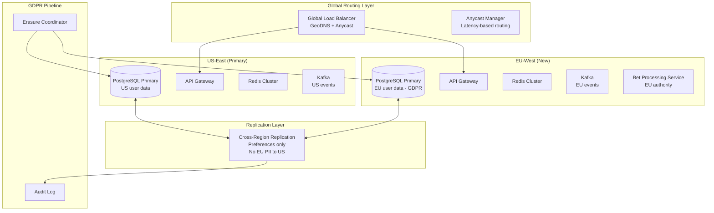

### Story Context

**#engineering-leadership — Monday, 9:02 AM**

**Priya Okonkwo [VP International]:** Morning everyone. Big news coming at 10. I'm going to need you all to be in the War Room.

**Dev Chatterjee [CTO]:** Already here. Coffee is on.

**Rosa Delgado [Staff Eng]:** On my way. Should I bring my laptop?

**Priya Okonkwo:** Bring everything.

---

The War Room at NovaSports fills fast. Marketing, product, engineering, legal — twenty people jammed into a room designed for twelve. On the big screen: a partnership slide deck. Premier League logo. La Liga. Bundesliga. Three of the biggest football leagues in Europe have agreed to an exclusive data and fan experience deal. The announcement goes live in ninety minutes.

You sit next to Rosa. She leans over and whispers: "Check the traffic numbers on that slide."

You look. Season opener projected fan registration from Europe: 4.8 million. Timeline for "full platform availability in Europe": four months.

You feel the blood leave your face.

**Dev Chatterjee [CTO]:** Before everyone gets too excited — engineering, give me a two-sentence reality check.

Every head turns to you and Rosa.

**Rosa Delgado [Staff Eng, Slack DM to you, 10:07 AM]:**
> "You want to take this one or should I?"

**You [Slack DM to Rosa, 10:07 AM]:**
> "I'll start. You catch what I miss."

You stand. "Our current infrastructure is US-East primary with a US-West warm standby. For 4.8 million European users, London-to-US round-trip latency is 180ms on a good day. For a live match — when 400,000 fans are simultaneously checking the same stat — that's not acceptable. We need active infrastructure in Europe."

Silence.

**Priya Okonkwo:** How long?

**You:** Four months is aggressive, but possible. There are some architectural choices we need to make today that will define how hard the next four months are.

**Priya Okonkwo:** Make them.

---

After the meeting, you get an email from Legal.

---

**From:** Elena Vasquez <elena.vasquez@novasports.com>
**To:** Engineering Leadership
**Subject:** GDPR Data Residency — URGENT — EU Expansion
**Date:** Monday, 10:34 AM

Team,

I've been reviewing the EU expansion announcement. Before we proceed with architecture, please read the following carefully.

Under GDPR Article 44-49, personal data of EU residents cannot be transferred to a third country (including the United States) without adequate safeguards. For a platform processing behavioral data — watch history, betting patterns, interaction logs — the safeguards required are substantial.

Additionally, the UK post-Brexit data adequacy decision is currently under review. We need separate UK data residency consideration.

Specifically:
- EU user PII and behavioral data must reside in EU data centers
- Processing logs must remain within the EU
- No EU user data should transit US infrastructure for primary serving
- Right to erasure must function within 30 days

This is not optional. Non-compliance fines: up to 4% of global annual revenue.

We need an architecture decision document before we can sign the partnership agreements.

—Elena

---

**Rosa Delgado [Slack DM, 11:02 AM]:**
> "Four months. Four regions. GDPR. Active-active writes for bet placement. This is a Staff-level problem."
> "Also: I found the hidden requirement. Our sportsbook partner contract says bets placed from Europe must be processed in Europe for UK Gambling Commission compliance. That's not just data residency — that's compute residency."
> "You seeing this?"

You stare at the message for a long moment.

**You [Slack DM]:**
> "I see it. The conflict resolution problem just got a lot harder. European bets need to be written authoritatively in EU-West. US bets in US-East. But a user traveling from London to New York needs their preference state to follow them."
> "Different consistency requirements per data type. Some things are active-active. Some things are active-passive with a clear authority region."
> "Let me draft the architecture doc."

---

### Problem Statement

NovaSports is expanding to Europe in four months with 4.8 million projected European users. The current US-East-only architecture delivers 180ms RTT to European users — unacceptable for a live sports platform. You must design a multi-region active-active architecture across four regions (US-East, US-West, EU-West, APAC) that serves users from their closest region, meets GDPR data residency requirements for EU users, and resolves conflicts for data types that can be written from multiple regions concurrently.

The stakes are not just technical: GDPR violations carry fines up to 4% of global revenue, and the UK Gambling Commission requires bet processing to occur in-region.

### Explicit Requirements

1. Four active regions: US-East (primary), US-West, EU-West (new), APAC (existing)
2. p95 latency < 50ms for users served from their home region
3. EU user PII and behavioral data must reside in EU infrastructure (GDPR)
4. Bet placement must be processed and persisted in the user's legal jurisdiction region
5. User preferences (fan favorites, notification settings) should be available across regions with < 5s propagation delay
6. Right to erasure must complete across all regions within 30 days
7. Conflict resolution for concurrent writes (user preferences modified from two regions simultaneously)
8. System must be operational in 4 months

### Hidden Requirements

1. **Hint: re-read Rosa's Slack DM.** UK Gambling Commission compliance requires bet processing *compute* to reside in-region — not just data. This affects where the bet placement service itself must run, not just where data is stored.

2. **Hint: re-read the Legal email.** The UK post-Brexit adequacy decision is "under review." This means UK and EU cannot share infrastructure — UK-EU data flows need Standard Contractual Clauses as a fallback, which changes the latency and routing model.

3. **Hint: re-read the War Room announcement.** "Season opener" in 4 months means the architecture must be live before its peak load event. There is no gradual ramp — it goes from 0 to 4.8M during a single Premier League match day.

4. **Hint: re-read the partnership slide deck detail.** The word "exclusive" in the partnership means competitor platforms cannot use this data. Data lineage must be tracked so NovaSports can prove no data leaked to competitors — this implies audit logging on cross-region data flows.

### Constraints

- **Regions**: US-East, US-West, EU-West, APAC (UK treated as separate from EU-West)
- **Users**: 35M total, 4.8M new EU users, 1.2M UK users
- **Peak load**: 400K concurrent users from EU during Premier League opener
- **Latency SLA**: p95 < 50ms in-region, p95 < 200ms cross-region
- **Replication lag**: < 5 seconds for user preferences between regions
- **Data residency**: EU PII stays in EU-West; UK PII stays in UK zone
- **Bet write authority**: EU bets written to EU-West only; US bets to US-East only
- **GDPR response**: Right to erasure within 30 days across all regions
- **Conflict window**: < 100ms window for detecting concurrent writes
- **Team**: 6 engineers, 4-month window
- **Infrastructure budget**: Additional $180K/month for EU-West + UK infra

### Your Task

Design the multi-region active-active architecture for NovaSports. Define which data types use active-active replication (and how conflicts are resolved) versus active-passive with a clear authority region. Design the routing layer that sends users to their home region. Define the GDPR data residency architecture including the right-to-erasure pipeline. Address the UK/EU separation requirement.

### Deliverables

- [ ] Mermaid architecture diagram showing all 4 regions, routing layer, and data flows
- [ ] Data classification table: which data types are active-active vs active-passive, and the authority region for each
- [ ] Conflict resolution design for user preferences (concurrent writes from two regions)
- [ ] GDPR right-to-erasure pipeline across all regions (show the 30-day SLA path)
- [ ] Database schema for region-aware user records (with data residency tags)
- [ ] Scaling estimation (show math step by step)
- [ ] Tradeoff analysis (minimum 3 explicit tradeoffs)
- [ ] Cost modeling ($X/month estimate for EU expansion)
- [ ] Capacity planning: 6-month ramp to full EU load

### Diagram Format

Expand this into a full production diagram covering: routing, all 4 regions, replication topology, GDPR pipeline, and conflict resolution.
