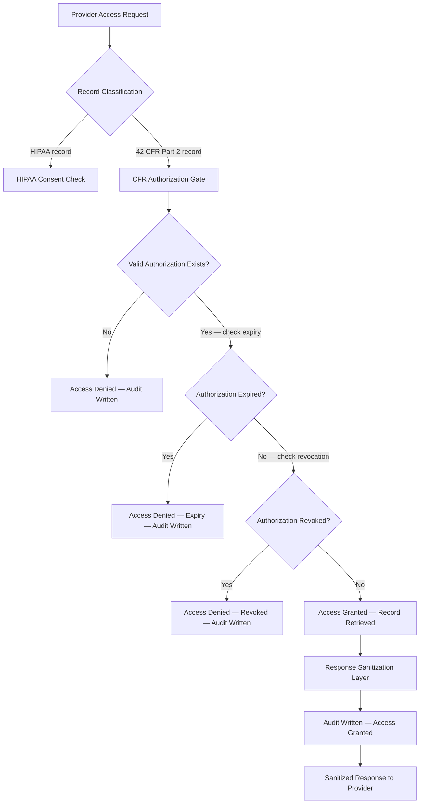

### Story Context

---

**From:** Nathan Cole <n.cole@mindscale.health>
**To:** Dr. Samara Wells <s.wells@mindscale.health>; [you] <you@mindscale.health>
**CC:** Priscilla Tang <p.tang@mindscale.health>
**Subject:** Care Coordination Feature — Q3 Launch
**Date:** Tuesday, 9:12 AM

Team —

Quick update from the board call yesterday. Investors are extremely excited about our care coordination pitch. The idea is simple: when a patient consents, their primary care physician can see their substance use disorder treatment records in MindScale. This closes a huge clinical gap — PCPs are often treating patients for physical conditions without knowing about SUD treatment that might affect medication choices. It also positions us for the integrated behavioral health market, which is the fastest-growing segment in the space.

From a product perspective, I'm thinking a consent toggle in the patient settings screen. Patient checks a box, enters their PCP's NPI number, and we surface a read-only view of their SUD records to that physician. Straightforward OAuth2 delegation — we've already built this kind of thing for the insurance reporting integration. Engineering estimate: 4 sprints, ship in Q3.

I'd like to get this on the roadmap by EOW. Can we schedule a 30-min sync to align?

Nathan

---

**From:** Dr. Samara Wells <s.wells@mindscale.health>
**To:** Nathan Cole <n.cole@mindscale.health>; [you] <you@mindscale.health>
**CC:** Priscilla Tang <p.tang@mindscale.health>
**Subject:** RE: Care Coordination Feature — Q3 Launch
**Date:** Tuesday, 11:47 AM

Nathan,

I want to be direct with you before this goes any further: what you've described cannot be implemented as a consent toggle. What you've described would expose MindScale to federal criminal liability under 42 CFR Part 2. I am not using that phrase for dramatic effect.

Let me explain why this is not a HIPAA problem. HIPAA permits disclosure of protected health information with patient authorization for treatment purposes, with relatively broad carve-outs. 42 CFR Part 2 is a separate federal statute that governs substance use disorder treatment records specifically — records created in the context of federally assisted SUD programs, which includes virtually every treatment center on our platform. The two regimes are not interchangeable. 42 CFR Part 2 is substantially more restrictive in the following ways:

**1. The consent must name the specific recipient.** Not "my primary care physician." Not "any treating provider." The authorization must identify the specific person or organization receiving the records. A toggle that says "share with my PCP" and routes to whoever holds an NPI that matches a patient-entered string is not legally valid consent under 42 CFR Part 2.

**2. The consent must state the specific purpose of the disclosure.** "Care coordination" is too vague. The authorization must state why the records are being shared — medication management, a specific procedure, coordinating care for a specific condition. The purpose constrains what the recipient can do with the information.

**3. The consent must state an expiration date or event.** A persistent toggle with no expiration is not valid. The patient must authorize a specific disclosure window or trigger condition. "Until I turn it off" is not sufficient.

**4. The right to revoke is not a future-state "turn off the toggle."** Revocation under 42 CFR Part 2 is retroactive to disclosures not yet made. If a patient revokes consent before records have been viewed by the recipient, those records must not be made available. This is not the same as deactivating an OAuth token.

**5. Re-disclosure is prohibited without new consent.** If the PCP shares those records with a specialist, a hospital system, or anyone else, that is a federal violation — by the PCP, but potentially by us as the platform that facilitated the original disclosure without adequate controls.

Nathan, I understand the business opportunity. Care coordination is genuinely valuable for patients. I am not opposed to building this feature. I am telling you that the architecture you've described is legally inoperative. We need to design a proper consent management system that captures legally valid 42 CFR Part 2 authorizations before a single record moves.

I'd like to schedule time with you and the engineering team this week — not a 30-minute sync, a proper working session.

Samara

---

**From:** Nathan Cole <n.cole@mindscale.health>
**To:** Dr. Samara Wells <s.wells@mindscale.health>; [you] <you@mindscale.health>
**CC:** Priscilla Tang <p.tang@mindscale.health>
**Subject:** RE: Care Coordination Feature — Q3 Launch
**Date:** Tuesday, 1:03 PM

Samara —

I appreciate the detailed response and I take the regulatory concern seriously. But I want to push back a little on the framing. We already have consent management for HIPAA purposes. Are you saying we need a completely different consent system for 42 CFR Part 2? That seems like a significant technical lift for what is fundamentally the same user action — a patient saying "yes, share my records."

Also — the insurance reporting integration has been running for 8 months. Are those disclosures also in violation?

Nathan

---

**From:** Dr. Samara Wells <s.wells@mindscale.health>
**To:** Nathan Cole <n.cole@mindscale.health>; [you] <you@mindscale.health>
**CC:** Priscilla Tang <p.tang@mindscale.health>
**Subject:** RE: Care Coordination Feature — Q3 Launch
**Date:** Tuesday, 1:31 PM

Nathan —

The insurance reporting integration does not disclose SUD treatment records. It discloses claims data for general mental health services, which is HIPAA-governed. I reviewed the data classification when Yusuf built it. SUD records were explicitly excluded from that scope. This is documented in our data classification policy, which I co-authored.

Yes. We need a different consent architecture for 42 CFR Part 2. The user action may feel the same to a patient but the legal requirements are fundamentally different. You cannot implement a legally valid 42 CFR Part 2 authorization through a settings toggle. The distinction is not bureaucratic. It is the difference between a button and a contract.

I have flagged this to our compliance counsel. They are available Wednesday afternoon for a working session. I would strongly recommend we include an engineer in that call.

Samara

---

**From:** [you] <you@mindscale.health>
**To:** Nathan Cole <n.cole@mindscale.health>; Dr. Samara Wells <s.wells@mindscale.health>
**CC:** Priscilla Tang <p.tang@mindscale.health>
**Subject:** RE: Care Coordination Feature — Q3 Launch
**Date:** Tuesday, 2:14 PM

Nathan, Samara —

I've been reading through 42 CFR Part 2 and I think I can sketch an architecture that satisfies the legal requirements while still shipping a usable care coordination feature. It's more than a toggle but it's not as far from what we have as it might seem.

The core insight is that a 42 CFR Part 2 authorization is a document, not a boolean. We need to store the authorization as a first-class entity with: recipient identity, stated purpose, expiration, issuing patient identity, and a timestamp. Downstream access is gated on a valid, non-expired, non-revoked authorization record for that specific (patient, recipient, purpose) triple. Revocation marks authorizations as revoked with an effective timestamp, and any disclosure pipeline checks for revocation before releasing data — not just at the moment of initial access grant.

I think Wednesday with legal makes sense. I'll have a preliminary schema and flow diagram ready. If we can get alignment on the data model, the engineering work is still achievable — it's just Q4, not Q3.

One question for Samara: does 42 CFR Part 2 permit us to notify a recipient that an authorization has been revoked, or does the statute prevent us from confirming the existence of the authorization at all?

---

**DM — Yusuf Adeyemi → [you]**
**Tuesday, 2:29 PM**

> The revocation question is the sharp edge. Worth looking at the 2020 amendments — they relaxed some of the re-disclosure rules but the named-recipient requirement is still hard. Also ask legal about "treating provider" as a category — the amendments tried to make coordinated care more workable but it's not a blanket carve-out.
>
> Side note: that toggle idea would have been a federal felony. I'm glad Samara caught it before it got to a sprint.

---

### Problem Statement

MindScale operates on 500 substance abuse treatment centers (SUD facilities), all of which fall under 42 CFR Part 2 — a federal statute governing SUD treatment records that is substantially stricter than HIPAA. Nathan Cole wants to build a care coordination feature allowing patients to share their SUD records with their primary care physicians. The feature is clinically valuable and commercially important.

The problem is architectural: a valid 42 CFR Part 2 authorization is a legal document with specific required fields, an expiration, and a right of retroactive revocation. It cannot be implemented as a settings toggle. You must design a consent management system that captures, stores, enforces, and audits 42 CFR Part 2 authorizations — while integrating with MindScale's existing access control and audit infrastructure to gate every disclosure against a valid, current authorization.

### Explicit Requirements

1. A patient must be able to create a 42 CFR Part 2 authorization naming a specific recipient (by NPI, name, and organization), stating a purpose, and setting an expiration date or event.
2. The system must prevent any SUD record disclosure unless a valid, non-expired, non-revoked authorization exists for the specific (patient, recipient, purpose) combination.
3. Patients must be able to revoke any authorization at any time; revocation must take effect for all disclosures not yet made (retroactive to pending requests).
4. Every authorization creation, access grant, access denial, revocation, and expiration event must be written to an immutable audit log.
5. The re-disclosure prohibition must be technically enforced: recipient systems must not receive data in a format that allows re-disclosure outside the platform.
6. Authorization expiration must be automatically enforced — no expired authorization may grant access, even if not explicitly revoked.
7. The consent UI must capture all legally required fields; incomplete or ambiguous authorizations must be rejected before storage.
8. The system must support 500 clinics, approximately 2M patients, and an estimated 50,000 active authorizations at steady state.

### Hidden Requirements

1. **Hint: re-read Dr. Wells' email, point 5.** Re-disclosure is prohibited. What does this mean for the data format you return to the PCP? A raw record dump they can screenshot and email is architecturally re-disclosable. How does the response format itself enforce the re-disclosure prohibition?

2. **Hint: re-read Yusuf's DM about the 2020 amendments.** The 2020 amendments to 42 CFR Part 2 introduced a pathway for a patient to authorize disclosure to a "treating provider" as a category rather than a named individual — but only in specific circumstances. Your architecture should handle both the named-recipient model and the treating-provider category model, with different validation rules for each.

3. **Hint: re-read Nathan's question about the insurance integration.** The existing system has HIPAA consent records that co-exist with these new 42 CFR Part 2 authorizations. A patient's general mental health records (HIPAA) and their SUD treatment records (42 CFR Part 2) are stored together in MindScale. Your access control layer must correctly classify which records are governed by which statute before deciding which consent artifact to check.

4. **Hint: re-read your own email, the final question.** Revocation notification: if a PCP has an active session viewing a patient's records and the patient revokes consent mid-session, what happens? The architecture must handle in-flight access, not just future access.

### Constraints

- **Platform scale:** 500 SUD clinics, 2M patients, 50,000 estimated active authorizations
- **Authorization operations:** ~500 new authorizations/day, ~50 revocations/day at steady state
- **Disclosure requests:** ~2,000 record access requests/day from recipient providers
- **Audit log retention:** 7 years minimum (federal requirement); append-only; tamper-evident
- **Latency SLA:** Authorization check (gate decision) must complete in < 50ms p99 (inline with record retrieval)
- **Revocation propagation:** Revocation must be reflected in all access control checks within 30 seconds of patient action
- **Data residency:** All PHI and authorization records must remain in US regions (HIPAA + 42 CFR Part 2 requirement)
- **Availability:** 99.9% uptime for the consent check path (clinic operations depend on it)
- **Storage estimate:** 50,000 authorizations × ~2KB each = ~100MB active; 7-year archive of ~1.3M authorization events × ~500 bytes = ~650MB audit log. Well within single-region PostgreSQL with partitioned audit tables.
- **Cost modeling:** At 2,000 access checks/day through a Redis authorization cache: ~60,000 reads/month at $0.0000001/read = negligible. Dominant cost is PostgreSQL RDS Multi-AZ (~$400/month) + audit log cold storage archival (~$20/month Glacier). Total infrastructure for this system: ~$500/month.
- **Team:** 2 engineers + compliance counsel oversight. 1 sprint for data model + API, 1 sprint for UI flows + revocation propagation, 1 sprint for audit log + access gate integration.

### Your Task

Design the 42 CFR Part 2 consent management system for MindScale, including:

1. The authorization data model capturing all legally required fields
2. The access control gate that enforces valid authorization before any SUD record disclosure
3. The revocation pipeline with propagation latency guarantee
4. The audit log schema and event taxonomy
5. The data classification layer that distinguishes HIPAA-governed from 42 CFR Part 2-governed records
6. The response sanitization layer that technically enforces the re-disclosure prohibition

### Deliverables

- [ ] **Mermaid architecture diagram** — end-to-end flow from patient consent creation through provider access request, authorization gate, record retrieval, and audit write
- [ ] **Database schema** — `cfr_authorizations`, `cfr_revocations`, `cfr_audit_log`, `record_classification` tables with column types, indexes, and constraints
- [ ] **Scaling estimation (step-by-step math)**
  - Authorization check latency budget: target < 50ms, break down into cache lookup + DB fallback + audit write
  - Revocation propagation: 30-second SLA through Redis pub/sub or short TTL cache invalidation — show the math
  - Audit log growth: 7 years × event rate × record size; partition strategy
  - Cost model: RDS instance sizing, Redis cache sizing, cold storage archival
- [ ] **Tradeoff analysis (minimum 3)**
  1. Named-recipient vs treating-provider authorization models: legal flexibility vs enforcement precision
  2. Synchronous authorization check (inline gate) vs asynchronous audit-only mode: latency vs safety
  3. Session invalidation on revocation (hard cutoff) vs graceful drain (complete current request): security vs UX
  4. Record classification at ingestion vs at query time: consistency vs flexibility
- [ ] **Revocation propagation design** — describe the mechanism for invalidating in-flight sessions within 30 seconds of a revocation event
- [ ] **Re-disclosure prevention design** — describe the technical mechanism (watermarking, view-only rendering, access-log-only API response format) that enforces the prohibition at the data layer

### Diagram Format

All architecture diagrams: Mermaid syntax (renders in GitHub Issues).

Example skeleton for the authorization gate:

Extend this into the full system including consent creation, revocation flow, session invalidation, and the record classification layer.
