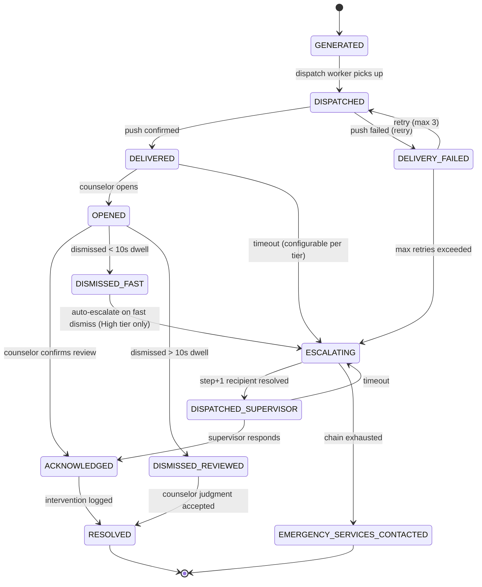

> **Notification System Lineage — Final Evolution**
>
> | Appearance | Company | Scale | Key Design Challenge |
> |---|---|---|---|
> | 1st | Beacon Media (Ch. 20) | 8.5M push, Champions League | Fan-out on write vs read; APNs/FCM provider limits |
> | 2nd | NeuroLearn (Ch. 43) | 6M in 90 min, exam reminders | Pre-staged fan-out; idempotency via staged table |
> | 3rd | SkyRoute (Ch. 59) | 8M in 40 min, irregular ops | Priority tiers P1/P2/P3; per-provider rate limiting |
> | 4th | ShieldMutual | Claims notifications | SOC 2 audit trail; delivery receipts for compliance |
> | **5th (Final)** | **MindScale (Ch. 255)** | **4,000/day, 30% false positive** | **Human attention as the constrained resource; consent-aware routing; crisis escalation state machine** |

---

### Story Context

---

**#clinical-operations — Monday, 8:51 AM**

**yusuf.adeyemi:** hey @[you] can you look at this before standup
**yusuf.adeyemi:** [screenshot: dashboard — Crisis Alert Volume Last 30 Days]
**yusuf.adeyemi:** 4,000 alerts/day sent to counselors
**yusuf.adeyemi:** 1,200 dismissed within 3 seconds of delivery
**yusuf.adeyemi:** that's a 3-second dismiss. they're not reading them.
**[you]:** what's the false positive rate
**yusuf.adeyemi:** 30%. we confirmed it by cross-referencing with counselor intervention logs.
**yusuf.adeyemi:** 2 missed crises last month. both cases: counselor received the alert, dismissed it, patient had an incident 40 minutes later.
**yusuf.adeyemi:** those counselors aren't bad. they learned to dismiss. we trained them to dismiss.
**[you]:** does samara know
**yusuf.adeyemi:** she called the meeting. it's this afternoon. nathan is not invited.

---

**MindScale Clinical Safety Review — Monday, 2:00 PM**
**Attendees:** Dr. Samara Wells (CMO), Yusuf Adeyemi (Staff Eng), Priscilla Tang (Head of Data Science), [you] (Staff Eng)
**Note-taker:** [you]

---

**Dr. Wells:** Before we start, I want to frame what this meeting is not. This is not a postmortem. This is not a blame session. And it is not an engineering problem.

**[you]:** What is it?

**Dr. Wells:** It is a human attention problem. And human attention is the scarcest resource we have. More scarce than compute, more scarce than storage, infinitely more scarce than bandwidth. A counselor at one of our partner clinics manages 40 to 60 patients at a time. They receive, on a typical day, between 8 and 12 crisis alerts from our platform. Of those, on average 3 are actionable. They cannot tell which 3 until they've investigated all of them. So they've done the rational thing: they've stopped investigating.

**Priscilla:** I want to defend the model for a second. A 30% false positive rate at a 92% recall is actually good for this domain. If we push precision higher, recall drops. We start missing real crises.

**Dr. Wells:** I know. I'm not asking you to fix the model. I'm asking for an architecture where a 30% false positive rate doesn't produce this outcome.

**Yusuf:** That's... a different design entirely.

**Dr. Wells:** Yes. It is. The current design treats notification delivery as the product. Send the alert, the job is done. I'm asking for a design where the product is a confirmed human response to a verified threat. Delivery is a means, not an end.

**[you]:** So we need to model the human as part of the system. Not just the recipient — an active participant with a defined role and response obligation.

**Dr. Wells:** Yes. And when the human doesn't respond, the system escalates. Not passively — not another alert to the same phone that's already drowning. Actively. A different channel. A different person. Ultimately, if no human in our system responds, external emergency services.

**Priscilla:** How do we handle consent here? Under 42 CFR Part 2, the notification itself might contain clinical context that can only go to authorized recipients. A supervisor escalation path could route information to someone without a valid authorization.

**Dr. Wells:** That is the correct question. And the answer is: the escalation path must be constrained by the authorization graph. A supervisor can receive a notification that says "Patient ID X, high priority, counselor has not responded" without receiving clinical content unless they have independent authorization for that patient. The routing layer has to know the difference.

**Yusuf:** So we have two separate concerns: escalation logic and consent-aware payload construction. The same event can trigger different notification content depending on the recipient's authorization state.

**Dr. Wells:** Exactly. And every action — including dismissal, including non-response — is an auditable event. I want to be able to show, in a regulatory review, that for every crisis alert generated by this system, we can trace every human decision and non-decision in the response chain.

**[you]:** Including the 3-second dismissals.

**Dr. Wells:** Especially those.

**Priscilla:** What do we do about notification fatigue? Even with escalation, if counselors know that dismissing will just bring a supervisor into it, they might start gaming the system — actually reading and assessing before dismissing, which is what we want, or routing to supervisors preemptively, which defeats the purpose.

**Dr. Wells:** I'd rather have counselors routing to supervisors than dismissing. At least a supervisor is a second pair of eyes. But you're right that we need smarter suppression logic for lower-severity alerts. Not every 0.65 confidence score should produce the same notification experience as a 0.94.

**Yusuf:** So we have tiers. High-confidence: immediate, no suppression, escalation chain on non-response. Medium-confidence: batched, aggregated view, counselor can bulk-review. Low-confidence: surfaced in a daily digest, no real-time interrupt.

**Dr. Wells:** Yes. But the tier assignment has to be explainable. Counselors need to be able to see why a patient was flagged at a given tier. If it's a black box, we've just added another system they won't trust.

**[you]:** I'll have a design by Thursday.

**Dr. Wells:** I know you will. I want one more thing in the design: a mechanism to detect when a counselor's dismissal patterns are becoming anomalous. Not to punish anyone. To identify when a human in the system is overwhelmed and needs support. That's a welfare signal, not a performance metric.

---

**DM — Yusuf Adeyemi → [you]**
**Monday, 3:47 PM**

> The escalation chain has to be configurable per clinic. Different clinics have different supervisor structures, different on-call rotations. We can't hardcode this.
>
> Also: for the at-least-once delivery guarantee with deduplication — we had an incident at SkyRoute (remember the irregular ops chapter?) where a dedup window that was too short caused duplicate P1 alerts. Make the dedup window configurable per severity tier.
>
> One more: notification payload under 42 CFR Part 2. Even if the supervisor doesn't have authorization, we can send a "check on patient X" notification with zero clinical content — no diagnosis, no SUD records, just a request for human presence. That's not a disclosure. Check with legal but I think that's clean.

---

### Problem Statement

MindScale sends 4,000 crisis alerts per day to counselors at 500 partner clinics. 30% are false positives. Two missed crises last month traced directly to notification fatigue: counselors dismissing alerts within seconds because the volume has conditioned them to treat all alerts as noise. Dr. Wells has redefined the product requirement: the system must produce a confirmed human response to a verified threat, not just deliver a notification.

Design the most mature notification system in the curriculum. The system must treat the human counselor as an active participant in the response chain — not a passive recipient. When a human fails to respond, the system must escalate through a defined chain until a response is confirmed or emergency services are contacted. Every human action and non-action must be audited. The routing of clinical content must be gated by 42 CFR Part 2 authorization. Notification fatigue must be addressed structurally through severity-tiered delivery with intelligent suppression and batching for lower-severity alerts.

### Explicit Requirements

1. Crisis alerts must be tiered by severity (High / Medium / Low) based on ML confidence score and configurable thresholds.
2. High-severity alerts must trigger an escalation state machine: primary counselor → supervisor → clinic administrator → emergency services, with configurable timeout per escalation step (default: 5 minutes between steps).
3. Escalation routing must be configurable per clinic: different supervisor structures, on-call rotations, and contact methods.
4. Notification payload must be consent-aware: recipients with valid 42 CFR Part 2 authorization for the patient receive clinical context; recipients without authorization receive a clinical-context-free escalation request.
5. Every alert event must be logged: generation, delivery, delivery failure, open, read, dismiss, acknowledge, escalation trigger, escalation step, and final resolution.
6. Delivery must be at-least-once with deduplication; dedup window must be configurable per severity tier.
7. Medium-severity alerts must be batched and aggregated for counselor review; batching interval and maximum batch size are configurable.
8. Low-severity alerts must be surfaced in a daily digest; no real-time interrupt.
9. If a counselor's dismissal rate over a rolling 7-day window exceeds a configurable threshold, a welfare signal must be raised to their supervisor (not the counselor).
10. The system must support 500 clinics, 2M patients, and 4,000 alerts/day at steady state with capacity for 10x spike (mass casualty event, clinic-wide mental health crisis).

### Hidden Requirements

1. **Hint: re-read Dr. Wells' comment about explainability.** Counselors must be able to see the specific signals that drove an alert's tier assignment. This is not just a UX requirement — it affects the notification payload schema. The payload must carry an explanation field with human-readable feature attribution (e.g., "Session sentiment: declining 3 consecutive sessions. Prior crisis: 47 days ago."). This explanation must itself be subject to data minimization: it should not reveal more clinical context than the recipient is authorized to see.

2. **Hint: re-read Yusuf's DM about clinic configurability.** The escalation chain is not global — it is a per-clinic, per-shift configuration artifact. This means the escalation chain must be resolved at alert dispatch time using the current clinic configuration, not at alert generation time. A configuration change (e.g., supervisor swap mid-shift) must affect in-flight escalation chains that have not yet reached that step.

3. **Hint: re-read Priscilla's concern about gaming.** The system must distinguish between a genuine human assessment ("I reviewed this and it is not a crisis") and a reflexive dismissal ("I dismissed this in 3 seconds"). These are the same user action but must produce different audit events and different behavioral signals. The distinction may require a UI-layer mandatory review window — but that is a product decision that should emerge from your architecture, not be assumed by it.

4. **Hint: re-read Dr. Wells' last request — the welfare signal.** The welfare signal (anomalous dismissal pattern detection) must not itself create a privacy problem. A supervisor receiving a "Counselor X has been dismissing alerts at an elevated rate" message is receiving performance-relevant information about a subordinate, which may be governed by labor relations policy. The architecture must route welfare signals to HR or clinical management, not expose them to peer counselors or patients.

### Constraints

- **Alert volume:** 4,000 crisis alerts/day at steady state; 40,000/day spike capacity (10x)
- **Clinics:** 500, each with independent escalation configuration
- **Patients:** 2M active; each alert maps to one patient
- **Alert tiers:** High (~400/day, 10%), Medium (~1,600/day, 40%), Low (~2,000/day, 50%)
- **Escalation chain:** Up to 5 steps; configurable timeout per step (minimum 3 min, default 5 min, maximum 30 min)
- **At-least-once delivery SLA:** High tier: < 10 seconds p99 from generation to delivery. Medium tier: < 60 seconds to batch inclusion. Low tier: included in next daily digest.
- **Dedup window:** High tier: 5 minutes. Medium tier: 30 minutes. Low tier: 24 hours.
- **Audit log retention:** 7 years, append-only, tamper-evident (HIPAA + 42 CFR Part 2)
- **Revocation impact:** If a 42 CFR Part 2 authorization is revoked while an escalation chain is in progress, subsequent escalation steps to non-independently-authorized recipients must suppress clinical content immediately (within 30 seconds — same SLA as Ch. 254)
- **Welfare signal window:** Rolling 7-day window, checked daily (not real-time) — batch job is acceptable
- **Cost modeling:**
  - Kafka: 4,000 events/day × 365 = 1.46M events/year; MSK t3.small ~$150/month
  - Redis (escalation state): 500 active High-tier chains max at any time × ~1KB state = 500KB — trivially small; ElastiCache t3.micro ~$30/month
  - Notification delivery (SNS/Firebase): 40,000 High-tier × $0.0000005 = $0.02/day = ~$7/year. Negligible.
  - Audit log storage: 4,000 alerts/day × 10 events/alert × 500 bytes = 20MB/day = 7.3GB/year × 7 years = 51GB; S3 + Glacier tiering ~$15/month
  - **Total infrastructure for notification system: ~$200/month**

### Your Task

Design the MindScale human-in-the-loop crisis notification system, producing:

1. The end-to-end notification pipeline from ML score → tier assignment → dispatch → escalation state machine → resolution
2. The escalation state machine with per-clinic configurability
3. The consent-aware payload construction layer (42 CFR Part 2 integration)
4. The audit trail schema covering all event types including dismissal behavior signals
5. The notification fatigue mitigation strategy with suppression logic, batching, and daily digest
6. The welfare signal detection and routing design

### Deliverables

- [ ] **Notification pipeline architecture (Mermaid)** — end-to-end from ML output through Kafka, tier router, dispatch workers, escalation state machine, and audit writer
- [ ] **Escalation state machine (Mermaid)** — states: `PENDING → DELIVERED → ACKNOWLEDGED | DISMISSED | ESCALATING → [next step] → RESOLVED | EMERGENCY_SERVICES_CONTACTED`; include timeout transitions, revocation-triggered state changes, and terminal states
- [ ] **Audit trail schema** — `crisis_alert_events` table: alert_id, patient_id (FK), clinic_id, recipient_id, event_type (ENUM: GENERATED, DISPATCHED, DELIVERED, OPENED, READ_CONFIRMED, DISMISSED_FAST, DISMISSED_REVIEWED, ACKNOWLEDGED, ESCALATED, RESOLVED, EMERGENCY_CONTACTED), event_timestamp, payload_hash, authorization_state (WITH_CLINICAL_CONTENT | WITHOUT_CLINICAL_CONTENT | NO_AUTHORIZATION), dismissal_dwell_ms (nullable), counselor_id, escalation_step (nullable). Column types, indexes, partition key.
- [ ] **Consent-aware routing decision tree** — for a given (alert, recipient): what authorization state is checked, what payload variant is constructed, what happens if authorization is revoked mid-chain
- [ ] **Notification fatigue mitigation strategy with metrics** — define: what threshold triggers welfare signal, how batching interval is computed, how suppression interacts with the escalation state machine for in-progress High-tier chains, what metric proves the redesign worked (target: counselor 3-second dismiss rate < 5%, down from 30%)
- [ ] **Scaling estimation (step-by-step math)** — show the path from 4,000/day steady state to 40,000/day spike: Kafka partition count, escalation state Redis memory, dispatch worker concurrency, audit log throughput

### Diagram Format

All architecture diagrams: Mermaid syntax (renders in GitHub Issues).

Escalation state machine sketch:

Extend this with: authorization revocation events that mutate payload variant for subsequent steps, welfare signal emission from `DISMISSED_FAST` events, and the daily digest aggregation path for Medium and Low tier alerts.
