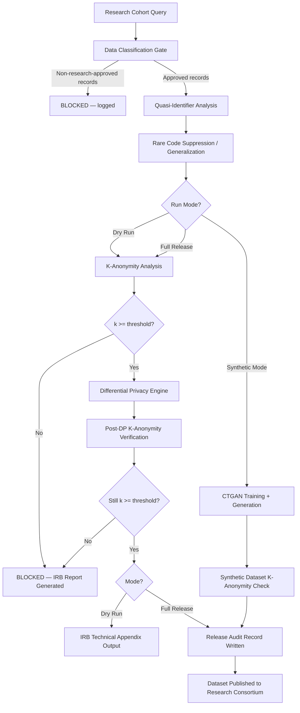

### Story Context

---

**#data-science — Wednesday, 10:14 AM**

**priscilla.tang:** morning — sharing the de-identification pipeline design for the IRB study before we finalize
**priscilla.tang:** [attachment: mindscale_deident_v2_pipeline.pdf]
**priscilla.tang:** summary: we strip direct identifiers (name, DOB, address, phone, NPI, MRN), generalize ZIP to 3-digit prefix, and bucket age into 5-year ranges. diagnosis codes are kept at ICD-10 specificity. session frequency is kept as exact count.
**priscilla.tang:** IRB approved the study design. we're good to publish the anonymized dataset to the research consortium by end of month.
**[you]:** give me a few minutes to read through this
**[you]:** actually — can you send me the field list as a flat schema? the PDF is hard to query mentally
**priscilla.tang:** [attachment: fields.csv]

---

*You open fields.csv. Eighteen columns. You run through them.*

*ZIP_3DIGIT. AGE_BUCKET (5-year range). PRIMARY_DIAGNOSIS (ICD-10 full code). COMORBIDITIES (array, ICD-10). SESSION_COUNT_LIFETIME. SESSION_FREQUENCY_WEEKLY. ADMISSION_DATE_MONTH_YEAR. DISCHARGE_DATE_MONTH_YEAR. TREATMENT_MODALITY. SUBSTANCE_TYPE (primary). SUBSTANCE_TYPE (secondary). GEOGRAPHIC_REGION. INSURANCE_TYPE. CLINIC_SIZE_BUCKET. OUTCOME_MEASURE. CRISIS_EVENTS_COUNT. READMISSION_FLAG. STUDY_COHORT_ID.*

*You reach for your laptop and pull up the k-anonymity analysis tool you built at Axiom Labs. You paste in the field list. You set the quasi-identifier set: ZIP_3DIGIT, AGE_BUCKET, PRIMARY_DIAGNOSIS, SESSION_FREQUENCY_WEEKLY. Four fields. You run the analysis against a 10,000-record sample Priscilla had shared two weeks ago for a different purpose.*

*The result loads. You stare at it.*

*23.4% of records are unique on those four fields alone.*

---

**#data-science — Wednesday, 10:43 AM**

**[you]:** Priscilla, I need to talk to you before this goes anywhere. Can you come to my desk or do you want a DM?
**priscilla.tang:** DM me

---

**DM — [you] → Priscilla Tang**
**Wednesday, 10:44 AM**

> **[you]:** I ran k-anonymity on the sample. ZIP_3DIGIT + AGE_BUCKET + PRIMARY_DIAGNOSIS + SESSION_FREQUENCY_WEEKLY. 23.4% of records are unique on those four fields. If a researcher — or anyone else — knows those four things about a patient, they can re-identify them with certainty.
>
> **priscilla.tang:** are you sure? we generalized ZIP and AGE specifically to prevent this
>
> **[you]:** The generalization isn't enough when you have rare diagnoses. ICD-10 F10.20 (alcohol use disorder, moderate) is common. F50.01 (anorexia nervosa, restricting type) is not. In a 3-digit ZIP area with maybe 800 people in the 25-30 age bucket, if you have a unique ICD-10 code and a distinctive session frequency, you're identifiable.
>
> **priscilla.tang:** ...
>
> **priscilla.tang:** that's a problem
>
> **[you]:** I know. I'm not sending this to #data-science. Let's get Samara.

---

**MindScale Privacy Review — Emergency — Wednesday, 11:15 AM**
**Attendees:** Dr. Samara Wells, Priscilla Tang, [you]
**Location:** Dr. Wells' office (door closed)

---

**Dr. Wells:** Show me the number.

**[you]:** 23.4%. Nearly one in four records is uniquely identifiable on four quasi-identifiers. That's before an adversary adds any external dataset — voter rolls, social media, insurance claims. Add one more data source and the percentage goes higher.

**Dr. Wells:** We cannot publish this. Full stop.

**Priscilla:** Samara, the research is important. This study will be cited in clinical practice guidelines for substance use disorder treatment outcomes. Academic researchers have been waiting 18 months for this data. Canceling it now —

**Dr. Wells:** I didn't say cancel it. I said we cannot publish this dataset. Those are different statements.

**Priscilla:** Can we fix it?

**[you]:** That depends on what "fix" means. We have three options and they have different tradeoffs. One: stronger generalization — suppress rare diagnosis codes, widen age buckets, drop session frequency to a categorical variable. You lose analytical precision. Some research questions become unanswerable. Two: differential privacy — add calibrated statistical noise to the sensitive fields. Preserves aggregate statistics for the research questions, but individual records are no longer exact. Three: synthetic data generation — train a model on the real dataset, generate a synthetic population that preserves the statistical properties without containing any real patient records. Highest protection, but researchers need to trust the synthetic distribution.

**Priscilla:** Option two or three. The research questions are about population-level patterns, not individual cases. Exact session counts don't matter if the distribution is preserved.

**Dr. Wells:** What's the re-identification risk for option two?

**[you]:** With proper epsilon-delta calibration, it can be made arbitrarily close to zero at the cost of analytical precision. The tradeoff is explicit and measurable. That's actually better than what we have now — right now the risk is 23%, and we don't even have a number for the residual risk after our generalization. Differential privacy gives us a formal privacy guarantee.

**Dr. Wells:** I want a formal guarantee. Not a best effort.

**Priscilla:** What about the IRB? They approved the current pipeline. If we change the de-identification method, do we need a new IRB amendment?

**[you]:** Almost certainly yes. But that's a month, not a year. And it's the right thing to do.

**Dr. Wells:** File the amendment. [you], I want an architecture document before end of week. Not a blog post. An engineering design that I can put in front of our legal team and the IRB. Show me the pipeline, show me the epsilon budget, show me what a researcher can and cannot do with the output.

**[you]:** I'll have it Thursday.

**Dr. Wells:** And one more thing. I want to know how this passed our internal review. We had a de-identification review process. It approved this. How did the k-anonymity check not happen?

*Silence.*

**Priscilla:** It wasn't in the checklist. We check for direct identifiers. We don't check for quasi-identifier combinations.

**Dr. Wells:** Add it to the checklist. Make it automated. Every future dataset release runs this check before any human reviews it. If the check fails, the release is blocked, not flagged.

---

**DM — Marcus Webb → [you]**
**Wednesday, 4:02 PM**

> Heard you caught a nasty one today. The quasi-identifier problem is older than most engineers know. AOL released "anonymized" search logs in 2006. NYT re-identified a specific user within 48 hours using four searches. Netflix released "anonymized" movie ratings in 2007. Two researchers re-identified users by cross-referencing with IMDb reviews. The pattern is always the same: whoever designed the de-identification thought about direct identifiers. Nobody thought about the combination.
>
> The fix you're building is the right one. Make the epsilon budget an explicit architectural decision, not a tuning knob. The number you pick is a statement about how much privacy risk you're willing to accept. That's an ethical decision, not a technical one. Make sure Dr. Wells knows she's making it.

---

### Problem Statement

MindScale's de-identification pipeline for an IRB-approved research dataset has a critical flaw: 23.4% of records are uniquely re-identifiable using just four quasi-identifier fields (ZIP code prefix, age bucket, ICD-10 diagnosis code, and weekly session frequency). Publishing this dataset in its current form would expose patients to re-identification risk despite surface-level anonymization.

Design a privacy-preserving research data pipeline that transforms the original clinical dataset into a publishable research dataset with formal privacy guarantees. The pipeline must support the research consortium's analytical needs (population-level statistics, cohort comparisons, outcome modeling) while reducing re-identification risk to a formally bounded, mathematically provable level. The architecture must also include the automated gating mechanism Dr. Wells mandated: no dataset release proceeds without passing k-anonymity and re-identification risk checks.

### Explicit Requirements

1. The pipeline must compute k-anonymity across all configurable quasi-identifier subsets and block release if k < 5 for any record (k=5 as minimum; configurable).
2. The pipeline must support differential privacy (DP) with explicit epsilon-delta budget assignment per field; the epsilon budget must be a documented, auditable decision, not a default value.
3. The pipeline must support synthetic data generation as an alternative output mode for datasets where DP noise would destroy analytical utility.
4. The release gate must be automated: a dataset release job cannot proceed unless the k-anonymity check and re-identification risk analysis pass; failure must block, not warn.
5. Every dataset release must produce an audit record: who requested it, IRB study ID, epsilon budget used, quasi-identifier configuration, k-anonymity result, release timestamp.
6. The pipeline must be reusable across multiple studies with different field configurations, quasi-identifier sets, and epsilon budgets.
7. Rare diagnosis codes (frequency < configurable threshold) must be suppressed or generalized before any downstream privacy transformation.
8. The pipeline must integrate with MindScale's existing data classification layer (Ch. 254): only records classified as "approved for research disclosure" may enter the pipeline.

### Hidden Requirements

1. **Hint: re-read Marcus Webb's DM about AOL and Netflix.** Both historical breaches involved cross-referencing the anonymized dataset with an external public dataset. Your re-identification risk analysis must model the linkage attack scenario — not just internal uniqueness, but uniqueness against plausible external data sources (insurance claims data is public; ZIP+diagnosis combinations appear in hospital discharge records). The pipeline should output a linkage attack risk score, not just a k-anonymity value.

2. **Hint: re-read Dr. Wells' statement "make the epsilon budget an explicit architectural decision."** The epsilon value must appear in the IRB amendment as a specific number with a justification. This means your system must provide a sensitivity analysis tool: for a given epsilon, what is the expected analytical utility loss for each research question? Researchers need to validate that their questions can still be answered before the IRB amendment is filed, not after.

3. **Hint: re-read Dr. Wells' demand about the review process failure.** The automated gate is not just for this pipeline — it must be retroactively applicable to previously released datasets. The architecture should include a dataset audit mode: given a previously released dataset and its field list, compute the current re-identification risk. If the risk has changed (because new external datasets have appeared), the system should surface that.

4. **Hint: re-read Priscilla's concern about IRB amendment timelines.** The pipeline must support a "dry run" mode where the full privacy analysis runs against the proposed dataset without committing to a release. The dry run output — including the epsilon budget recommendation, k-anonymity report, and suppression decisions — becomes the technical appendix to the IRB amendment. This means the pipeline's output format must be IRB-readable documentation, not just logs.

### Constraints

- **Dataset size:** 2M patient records total; research cohorts typically 10,000–500,000 records
- **Fields per dataset:** 15–25 quasi-identifier or sensitive fields typical
- **Re-identification target:** k ≥ 5 for all records (no record belongs to a group of fewer than 5 similar records)
- **Differential privacy budget:** epsilon ≤ 1.0 (strong privacy); epsilon ≤ 3.0 (moderate privacy, higher utility). Delta ≤ 10^-6 in all cases.
- **Suppression threshold for rare codes:** ICD-10 codes with population frequency < 0.1% in the cohort are generalized to 3-character level before DP noise addition
- **Pipeline latency:** full privacy analysis on 500K records must complete in < 30 minutes (batch job; not real-time)
- **Synthetic data generation:** must preserve marginal distributions for 1st and 2nd order statistics; GANs or CTGAN preferred; generation time budget: 4 hours for 500K records
- **Audit log retention:** 10 years (IRB requirement for research data governance)
- **Cost modeling:**
  - Compute: DP pipeline runs as batch on Spark (EMR); 500K records at epsilon=1.0: ~20 min on 4x r5.xlarge = ~$3/run
  - Synthetic data generation (CTGAN on GPU): g4dn.xlarge, 4 hours = ~$5/run
  - Audit log storage: 100 releases/year × 50KB metadata each = 5MB/year → negligible
  - Total pipeline cost: ~$8–$15/release; ~$1,000/year for 100 annual research releases
- **Team:** Priscilla's data science team owns the DP parameter selection; engineering owns the pipeline automation and gating

### Your Task

Design the privacy-preserving research data pipeline, including:

1. The end-to-end pipeline: raw cohort selection → data classification gate → quasi-identifier analysis → suppression → differential privacy noise addition → k-anonymity verification → release gate → audit record
2. The automated release gate with configurable thresholds
3. The dry-run mode output format (IRB-readable technical appendix)
4. The retroactive dataset audit capability
5. The synthetic data generation mode as an alternative output path

### Deliverables

- [ ] **Mermaid architecture diagram** — end-to-end pipeline from cohort query through data classification gate, suppression layer, DP engine, k-anonymity check, release gate (pass/block), and audit writer; include the dry-run and synthetic data branches
- [ ] **Database schema** — `research_releases` (release_id, study_id, irb_amendment_id, field_config JSONB, quasi_identifier_set JSONB, epsilon, delta, k_min_achieved, suppression_log JSONB, linkage_attack_score, status ENUM(PENDING, DRY_RUN, PASSED, BLOCKED, RELEASED), released_at, released_by); `release_audit_events` (append-only, indexed by study_id and release_id). Column types and indexes.
- [ ] **Scaling estimation (step-by-step math)**
  - EMR cluster sizing for 500K records: cores × memory × Spark partition strategy
  - Runtime estimate breakdown: cohort query → suppression pass → DP noise pass → k-anonymity scan → output
  - Storage: output dataset sizes for DP-noised vs synthetic variants
  - Cost per release and annual cost at 100 releases/year
- [ ] **Tradeoff analysis (minimum 3)**
  1. Differential privacy (formal guarantee, noise-added) vs k-anonymity + suppression (deterministic, zero noise, but no formal guarantee): when to use each
  2. Synthetic data (highest protection, most utility for aggregate stats) vs DP-noised real data (real provenance, auditable): research community trust tradeoffs
  3. Epsilon = 1.0 (strong privacy, higher utility loss) vs epsilon = 3.0 (moderate privacy, lower utility loss): frame as a clinical outcomes research vs pure statistics tradeoff
  4. Blocking on k-anonymity failure vs suppressing failing records and releasing the rest: what does Dr. Wells' "formal guarantee" requirement demand here?
- [ ] **Re-identification risk report template** — the output document produced by dry-run mode that becomes the IRB amendment technical appendix; must include: k-anonymity distribution histogram, linkage attack risk score with methodology, epsilon budget justification, suppression decisions with counts, recommended output mode (DP vs synthetic)

### Diagram Format

All architecture diagrams: Mermaid syntax (renders in GitHub Issues).

Extend this with: linkage attack risk scoring node, epsilon sensitivity analysis output, retroactive audit mode entry point, and the classification gate's integration with the Ch. 254 record classification layer.
