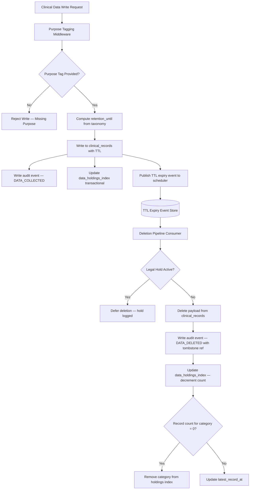

### Story Context

---

*Dr. Wells books a 1:1 with you for Thursday at 4 PM. The calendar invite has no description. That is unusual for her. She is normally precise about agenda items.*

*You arrive at her office. She is standing at a whiteboard, not sitting. The whiteboard has three columns drawn in blue marker: COLLECTED, PROCESSED, RETAINED. Under COLLECTED there are about fifteen items in small, careful handwriting. Under PROCESSED there are six. Under RETAINED there are two.*

---

**1:1 — Dr. Samara Wells and [you]**
**Thursday, 4:00 PM**
**Dr. Wells' office**

---

**Dr. Wells:** I've been thinking about something since the IRB dataset incident. *(She doesn't turn around from the whiteboard.)* The 23% re-identification risk came from data we were retaining that we didn't need to retain. The session frequency field. The full ICD-10 code. The admission date. We collected all of it because it was clinically useful at the time. We kept all of it because nobody ever said not to.

**[you]:** That's how most systems work. Collect everything, decide what to use later.

**Dr. Wells:** Yes. And it's wrong. Not wrong as in inefficient. Wrong as in — ethically indefensible. Every data point we hold about a patient that we don't need is a liability to that patient. We might be breached. We might make a mistake. We might someday have a different leadership team that makes different choices about what "consented use" means. The data's existence is the risk.

*She finally turns around.*

**Dr. Wells:** I want MindScale to be architecturally incapable of retaining data it doesn't need. Not through a retention job that runs at midnight and deletes old records. Through an architecture where over-retention is structurally prevented. Where the system can't hold data longer than it has a declared purpose for holding it, the same way a glass can't hold more water than its volume allows.

**[you]:** Purpose-bound storage.

**Dr. Wells:** Yes. Data should be tagged, at the moment of collection, with the purpose it's being collected for and the maximum duration that purpose justifies. When the purpose expires or is fulfilled, deletion is automatic and immediate. Not scheduled. Not dependent on a maintenance window.

**[you]:** There's a tension there. Therapeutic purposes don't always have clear end dates. A patient's crisis history is relevant to treatment decisions even years after the crisis.

**Dr. Wells:** Yes. And that's a legitimate purpose. "Ongoing therapeutic relationship — active patient" is a purpose with a defined duration: while the patient is in active treatment. The moment they discharge, the retention clock starts. The question is: what's the minimum data we need to retain after discharge, and for how long?

**[you]:** HIPAA requires 6 years for medical records. Some states require 10. So there's a regulatory floor.

**Dr. Wells:** Right. The regulatory floor is not the architectural design. Most systems treat the regulatory minimum as the default maximum. I want the inverse: the regulatory minimum is the maximum, not the default. We retain the minimum data required for compliance purposes, and nothing more. Anything beyond that minimum needs an active, documented, purpose-bound justification.

*She turns back to the whiteboard and adds a fourth column: MINIMUM REQUIRED.*

**[you]:** The event log is the hard problem. We have an append-only audit log for HIPAA and 42 CFR Part 2. You can't delete from an append-only log by definition.

**Dr. Wells:** Can we?

**[you]:** Not without breaking the tamper-evidence property. If you delete an event from the log, you can't prove the log hasn't been altered.

**Dr. Wells:** What would this look like if you were wrong about what we need?

*You sit with that for a moment.*

**[you]:** ...what do you mean?

**Dr. Wells:** You said we can't delete from an append-only log without breaking tamper-evidence. What if the assumption "we need the original clinical detail in the audit log" is wrong? What if we need to audit that an action happened, but not the clinical content of the action?

*Something shifts.*

**[you]:** Separation of the audit proof from the clinical payload. The log records that a record was accessed, by whom, when, under what authorization — but the clinical content it refers to is stored separately and is deletable. The log's integrity is preserved. The patient's clinical data can still be erased.

**Dr. Wells:** Yes. Now you're thinking about it the right way. *(A pause.)* I heard that question from Dr. Adaeze Obi at a conference last year. Privacy and Systems Design Summit. She asks it about every architecture she reviews: "What would this look like if you were wrong about what you need?" I've used it three times since and it's changed the design each time.

**[you]:** I should read her work.

**Dr. Wells:** You should. She was also a psychiatrist before she became a systems architect. We have more in common than most people expect.

*She caps her marker and sets it on the whiteboard tray.*

**Dr. Wells:** I want a design. Not a policy document. An architecture. Mutable storage for clinical payloads, immutable storage for audit proofs. Purpose tags and TTLs written at the moment of data collection. Automatic deletion pipelines that are not cron jobs — they're architectural invariants. And a right-to-erasure implementation that can prove, to a regulator, that the deletion happened and that the audit trail is still intact.

**[you]:** That's three or four systems that need to change.

**Dr. Wells:** I know. How long?

**[you]:** A quarter for the architecture. A quarter to migrate existing data. Another quarter to harden. Call it nine months end-to-end.

**Dr. Wells:** I'm not in a hurry. I've waited years for someone to propose this properly. *(She moves to the door.)* One more thing. When you design the purpose taxonomy — the list of valid purposes a data collection can be tagged with — I want patients to see it. In plain English. Not a privacy policy. A live view: "We currently hold these categories of information about you, for these purposes, until these dates." Transparency is part of minimization.

---

**DM — [you] → Yusuf Adeyemi**
**Thursday, 5:31 PM**

> **[you]:** Samara wants purpose-bound storage across the whole platform. Purpose + TTL at write time, automatic deletion when TTL expires or purpose ends. The audit log stays immutable but the clinical payload it references gets deleted separately.
>
> **yusuf.adeyemi:** oh. that's... actually elegant. the hard part is migrating existing data. everything we have right now has no purpose tag.
>
> **[you]:** I know. I'm going to need your help mapping the current data flows. You know where everything is buried.
>
> **yusuf.adeyemi:** yeah. some of it I buried. some of it predates me. some of it... I genuinely don't know why it exists.
>
> **[you]:** That's where we start. The data we can't explain the purpose of gets tagged "UNKNOWN_PURPOSE" and goes into a 90-day review queue before automatic deletion.
>
> **yusuf.adeyemi:** samara is going to love that.
>
> **[you]:** I know.

---

### Problem Statement

Dr. Samara Wells has articulated a philosophy she calls "privacy by forgetting" — an architecture where over-retention of patient data is structurally prevented, not managed by policy. The current MindScale platform collects clinical data with no purpose tagging, retains it indefinitely by default, and runs periodic cleanup jobs that are inadequate to enforce real data minimization.

Design the data minimization architecture: a platform-wide system where every data collection event is tagged with a declared purpose and a maximum TTL at write time, where deletion is automatic and architectural rather than scheduled and operational, where the right-to-erasure can be executed on clinical payloads without invalidating the tamper-evident audit log, and where patients have a real-time transparent view of what data is held about them and why.

### Explicit Requirements

1. Every data write to MindScale's clinical data store must include a purpose tag (from a controlled taxonomy) and a calculated TTL based on that purpose.
2. TTL expiration must trigger automatic, immediate deletion of the clinical payload — not a scheduled job, but an event-driven pipeline.
3. The audit log must remain immutable and tamper-evident after clinical payload deletion; the log must record that the record existed and that it was deleted, without retaining the clinical content.
4. Right-to-erasure requests (GDPR Article 17 / HIPAA patient rights) must be processable within 30 days; the system must produce a deletion certificate proving the data was erased and the audit trail is intact.
5. The purpose taxonomy must be finite, documented, and patient-readable; purposes must map to maximum retention durations.
6. Existing data with no purpose tag must be categorized: either retrospectively tagged through a migration process or placed in a 90-day review queue pending classification, after which unclassified data is auto-deleted.
7. Patients must have access to a real-time transparency view showing: what data categories are held, under what purpose, until what date.
8. 42 CFR Part 2 records must follow their own purpose taxonomy distinct from general clinical records; purpose tags for SUD records must be constrained to purposes permitted under 42 CFR Part 2.

### Hidden Requirements

1. **Hint: re-read Dr. Wells' question "What would this look like if you were wrong about what we need?"** The shift she describes — separating the audit proof from the clinical payload — has a second implication you haven't fully addressed in the 1:1. If the clinical payload is deleted, what happens to the audit log entries that reference it by foreign key? A referential integrity violation or a dangling reference? The architecture must define what happens to audit log entries after their referenced clinical payload is deleted: tombstone records, nullable payload FKs with deletion timestamps, or a separate deletion confirmation event type.

2. **Hint: re-read Yusuf's DM about data he "genuinely doesn't know why it exists."** Some of the data in MindScale predates the current team. The purpose-taxonomy migration cannot rely on engineers knowing why data was collected. The UNKNOWN_PURPOSE classification and 90-day review queue must have an owner assignment: someone responsible for investigating and classifying each UNKNOWN_PURPOSE record category, with an escalation path if the owner doesn't respond within a defined window. The architecture must enforce this ownership, not just log it.

3. **Hint: re-read Dr. Wells' description of the transparency view for patients.** The transparency view must be generated from live data — not a cached static policy document. This means the system must maintain a per-patient index of active data holdings: data category, purpose, retention_until. This index must be updated transactionally with every data write and every deletion. If the index is stale (because a deletion ran but the index wasn't updated), the transparency view shows data that no longer exists — which is a different kind of integrity problem than retaining data too long.

4. **Hint: re-read Dr. Wells' statement about the regulatory floor not being the architectural design.** HIPAA's 6-year retention minimum applies to the designated record set (DRS), which is a defined subset of clinical records. Not all data MindScale collects is part of the DRS. Session telemetry, app usage logs, feature interaction data, and behavioral analytics are almost certainly not DRS-regulated. The purpose taxonomy must distinguish DRS-regulated data (minimum retention floor applies) from non-DRS data (no regulatory floor; the minimum is whatever the purpose requires). This distinction changes the default TTL calculation for each data category.

### Constraints

- **Data scale:** 2M patients; estimated 50M clinical data records across all categories; ~500M app-level telemetry records
- **Purpose taxonomy size:** 12–20 distinct purposes expected; each has a defined maximum retention duration
- **TTL range:** Minimum 30 days (session artifact); Maximum 10 years (state-mandated medical record retention)
- **Right-to-erasure SLA:** 30 days from request to deletion certificate
- **Deletion pipeline throughput:** Must handle up to 10,000 TTL-expiry deletions/day at steady state; 100,000/day spike (bulk discharge event or legal hold lift)
- **Audit log integrity:** Cryptographic hash chain; each entry includes hash of previous entry; deletion does not alter existing entries
- **Transparency view latency:** Patient-facing, must load in < 2 seconds; served from materialized per-patient holdings index
- **Migration window for legacy data:** 90-day review queue; auto-deletion after 90 days if unclassified; migration job must process existing 50M records within 6 months
- **Cost modeling:**
  - Storage reduction estimate: 40–60% reduction in clinical data storage by eliminating retained-but-purposeless data. At current RDS storage cost of ~$0.115/GB-month and estimated 2TB of clinical data, 50% reduction saves ~$115/month.
  - Deletion pipeline (event-driven, Lambda or Kubernetes Job): ~10,000 deletions/day × minimal compute = < $5/month
  - Transparency index (materialized table in PostgreSQL): 2M rows × ~500 bytes = 1GB; negligible storage addition
  - Migration batch job (6-month window): Spark on EMR, weekend batch; ~$200 total over migration period
  - **Total ongoing cost delta: -$100 to -$200/month (net savings from storage reduction)**
- **Compliance:** HIPAA, GDPR Article 17 (right to erasure), GDPR Article 15 (right of access — the transparency view), 42 CFR Part 2

### Your Task

Design the data minimization architecture for MindScale, including:

1. The purpose taxonomy: a controlled vocabulary of valid data collection purposes, each with a maximum retention duration and a DRS-regulated flag
2. The write-time tagging system: how every data write acquires a purpose tag and TTL
3. The deletion pipeline: event-driven, triggered by TTL expiry or explicit erasure request
4. The audit log design: how immutability is preserved after payload deletion
5. The per-patient transparency index: maintained transactionally with writes and deletions
6. The legacy data migration strategy: the 90-day review queue, owner assignment, and auto-deletion path
7. The right-to-erasure workflow: request intake, processing, deletion certificate generation

### Deliverables

- [ ] **Mermaid architecture diagram** — data write path (purpose tagging → clinical store → audit log → transparency index update), deletion pipeline (TTL expiry event → payload deletion → audit tombstone write → transparency index update), and erasure request path (request intake → legal hold check → deletion pipeline → certificate generation)
- [ ] **Database schema** — `clinical_records` (record_id, patient_id, data_category, purpose_tag ENUM, collection_timestamp, retention_until, payload JSONB, deleted_at nullable, deleted_reason), `purpose_taxonomy` (purpose_id, purpose_name, description_patient_readable, max_retention_days, is_drs_regulated, requires_active_treatment), `data_holdings_index` (patient_id, data_category, purpose_tag, earliest_record_at, latest_record_at, retention_until, record_count), `erasure_requests` (request_id, patient_id, requested_at, completed_at, certificate_hash, status ENUM). Column types, indexes, and partition strategy.
- [ ] **Scaling estimation (step-by-step math)**
  - Migration batch: 50M records × classification lookup time = total migration duration at given parallelism
  - Steady-state deletion pipeline: 10,000 TTL expirations/day → event rate → Lambda concurrency or K8s job parallelism → latency to deletion from TTL expiry
  - Transparency index update throughput: writes/day to clinical_records → index update rate → whether synchronous (transactional) or asynchronous (acceptable staleness window)
  - Storage reduction ROI: model the 6-month migration effect on RDS storage bill
- [ ] **Tradeoff analysis (minimum 3)**
  1. Transactional transparency index update (strong consistency, write amplification) vs async update (eventual consistency, risk of showing deleted data): which does Dr. Wells' transparency requirement demand?
  2. Event-driven deletion (immediate on TTL expiry) vs scheduled batch deletion (cheaper compute, predictable load, slight delay): compliance SLA implications
  3. Per-record TTL vs per-category TTL (all records of a type share the same TTL): operational simplicity vs patient-specific purpose tracking
  4. Nullable payload FK in audit log (references a deleted record) vs tombstone record in clinical store (record exists as a shell with deleted_at set, no payload): what does each approach mean for the right-to-erasure certificate?
- [ ] **Purpose taxonomy table** — define 10–12 representative purposes with human-readable names, max retention durations, and DRS-regulated status. Examples: ACTIVE_TREATMENT, POST_DISCHARGE_CONTINUITY, REGULATORY_COMPLIANCE_HIPAA, RESEARCH_IRB_APPROVED, BILLING_AND_CLAIMS, CRISIS_RESPONSE_HISTORY, QUALITY_ASSURANCE. Include the purpose for 42 CFR Part 2 SUD records as a distinct entry.
- [ ] **Deletion certificate design** — describe the contents of the deletion certificate issued after a right-to-erasure request: which fields it must contain, how it proves completeness of deletion, how it proves the audit log was not altered, and how it handles the case where some records had a regulatory hold and could not be immediately deleted.

### Diagram Format

All architecture diagrams: Mermaid syntax (renders in GitHub Issues).

Extend this with: the erasure request path, the right-to-erasure certificate generation, the legacy migration 90-day queue, and the patient-facing transparency view read path.
