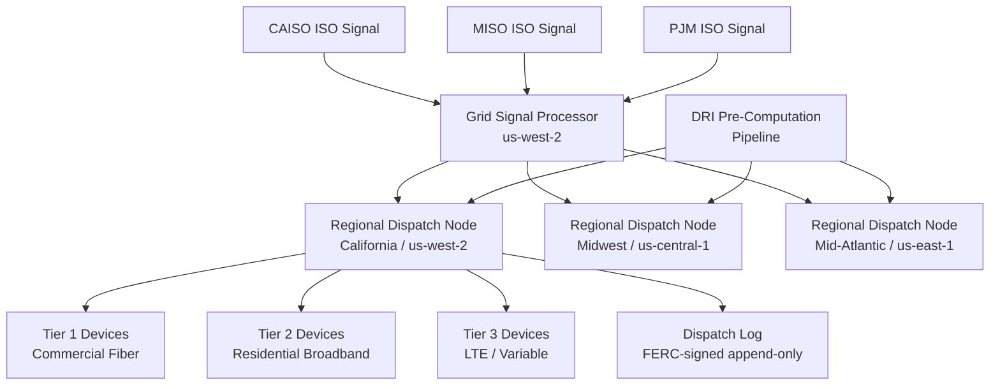

### Story Context

Your second week at GlacierGrid, Sofia Andersen calls it "grid week." No new features. No roadmap discussions. Just architecture.

She pulls you into a standing meeting with Kwabena Asiedu on Wednesday morning and says, plainly: "We are about to lose the CAISO contract. You need to understand why before you can help us fix it." Then she leaves the room.

---

**#grid-reliability** — Tuesday 3:14 PM

**Kwabena Asiedu:** p99 dispatch latency for today's 2pm event: 2,147ms.

**Mei Zhang:** That's not a spike. That's been the trend for three weeks. Attaching the Grafana link.

> [grafana.glaciergrid.internal/dispatch-latency · 7d]
> p50: 310ms | p95: 1,840ms | p99: 2,147ms | SLA: 500ms

**Kwabena Asiedu:** We had 612ms average two months ago. What changed?

**Mei Zhang:** Fleet grew. September we were at 38,000 DERs. Today we're at 50,212. The dispatch server is a single process. It opens a TCP connection to each device sequentially in chunks of 500. At 50k devices that math doesn't work anymore.

**Kwabena Asiedu:** It was never supposed to work this way. That architecture was a proof of concept from 2021.

**Sofia Andersen:** [joins] I just got off a call with Lisa Huang at CAISO. They ran a compliance audit on our response times for October. We were out of SLA on 14 of 31 frequency regulation events. The contract requires 95% compliance. We hit 55%.

**Kwabena Asiedu:** How much time do we have?

**Sofia Andersen:** Lisa was generous. She gave us 90 days to demonstrate architectural improvement or they open the contract for rebid. If we lose CAISO, we lose $4.2M ARR. MISO and PJM will hear about it within a week. We lose all three, we're done.

**Mei Zhang:** I've been looking at the dispatch server code. It's a Node.js process, single-threaded event loop, sends commands serially to device agents. No regional grouping. No pre-computation. A device in Sacramento gets queued behind a device in San Diego.

**Kwabena Asiedu:** The ISOs don't care about Sacramento vs San Diego. They care about aggregate MW response. We don't need to dispatch every device — we need to dispatch enough devices in the right region fast enough to hit the MW target.

**Sofia Andersen:** That's the insight we haven't built around. @newengineer — I want you and Kwabena to design the new dispatch architecture. We need it reviewed by Friday. Real numbers only.

---

**DM — Kwabena Asiedu → [You]** — Tuesday 4:02 PM

**Kwabena:** Let's go through this together. I'll give you the grid context, you give me the systems architecture. Deal?

**You:** Deal. Start from the top.

**Kwabena:** CAISO sends us a frequency regulation signal every 2–4 seconds during a regulation event. The signal says: we need +150MW or -80MW within 4 seconds from your California fleet. We have ~18,000 DERs in California. Not all of them are dispatchable at any given moment — some are at max output, some have low state of charge, some are in maintenance mode.

**You:** So we need to know the dispatchable capacity of each DER before the event arrives.

**Kwabena:** Exactly. Right now we compute that at dispatch time. That's the first bottleneck. We query device state, rank them, build dispatch commands, then send. Under load that sequence takes 800ms before we send a single packet.

**You:** We need to pre-compute. Maintain a ranked dispatch list that's updated continuously, not built at event time.

**Kwabena:** Yes. But there's more. The dispatch signal has to arrive at the device and be acknowledged before we can report compliance to the ISO. Acknowledgment latency has two components: network RTT and device processing time. Our residential inverters are behind home routers — NAT traversal, variable connectivity, some on LTE with 80ms+ RTT. Our commercial battery banks are on dedicated fiber — 5ms RTT.

**You:** That means we shouldn't be sending commands from a central server in us-west-2. We need regional dispatch nodes, physically closer to device concentrations.

**Kwabena:** There are three geographic clusters that match the ISO boundaries roughly. California (CAISO) — 18,000 DERs, mostly residential solar + utility-scale batteries in the Central Valley. Midwest (MISO) — 16,000 DERs, commercial wind farms, grain elevator backup generators. Mid-Atlantic (PJM) — 16,000 DERs, commercial solar + demand response industrial loads.

**You:** Okay. Let me sketch the architecture.

**Kwabena:** One more constraint. The ISO contract requires us to maintain a cryptographically signed dispatch log for every command sent and acknowledged. Audit trail. That's a FERC requirement.

**You:** How long must it be retained?

**Kwabena:** Seven years. FERC Order 890.

---

**Design Session — Wednesday 10:00 AM — Conference Room "Faraday"**

You sketch on the whiteboard. Kwabena watches, occasionally correcting grid terminology.

The architecture that emerges over the next two hours:

Three Regional Dispatch Nodes (RDNs) — one per ISO boundary. Each RDN maintains a continuously-updated Dispatch Readiness Index (DRI) for every DER in its region. The DRI is a pre-ranked list: devices sorted by dispatchable capacity, current state of charge, historical reliability score, and network latency percentile.

When an ISO regulation signal arrives, the central Grid Signal Processor receives it, routes it to the relevant RDN, and the RDN executes the pre-computed dispatch list — no ranking at dispatch time. Target: command generation in under 50ms. Network delivery to 80% of devices: under 200ms. Aggregate acknowledgment for enough MWs to satisfy the ISO target: under 500ms total.

The key insight Kwabena keeps coming back to: you don't need all 18,000 California DERs to respond. You need enough dispatchable MW. If your top 2,000 commercial assets can deliver 120MW of the requested 150MW, dispatch them first and only page residential units if you fall short.

"Tier your fleet," he says. "Tier 1 are low-latency, high-reliability commercial assets. Tier 2 are residential. Tier 3 are assets with variable connectivity. You dispatch Tier 1 first, measure the aggregate response, dispatch Tier 2 if you're short. You almost never need Tier 3."

You write at the top of the whiteboard: **Pre-rank. Pre-compute. Tier your fleet. Route close.**

### Problem Statement

GlacierGrid's centralized dispatch architecture cannot deliver frequency regulation commands to 50,000 DERs within the contractually required 500ms SLA. Current p99 latency is 2,147ms — 4.3x the SLA. The root cause is a combination of centralized command generation, sequential dispatch, and no pre-computation of device readiness.

Design a regional edge dispatch architecture that reduces p99 dispatch latency to under 400ms (20% buffer below the 500ms SLA), supports 50,000 DERs across three ISO regions, and maintains a FERC-compliant cryptographically signed dispatch log with 7-year retention.

### Explicit Requirements

1. Dispatch commands must reach enough DERs to satisfy ISO MW target within 500ms of receiving the regulation signal (p99 SLA)
2. Support 50,000 DERs across three ISO regions: CAISO (18,000), MISO (16,000), PJM (16,000)
3. Regional dispatch nodes must operate independently — failure in one region must not affect others
4. Pre-compute and continuously maintain a Dispatch Readiness Index (DRI) for each DER
5. Tier device fleet by response reliability: Tier 1 (commercial, fiber, low-latency), Tier 2 (residential, variable), Tier 3 (high-latency, intermittent)
6. Maintain a cryptographically signed dispatch log for every command sent and acknowledged (FERC Order 890, 7-year retention)
7. Device state updates must feed into DRI within 30 seconds of a state change
8. Support graceful degradation: if a regional node is unreachable, the central coordinator must be able to dispatch directly (with degraded latency)

### Hidden Requirements

1. **Hint**: Re-read Kwabena's Slack message: "We don't need to dispatch every device — we need to dispatch enough devices in the right region fast enough to hit the MW target." This implies the dispatch system needs a **partial-acknowledgment model** — it should report compliance to the ISO when enough MW have responded, not when all dispatched devices have acknowledged. What does your acknowledgment rollup look like?

2. **Hint**: Kwabena mentioned "cryptographically signed dispatch log" for FERC compliance. Re-read the DM exchange. The signed log must be tamper-evident and auditable by FERC. What does your signing model look like? Who holds the signing key? What happens if a regional dispatch node signs a command that was never actually sent?

3. **Hint**: Sofia said "90 days to demonstrate architectural improvement." This means you need to migrate the live fleet — 50,000 devices — to the new architecture without a downtime window. The ISO never stops sending signals. What is your migration strategy?

4. **Hint**: Mei's observation that "residential inverters are behind home routers — NAT traversal, variable connectivity." The dispatch protocol must work through NAT without a persistent connection from the server side. What connection model do you use for residential vs commercial DERs?

### Constraints

- DERs: 50,000 total (CAISO: 18,000, MISO: 16,000, PJM: 16,000)
- ISO regulation signal frequency: every 2–4 seconds during an active regulation event
- Peak concurrent regulation events: 3 (one per ISO, occasionally simultaneous)
- Dispatch latency SLA: p99 < 500ms end-to-end (signal receipt to MW response)
- Target design: p99 < 400ms (20% buffer)
- FERC dispatch log retention: 7 years, cryptographically signed
- Device state update interval: Tier 1 (5s heartbeat), Tier 2 (30s), Tier 3 (60–300s)
- Tier 1 devices: ~8,000 (commercial assets, fiber, <10ms RTT)
- Tier 2 devices: ~32,000 (residential, broadband/LTE, 20–80ms RTT)
- Tier 3 devices: ~10,000 (variable connectivity, 80–500ms RTT)
- Team: 15 engineers (6 backend, 2 infra, 1 SRE, 2 embedded/firmware, 2 data, 2 grid ops)
- Budget: $180,000/month infrastructure (current: $45,000/month — you have room to spend)
- Compliance: FERC Order 890, NERC CIP-002 through CIP-011 (cyber security standards for BES)

### Your Task

Design the regional edge dispatch architecture for GlacierGrid's virtual power plant. Produce a complete system design covering the Dispatch Readiness Index pre-computation pipeline, regional dispatch node architecture, tiered fleet dispatch logic, partial-acknowledgment reporting to ISO, FERC-compliant dispatch log, and migration strategy for the live fleet.

### Deliverables

- [ ] Mermaid architecture diagram showing central Grid Signal Processor, three Regional Dispatch Nodes, DRI pre-computation pipeline, and device connectivity tiers
- [ ] Database schema for Dispatch Readiness Index: device state, tier assignment, dispatchable capacity, reliability score, last-seen timestamp (with indexes)
- [ ] Dispatch log schema: command ID, device ID, region, ISO target MW, commanded MW, acknowledged MW, signed hash, timestamp chain
- [ ] Scaling estimation (show math):
  - Commands per second at peak (3 simultaneous ISO events, 50,000 DERs)
  - DRI update throughput (state changes/second across all tiers)
  - Dispatch log write throughput and storage over 7 years
  - Network bandwidth per Regional Dispatch Node
- [ ] Tradeoff analysis (minimum 4 tradeoffs):
  - Pre-computed DRI vs. real-time query at dispatch time
  - Tiered fleet dispatch vs. uniform dispatch (MW efficiency vs. latency)
  - Regional node autonomy vs. central coordinator authority
  - Partial-acknowledgment reporting vs. wait-for-all
- [ ] Migration plan: how to cut over 50,000 live devices to new architecture while ISOs continue sending signals
- [ ] FERC signing model: key management, tamper-evidence mechanism, audit query interface
- [ ] Connection model specification: how Tier 1 (fiber, static IP), Tier 2 (NAT/broadband), and Tier 3 (LTE/intermittent) devices maintain dispatchability

### Diagram Format

All architecture diagrams: Mermaid syntax (renders in GitHub Issues).

> Expand this diagram in your deliverable to show the DRI update pipeline, acknowledgment rollup, and fallback path from central coordinator to direct dispatch.
