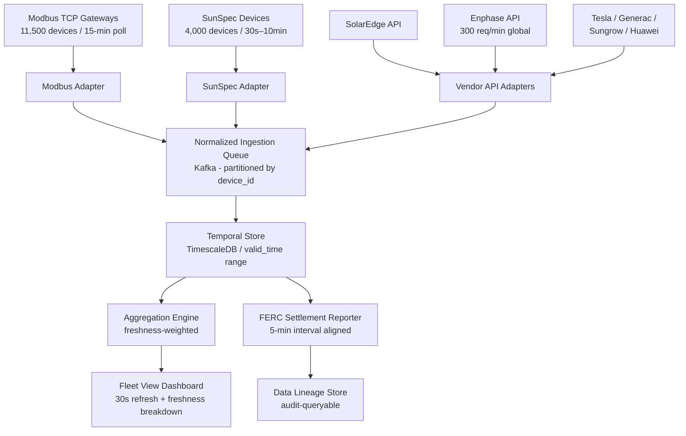

### Story Context

Three weeks into your tenure at GlacierGrid, Darius Okonkwo stops you in the hallway between the kitchen and the engineering bullpen. He is holding a printout — actual paper, which is unusual — covered in highlighted rows.

"I need to show you something," he says.

Darius is Head of Grid Operations. He is not technical in the engineering sense, but he reads data the way a cardiologist reads an EKG: instinctively, pattern-first. He has been managing grid operations for eleven years, first at Pacific Gas & Electric, then at a demand response aggregator, now here. He was the one who negotiated the CAISO contract. He is the reason GlacierGrid has revenue.

He spreads the printout on the conference table. It's a 24-hour snapshot of fleet output from last Tuesday — aggregated generation in megawatts, per hour, across the California fleet.

"We reported 1,847 MW to CAISO at 2pm," he says. "But I cross-checked with the individual asset reports. Best I can figure, we were actually generating around 1,620 MW at that time."

He pauses. "That's a 12% error. That's not a rounding issue. That's a systems problem."

---

**Email Chain — Wednesday, 7:42 AM**

**From:** Darius Okonkwo (Head of Grid Operations)
**To:** Sofia Andersen (CTO)
**CC:** Kwabena Asiedu (Principal Engineer)
**Subject:** Fleet Dashboard Numbers — Accuracy Concern — Urgent

Sofia,

I have been sitting on this for two weeks because I wanted to make sure before I raised it. I am now sure.

The aggregate generation numbers on the Fleet View dashboard are not reliable. I have done spot checks on 14 trading days and in 11 of them the reported aggregate was more than 8% different from what I calculate manually from the individual DER reports. In four cases the error was above 15%.

This matters for two reasons:

1. We use these numbers in real-time to calculate our "headroom" — how much additional MW we can commit to an ISO dispatch signal. If the dashboard says we have 200MW of headroom and the real number is 150MW, we accept a dispatch signal we cannot fulfill. NERC reliability violation. Contract penalty. Possibly something worse.

2. We use these numbers in our weekly settlement reports to CAISO. If we are systematically over-reporting, and CAISO audits us, this is a significant compliance exposure.

I don't know if this is a data problem or a software problem. I need engineering to investigate.

Darius

---

**Email Response — Wednesday, 8:15 AM**

**From:** Sofia Andersen
**To:** Darius Okonkwo
**CC:** Kwabena Asiedu, [You]
**Subject:** RE: Fleet Dashboard Numbers — Accuracy Concern — Urgent

Darius,

Thank you for escalating. This is important.

I am pulling [our new Staff Engineer] onto this today. Kwabena will provide protocol context.

To be clear about the business consequence: if CAISO audits our settlement reports and finds systematic over-reporting, we face potential disgorgement of payments received plus penalties. In a worst-case scenario, this could constitute market manipulation under FERC tariff rules, regardless of intent.

I need a root cause analysis and a design proposal by end of week.

Sofia

---

**Design Session — Wednesday 2:00 PM — "Faraday" Conference Room**

Kwabena pulls up the device fleet database and starts walking you through it.

"The problem," he says, opening a query result, "is that we have 50,000 devices and they speak completely different languages."

He points to three columns: `protocol`, `poll_interval_seconds`, `last_reading_timestamp`.

"23% of our fleet — about 11,500 devices — report through Modbus TCP gateways. These are mostly older residential inverters and agricultural load controllers. The gateways poll the devices every 15 minutes. So when we aggregate at 2pm, those devices are reporting their output as of 1:45pm. Or maybe 1:47pm. The gateway has its own clock drift."

"8% — about 4,000 devices — use SunSpec, which is the solar industry's open protocol. It runs over Modbus with a standardized register map. The data quality is better, but the poll intervals vary by installation. Some of these are every 30 seconds. Some are every 5 minutes. Some are 10 minutes."

"The remaining 69% — about 34,500 devices — use proprietary vendor APIs. SolarEdge, Enphase, Tesla Powerwall, Generac, Sungrow, Huawei FusionSolar. Each one has a different API, different auth mechanism, different data schema, different rate limits, and different latency. SolarEdge gives us a 5-minute aggregation with a 2-minute delivery lag. Enphase is near-real-time but their API has a 300-request-per-minute rate limit across all our customers combined."

You stare at the list. "And we're blending all of this into a single aggregate number without labeling the timestamps?"

Kwabena: "The current aggregation service takes the most recent reading for each device, sums the power output, and reports that. It was built in 2021 when we had 8,000 devices. Nobody thought about temporal alignment."

"So when Darius looks at the 2pm number, he's seeing a blend of: devices that reported at 2:00pm, devices that reported at 1:45pm, devices that reported at 1:47pm, and devices that reported at 1:53pm."

"Correct. And on a day when the sun went behind clouds at 1:50pm, the California fleet output dropped by 180MW in about 90 seconds. If most of our 15-minute-polling Modbus devices captured their reading at 1:45pm — before the cloud cover — and our real-time devices captured it at 2:00pm, we're blending a pre-cloud reading with a post-cloud reading. The aggregate looks 'average.' It's actually wrong about everything."

You write on the whiteboard: **The aggregate is not a snapshot. It's a smear.**

Kwabena nods. "That's exactly what it is."

"What does FERC require for settlement reports?" you ask.

"Settlement intervals are 5 minutes. CAISO market rules require that each 5-minute interval report represent actual measured output during that interval, not a point-in-time sample. We're not even close to compliant."

"How long has this been in production?"

Kwabena looks at the floor. "The aggregation service has been this way since we launched commercial operations. About 26 months."

You both sit with that for a moment.

"Okay," you say. "Let me think about the data model."

You start drawing. The insight that emerges over the next two hours: you can't fix the polling intervals — those are constrained by the protocols and vendor APIs. What you can fix is how you represent and surface the uncertainty.

Every reading needs a `valid_time_start` and `valid_time_end` — a temporal interval that represents what real-world period the reading actually covers. When you aggregate, you have to account for whether readings overlap the target interval or not, and you have to quantify how much of your aggregate is based on stale data.

The fleet view dashboard should show not just "1,847 MW" but "1,847 MW (of which 68% reported within last 2 minutes, 23% reported 3–18 minutes ago, 9% data older than 18 minutes)." Darius needs to see the confidence interval on that number.

And for FERC settlement, you need a different computation entirely: an interval-aligned aggregation that only uses readings whose valid_time overlaps the 5-minute settlement interval — and explicitly marks intervals where data coverage is insufficient for compliance reporting.

"You're describing bi-temporal data modeling," Kwabena says.

"With uncertainty quantification on top," you say.

"That's not what I expected from a grid systems perspective, but it's correct."

Sofia appears in the doorway. "Do I need to call a compliance attorney?"

You and Kwabena exchange a look.

"Yes," you both say.

### Problem Statement

GlacierGrid's Fleet View dashboard aggregates real-time output from 50,000 DERs across three incompatible protocols — Modbus TCP (15-minute polling), SunSpec (30-second to 10-minute polling), and 6 proprietary vendor APIs (2-minute to 5-minute delays). The current aggregation service blends readings regardless of their timestamps, producing numbers that are systematically inaccurate by 8–15%.

Design a multi-protocol DER ingestion platform and temporally-correct aggregation engine. The system must: ingest heterogeneous data streams, track data freshness per device, produce aggregates that correctly represent uncertainty and staleness, and generate FERC-compliant 5-minute interval settlement data.

### Explicit Requirements

1. Ingest data from all four source types: Modbus TCP gateways, SunSpec devices, and 6 proprietary vendor APIs (SolarEdge, Enphase, Tesla Powerwall, Generac, Sungrow, Huawei FusionSolar)
2. Each reading must be stored with temporal metadata: `valid_time_start`, `valid_time_end`, `received_at`, `source_protocol`, `poll_interval_seconds`
3. Real-time Fleet View dashboard must display aggregate MW with data freshness breakdown (% of fleet reported within: 0–2 min, 2–18 min, 18+ min)
4. FERC 5-minute interval settlement report must only use readings whose valid_time overlaps the settlement interval; explicitly flag intervals with insufficient coverage
5. Support vendor API rate limits without dropping data: Enphase global rate limit 300 req/min across all customers; SolarEdge 300 req/day per installation
6. Device state changes (e.g., inverter goes offline) must be reflected in aggregates within the device's polling interval — no "zombie" contributions from devices that have stopped reporting
7. Historical replay: ability to recompute any past settlement interval with corrected readings
8. Audit log: every settlement interval report must include the source readings used, their timestamps, and a coverage percentage

### Hidden Requirements

1. **Hint**: Re-read Darius's email: "if CAISO audits us, this is a significant compliance exposure" and Sofia's response about "disgorgement of payments received plus potential market manipulation." The 26 months of existing settlement reports are already filed. The system you build must include a **historical restatement capability** — the ability to recompute past settlement reports with corrected temporal logic and produce a delta between what was reported and what should have been reported. This is not a nice-to-have; it's the legal exposure mitigation.

2. **Hint**: Kwabena mentioned "Enphase's API has a 300-request-per-minute rate limit across all our customers combined." GlacierGrid has approximately 4,800 Enphase devices. At 300 req/min, you can poll each device at most once every 16 minutes. But the settlement interval is 5 minutes. You cannot poll every Enphase device every 5 minutes. What is your coverage strategy for this vendor? How do you handle partial coverage in the aggregate?

3. **Hint**: Kwabena said "the gateway has its own clock drift." Modbus gateways are embedded devices that often have hardware clocks that drift by seconds or minutes per day. If a gateway clock is 4 minutes slow, the `valid_time` label on all readings from that gateway is systematically wrong. How do you detect and correct for gateway clock skew?

4. **Hint**: Sofia's email CC'd you from the start. She expects a compliance posture — not just a technical fix. Your design should include a **data lineage system**: for any reported aggregate, an auditor must be able to trace every contributing reading back to the raw source, the protocol, and the device. This is distinct from just storing readings — it's a queryable audit graph.

### Constraints

- Fleet: 50,000 DERs (Modbus: 11,500, SunSpec: 4,000, Proprietary APIs: 34,500 across 6 vendors)
- Data ingestion rate: varies by protocol
  - Modbus: ~767 device readings/minute (11,500 devices / 15-minute poll)
  - SunSpec: ~133 readings/minute average (4,000 devices / 30s–10min mix)
  - SolarEdge: 300 API calls/day total for the installation set (~3,500 devices)
  - Enphase: 300 requests/minute global across ~4,800 devices
  - Tesla/Generac/Sungrow/Huawei: per-vendor limits (assume 1 req/device/5min average)
- Settlement reporting: 5-minute intervals, filed with CAISO within 30 minutes of interval end
- Fleet View dashboard refresh: 30-second target
- Historical data: 26 months of existing readings to be reprocessed for restatement analysis
- Storage: readings are ~200 bytes each. At 50,000 devices with average 5-minute polling: 10,000 readings/minute = 600,000/hour = 14.4M/day = ~5.2B/year
- Team: 6 backend engineers (2 assigned to this project)
- Latency SLA: settlement reports < 30 minutes after interval end; dashboard < 30s refresh
- Budget: $180,000/month total infra (this project should add < $8,000/month)

### Your Task

Design the multi-protocol DER data ingestion and temporally-correct aggregation platform. Cover: protocol adapter architecture for each source type, temporal data model, real-time aggregation with freshness metadata, FERC 5-minute interval settlement engine, historical restatement capability, vendor rate limit management, and data lineage system.

### Deliverables

- [ ] Mermaid architecture diagram: protocol adapters, ingestion pipeline, temporal store, aggregation engine, Fleet View feed, FERC settlement reporter
- [ ] Database schema for DER readings with full temporal metadata (column types and indexes):
  - `device_readings` table with valid_time range, received_at, source_protocol, raw_value_kw
  - `settlement_intervals` table with coverage_pct, flagged status, filing timestamp
  - `data_lineage` table linking settlement computations to source readings
- [ ] Scaling estimation (show math):
  - Peak ingestion rate (readings/sec) across all protocols
  - Storage sizing over 7 years (FERC retention)
  - Dashboard aggregation query cost at 30s refresh over 50,000 devices
  - Restatement recompute time for 26 months of historical data
- [ ] Tradeoff analysis (minimum 4 tradeoffs):
  - Continuous poll aggregation vs. interval-aligned settlement computation
  - Per-device temporal storage vs. pre-aggregated rollups
  - Full historical restatement vs. forward-only correction
  - Freshness-weighted aggregation vs. last-known-value aggregation
- [ ] Vendor rate limit strategy: how you allocate Enphase's 300 req/min across 4,800 devices without dropping settlement coverage
- [ ] Clock skew detection algorithm: how to identify and correct Modbus gateway clock drift
- [ ] Compliance posture document outline: what you present to Sofia and the compliance attorney covering the 26-month restatement analysis approach

### Diagram Format

All architecture diagrams: Mermaid syntax (renders in GitHub Issues).

> Expand to show clock skew detection path, restatement job, rate limit scheduler per vendor, and the coverage flagging logic in the settlement reporter.
