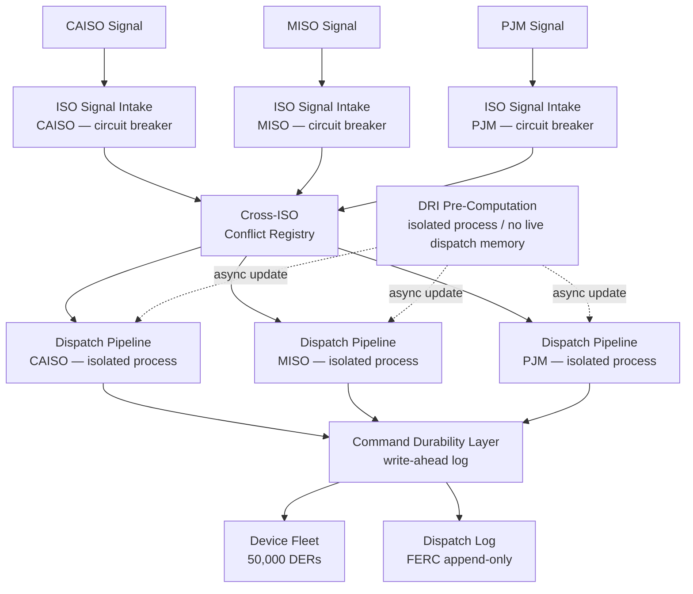

### Story Context

**SPIKE: Production DOWN — Grid Cascade Failure Across 3 ISO Regions**

---

**#incidents** — Wednesday, 06:47 AM Pacific

**[PagerDuty]** ALERT: CAISO_DISPATCH_ACK_RATE below 40% threshold. Expected ≥80%. Current: 23%. [P1] Assigned to: Mei Zhang

---

**06:48 — Mei Zhang:** I'm on. Pulling metrics now. CAISO sent a negative dispatch event (curtailment) at 06:44. We issued commands to 18,000 California DERs. Acknowledgment rate is stuck at 23%.

**06:49 — Mei Zhang:** Dispatch server CPU at 94%. Memory at 88%. The command queue is backed up. I'm seeing 14,000 commands still pending in the outbound queue.

**06:51 — Kwabena Asiedu:** [joins] I'm looking at the CAISO signal. This is unusual — it's a blanket curtailment, not a frequency response. They want -400MW from the entire California fleet simultaneously. That's every dispatchable asset. We don't normally dispatch all 18,000 at once. Standard events are 2,000–4,000 devices.

**06:52 — [PagerDuty]** ALERT: MISO_DISPATCH_SERVICE latency_p99 above 5000ms threshold. Expected ≤500ms. [P1] Assigned to: Mei Zhang

**06:52 — Mei Zhang:** Oh no. MISO is now signaling too.

**06:53 — Kwabena Asiedu:** Both at the same time? What's happening on the grid this morning?

**06:54 — [automated]** ALERT: DISPATCH_SERVER OutOfMemoryError — process restarted automatically. Node: dispatch-prod-01

**06:54 — Mei Zhang:** The server just OOM'd and restarted. All in-flight commands for CAISO — lost. We're starting over.

**06:55 — [PagerDuty]** ALERT: PJM_DISPATCH_LATENCY p99 above threshold. [P1] Assigned to: Mei Zhang

**06:55 — Mei Zhang:** PJM. All three ISOs. Simultaneously.

**06:55 — Darius Okonkwo:** [joins] What is happening. I'm getting calls from our ISO relationship managers.

**06:56 — Kwabena Asiedu:** Darius — there's a grid event happening across all three regions at the same time. Probably a generation shortfall somewhere, ISOs are calling on all demand response resources simultaneously. We are not equipped for this scenario. Our dispatch server was designed for one ISO at a time.

**06:57 — Mei Zhang:** I need to be honest about what's happening. The dispatch server is a single process. It's now trying to manage command queues for 50,000 devices across three ISOs at the same time. That's 3x its designed peak load. It is thrashing. Every time it OOMs and restarts, it loses all in-flight state. We are in a restart loop.

**06:57 — Sofia Andersen:** [joins] I'm here. Give me situation status.

**06:58 — Mei Zhang:** Status: dispatch system is effectively down. We are not delivering commands to devices. Three ISO contracts are in active non-compliance. CAISO event has been running for 11 minutes without acknowledgment. MISO: 6 minutes. PJM: 3 minutes.

**06:58 — Sofia Andersen:** What are the contract penalty thresholds?

**06:59 — Darius Okonkwo:** CAISO: we lose 100% of capacity payment for any event where we fail to respond within 4 seconds. That event is now 13 minutes old. MISO: sliding penalty scale starts at 5 minutes non-response. PJM: automated deficiency notice at 10 minutes. Each incident is logged in our performance record. Three incidents in one quarter triggers a capacity accreditation review.

**07:01 — Mei Zhang:** I found something. Look at dispatch-prod-01 logs at 06:43. Before the CAISO event, there was already a large batch job running — the DRI pre-computation update (from the new architecture we started building after the Ch. 267 work). It was doing a full fleet refresh. 50,000 devices. It was consuming 40% of dispatch server memory before the cascade started.

**07:01 — Kwabena Asiedu:** The pre-computation job and the live dispatch system share the same process. That's a resource isolation failure on top of a load failure.

**07:02 — [automated]** ALERT: dispatch-prod-01 restarted (3rd time). Process uptime: 47 seconds.

**07:03 — Tom Reidel [PJM Grid Ops, external]:** [joins bridge] This is Tom Reidel, PJM grid operator. We issued a reliability directive at 06:43 due to a large generation unit tripping offline in the PJM footprint. We coordinated with CAISO and MISO to call on all demand response aggregators simultaneously. This is a NERC reliability event. I need a status update from GlacierGrid on your response compliance.

**07:04 — Sofia Andersen:** Tom, we are experiencing a system failure. We are working to restore dispatch capability. Can you give us a timeline on how long this directive will be in effect?

**07:04 — Tom Reidel:** The generation unit is expected back online in 60–90 minutes. The directive will remain in effect. GlacierGrid's non-response is being logged as a reliability event.

**07:06 — Mei Zhang:** I have a partial mitigation. I can kill the DRI pre-computation job. That frees 40% memory. The dispatch server might stabilize long enough to process commands — but it'll still be trying to handle 50,000 devices with one process. I give it 15 minutes before it OOMs again under full load.

**07:06 — Sofia Andersen:** Do it. Buy us 15 minutes.

**07:07 — Mei Zhang:** DRI job killed. Dispatch server memory: 48%. It's stable. Starting command dispatch — prioritizing CAISO first (longest non-compliance window).

**07:09 — Kwabena Asiedu:** We need to triage. We cannot dispatch all 50,000 devices with one server. We need to decide which ISO to serve first and let the others continue accumulating penalties, or we accept degraded performance across all three.

**07:10 — Darius Okonkwo:** CAISO is our largest contract — $4.2M ARR. MISO is $2.8M. PJM is $1.9M. If I had to choose, we protect CAISO first. But this is not a normal business decision. Tom, are you still on this bridge?

**07:10 — Tom Reidel:** I'm here.

**07:10 — Darius Okonkwo:** Tom, given the reliability event, do the ISOs have a preference for which aggregators respond to which ISO's directives if an aggregator cannot respond to all three simultaneously?

**07:11 — Tom Reidel:** That's a novel question. Normally aggregators don't serve multiple ISOs simultaneously. The ISOs don't have a coordination protocol for this scenario because it isn't supposed to happen.

**07:13 — Mei Zhang:** CAISO dispatch running. I'm sending to Tier 1 California devices only — 3,200 commercial assets. Acknowledgment rate climbing: 31%, 44%, 58%, 71%. Getting there.

**07:15 — [automated]** ALERT: dispatch-prod-01 memory at 79%. Warning threshold.

**07:16 — Mei Zhang:** I'm going to lose it again in about 4 minutes. I can't do MISO and PJM from this server while CAISO is still running.

**07:17 — Kwabena Asiedu:** I have an emergency option. I can spin up two additional EC2 instances — dispatch-emergency-01 and dispatch-emergency-02 — and manually configure them to handle MISO and PJM respectively. They won't have the DRI pre-computation data so they'll dispatch all devices rather than prioritizing by tier. Slower. But it's three processes instead of one.

**07:17 — Sofia Andersen:** Do it.

**07:19 — Kwabena Asiedu:** Instances spinning up. 90 seconds.

**07:20 — [automated]** ALERT: dispatch-prod-01 memory at 91%.

**07:21 — Mei Zhang:** CAISO ACK rate: 82%. We've crossed the 80% threshold. CAISO is partial-compliant for the first time this event. 34 minutes after the directive. We're still going to be penalized but we're no longer fully non-compliant.

**07:22 — Kwabena Asiedu:** dispatch-emergency-01 is live. Starting MISO dispatch. dispatch-emergency-02 starting PJM in 30 seconds.

**07:24 — Mei Zhang:** MISO dispatch running. PJM dispatch running. But look at this — some California devices that are also registered with our MISO fleet are receiving commands from both dispatch-prod-01 and dispatch-emergency-01. Conflicting commands. One says curtail, one says normal operation.

**07:25 — Kwabena Asiedu:** That's because we have 847 devices that span CAISO/MISO boundary — they're registered in both ISO markets for different products. The two dispatch processes don't know about each other.

**07:26 — Mei Zhang:** I'm seeing device fault alerts from those 847 assets. When they receive conflicting commands, the inverter firmware goes into a safe-hold state. They stop dispatching entirely. They're now generating 0 MW.

**07:27 — Tom Reidel:** [still on bridge] What is happening with the boundary devices? We're seeing anomalous readings from those registrations in both PJM and MISO markets.

**07:28 — Sofia Andersen:** We have conflicting dispatch commands reaching devices registered in multiple ISO markets. We are working to resolve.

**07:28 — Kwabena Asiedu:** I'm stopping MISO dispatch for the 847 boundary devices. Sending a reset command to clear their fault state.

**07:30 — Darius Okonkwo:** Running tally: CAISO non-response window was 34 minutes. That's full capacity payment loss for this event. MISO: 38 minutes. PJM: 35 minutes. And we have 847 devices in fault state that are reporting zero generation — those will affect our settlement numbers too.

**07:45 — Mei Zhang:** All three dispatchers are running. Overall ACK rates: CAISO 84%, MISO 71%, PJM 68%. The emergency instances are slower without DRI pre-ranking.

**08:30 — Mei Zhang:** Reliability directive is winding down. Tom Reidel reports the tripped generation unit is back online. Scaling down emergency instances. Starting full postmortem capture.

**09:00 — Sofia Andersen:** Bridge formally closed. Incident duration: 2h13m. This is our worst production incident. I need a complete postmortem and architecture redesign proposal by Monday. Not next Monday. This Monday. Three days.

**09:00 — Kwabena Asiedu:** Understood.

**09:00 — Tom Reidel:** I'll need a copy of your incident report for NERC reliability event documentation. Standard protocol.

**09:30 — Sofia Andersen (DM → you):** You just watched what happens when a system fails in a way you never designed for. What's the architecture we should have had? Start writing.

---

**Incident Timeline Summary**

| Time | Event |
|------|-------|
| 06:43 | DRI pre-computation job starts (memory contention begins) |
| 06:44 | CAISO issues blanket curtailment directive |
| 06:47 | CAISO ACK rate alert fires |
| 06:52 | MISO directive received |
| 06:54 | Dispatch server OOM #1 |
| 06:55 | PJM directive received |
| 06:55 | All three ISO dispatch running on single server |
| 06:57 | Dispatch server OOM #2 |
| 07:02 | Dispatch server OOM #3 |
| 07:06 | DRI job killed — partial stabilization |
| 07:21 | CAISO partial compliance achieved (34 min late) |
| 07:22 | Emergency MISO/PJM dispatchers started |
| 07:26 | 847 boundary devices enter fault state from conflicting commands |
| 08:30 | Reliability directive ends |
| 09:00 | Bridge closed |

---

### Problem Statement

GlacierGrid's dispatch architecture suffered a catastrophic cascade failure when three ISO regions issued simultaneous curtailment directives — a scenario the system was never designed to handle. The root failures were: (1) single-process dispatch server with no bulkhead isolation between ISO regions, (2) shared memory between pre-computation batch jobs and live dispatch, (3) no circuit breaker to prevent command flooding beyond device fleet capacity, (4) no cross-ISO device registration awareness leading to conflicting commands and 847 devices entering fault mode.

Design the post-incident architecture that makes a multi-ISO simultaneous dispatch scenario a handled, graceful case rather than a catastrophic one. The architecture must prevent cascading failures through bulkhead isolation, handle graceful degradation under overload, prevent conflicting commands to multi-ISO-registered devices, and maintain FERC-compliant audit records even during partial system failure.

### Explicit Requirements

1. Bulkhead isolation: each ISO region (CAISO, MISO, PJM) must have a fully isolated dispatch pipeline — one ISO overload must not affect others
2. Circuit breaker on ISO signal intake: if a single ISO signal requires dispatching more than X% of the regional fleet simultaneously, trigger a load-shedding protocol before accepting the signal
3. Pre-computation jobs (DRI refresh) must run in resource-isolated processes completely separate from the live dispatch path
4. Cross-ISO device registry: maintain awareness of devices registered in multiple ISO markets; a device receiving a command from one ISO must be locked against conflicting commands from another ISO for the duration of the dispatch event
5. Graceful degradation mode: when a regional dispatch node is overloaded, automatically fall back to Tier 1-only dispatch with explicit ISO notification of partial response
6. Dispatch log must be written even during partial failure — commands that were sent but unacknowledged must be logged as `sent_unacknowledged`, not silently dropped
7. Incident playbook automation: load-shedding, emergency instance provisioning, and cross-ISO conflict detection must be runbook-driven with automation hooks (not ad-hoc manual commands as in this incident)
8. Recovery time objective (RTO): from OOM event to dispatch restoration < 90 seconds (vs. 17+ minutes in this incident)

### Hidden Requirements

1. **Hint**: Tom Reidel said "normally aggregators don't serve multiple ISOs simultaneously" and "the ISOs don't have a coordination protocol for this scenario." This is a gap in the industry. The real hidden requirement is that GlacierGrid needs a **multi-ISO coordination protocol**: a way to notify all three ISOs simultaneously when entering a degraded dispatch mode, commit to partial MW delivery, and negotiate which ISO gets priority MW if capacity is constrained. This is a business process requirement surfaced by a technical failure.

2. **Hint**: Mei said "I'm going to lose it again in about 4 minutes." The dispatch server had no **graceful drain mechanism** — when it OOM'd, in-flight commands were simply lost. The architecture needs a **command durability guarantee**: commands must be persisted (and de-duplicated) before they are sent to devices, so a process restart can resume from last known state rather than starting over.

3. **Hint**: Darius said "those [847 boundary devices] will affect our settlement numbers too." The fault-state period of those 847 devices — where they generated 0 MW because of a conflicting command GlacierGrid issued — creates a **liability question**: who bears the cost of the generation loss from a GlacierGrid-caused fault? This requires an **operational harm detection** mechanism: automatically flagging devices that were taken offline by GlacierGrid-issued commands and calculating the MW-hour cost.

4. **Hint**: Tom Reidel said "I'll need a copy of your incident report for NERC reliability event documentation." GlacierGrid's incident response tooling was entirely informal (Slack messages, ad-hoc manual commands). For a NERC reliability event, there is a formal reporting requirement under NERC Standard EOP-004. The architecture needs an **incident record system** that captures timeline, actions taken, commands sent, and personnel involved in a structured format suitable for regulatory submission.

### Constraints

- Fleet: 50,000 DERs across 3 ISOs
- Multi-ISO-registered devices: ~847 (boundary assets with dual market registration)
- Peak simultaneous dispatch scenario: all three ISOs simultaneously, full fleet curtailment = 150,000 command operations (50k devices × 3 — though device conflicts reduce this)
- Command throughput requirement: 18,000 commands/4 seconds per ISO = 4,500 commands/sec per region = 13,500 commands/sec at peak across all three
- Dispatch RTO: < 90 seconds from process failure to restored dispatch (vs. 17 min in incident)
- FERC dispatch log: append-only, every command regardless of ACK status
- NERC reliability event reporting: structured report within 24 hours of incident closure
- Cross-ISO conflict lock: device locked against conflicting commands for duration of dispatch event (maximum 15 minutes per NERC O&P standard)
- Cost: emergency EC2 provisioning in < 60 seconds (current: manual, ~90 seconds)
- Team available during incident: 4 engineers (Mei, Kwabena, you, one on-call)

### Your Task

Design the post-incident architecture and the blameless postmortem structure. Produce: bulkhead isolation architecture per ISO, command durability mechanism, cross-ISO device conflict registry, graceful degradation protocol with ISO notification, automated runbook triggers, NERC-compliant incident record system, and a capacity model for the peak simultaneous dispatch scenario. Also produce the postmortem document structure (5 Whys analysis for this specific incident).

### Deliverables

- [ ] Mermaid architecture diagram: three isolated ISO dispatch pipelines (bulkheads), shared cross-ISO conflict registry, DRI pre-computation in isolated process, command durability layer, graceful degradation path
- [ ] Database schema:
  - `dispatch_commands` table (command_id, device_id, iso_id, event_id, status enum: `queued/sent/acked/sent_unacknowledged/conflicted/fault`, signed_hash, timestamps)
  - `cross_iso_device_locks` table (device_id, locked_by_iso_id, lock_expires_at, command_id)
  - `incident_records` table (NERC EOP-004 structured fields)
- [ ] Scaling estimation (show math):
  - Commands/sec at peak (3 ISOs simultaneous, full curtailment)
  - Memory requirement per ISO dispatch process (isolated)
  - Dispatch log write throughput and storage growth
  - Cross-ISO conflict registry lookup latency (must be < 10ms — on critical dispatch path)
- [ ] Tradeoff analysis (minimum 4 tradeoffs):
  - Bulkhead per ISO vs. shared dispatch pool with priority queues
  - Command durability (write-ahead log) vs. in-memory queue with faster throughput
  - Automatic graceful degradation vs. human-in-the-loop degradation decision
  - Hard conflict lock (block duplicate ISO commands) vs. soft conflict detection (alert + allow with logging)
- [ ] Blameless postmortem document:
  - 5 Whys analysis for the primary failure chain
  - Contributing factors (at least 5)
  - Action items with owners and deadlines (engineering items only — no blame)
  - What went well (at least 3 items — this was not all failure)
- [ ] Multi-ISO coordination protocol design: how GlacierGrid notifies ISOs of degraded dispatch mode and commits to partial MW delivery
- [ ] Operational harm calculation: formula for computing MW-hour loss attributable to GlacierGrid-caused device faults (for liability quantification and NERC reporting)

### Diagram Format

All architecture diagrams: Mermaid syntax (renders in GitHub Issues).

> Expand to show: graceful degradation path (Tier 1 only fallback), ISO notification channel, NERC incident record write path, emergency provisioning automation hook, and the recovery path after OOM restart.
