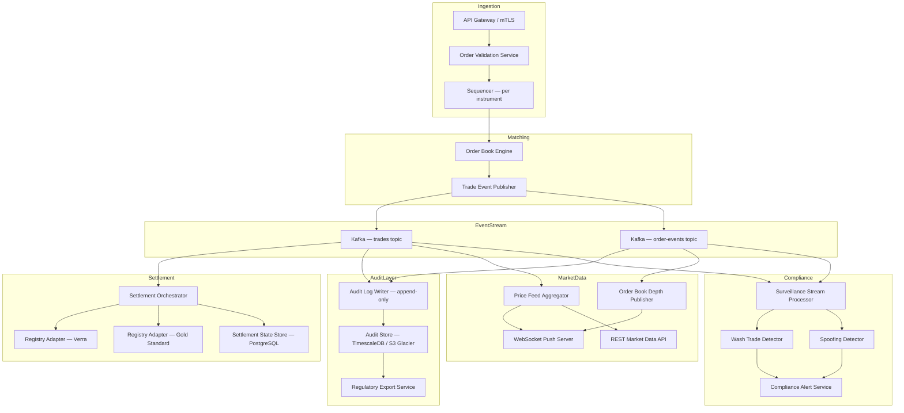

### Story Context

---

It's 10:47 PM. You're in the kitchen, laptop open, reviewing notes you've accumulated across two years of hard engineering. Your coffee has gone cold. Your Slack notification sound fires once.

**Direct Message — Marcus Webb**

> **Marcus Webb** 10:47 PM
> Tomorrow. You already know what to do.
> Don't perform. Don't show off. Just think out loud and tell the truth when you're uncertain.
> One more thing: they're going to give you a sentence. Not a paragraph. A sentence.
> That's not an accident.
> —M

You stare at it for a moment. Three years ago, a message this short from Marcus would have sent you spiraling. Tonight it lands differently. You close the laptop.

---

**The Next Morning — Helion Systems HQ, San Francisco**

Helion Systems is a Series D climate tech infrastructure company — $340M raised, 280 employees, offices in San Francisco, London, and Singapore. Their tagline is "The Rails for the Carbon Economy." They don't generate carbon credits. They don't trade them. They build the infrastructure that other companies use to do both. Their existing platform handles carbon credit issuance verification and registry connectivity for 14 national and regional programs. Now they want to expand into real-time trading.

The recruiter's email said this was a "Staff Engineer — Trading Infrastructure" role. The job description was deliberately thin.

You're in a glass-walled conference room on the 12th floor overlooking the Bay. Three people sit across from you. They introduce themselves:

- **Daniyar Seitkali** — VP of Engineering, Helion Systems. Mid-50s, unhurried, watchful. He has the particular stillness of someone who has seen many architectures fail and learned to stop reacting to the first five minutes of a proposal.

- **Sofía Vargas** — Staff Engineer, Platform. Late 30s, direct, already has a pen uncapped and a blank sheet of paper in front of her. She built Helion's existing registry connectivity layer.

- **Tobias Reinhardt** — Principal Engineer, formerly Deutsche Börse (Germany's primary stock exchange). He joined Helion 18 months ago specifically to build the trading engine. He is technically the deepest person in the room, and he knows it. He is also fair.

Daniyar opens.

> "Thanks for coming in. We'll skip the résumé walk-through — you've had three rounds already, you know we've read your background. We have about 90 minutes. We want to see how you think."
>
> He slides a single index card across the table. On it, in clean block letters:
>
> **"Design a system that lets energy companies trade carbon credits in real time."**
>
> "That's the brief. Go."

Silence. Sofía's pen hasn't moved yet. Tobias is watching you.

You look at the card for exactly four seconds. Then you set it down, look up, and say: "Before I put anything on a whiteboard, I need to ask some questions."

Daniyar nods once. "Good. Ask."

---

### The Brief (Intentionally Ambiguous)

> "Design a system that lets energy companies trade carbon credits in real time."

One sentence. No volume numbers. No regulatory regime. No definition of "real time." No indication of whether this is an exchange, a bilateral OTC market, or an auction. No mention of settlement. No mention of fraud. No mention of which carbon credit standards apply. No mention of multi-currency. No mention of what "energy companies" means across jurisdictions.

This is not laziness. This is the test.

---

### Clarifying Questions and Panel Answers

**Q1: "Who are the buyers and sellers, and what is their relationship to Helion?"**

> **Daniyar:** "Energy companies — utilities, large industrials, some financial intermediaries acting as market makers. They're Helion's B2B customers. They connect via API. We are not a marketplace in the consumer sense. We are infrastructure. Our customers build products on top of us. Some of those products are trading desks, some are automated hedging systems, some are sustainability reporting tools that need real-time price signals."

*What this reveals: Helion is not the end-user interface layer. They are the plumbing. The trading API must be designed for programmatic, high-frequency clients — not humans clicking buttons. Latency and throughput SLAs must be appropriate for automated systems.*

---

**Q2: "When you say 'real time' — are you describing a continuous order book like a stock exchange, a periodic batch auction like a carbon credit clearing house, or something else?"**

> **Tobias:** (leans forward slightly) "Good question. We want continuous matching. A central limit order book — bids, asks, price-time priority. This is not the EU ETS auction model. Think closer to a commodity exchange. Latency target for order acknowledgment is under 50 milliseconds. Match notification to both counterparties: under 200 milliseconds end-to-end."

*What this reveals: This is an exchange, not a bulletin board. You need an order book engine. Price-time priority means FIFO within price levels. This is algorithmically non-trivial and has very specific consistency requirements — partial fills, order cancellations, and match events must be handled atomically.*

---

**Q3: "Which carbon credit standards and registries are in scope? Gold Standard, Verra VCS, EU ETS, California ARB, others?"**

> **Sofía:** "Initially: Verra VCS and Gold Standard. Those are the two largest voluntary market standards. EU ETS compliance market is a phase-two target — that's a different regulatory regime and we're not going there on day one. California's ARB we have existing relationships with but no trading integration yet. So: Verra and Gold Standard, voluntary market, global buyers and sellers."

*What this reveals: Voluntary carbon markets (VCM) — not compliance. This changes the regulatory picture significantly. VCM has less regulatory oversight than ETS, but it has its own integrity frameworks (ICVCM Core Carbon Principles, VCMI Claims Code). There is no single regulator. But financial instruments that reference carbon credits may still trigger financial regulation in some jurisdictions — particularly if market makers are involved.*

---

**Q4: "What is the transaction volume target — orders per second, trades per day?"**

> **Daniyar:** "We're starting with a small set of pilot customers — call it 20 companies. Expected order rate at launch: maybe 50-100 orders per second across all customers combined. But." He pauses. "Voluntary carbon markets have historically been illiquid and manual. We believe we are going to be the catalyst for liquidity. Our 18-month target is 2,000 orders per second. Our 3-year target is 10,000 orders per second. Plan for the 3-year number in the architecture, but the launch system should be economically sensible."

*What this reveals: The design must scale 100x from launch to 3-year target. The launch architecture can be simple, but it must be built on foundations that scale without a rewrite. This is exactly the "design for 100x, spend only 2x more" constraint from Phase 3.*

---

**Q5: "How does settlement work? Is this delivery-versus-payment (DvP), and how do carbon credits actually transfer between registries?"**

> **Tobias:** "This is where it gets interesting. Carbon credits live in registries — Verra's Markit registry, Gold Standard Impact Registry. A 'transfer' means instructing the registry to move a credit from seller's account to buyer's account. Registry API calls are slow — sometimes 2-5 seconds, sometimes they fail, sometimes they queue. Settlement is not instant. What we want is: matched trades settle asynchronously. The match is confirmed in real time. The registry transfer happens in a settlement window — T+0 same day for voluntary market is aspirational, T+1 is realistic. Payment is separate — we do not handle fiat. Buyers and sellers settle cash bilaterally or through a third-party clearing house we integrate with."

*What this reveals: The real-time matching engine and the settlement system are decoupled systems with very different consistency and latency requirements. The match must be atomic and durable. Settlement is an async saga with external dependencies (registry APIs) that can fail. You must model this as a distributed transaction problem — with compensating transactions and a settlement audit log.*

---

**Q6: "What are the compliance and audit requirements? Is Helion acting as a regulated financial venue, or are they infrastructure?"**

> **Daniyar:** "We have lawyers arguing about this right now." (Sofía suppresses a smile.) "In the EU, if you operate a trading venue that brings together buyers and sellers of financial instruments, you need MiFID II authorization. Carbon credits in the voluntary market are arguably not financial instruments — but some EU regulators are starting to disagree. In the US, the CFTC has been making noises about voluntary carbon derivatives. Our current position: we are infrastructure. We do not take principal positions. We do not hold customer assets. We connect counterparties. But." He taps the table once. "Every trade must be fully audited, tamper-evident, and exportable. If regulation changes and we need to produce a 5-year trade history tomorrow morning, we have it. That is non-negotiable."

*What this reveals: The audit trail must be compliance-ready even before compliance is formally required. Append-only, tamper-evident, exportable. This is the same pattern as the HIPAA audit trail from MeridianHealth (Ch. 6) and the PCI-DSS audit log from NovaPay (Ch. 2) — but now in an emerging regulatory environment where the rules are still being written.*

---

**Q7: "What fraud and market manipulation surface area are you worried about? Wash trading, spoofing, layering?"**

> **Tobias:** "All of the above. Wash trading is the big one in voluntary carbon markets — it's a known integrity problem. Spoofing and layering are concerns as soon as you have a continuous order book with automated participants. We need surveillance. We are not building an SEC enforcement system, but we need to flag anomalies and make the data available to compliance teams. Real-time alerting for obvious patterns. Retroactive analysis for complex patterns."

*What this reveals: A market surveillance system is a mandatory component. It's not a bolt-on. It needs access to the full order book history and trade history with millisecond timestamps.*

---

**Q8: "What does the multi-tenancy model look like? Do customers see each other's orders? Is this a single shared order book or multiple books per instrument?"**

> **Sofía:** "Single shared order book per instrument. Carbon credits are traded by vintage year and project type — so 'VCS 2022 Renewable Energy' is a separate instrument from 'Gold Standard 2023 Cookstoves.' Each instrument has its own order book. Customers do see the public order book depth — that's the whole point of price discovery. But order identity is anonymous. You see the price and quantity, not who placed the order."

*What this reveals: Market microstructure matters. Anonymization of order identity is a product requirement, not just a privacy concern. Instrument taxonomy (standard x vintage x project type) needs to be modeled carefully — this is the schema design problem buried in the brief.*

---

### Hidden Complexity

**What a Strong Senior Engineer sees:** An order book matching engine with an async settlement layer and an audit log.

**What a Staff Engineer sees:**

1. **The registry integration is a distributed transaction with no rollback.** Once a carbon credit is transferred in Verra's registry, you cannot undo it via API. If your matching engine marks a trade as settled but the registry call fails halfway, you have a consistency problem with a real-world asset that exists outside your system. This requires a careful saga design with idempotent registry calls, a settlement state machine, and a reconciliation job that can detect and resolve divergence between your internal state and the registry's state.

2. **The regulatory ambiguity is an architectural constraint, not a legal team problem.** "We might need MiFID II compliance tomorrow" means you must design the audit trail, the data retention layer, and the API surface as if you already are a regulated venue — even if the current legal position says you're not. Retrofitting MiFID II-compliant record-keeping into a system that wasn't designed for it costs months and frequently requires downtime. You design it right the first time.

3. **Price-time priority in a distributed system requires a single authoritative sequencer.** You cannot horizontally scale a matching engine naively. Two matching engine instances that both receive an order at "the same time" will produce non-deterministic results. The order book must have a single sequencing point. This creates a bottleneck that requires very careful design — and the 3-year target of 10,000 orders/second means you must plan for how to shard the order book by instrument when the time comes.

4. **Wash trading detection requires joining the order stream with the identity graph.** The order book anonymizes identity at the market level, but your compliance system must have access to de-anonymized order data to detect that Party A is trading with Party B who is ultimately the same beneficial owner. This requires a separate, access-controlled compliance data layer that is logically separated from the public trading data but temporally consistent with it.

5. **Carbon credit instrument taxonomy is a write-once, hard-to-change schema decision.** If you model instruments incorrectly — e.g., you flatten vintage year into a string tag instead of making it a first-class dimension — you will face painful migrations as new standards, new project types, and new vintage years are added. The instrument catalog is also the schema for the order book. Get it wrong and you're either stuck with a bad model or migrating a live exchange.

6. **"Real time" for carbon markets means something different to different stakeholders.** A trading desk wants sub-50ms order acknowledgment. A sustainability reporting tool wants accurate end-of-day prices. A regulatory export wants a complete, ordered, time-stamped record of every order and every trade. These three consumers need the same data with very different consistency, latency, and format requirements — and building one system that serves all three naively will result in a system that serves none of them well. CQRS is not optional here.

---

### Explicit Requirements

*(Derived from the clarification session)*

1. Continuous limit order book matching engine per instrument (Verra VCS and Gold Standard, multiple vintages and project types)
2. Price-time priority matching algorithm (bids sorted descending by price then by arrival time; asks ascending)
3. Order acknowledgment latency: under 50ms (p99)
4. Match notification to both counterparties: under 200ms end-to-end (p99)
5. Support for order types: limit orders and market orders at minimum; IOC (immediate-or-cancel) for automated clients
6. Async settlement pipeline: trade confirmed in real time, registry transfer initiated asynchronously, T+0 aspirational / T+1 guaranteed SLA
7. Idempotent registry API calls (Verra Markit API and Gold Standard Impact Registry API) with retry logic and circuit breakers
8. Settlement state machine: PENDING → REGISTRY_SUBMITTED → REGISTRY_CONFIRMED → SETTLED (and: REGISTRY_FAILED → MANUAL_REVIEW)
9. Tamper-evident, append-only audit log: every order lifecycle event (placed, partially filled, filled, cancelled, expired) and every trade event with millisecond-precision timestamps
10. Audit log exportable in structured format (JSON Lines or CSV) for regulatory review; must support 5-year retention minimum
11. Public order book depth endpoint (anonymized) with WebSocket streaming for real-time updates
12. Per-instrument price feed: last trade price, bid/ask spread, 24h volume — available via REST and WebSocket
13. Market surveillance data feed: complete de-anonymized order and trade stream available to compliance subsystem (access-controlled)
14. Wash trading anomaly detection: flag same-beneficial-owner trades in real time
15. Multi-tenant API: each customer authenticates via API key + mTLS; rate limited per customer; order identity anonymized in public feeds
16. Instrument catalog: queryable, supports filtering by standard, vintage year, project type, geography
17. Launch: 20 customers, 50-100 orders/second; 18-month target: 2,000 orders/second; 3-year target: 10,000 orders/second

---

### Hidden Requirements

**Hint 1:** Re-read Daniyar's answer to Q6. He said "if regulation changes and we need to produce a 5-year trade history tomorrow morning, we have it." The word "tomorrow morning" is not casual. What does a regulatory subpoena SLA actually look like? The audit export system must be operational and tested *before* it is needed — not designed in response to a regulator's request. A system that can theoretically export data but has never been run against 5 years of trade volume is not compliant — it is a liability.

**Hint 2:** Re-read Tobias's answer to Q5. He said "registry API calls are slow — sometimes 2-5 seconds, sometimes they fail, sometimes they queue." He used the word "sometimes." This is an external dependency with undefined SLA. What happens to your settlement pipeline when Verra's registry is down for 6 hours during a peak trading window? Your system must handle this gracefully — trades must remain in a durable, resumable state, and the settlement queue must not be the bottleneck that backs up into the matching engine.

**Hint 3:** Re-read Q8 — Sofía's answer on anonymization. "You see the price and quantity, not who placed the order." Now re-read Q7 — wash trading detection requires knowing who placed the order. These two requirements are in tension. The public API anonymizes. The compliance API de-anonymizes. Both read from the same event stream. If the anonymization is applied at write time (to the event store), you've broken compliance. Anonymization must be applied at the read layer, not the write layer.

**Hint 4:** Daniyar said "we are not going to EU ETS on day one." The qualifier "on day one" is load-bearing. The instrument model must accommodate compliance market instruments (which have different attributes, lot sizes, and settlement rules) without a schema migration. Design the instrument catalog as a polymorphic, extensible model, not a flat table.

---

### Constraints

- **Launch customers:** 20 B2B API clients
- **Launch order rate:** 50-100 orders/second (combined)
- **18-month target:** 2,000 orders/second
- **3-year target:** 10,000 orders/second
- **Order acknowledgment SLA:** p99 < 50ms
- **Match notification SLA:** p99 < 200ms end-to-end
- **Settlement SLA:** T+0 aspirational, T+1 guaranteed
- **Audit log retention:** 5 years minimum, tamper-evident
- **Regulatory export SLA:** Full 5-year history must be exportable within 4 hours of request
- **Instruments at launch:** ~20-40 (2 standards x ~10-20 vintage/project-type combinations each)
- **Instruments at 3 years:** ~200-500 (new standards, new vintages added annually)
- **Team:** 8 engineers (2 platform, 2 matching engine, 2 settlement/registry, 1 compliance/surveillance, 1 infra/SRE)
- **Infrastructure budget at launch:** ~$25,000/month
- **Infrastructure budget at 18 months:** up to $120,000/month
- **Compliance posture:** Design as if MiFID II-adjacent; no formal authorization required at launch but architecture must not preclude it

---

### Your Task

This is a Staff-level interview. You are expected to:

1. **Ask clarifying questions** before designing anything — the eight questions above represent what you would have asked.
2. **Identify the hidden complexity** — the six points in the Hidden Complexity section represent what a Staff Engineer sees that a Strong Senior misses.
3. **Design the system end-to-end:** instrument catalog, order ingestion, matching engine, trade event stream, settlement pipeline, audit layer, market surveillance, public market data API.
4. **Model costs** for month 1 (launch) and month 12 (scale-up).
5. **Address compliance:** audit log architecture, export pipeline, regulatory readiness posture.
6. **Explicitly state what you would NOT build** at launch and why — this is a Staff-level differentiator.
7. **Defend your tradeoffs** under panel pressure.

---

### Deliverables

- [ ] **Mermaid architecture diagram** — end-to-end system: order ingestion → matching engine → trade event stream → settlement pipeline → registry integration → audit log → market data API → compliance surveillance feed
- [ ] **Database schema** — instruments table (polymorphic, extensible), orders table (with full lifecycle columns and indexes), trades table, settlement_attempts table, audit_log table (append-only); include column types and indexes
- [ ] **Real-time matching engine design** — sequencer architecture, order book data structure (price level map + FIFO queue per level), partial fill handling, atomicity guarantees, how you handle the single-sequencer bottleneck at 10,000 orders/second (instrument-level sharding strategy)
- [ ] **Settlement pipeline design** — settlement state machine diagram, saga steps, idempotent registry call design, failure handling (circuit breaker, dead-letter queue, manual review escalation), reconciliation job design
- [ ] **Compliance and audit trail architecture** — event store design (append-only, tamper-evident using hash chaining or similar), read-layer anonymization strategy, regulatory export pipeline (batch job vs streaming, format, SLA), 5-year retention tier strategy (hot/warm/cold)
- [ ] **Cost model** — Month 1: enumerate services (matching engine, settlement workers, Kafka, PostgreSQL/TimescaleDB, Redis, audit store, API gateway), instance sizes, estimated monthly cost. Month 12: same enumeration at 2,000 orders/second, show the delta and which components drive the cost increase
- [ ] **"What I would NOT build at launch" list** — minimum 4 items with rationale for each (e.g., dark pools, options/derivatives, FX settlement, self-service instrument creation, full MiFID II reporting suite)
- [ ] **Tradeoff analysis** — minimum 5 explicit tradeoffs with the alternative considered and the reasoning for the choice made

---

### Diagram Format

All architecture diagrams: Mermaid syntax (renders in GitHub Issues).

Reference diagram structure (you will fill in the details):

---

### What I Would NOT Build at Launch

This section is a Staff-level differentiator. A Strong Senior optimizes the system they're asked to build. A Staff Engineer questions the scope of what is being built.

Use this section to explicitly argue against building the following at launch, with clear rationale:

1. **A self-service instrument creation API** — Why: instrument taxonomy errors in a live market are extremely expensive to correct. Instruments should be created by Helion ops with manual review at launch. Self-service creation introduces the risk of duplicate instruments, malformed vintages, and orphaned order books. Add it in phase 2 after the catalog model is proven stable.

2. **Options, futures, or any derivatives on carbon credits** — Why: derivatives require margining, collateral management, and expiry handling. The regulatory surface area is an order of magnitude larger. Derivatives on carbon credits are the thing that most clearly triggers CFTC and MiFID II jurisdiction. Launch with spot market only.

3. **An internal FX settlement layer** — Why: Tobias explicitly said payment is bilateral between counterparties or through a third-party clearing house. Building FX settlement means becoming a financial institution. Defer indefinitely.

4. **A full MiFID II transaction reporting pipeline** — Why: Helion's current legal position is "we are infrastructure." Building a full MiFID II reporting pipeline before the legal question is resolved creates regulatory surface area, not protection. Build the data foundation (audit log, exportable trade records) and contract with a regulatory reporting vendor (e.g., Broadridge, DTCC) for the reporting layer if and when authorization is required.

5. **Dark pool / negotiated trade functionality** — Why: bilateral OTC negotiation is a fundamentally different product from a central limit order book. It requires a different matching model, a different regulatory treatment, and a different API surface. Mixing it into the launch system creates complexity that slows down the core exchange product. Build the exchange first. Dark pool is a separate product.

---

### Tradeoff Analysis

*(Minimum 5 — fill in your reasoning for each)*

| # | Decision | Alternative Considered | Rationale |
|---|----------|----------------------|-----------|
| 1 | Single sequencer per instrument (vertical scaling) | Distributed matching with consensus | Price-time priority requires total ordering of order arrival. Consensus-based ordering (Raft) introduces latency that violates the 50ms SLA. Single sequencer is predictable and fast; shard by instrument at 10K orders/sec. |
| 2 | Kafka as the event backbone between matching and settlement | Direct DB write from matching engine | Decouples latency-sensitive matching from slow settlement. Settlement consumers can lag without affecting match acknowledgment. Kafka provides durable, replayable event log for free — which doubles as the raw audit stream. |
| 3 | Read-layer anonymization (anonymize at API, not at event store) | Write-time anonymization (strip identity before storing) | Write-time anonymization is irreversible. Compliance surveillance requires full identity. Audit export for regulators requires full identity. Anonymize at the read layer for the public API only — the source of truth retains all data. |
| 4 | Append-only audit log with hash chaining (tamper-evidence) | Standard database table with updated_at timestamps | A table row can be silently modified. An append-only log with each entry containing the hash of the previous entry cannot be tampered without invalidating the chain — detectable by the reconciliation job. This is the MiFID II / financial audit standard. |
| 5 | Async settlement with explicit state machine (saga) | Synchronous settlement (match only completes when registry confirms) | Registry APIs are 2-5 seconds and unreliable. Blocking the match on registry confirmation would collapse the sub-50ms SLA. Async settlement with a durable saga means the match is confirmed instantly, settlement is guaranteed eventually, and failures are recoverable without data loss. |
| 6 | Instrument-level order book sharding strategy (planned, not implemented at launch) | Single global order book process | At launch, 20-40 instruments and 100 orders/second easily fits one process. But instrument count will grow to 200-500 in 3 years, and 10,000 orders/second requires horizontal scaling. Design the sequencer-per-instrument model now so that adding a new instrument is operationally equivalent to spawning a new shard — no code change required. |

---

### Cost Model

**Month 1 (Launch — 20 customers, 100 orders/second)**

| Component | Instance Type | Count | Monthly Cost |
|-----------|--------------|-------|-------------|
| Matching Engine (sequencers + order book) | c6i.2xlarge (8 vCPU, 16 GB) | 2 (primary + hot standby) | ~$560 |
| Settlement Orchestrator + Registry Adapters | c6i.xlarge (4 vCPU, 8 GB) | 2 | ~$280 |
| Kafka cluster (MSK or self-managed) | kafka.m5.large (3 brokers) | 3 | ~$540 |
| PostgreSQL (RDS Multi-AZ, orders + settlement state) | db.r6g.xlarge | 1 primary + 1 replica | ~$700 |
| TimescaleDB (audit log) | db.r6g.xlarge | 1 | ~$350 |
| Redis (order book state cache, rate limiting) | cache.r6g.large | 1 (cluster mode off) | ~$180 |
| API Gateway + Load Balancer | ALB + API GW | — | ~$150 |
| WebSocket Server (market data push) | c6i.large x2 | 2 | ~$200 |
| S3 (audit log cold tier, 5-year retention) | S3 Standard + Glacier | ~500 GB/month growth | ~$50 |
| Observability (Datadog / Grafana Cloud) | — | — | ~$800 |
| Misc (networking, CloudWatch, WAF) | — | — | ~$400 |
| **Total** | | | **~$4,210/month** |

Well within the $25,000/month launch budget. Reserve the headroom for engineering tooling, staging environment (same topology at 50%), and load testing infrastructure.

---

**Month 12 (Scale-up — 2,000 orders/second, ~100 customers, ~100 instruments)**

| Component | Change from Month 1 | Monthly Cost |
|-----------|--------------------|----|
| Matching Engine | 8x instances (instrument sharding, ~12 active sequencers) | ~$3,360 |
| Settlement Orchestrator | 4x workers (higher trade volume) | ~$560 |
| Kafka cluster | 9 brokers (higher throughput, replication) | ~$1,620 |
| PostgreSQL (orders) | Upgrade to db.r6g.2xlarge, 2 read replicas | ~$2,100 |
| TimescaleDB (audit log) | Upgrade, compressed chunks, S3 offload tiering | ~$700 |
| Redis | Cluster mode, 3 shards | ~$720 |
| WebSocket Server | 8x instances (more subscribers) | ~$800 |
| S3 (audit log, 12 months accumulation) | ~6 TB total | ~$180 |
| Observability | More metrics, longer retention | ~$2,000 |
| Misc | NAT gateway, data transfer, WAF | ~$1,500 |
| **Total** | | **~$13,540/month** |

Well within the $120,000/month target. The gap between actual cost and budget ceiling is your engineering margin — capacity reserve, DR environment, and compliance tooling budget.

**Primary cost driver from Month 1 to Month 12:** Kafka brokers and PostgreSQL read replicas. The matching engine is surprisingly cheap at this scale because the workload is CPU-bound (in-memory order book operations), not memory-bound. The audit log TimescaleDB instance is the long-term cost to watch — at 3 years, with 5-year retention, you will have 15-18 TB of audit data. Plan the S3 Glacier migration pipeline on day one.

---

### Staff-Level Evaluation Criteria

What separates a Strong Senior answer from a Staff answer on this problem:

**1. Sequencer architecture clarity.** A Strong Senior says "order book matching engine." A Staff Engineer says "single sequencer per instrument, each sequencer is the sole writer to that instrument's order book, sequencers can be sharded across nodes by instrument ID, instrument assignment is managed by a coordinator — and here's what happens during sequencer failover." The failover story (fencing tokens, in-flight order handling, no double-fills) is where the real design lives.

**2. Settlement as a saga, not an afterthought.** A Strong Senior designs the matching engine beautifully and then says "settlement is async, handled separately." A Staff Engineer draws the settlement state machine, names each state, identifies the failure modes at each transition, explains how idempotency keys are constructed for registry API calls, and describes the reconciliation job that runs every 5 minutes to detect divergence between internal settlement state and registry state. The reconciliation job is the safety net. Designing it first, not last, is the Staff signal.

**3. The compliance layer is designed before it is needed.** A Strong Senior notes "we'll add audit logging." A Staff Engineer argues for hash-chained append-only log on day one, explains why retrofitting tamper-evidence after the fact is a 3-month project, and scopes the regulatory export pipeline to a 4-hour SLA because that's what a real subpoena looks like — not a hypothetical.

**4. The "What I Would NOT Build" list is as important as the architecture.** This is the single clearest differentiator. Strong Seniors optimize scope. Staff Engineers constrain scope. The ability to say "we will not build derivatives, here is why, here is what we build instead, and here is how the architecture accommodates derivatives later without a rewrite" is the Staff-level signal. Tobias will push back on this. Hold the line, with reasoning, not defensiveness.

**5. Cost is a first-class constraint, not an afterthought.** A Strong Senior models costs when asked. A Staff Engineer presents cost at the same moment as the architecture, frames the Month 1 budget as intentionally conservative to preserve margin, and identifies the specific components that will drive Month 12 cost growth before being asked. The insight that "audit log storage is the 3-year cost to watch, not the matching engine" is not obvious — and saying it unprompted signals that you have thought about operations, not just launch day.
